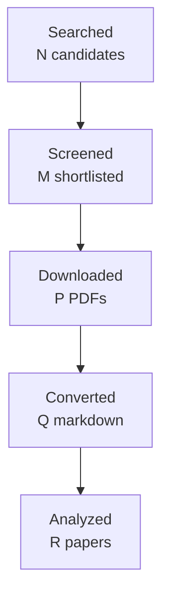

You are one worker inside an automated literature-review pipeline.
A script, not a person, reads your reply. Follow these rules exactly:
- Do the task completely in this single reply. Do not ask questions and do not
  wait for confirmation.
- Reply with the requested artifact block(s) only: no preamble, no commentary
  outside the blocks. Each block starts with a line `===BEGIN <name>===` and
  ends with a line `===END <name>===`; the content between those lines is
  written to a file verbatim.
- Never invent papers, identifiers, numbers, or quotes. Leave unknown fields
  out or mark them as unknown.
- Do not use your code tool, canvas, or connectors; plain text is enough.

# Task: write the final research report

Research topic: **incremental, personalized and priority-aware briefings from workplace communication: how accepted topic information is selected, updated, prioritized and summarized for a user over time, distinguishing new developments from still-open state without repeating superseded facts**
Run id: `229b747dc22e`  Round: 4 of at most 4

Write the final report in Markdown following the template below exactly:
same section names in the same order, `[HIGH]`/`[MEDIUM]`/`[LOW]` confidence
tags on every finding, `[ACADEMIC]`/`[ENGINEERING]` labels on every gap, at
least one Mermaid `flowchart TD` diagram, LaTeX (`$...$`) for formulas, and
evidence citations as `[paper_id]`. Cite only the paper ids listed under
"Papers reviewed". In Methodology state that the papers were read through
the host's web tool and give the access level of each paper. Leave no
template placeholder in the output. Do not write a line that starts with
`===` inside the report.

Round History: use exactly these rows (they are computed by the pipeline):
| 1 | 48b3f0169bfb | incremental, personalized and priority-aware briefings from workplace communication: how accepted topic information is selected, updated, prioritized and summarized for a user over time, distinguishing new developments from still-open state without repeating superseded facts | 13 | initial shortlist | 7 academic, 1 engineering |
| 2 | 49f688a25a3f | longitudinal and cross-thread workplace briefing systems that track new, open, resolved, and superseded work-item state over repeated cycles, with adaptive user-specific prioritization, reminder value, uncertainty presentation, and omission/repetition evaluation | 16 | 0 resolved | 7 academic, 1 engineering |
| 3 | 9f57e4d7c3d9 | cycle-based cross-thread workplace briefing with explicit work-item state transitions: evidence for longitudinal new/open/resolved/superseded tracking, adaptive personalization, obligation-versus-preference prioritization, and joint omission/repetition evaluation | 14 | 0 resolved | 7 academic, 1 engineering |
| 4 | 229b747dc22e | Direct empirical evaluations of longitudinal cross-thread workplace briefing: cycle-by-cycle new/open/resolved/superseded work-item tracking, obligation-versus-preference selection, adaptive personalization under preference drift, and joint omission/repetition/false-alert evaluation. | 10 | academic gaps of the previous round | 7 academic, 1 engineering |
Stop reason line: 4-round cap reached

Research Gaps: list every gap that is still open with its classification,
priority, and the rounds that already searched for it. An unresolved gap is
never presented as accepted or closed; say plainly that the literature has
not answered it yet.

Query variants used:
- direct empirical evaluations longitudinal cross-thread workplace briefing: cycle-by-cycle new/open/resolved/superseded work-item tracking, obligation-versus-preference selection, adaptive personalization under drift, joint omission/repetition/false-alert evaluation.
- direct empirical evaluations
- direct longitudinal cross-thread workplace briefing: cycle-by-cycle new/open/resolved/superseded work-item tracking, obligation-versus-preference selection, adaptive personalization under drift, joint omission/repetition/false-alert evaluation.
- empirical longitudinal cross-thread workplace briefing: cycle-by-cycle new/open/resolved/superseded work-item tracking, obligation-versus-preference selection, adaptive personalization under drift, joint omission/repetition/false-alert evaluation.
- evaluations longitudinal cross-thread workplace briefing: cycle-by-cycle new/open/resolved/superseded work-item tracking, obligation-versus-preference selection, adaptive personalization under drift, joint omission/repetition/false-alert evaluation.
- direct empirical evaluations longitudinal cross-thread
- direct empirical evaluations workplace briefing:
- direct empirical evaluations cycle-by-cycle new/open/resolved/superseded

## Project context you must work within

This is the project's own description of the problem, its boundaries,
and the distinctions it needs preserved. It governs what counts as
relevant; the academic task names alone do not.

# Topic 09 context — Incremental, personalized, and priority-aware briefings

## Why this Topic exists

msgloom's final user-facing value is not a database of extracted facts; it is a briefing that lets one user keep up with important work with much less reading. The briefing must show **new developments** without repeating everything, while still carrying forward unresolved important work, actions, deadlines, conditions, and risks. It must reflect the user's Triage rules and working context without confusing likelihood of response with obligation to respond.

Topic 09 therefore owns **how accepted Topic information is selected, updated, prioritized, and summarized for the user over time**.

## Core research object

For each report cycle and Topic, determine:

- what changed since the user's previous accepted view;
- what remains open/important even if unchanged;
- what evidence/context is necessary to understand the change;
- what can be omitted as redundant without losing decision value;
- how Triage rules and working context affect ordering/priority;
- how uncertainty/pending investigation should be displayed.

The overview must cover every due Topic; summary compression must not remove essential content.

## Product and phase relevance

Phase 1 A5 already delivers email reports from accepted triage results. Phase 2 adds investigation findings and a navigable website, but reporting must remain useful even when investigation is incomplete. Topic 09 informs report-content selection and presentation; it does not own external action execution.

## Relationships to other Topics

| Topic | Relationship |
| --- | --- |
| 02 | Supplies correctly scoped within-message Topic evidence. |
| 03 | Supplies stable Topic identity so updates are compared against the same work matter rather than title similarity. |
| 04 | Supplies correct response/antecedent scope. |
| 05 | Supplies actions, deadlines, requests, commitments, decisions. |
| 06 | Supplies current state, supersession, temporal ordering, unresolved conflicts. |
| 07 | Investigation may add evidence, but report generation must not wait indefinitely; unresolved gaps can be shown. |
| 08 | Supplies grounded attachment/table/image evidence. |
| 10 | Evaluates factuality, attribution, completeness, omission, calibration, and report coverage. |

## Key conceptual distinctions

- Novel information ≠ important information.
- Unchanged but unresolved critical work must remain visible.
- Response probability ≠ response obligation.
- Summary brevity ≠ permissible omission.
- Update summarization ≠ merely diffing text.
- Personalization must not override explicit Triage rules.
- Topic summary ≠ list of message summaries.
- Report completeness is by Topic identity/version and essential content, not item counts.

## High-value academic terminology

- update summarization; incremental summarization;
- temporal summarization; timeline summarization;
- query-focused summarization; query-focused multi-document summarization;
- multi-document summarization; entity/event-centric summarization;
- topic-focused summarization; case-centric/work-item summarization;
- novelty detection / redundancy reduction in summarization;
- information update / delta summarization;
- personalized summarization; user-adaptive summarization;
- personalized ranking; learning to rank; preference-aware ranking;
- email prioritization / email triage;
- task/response priority prediction (carefully distinguished from obligation);
- salience estimation / content selection;
- coverage-aware summarization; constrained summarization;
- long-running conversation summarization / incremental dialogue summarization.

## Query families

- `"update summarization" multi-document`
- `"incremental summarization" evolving documents`
- `"temporal summarization" events`
- `"query-focused multi-document summarization"`
- `"topic-focused summarization" conversation`
- `novelty redundancy update summarization`
- `"personalized summarization" user preferences`
- `"email prioritization" triage`
- `"email triage" learning to rank`
- `unresolved action update summarization`
- `coverage-aware summarization important information`
- `incremental dialogue summarization unresolved tasks`

## False friends / exclusions

- generic message-level summarization with no stable Topic identity;
- pure novelty detection that drops unchanged open work;
- response-likelihood models treated as obligation classifiers;
- popularity/recommendation ranking;
- summarization evaluations focused only on fluency/ROUGE without decision-essential coverage;
- action drafting/execution (Phases 3/4).

## Gap-evaluation guidance

The first metric is **missed important work or evidence that would change a decision**, not average summary similarity. Prioritize research that helps prove coverage of due Topics, actions, deadlines, risks, and unresolved state while reducing redundancy. Evaluate both omission and false-alert/over-reporting costs. Personalization must remain subordinate to explicit user rules and source evidence.

## How to use this file

This file is the self-contained research context for this Topic. A future AI research agent should read **this file first**, then `BRIEF.md`, then any existing `CURRENT_STATUS.md`, gap decisions, reports, manifests, and prior-round artifacts in this folder. The aim is that an agent given only this Topic folder can reconstruct the project intent, Topic boundary, dependencies, search vocabulary, and gap-prioritization logic without relying on the original ChatGPT conversation.

If the full repository is available, the authoritative product documents remain `../../docs/design-brief.md`, `../../docs/design-principles.md`, `../../docs/design.md`, and `../../docs/phase-roadmap.md`. This file explains how those product constraints apply to this research Topic; it does not replace or approve changes to those design documents.

## Shared msgloom background

msgloom is a personal work-information system for one user. It is intended to process very large daily volumes of work communication, initially Outlook email and Microsoft Teams, while ensuring that **work requiring the user's response is not missed** and reducing how much the user must read to stay current.

The product is organized around **Topics**, not message summaries. A Topic is a concrete work matter described by information from one or more sources. One message can contain several Topics; one Topic can span many messages, conversations, attachments, groups, and eventually multiple sources. A conversation or Group is therefore not automatically one Topic.

The report contract is the ultimate product pressure on all ten research Topics. Reports must preserve every due Topic and the decision-relevant information needed to act on it, including developments, actions, deadlines, conditions, risks, uncertainty, and links back to exact source evidence. Missing or conflicting information must remain visible rather than being silently filled in.

The design decision order is important when evaluating research gaps: user permissions are fixed; then preserve correct meaning and report coverage; then traceability and recovery; then usability/maintenance; finally speed, brevity, and token savings. A method that is faster but loses a condition, deadline, branch, source relation, or important Topic is not an improvement for msgloom.

Important persistent principles:

- Use deterministic code for reliable mechanical relationships and AI for language understanding/judgement.
- Preserve source bytes, versions, stage history, identities, and lineage. New assessments do not erase old evidence.
- Group only on reliable relationships. Similar subjects, participants, wording, or model labels are not enough to prove Topic identity.
- Keep uncertain relationships separate and make the reason for uncertainty visible.
- Brevity must come from concise wording and layered detail, never from omitting decision-essential information.
- User-reviewed examples, missed important work, false alerts, wrong grouping, lost actions/deadlines, and evidence that changes a decision matter more than paper count or message throughput.

## Research-programme relationship

The ten Topics form a dependency network rather than ten independent literature reviews. A useful conceptual flow is:

```text
01 source/conversation structure
        ↓
02 within-message Topic spans/membership
        ↓
03 cross-thread/source Topic identity
        ↓
04 reference and response scope
        ↓
05 actions / requests / commitments / decisions
        ↓
06 state / factuality / time / revision
        ↓
07 retrieve missing context when needed
        ↘
08 understand attachments / tables / images
        ↓
09 incremental personalized briefing
        ↓
10 evidence, completeness, calibration, reliability evaluation
```

This is not a strict processing pipeline. Several Topics feed each other, and Topic 10 is cross-cutting. The numbering primarily gives a research order and ownership boundary so that one Topic does not silently absorb the whole product problem.

## Gap-evaluation rules inherited from Topics 01 and 02

The Research Pipeline must evaluate gaps using **project value**, not just academic novelty. The following rules are part of the context for every Topic:

1. A machine-classified `HIGH` or `ACADEMIC` gap does **not** automatically authorize another literature round.
2. After each academic round, perform a human/project-value review: decide whether the uncertainty is best addressed by more papers, engineering experiments, a later Topic, production-domain data, candidate-method selection, or no further current work.
3. Prefer targeted academic follow-up over broad searching. Do not fill paper quotas with weakly related literature.
4. Distinguish direct target-domain evidence from transfer methods/evaluation evidence. Transfer evidence can justify a mechanism or experiment, not production-email accuracy.
5. Engineering validation may use independent synthetic/adversarial fixtures and public data. Lack of production mailbox examples is not a reason to stop work that can be validly completed without them.
6. Never claim production representativeness from synthetic or transfer evidence. Record it as deferred until suitable authorized domain data exists.
7. If a gap belongs to another Topic, hand it off explicitly rather than duplicating research.
8. Research closure means **everything actionable at the current stage is complete and remaining work is explicitly deferred/handed off**. It does not mean literature exhaustion, production accuracy, or architecture approval.
9. For new academic work, use terminology refinement, strict paper admission, manual/controlled canonical acquisition, corpus freeze, fresh isolated Pipeline runs, direct-vs-transfer labels, independent review, strict validation, and post-round gap review. These are lessons learned from Topics 01 and 02.
10. For engineering research, keep gold independent from the component under test; structurally separate prediction inputs from evaluation gold/future context; count false positives and false negatives in end-to-end denominators; use clean-workspace reproducibility, mutation/regression tests, and fresh independent methodological review.

## Work handed to this topic by an earlier one

Treat each entry as a starting condition, not as something to
rediscover. Where a sending topic left a gap open it is still open:
do not report it as established. Respect the stated ownership
boundary and do not absorb what the sender still owns.

**None of this is evidence for your own report.** It scopes your
work; it does not support a finding or a gap. Only papers this
topic admitted can do that.

# Inherited handoffs

Everything an earlier Topic explicitly handed to this one, copied in full so
that this folder is enough on its own. You do not need to open an earlier
Topic's documents to start work here.

Each entry states what was handed over, what the sending Topic still owns, and
what it had established or left open at the time. A handoff is not a finding:
where the sender left a gap open, it is still open.

## From Topic 06 — Work-item state, event factuality, time, conflicting revisions

*Completed 2026-09-17. 4 rounds, 38 papers, no duplicate records. Every
round's synthesis was accepted by the independent review at the first attempt
— faithfulness 0.93 to 0.95 — which no earlier Topic managed. Stopped on
`round_cap_reached`. All eight gaps remain open and none was downgraded.*

**Handed to Topic 09.** What counts as a *new development* rather than a
restatement, and which facts have been superseded and must not be repeated.
Topic 06 owns the state and its revision history; Topic 09 owns deciding what
of it is worth telling the user now.

**What Topic 06 established.** A work item's state evolves through requested,
proposed, planned, approved, completed, revoked, superseded, disputed,
conditional and unresolved, and the historical assessments must be kept, not
overwritten. A briefing that reports only the latest message therefore risks
both repeating superseded facts and hiding an item that is still open.

**What Topic 06 left open, and Topic 09 must not treat as settled:**

- *(ACADEMIC, HIGH, Gap 1)* No direct evaluation of multi-state lifecycle
  tracking across successive workplace messages while preserving historical
  assessments. The state Topic 09 receives is not a measured quantity.
- *(ACADEMIC, HIGH, Gap 5)* A "completed" state may be claimed rather than
  corroborated. A briefing that drops an item because it looks finished may
  be dropping work that still needs action — Topic 06 names this as the
  failure mode to fear.
- *(ENGINEERING, HIGH, Gap 6)* Cancellation, revocation, deadline change,
  late ingestion, same-time contradiction and corrected completion have never
  been measured end to end. These are exactly the transitions a briefing must
  surface.

**Boundary.** Topic 09 owns selection, priority and phrasing over time.
Topic 06 owns what the state is and what changed, including the admission
that it is unresolved.

*Basis: the ownership map — Topic 06's relationship table entry for 09
("briefing must distinguish new developments from still-open state and avoid
repeating superseded facts") — plus Topic 06's Gaps 1, 5 and 6. Topic 06's
report does not name Topic 09 by number.*

## From Topic 08 — Email, image, table and attachment understanding

*Completed 2026-09-17. 4 rounds, 53 corpus records — **52 distinct papers**,
because one study was admitted twice under two identifiers. Rounds 2 and 4
were each rejected once and accepted after one repair; rounds 1 and 3 passed
at the first attempt. Stopped on `round_cap_reached`. All eight gaps remain
open and none was downgraded.*

**Handed to Topic 09.** Critical structured evidence that a briefing must
preserve rather than flatten. A number in a table cell, a highlighted row, a
figure or an attachment version can carry the decision-relevant content, and
summarising only body text drops it.

**What Topic 08 established.** Flattening a document into plain text loses
relationships, units, coordinates, visual emphasis and version identity.
Structure- or visually enriched representations outperform lossy OCR or
plain-text pipelines in the settings tested. A briefing built on flattened
text inherits those losses.

**What Topic 08 left open, and Topic 09 must not treat as settled:**

- *(ACADEMIC, HIGH, gap-2)* Direct grounding of workplace-message referring
  expressions — "this screenshot", "the highlighted row", "numbers below" —
  is not established. A briefing that repeats such a phrase may be repeating
  a pointer nothing has resolved.
- *(ACADEMIC, HIGH, gap-3)* Comprehensive spreadsheet understanding is open
  for formulas, hidden rows and sheets, cross-sheet references and merged
  cells. A figure lifted from a workbook may not mean what it appears to.
- *(ENGINEERING, HIGH, gap-8)* No single evaluation measures semantic
  correctness, extraction completeness, exact provenance and
  unsupported-evidence handling together. Briefing completeness therefore
  cannot be inferred from extraction success.

**Boundary.** Topic 09 owns what is worth telling the user and when.
Topic 08 owns what the structured evidence says and where it came from.

*Basis: the ownership map — Topic 08's relationship table entry for 09
("briefing must preserve critical structured evidence rather than summarizing
only body text") — plus Topic 08's gaps 2, 3 and 8. The report does not name
Topic 09 by number.*


Papers reviewed:
- paper_id `doi-10-3758-s13423-026-02985-6` — Let it go: How trusted reminders alter intention maintenance (Connor Dupre, B. Hunter Ball; 2026)
- paper_id `doi-10-18653-v1-2020-acl-main-122` — Examining the State-of-the-Art in News Timeline Summarization (Demian Gholipour Ghalandari, Georgiana Ifrim; 2020)
- paper_id `2609.02465` — Can Risk-Based Alerting Mitigate Cybersecurity Alert Fatigue? (Rafael Uetz, Philipp Bönninghausen, Louis Hackländer-Jansen et al.; 2026)
- paper_id `doi-10-2196-43977` — Effect of Personalized Email-Based Reminders on Participants’ Timeliness in an Online Education Program: Randomized Controlled Trial (Olle Bälter, Andreas Jemstedt, Feben Javan Abraham et al.; 2023)
- paper_id `2403.19795` — Learning Human Preferences Over Robot Behavior as Soft Planning Constraints (Austin Narcomey, Nathan Tsoi, Ruta Desai et al.; 2024)
- paper_id `1301.6707` — Attention-Sensitive Alerting (Eric J. Horvitz, Andy Jacobs, David Hovel; 1999)
- paper_id `manual-bdce973227` — Success of an Agent-Assisted System that Reduces Email Overload (Andrew Faulring, Brad A. Myers, Aaron Steinfeld; 2009)
- paper_id `2208.03828` — How Do Viewers Synthesize Conflicting Information from Data Visualizations? (Prateek Mantri, Hariharan Subramonyam, Audrey L. Michal et al.; 2023)
- paper_id `doi-10-1109-access-2022-3182390` — An End-to-End Personalized Preference Drift Aware Sequential Recommender System With Optimal Item Utilization (Saranya Maneeroj, Nakarin Sritrakool; 2022)
- paper_id `doi-10-1145-383952-383954` — Temporal summaries of new topics (James Allan, Rahul Gupta, Vikas Khandelwal; 2001)
- paper_id `manual-13a21477e7` — Summarize What You Are Interested In: An Optimization Framework for Interactive Personalized Summarization (Rui Yan, Jian-Yun Nie, Xiaoming Li; 2011)
- paper_id `doi-10-1145-1557019-1557124` — Mining social networks for personalized email prioritization (Shinjae Yoo, Yiming Yang, Frank Lin et al.; 2009)
- paper_id `doi-10-1145-2063576-2063683` — Modeling personalized email prioritization: Classification-based and regression-based approaches (Shinjae Yoo, Yiming Yang, Jaime G. Carbonell; 2011)
- paper_id `doi-10-1093-jcmc-zmac001` — Measurement of Perceived Importance and Urgency of Email: An Employees’ Perspective (Andre Lanctot, Linda Duxbury; 2022)
- paper_id `doi-10-1207-s15327051hci2001-2-3` — Supporting Collaborative Task Management in E-mail (Steve Whittaker; 2005)
- paper_id `doi-10-18653-v1-d19-1386` — Summary Cloze: A New Task for Content Selection in Topic-Focused Summarization (Daniel Deutsch, Dan Roth; 2019)
- paper_id `manual-c2f56a571b` — Summarizing Emails with Conversational Cohesion and Subjectivity (Giuseppe Carenini, Raymond T. Ng, Xiaodong Zhou; 2008)
- paper_id `doi-10-18653-v1-2007-sigdial-1-4` — Detecting and Summarizing Action Items in Multi-Party Dialogue (Matthew Purver, John Dowding, John Niekrasz et al.; 2007)
- paper_id `doi-10-1145-1056808-1057071` — Beyond “From” and “Received”: Exploring the Dynamics of Email Triage (Carman Neustaedter, A. J. Bernheim Brush, Marc A. Smith; 2005)
- paper_id `2109.06896` — Decision-Focused Summarization (Chao-Chun Hsu, Chenhao Tan; 2021)
- paper_id `doi-10-1145-290941-291025` — The Use of MMR, Diversity-Based Reranking for Reordering Documents and Producing Summaries (Jaime G. Carbonell, Jade Goldstein; 1998)
- paper_id `2403.01365` — AI-Powered Reminders for Collaborative Tasks: Experiences and Futures (Katelyn Morrison, Shamsi T. Iqbal, Eric Horvitz; 2024)
- paper_id `2107.14691` — EmailSum: Abstractive Email Thread Summarization (Shiyue Zhang, Asli Celikyilmaz, Jianfeng Gao et al.; 2021)
- paper_id `doi-10-1007-978-3-319-67684-5-24` — RemindMe: Plugging a Reminder Manager into Email for Enhancing Workplace Responsiveness (Casey Dugan, Aabhas Sharma, Michael Muller et al.; 2017)
- paper_id `doi-10-1136-amiajnl-2014-002945` — HARVEST, a longitudinal patient record summarizer (Jamie S. Hirsch, Jessica S. Tanenbaum, Sharon Lipsky Gorman et al.; 2014)
- paper_id `doi-10-64898-2025-11-28-25341233` — CLIN-SUMM: Incremental Longitudinal Summarization of Clinical Notes Enables Scalable Representation and Early Disease Prediction (Valentina D'Souza, Danielle F. Pace, Alaleh Azhir et al.; 2026)
- paper_id `doi-10-1098-rsos-181870` — Communicating uncertainty about facts, numbers and science (Anne Marthe van der Bles, Sander van der Linden, Alexandra L. J. Freeman et al.; 2019)
- paper_id `manual-1d6b22c7ad` — Corpus-Based Problem Selection for EHR Note Summarization (Tielman T. Van Vleck, Noémie Elhadad; 2010)
- paper_id `doi-10-1016-j-eswa-2021-114890` — A case study of batch and incremental recommender systems in supermarket data under concept drifts and cold start (Antônio David Viniski, Jean Paul Barddal, Alceu de Souza Britto Jr. et al.; 2021)
- paper_id `doi-10-6028-nist-sp-500-302-tempsumm-overview` — TREC 2013 Temporal Summarization (Javed A. Aslam, Matthew Ekstrand-Abueg, Virgil Pavlu et al.; 2013)
- paper_id `doi-10-1609-icwsm-v12i1-15014` — Can You Verifi This? Studying Uncertainty and Decision-Making About Misinformation Using Visual Analytics (Alireza Karduni, Ryan Wesslen, Sashank Santhanam et al.; 2018)
- paper_id `manual-4cb48c423e` — Interactive Multi-Objective Probabilistic Preference Learning with Soft and Hard Bounds (Edward Chen, Sang T. Truong, Natalie Dullerud et al.; 2026)
- paper_id `manual-39435af3dd` — Overview of the TAC 2008 Update Summarization Task (Hoa Trang Dang, Karolina Owczarzak; 2008)
- paper_id `doi-10-1177-1071181322661236` — Strategy-Specific Decision Making with Incomplete Information (William I.N. Sealy, Karen M. Feigh; 2022)
- paper_id `doi-10-3758-bf03201140` — Prospective memory: when reminders fail (Melissa J. Guynn, Mark A. McDaniel, Gilles O. Einstein; 1998)
- paper_id `doi-10-1145-642611-642672` — Taking Email to Task: The Design and Evaluation of a Task Management Centered Email Tool (Victoria Bellotti, Nicolas Ducheneaut, Mark Howard et al.; 2003)
- paper_id `doi-10-3389-fpsyg-2014-00657` — How important is importance for prospective memory? A review (Stefan Walter, Beat Meier; 2014)
- paper_id `doi-10-18653-v1-2024-acl-long-390` — From Moments to Milestones: Incremental Timeline Summarization Leveraging Large Language Models (Qisheng Hu, Geonsik Moon, Hwee Tou Ng; 2024)
- paper_id `doi-10-1016-j-eswa-2021-115626` — A novel temporal recommender system based on multiple transitions in user preference drift and topic review evolution (Charinya Wangwatcharakul, Sartra Wongthanavasu; 2021)
- paper_id `doi-10-1145-2998181-2998251` — What Did I Ask You to Do, by When, and for Whom?: Passion and Compassion in Request Management (Michael J. Muller, Casey Dugan, Michael Brenndoerfer et al.; 2017)
- paper_id `doi-10-18653-v1-2026-acl-long-1149` — Agent Newsroom: Efficient Chronological Report Generation via Dynamic Multi-Agent Collaboration (Zhenhua Wang, Chunlei Wang, Yue Geng et al.; 2026)
- paper_id `manual-50ed5dc808` — The Learning Behind Gmail Priority Inbox (; 2010)
- paper_id `doi-10-1016-j-knosys-2013-02-015` — Exploiting relevance, coverage, and novelty for query-focused multi-document summarization (Wenjuan Luo, Fuzhen Zhuang, Qing He et al.; 2013)
- paper_id `manual-0839b98ee7` — Can requests-for-action and commitments-to-act be reliably identified in email messages? (Andrew Lampert, Cécile Paris, Robert Dale; 2007)
- paper_id `2202.07088` — Scaling up Ranking under Constraints for Live Recommendations by Replacing Optimization with Prediction (Yegor Tkachenko, Wassim Dhaouadi, Kamel Jedidi; 2022)
- paper_id `doi-10-1016-j-cag-2014-02-006` — Effects of visualizing uncertainty on decision-making in a target identification scenario (Maria Riveiro, Tove Helldin, Göran Falkman et al.; 2014)
- paper_id `doi-10-1145-2523813` — A survey on concept drift adaptation (João Gama, Indrė Žliobaitė, Albert Bifet et al.; 2014)
- paper_id `doi-10-1155-2016-1340973` — Mining Sequential Update Summarization with Hierarchical Text Analysis (Chunyun Zhang, Zhongwei Si, Zhanyu Ma; 2016)
- paper_id `doi-10-1109-fuzz-ieee-2016-7737835` — Fuzzy user-interest drift detection based recommender systems (; 2016)
- paper_id `doi-10-1145-3705328-3748164` — Time to Split: Exploring Data Splitting Strategies for Offline Evaluation of Sequential Recommenders (Danil Gusak, Anna Volodkevich, Anton Klenitskiy et al.; 2025)
- paper_id `doi-10-1186-s41235-019-0195-y` — Confidence guides spontaneous cognitive offloading (Annika Boldt, Sam J. Gilbert; 2019)
- paper_id `doi-10-1145-634067-634150` — Supporting Prospective Information in Email (Jacek Gwizdka; 2001)
- paper_id `doi-10-3758-s13421-025-01708-x` — Strategic reminder setting for time-based intentions: Influence of metacognition, delay length, and cue visibility (Pei-Chun Tsai, Sam J. Gilbert; 2025)

Access level per paper:
- `1301.6707`: full_text via https://arxiv.org/pdf/1301.6707
- `2107.14691`: full_text via https://arxiv.org/html/2107.14691
- `2109.06896`: full_text via https://arxiv.org/html/2109.06896
- `2202.07088`: full_text via https://arxiv.org/html/2202.07088v1
- `2208.03828`: full_text via https://arxiv.org/html/2208.03828
- `2403.01365`: full_text via https://arxiv.org/html/2403.01365
- `2403.19795`: full_text via https://arxiv.org/html/2403.19795
- `2609.02465`: full_text via https://arxiv.org/pdf/2609.02465
- `doi-10-1007-978-3-319-67684-5-24`: abstract_only via https://www.researchgate.net/publication/319920480_RemindMe_Plugging_a_Reminder_Manager_into_Email_for_Enhancing_Workplace_Responsiveness
- `doi-10-1016-j-cag-2014-02-006`: abstract_only via https://www.sciencedirect.com/science/article/pii/S0097849314000302
- `doi-10-1016-j-eswa-2021-114890`: full_text via https://jpbarddal.github.io/assets/pdf/2021_ESWA_case_study_recsys.pdf
- `doi-10-1016-j-eswa-2021-115626`: abstract_only via https://www.sciencedirect.com/science/article/pii/S0957417421010204
- `doi-10-1016-j-knosys-2013-02-015`: full_text via https://www.sciencedirect.com/science/article/pii/S0950705113000804
- `doi-10-1093-jcmc-zmac001`: full_text via https://academic.oup.com/jcmc/article/27/2/zmac001/6548841
- `doi-10-1098-rsos-181870`: full_text via https://pmc.ncbi.nlm.nih.gov/articles/PMC6549952/
- `doi-10-1109-access-2022-3182390`: full_text via https://www.researchgate.net/publication/361279980_An_End-to-End_Personalized_Preference_Drift_Aware_Sequential_Recommender_System_With_Optimal_Item_Utilization
- `doi-10-1109-fuzz-ieee-2016-7737835`: abstract_only via https://opus.lib.uts.edu.au/handle/10453/121832
- `doi-10-1136-amiajnl-2014-002945`: full_text via https://pmc.ncbi.nlm.nih.gov/articles/PMC4394965/
- `doi-10-1145-1056808-1057071`: full_text via https://www.microsoft.com/en-us/research/wp-content/uploads/2005/04/triagechishort2005.pdf
- `doi-10-1145-1557019-1557124`: full_text via https://www.researchgate.net/publication/221654545_Mining_social_networks_for_personalized_email_prioritization
- `doi-10-1145-2063576-2063683`: full_text via https://digital.library.unt.edu/ark:/67531/metadc835677/
- `doi-10-1145-2523813`: full_text via https://eprints.bournemouth.ac.uk/22491/1/ACM%20computing%20surveys.pdf
- `doi-10-1145-290941-291025`: full_text via https://www.cs.cmu.edu/afs/cs/Web/People/jgc/publication/MMR_DiversityBased_Reranking_SIGIR_1998.pdf
- `doi-10-1145-2998181-2998251`: abstract_only via https://research.ibm.com/publications/what-did-i-ask-you-to-do-by-when-and-for-whom-passion-and-compassion-in-request-management
- `doi-10-1145-3705328-3748164`: full_text via https://arxiv.org/html/2507.16289
- `doi-10-1145-383952-383954`: full_text via https://ciir-publications.cs.umass.edu/getpdf.php?id=226
- `doi-10-1145-634067-634150`: full_text via https://www.researchgate.net/publication/2439626_Supporting_Prospective_Information_in_Email
- `doi-10-1145-642611-642672`: full_text via https://www.researchgate.net/publication/221518716_Taking_Email_to_Task_The_Design_and_Evaluation_of_a_Task_Management_Centered_Email_Tool
- `doi-10-1155-2016-1340973`: full_text via https://onlinelibrary.wiley.com/doi/10.1155/2016/1340973
- `doi-10-1177-1071181322661236`: abstract_only via https://journals.sagepub.com/doi/10.1177/1071181322661236
- `doi-10-1186-s41235-019-0195-y`: full_text via https://link.springer.com/article/10.1186/s41235-019-0195-y
- `doi-10-1207-s15327051hci2001-2-3`: full_text via https://www.researchgate.net/publication/247676562_Supporting_Collaborative_Task_Management_in_E-mail
- `doi-10-1609-icwsm-v12i1-15014`: full_text via https://ojs.aaai.org/index.php/ICWSM/article/download/15014/14864/18533
- `doi-10-18653-v1-2007-sigdial-1-4`: full_text via https://aclanthology.org/2007.sigdial-1.4.pdf
- `doi-10-18653-v1-2020-acl-main-122`: full_text via https://arxiv.org/html/2005.10107
- `doi-10-18653-v1-2024-acl-long-390`: full_text via https://aclanthology.org/2024.acl-long.390.pdf
- `doi-10-18653-v1-2026-acl-long-1149`: full_text via https://aclanthology.org/2026.acl-long.1149.pdf
- `doi-10-18653-v1-d19-1386`: full_text via https://aclanthology.org/D19-1386.pdf
- `doi-10-2196-43977`: full_text via https://formative.jmir.org/2023/1/e43977
- `doi-10-3389-fpsyg-2014-00657`: full_text via https://www.frontiersin.org/journals/psychology/articles/10.3389/fpsyg.2014.00657/full
- `doi-10-3758-bf03201140`: full_text via https://www.researchgate.net/publication/13700527_Prospective_memory_When_reminders_fail
- `doi-10-3758-s13421-025-01708-x`: full_text via https://link.springer.com/article/10.3758/s13421-025-01708-x
- `doi-10-3758-s13423-026-02985-6`: full_text via https://link.springer.com/article/10.3758/s13423-026-02985-6
- `doi-10-6028-nist-sp-500-302-tempsumm-overview`: full_text via https://trec.nist.gov/pubs/trec22/papers/TS.OVERVIEW.pdf
- `doi-10-64898-2025-11-28-25341233`: full_text via https://www.medrxiv.org/content/10.64898/2025.11.28.25341233v2.full
- `manual-0839b98ee7`: full_text via https://www.researchgate.net/publication/228649541_Can_requests-for-action_and_commitments-to-act_be_reliably_identified_in_email_messages
- `manual-13a21477e7`: full_text via https://aclanthology.org/D/D11/D11-1124.pdf
- `manual-1d6b22c7ad`: full_text via https://pmc.ncbi.nlm.nih.gov/articles/PMC3041431/
- `manual-39435af3dd`: full_text via https://tac.nist.gov/publications/2008/additional.papers/update_summ_overview08.proceedings.pdf
- `manual-4cb48c423e`: full_text via https://arxiv.org/html/2506.21887
- `manual-50ed5dc808`: full_text via https://static.googleusercontent.com/media/research.google.com/en//pubs/archive/36955.pdf
- `manual-bdce973227`: full_text via https://www.cs.cmu.edu/~faulring/papers/radar-ui-iui09-workshop.pdf
- `manual-c2f56a571b`: full_text via https://aclanthology.org/P08-1041.pdf

Cross-paper synthesis (the source of findings, gaps, and themes):
{
 "topic": "Direct empirical evaluations of longitudinal cross-thread workplace briefing: cycle-by-cycle new/open/resolved/superseded work-item tracking, obligation-versus-preference selection, adaptive personalization under preference drift, and joint omission/repetition/false-alert evaluation.",
 "paper_count": 53,
 "executive_summary": "The corpus provides substantial component-level evidence for temporal update summarization, personalized email prioritization, reminder systems, preference-drift adaptation, uncertainty communication, and longitudinal summarization, but it does not directly evaluate the combined workplace-briefing task defined by this topic. News summarization work explicitly evaluates novelty, coverage, redundancy, latency, and off-event material, while email studies demonstrate heterogeneous user priority policies, useful personalization, reminder value, and problems caused by stale state. Incremental longitudinal processing is demonstrated in news and clinical settings, and recommender research supplies transfer evidence on adaptation under preference drift. Prospective-memory studies separately identify effects of reminder content, reminder-setting determinants, and learned reminder reliability. None of the admitted papers jointly evaluates cycle-by-cycle new/open/resolved/superseded workplace items, explicit obligations versus soft preferences, preference drift, omission, repetition, and false alerts.",
 "themes": [
  "Temporal and update summarization separates novelty, usefulness, coverage, redundancy, and latency rather than reducing quality to generic summary similarity.",
  "Email prioritization and triage are strongly user-dependent, and personalized models can outperform global or non-personalized alternatives.",
  "Workplace task and reminder studies expose persistent pending-work, staleness, forgotten-task, and heterogeneous-workstyle problems.",
  "Incremental longitudinal processing has empirical support in news and clinical domains, but direct cross-thread workplace briefing remains untested.",
  "Preference drift and continual adaptation are well studied in recommender systems, primarily as transfer evidence rather than workplace-email evidence.",
  "Hard requirements and soft preferences can be represented separately in adjacent constrained-decision domains, without direct evidence that this decomposition improves workplace briefing.",
  "Uncertainty and conflicting evidence alter human decision behavior in ways that depend on presentation and task context.",
  "Prospective-memory research distinguishes reminder content effectiveness from determinants of reminder use and from behavioral consequences of reminder reliability."
 ],
 "findings": [
  {
   "statement": "In temporal news summarization, evaluation frameworks explicitly distinguish useful or novel updates from coverage, redundancy, off-event material, verbosity, and latency, and the reported systems exhibit trade-offs between precision-like gain and comprehensiveness rather than one method maximizing all objectives.",
   "confidence": "HIGH",
   "evidence": [
    {
     "paper_id": "doi-10-1145-383952-383954",
     "section": "Key findings in supplied analysis"
    },
    {
     "paper_id": "doi-10-6028-nist-sp-500-302-tempsumm-overview",
     "section": "Key findings in supplied analysis"
    },
    {
     "paper_id": "doi-10-1155-2016-1340973",
     "section": "Key findings in supplied analysis"
    },
    {
     "paper_id": "manual-39435af3dd",
     "section": "Key findings in supplied analysis"
    }
   ]
  },
  {
   "statement": "Email-thread summarization experiments show that conversational structure can improve extractive content selection, while modern abstractive models still make salience and faithfulness errors involving main intentions, participant roles, and attribution, with performance declining on longer threads.",
   "confidence": "HIGH",
   "evidence": [
    {
     "paper_id": "2107.14691",
     "section": "Key findings in supplied analysis"
    },
    {
     "paper_id": "manual-c2f56a571b",
     "section": "Key findings in supplied analysis"
    }
   ]
  },
  {
   "statement": "Workplace email and task-management studies show that users retain messages as prospective-task cues, value reminders for forgotten work, encounter stale or incorrect reminder state, and differ substantially in triage and request-management practices.",
   "confidence": "HIGH",
   "evidence": [
    {
     "paper_id": "2403.01365",
     "section": "Key findings in supplied analysis"
    },
    {
     "paper_id": "doi-10-1145-634067-634150",
     "section": "Key findings in supplied analysis"
    },
    {
     "paper_id": "doi-10-1207-s15327051hci2001-2-3",
     "section": "Key findings in supplied analysis"
    },
    {
     "paper_id": "doi-10-1145-2998181-2998251",
     "section": "Key findings in supplied analysis"
    },
    {
     "paper_id": "doi-10-1145-642611-642672",
     "section": "Key findings in supplied analysis"
    }
   ]
  },
  {
   "statement": "Personalized email-priority models improve priority prediction relative to global or simpler baselines in the evaluated email datasets, while observed triage strategies and useful feature combinations vary across users and data conditions; these studies predict importance or priority rather than response obligation.",
   "confidence": "HIGH",
   "evidence": [
    {
     "paper_id": "manual-50ed5dc808",
     "section": "Key findings in supplied analysis"
    },
    {
     "paper_id": "doi-10-1145-1557019-1557124",
     "section": "Key findings in supplied analysis"
    },
    {
     "paper_id": "doi-10-1145-2063576-2063683",
     "section": "Key findings in supplied analysis"
    },
    {
     "paper_id": "doi-10-1145-1056808-1057071",
     "section": "Key findings in supplied analysis"
    }
   ]
  },
  {
   "statement": "Incremental longitudinal summarization is empirically demonstrated in the supplied analyses for an LLM-based news-timeline pipeline that processes new text as it arrives and for CLIN-SUMM, which incrementally summarizes newly documented clinical information without future documentation. The supplied analysis of MAS-TLS establishes chronological report generation and adaptive scheduling, but does not itself establish streaming incremental-arrival processing.",
   "confidence": "HIGH",
   "evidence": [
    {
     "paper_id": "doi-10-18653-v1-2024-acl-long-390",
     "section": "Key findings in supplied analysis"
    },
    {
     "paper_id": "doi-10-64898-2025-11-28-25341233",
     "section": "Key findings in supplied analysis"
    },
    {
     "paper_id": "doi-10-18653-v1-2026-acl-long-1149",
     "section": "Key findings in supplied analysis"
    }
   ]
  },
  {
   "statement": "In recommender-system transfer domains, incremental updating, temporal preference models, drift detection, and selective use of historical interactions can improve offline recommendation metrics under changing preferences, although gains vary by dataset, history utilization, and evaluation protocol.",
   "confidence": "HIGH",
   "evidence": [
    {
     "paper_id": "doi-10-1016-j-eswa-2021-114890",
     "section": "Key findings in supplied analysis"
    },
    {
     "paper_id": "doi-10-1016-j-eswa-2021-115626",
     "section": "Key findings in supplied analysis"
    },
    {
     "paper_id": "doi-10-1109-access-2022-3182390",
     "section": "Key findings in supplied analysis"
    },
    {
     "paper_id": "doi-10-1109-fuzz-ieee-2016-7737835",
     "section": "Key findings in supplied analysis"
    },
    {
     "paper_id": "doi-10-1145-2523813",
     "section": "Key findings in supplied analysis"
    },
    {
     "paper_id": "doi-10-1145-3705328-3748164",
     "section": "Key findings in supplied analysis"
    }
   ]
  },
  {
   "statement": "Adjacent constrained-decision studies demonstrate explicit separation of mandatory task constraints from softer learned preferences and show that personalized constrained ranking can retain constraint compliance, but these experiments concern robot planning and recommendation rather than workplace response obligations.",
   "confidence": "MEDIUM",
   "evidence": [
    {
     "paper_id": "2403.19795",
     "section": "Key findings in supplied analysis"
    },
    {
     "paper_id": "2202.07088",
     "section": "Key findings in supplied analysis"
    }
   ]
  },
  {
   "statement": "Uncertainty and conflicting-evidence studies show that presentation of uncertainty can change decision process or prioritization without necessarily improving classification accuracy, conflicting cues can increase uncertainty and errors, and communicating epistemic uncertainty does not have a uniform negative effect on trust.",
   "confidence": "MEDIUM",
   "evidence": [
    {
     "paper_id": "doi-10-1016-j-cag-2014-02-006",
     "section": "Key findings in supplied analysis"
    },
    {
     "paper_id": "doi-10-1609-icwsm-v12i1-15014",
     "section": "Key findings in supplied analysis"
    },
    {
     "paper_id": "doi-10-1098-rsos-181870",
     "section": "Key findings in supplied analysis"
    },
    {
     "paper_id": "2208.03828",
     "section": "Key findings in supplied analysis"
    }
   ]
  },
  {
   "statement": "In the tested prospective-memory experiments on reminder content, reminders linking the target event with the intended action produced stronger prospective-memory performance than target-only reminders and generally outperformed action-only reminders.",
   "confidence": "HIGH",
   "evidence": [
    {
     "paper_id": "doi-10-3758-bf03201140",
     "section": "Key findings in supplied analysis"
    }
   ]
  },
  {
   "statement": "Prospective-memory studies on reminder setting and cognitive offloading find that lower confidence can predict greater reminder use, longer delays can increase reminder setting in a time-based paradigm, and reduced cue visibility can increase reminder use; these results concern whether people externalize intentions, not a general effect of confidence or cue visibility on reminder effectiveness.",
   "confidence": "HIGH",
   "evidence": [
    {
     "paper_id": "doi-10-1186-s41235-019-0195-y",
     "section": "Key findings in supplied analysis"
    },
    {
     "paper_id": "doi-10-3758-s13421-025-01708-x",
     "section": "Key findings in supplied analysis"
    }
   ]
  },
  {
   "statement": "Experience with highly reliable reminders can reduce reported internal intention-maintenance thoughts and increase ongoing-task-related thoughts; when expected reminders were unexpectedly absent, worse prospective-memory performance in the fully reliable condition was reported as suggestive rather than definitive.",
   "confidence": "MEDIUM",
   "evidence": [
    {
     "paper_id": "doi-10-3758-s13423-026-02985-6",
     "section": "Key findings in supplied analysis"
    }
   ]
  }
 ],
 "contradictions": [
  {
   "topic": "Scope-qualified tension in the role of delay in prospective-memory reminder paradigms",
   "papers": [
    "doi-10-3758-bf03201140",
    "doi-10-3758-s13421-025-01708-x"
   ],
   "note": "These studies do not provide a clean direct contradiction because they use different prospective-memory paradigms and outcomes. The earlier reminder-content experiments found no significant effect of reminder-to-target or instruction-to-task delay within their tested ranges, whereas the later time-based-intention experiments found that longer delays reduced unaided first-response accuracy, lowered confidence, increased reminder use, and produced larger benefits from setting reminders. The evidence therefore does not support a domain-general claim that delay either does or does not affect reminder effectiveness."
  }
 ],
 "gaps": [
  {
   "id": "gap-1",
   "description": "This corpus still does not directly evaluate a longitudinal workplace briefing that, across successive report cycles, distinguishes newly changed information from unchanged-but-still-open work while suppressing resolved or superseded information.",
   "classification": "ACADEMIC",
   "priority": "HIGH",
   "suggested_query": "\"incremental summarization\" longitudinal workplace email briefing \"open\" resolved superseded state"
  },
  {
   "id": "gap-2",
   "description": "This corpus still does not establish how explicit user rules or response obligations interact with softer personalized importance, triage, reminder-value, or forgetting signals in briefing selection, nor whether separating these signal classes improves workplace outcomes.",
   "classification": "ACADEMIC",
   "priority": "HIGH",
   "suggested_query": "\"email prioritization\" \"response obligation\" hard constraints soft preferences personalized triage reminder"
  },
  {
   "id": "gap-3",
   "description": "Long-term adaptation to changing user roles, projects, priorities, feedback, and work patterns remains unevaluated in the admitted personalized workplace email or reminder studies; preference-drift evidence in the corpus comes primarily from recommender-system transfer domains.",
   "classification": "ACADEMIC",
   "priority": "HIGH",
   "suggested_query": "\"longitudinal personalization\" workplace email preference drift adaptive prioritization user feedback"
  },
  {
   "id": "gap-4",
   "description": "The corpus still lacks an end-to-end evaluation of briefing content selection that jointly measures omission of decision-essential work, redundant repetition, false alerts, and preservation of unresolved important state over repeated workplace cycles.",
   "classification": "ACADEMIC",
   "priority": "HIGH",
   "suggested_query": "\"longitudinal summarization\" omission redundancy false alerts unresolved state evaluation"
  },
  {
   "id": "gap-5",
   "description": "The admitted studies do not determine how reminder usefulness or likelihood of forgetting combines with perceived importance, urgency, recency, or personalized priority when selecting workplace briefing content.",
   "classification": "ACADEMIC",
   "priority": "MEDIUM",
   "suggested_query": "\"email reminder\" forgetting importance urgency recency personalized priority task selection"
  },
  {
   "id": "gap-6",
   "description": "No admitted paper evaluates topic- or work-item-level incremental briefing across multiple workplace conversations and sources; direct email summarization remains primarily thread- or conversation-level, while incremental longitudinal evidence comes from transfer domains.",
   "classification": "ACADEMIC",
   "priority": "HIGH",
   "suggested_query": "\"cross-thread summarization\" email multi-source incremental \"work item\" workplace"
  },
  {
   "id": "gap-7",
   "description": "Although the corpus contains evidence about stale reminders, epistemic uncertainty, conflicting cues, and uncertainty visualization, it does not experimentally establish how a workplace briefing presents stale, uncertain, disputed, or incompletely investigated state or how alternative presentations affect workplace decisions.",
   "classification": "ACADEMIC",
   "priority": "HIGH",
   "suggested_query": "\"uncertainty visualization\" workplace decision support stale disputed incomplete information briefing"
  },
  {
   "id": "gap-8",
   "description": "Candidate mechanisms from this corpus have not been compared in one reproducible cycle-based benchmark with chronological holdouts, independently labeled new/open/resolved/superseded state, user-specific priority labels, and explicit omission and repetition errors.",
   "classification": "ENGINEERING",
   "priority": "HIGH",
   "classification_note": "The ENGINEERING classification is intentional under the supplied taxonomy because the missing artifact is a reproducible benchmark and comparative experiment that can be constructed from code, public data, and independently authored synthetic or adversarial fixtures without first obtaining another paper. Such an engineering benchmark would not establish production-workplace representativeness; that separate question remains outside what the benchmark itself can prove."
  }
 ],
 "actionable_insights": [
  "Synthesis-derived recommendation: evaluate briefing selection cycle by cycle with independently labeled new, unchanged-open, resolved, and superseded states, and report omission, repetition, and false-alert errors separately rather than collapsing them into one summary score.",
  "Synthesis-derived recommendation: keep explicit rules and response obligations as a distinct signal class from learned importance, preference, urgency, recency, forgetting risk, and other soft ranking signals so that later evaluation can measure interactions between them rather than conflating them.",
  "Synthesis-derived recommendation: use chronological holdouts for adaptive personalization and prevent future interactions or later state from entering training, feature construction, or evaluation of earlier briefing cycles.",
  "Synthesis-derived recommendation: preserve stale, disputed, uncertain, and incompletely investigated states as explicit evaluation categories instead of silently mapping them to open or resolved.",
  "Synthesis-derived recommendation: when reminders are generated from an identified intention, include both the triggering target or context and the intended action in reminder-content experiments rather than assuming that either element alone is sufficient.",
  "Synthesis-derived recommendation: expose user correction paths for missed tasks, false positives, wrong priority, and stale state, while recording corrections as evaluation evidence for later personalization.",
  "Synthesis-derived recommendation: keep target-domain workplace results separate from transfer-domain evidence in benchmark reporting; news, clinical, recommender, cybersecurity, robot-planning, and prospective-memory results can motivate mechanisms or tests without serving as production-email accuracy estimates."
 ],
 "confidence_summary": "Confidence is high for the existence of several component-level empirical patterns: temporal-summary trade-offs, personalized email-priority gains, heterogeneous triage behavior, reminder-content effects, and incremental longitudinal processing in specific news and clinical settings. Confidence is medium for transferring hard-versus-soft constraint mechanisms, uncertainty-presentation findings, and preference-drift methods into workplace briefing because their strongest evidence comes from adjacent domains. Confidence is low for the combined target task itself: no admitted paper directly evaluates repeated cross-thread workplace briefing with work-item lifecycle state, obligation-versus-preference selection, adaptive personalization under drift, and joint omission/repetition/false-alert outcomes. The corpus therefore supports well-evidenced component principles and testable mechanisms, not validation of the integrated product behavior.",
 "limitations": [
  "The synthesis is based on the supplied reduced per-paper analyses rather than independent rereading of full papers, so conclusions are bounded by what those analyses report.",
  "The corpus spans email, news, clinical records, recommender systems, cybersecurity, robot planning, visualization, and prospective-memory experiments; adjacent-domain findings are explicitly treated as transfer evidence rather than direct workplace-briefing evidence.",
  "Several workplace-email studies evaluate message priority, thread summaries, reminders, requests, or task interfaces rather than stable cross-thread work-item identity across repeated briefing cycles.",
  "The supplied list contains 53 records and no exact-title duplicate is visible in the provided titles, so paper_count is reported as 53; identifier-level duplicate resolution was not independently performed from external metadata.",
  "The inherited handoffs from Topics 06 and 08 are project context only and are not used as evidence for any finding or gap closure in this synthesis.",
  "The corpus contains useful partial evaluations of omission, redundancy, false positives, stale reminders, drift, and uncertainty, but no single admitted study combines these dimensions under the target workplace-briefing protocol.",
  "Gap-8 remains categorized as ENGINEERING because its immediate missing artifact is a constructible benchmark and comparative experiment; success on such a benchmark would not by itself establish production-domain representativeness."
 ],
 "gap_status": [
  {
   "id": "gap-1",
   "status": "open",
   "note": "Incremental news and clinical summarization provide transfer evidence, but no admitted study evaluates repeated workplace briefing with explicit new, unchanged-open, resolved, and superseded work-item states.",
   "evidence": [
    "doi-10-18653-v1-2024-acl-long-390",
    "doi-10-64898-2025-11-28-25341233",
    "doi-10-1145-383952-383954"
   ]
  },
  {
   "id": "gap-2",
   "status": "open",
   "note": "The corpus separately studies personalized priority, constrained ranking, hard-versus-soft planning constraints, reminders, and importance, but no admitted workplace study experimentally combines explicit response obligations or user rules with soft personalization signals.",
   "evidence": [
    "manual-50ed5dc808",
    "2403.19795",
    "2202.07088",
    "2403.01365",
    "doi-10-1093-jcmc-zmac001"
   ]
  },
  {
   "id": "gap-3",
   "status": "open",
   "note": "Preference-drift adaptation is directly evaluated in recommender systems, but long-term adaptive personalization under changing workplace roles, projects, priorities, and feedback is not evaluated in the admitted email or reminder studies.",
   "evidence": [
    "doi-10-1016-j-eswa-2021-114890",
    "doi-10-1016-j-eswa-2021-115626",
    "doi-10-1109-access-2022-3182390",
    "doi-10-1145-2523813"
   ]
  },
  {
   "id": "gap-4",
   "status": "open",
   "note": "Temporal-summary evaluations measure combinations of novelty, coverage, redundancy, latency, and off-event material, and email-assistance work measures false positives and task outcomes, but no admitted study jointly evaluates omission, repetition, false alerts, and unresolved-state preservation across repeated workplace briefing cycles.",
   "evidence": [
    "doi-10-1145-383952-383954",
    "doi-10-6028-nist-sp-500-302-tempsumm-overview",
    "manual-bdce973227"
   ]
  },
  {
   "id": "gap-5",
   "status": "open",
   "note": "The corpus separately supplies evidence on perceived importance and urgency, forgotten-task reminder value, prospective-memory importance, and reminder-use determinants, but it does not evaluate their joint contribution to workplace briefing selection.",
   "evidence": [
    "2403.01365",
    "doi-10-1093-jcmc-zmac001",
    "doi-10-3389-fpsyg-2014-00657",
    "doi-10-1186-s41235-019-0195-y",
    "doi-10-3758-s13421-025-01708-x"
   ]
  },
  {
   "id": "gap-6",
   "status": "open",
   "note": "Email summarization evidence remains thread- or conversation-centered, while incremental longitudinal processing is demonstrated in news and clinical transfer domains rather than cross-thread workplace work items.",
   "evidence": [
    "2107.14691",
    "manual-c2f56a571b",
    "doi-10-18653-v1-2024-acl-long-390",
    "doi-10-64898-2025-11-28-25341233"
   ]
  },
  {
   "id": "gap-7",
   "status": "open",
   "note": "Stale reminders, uncertainty visualization, epistemic uncertainty, and conflicting cues are empirically studied, but no admitted paper compares presentation strategies for stale, disputed, uncertain, or incompletely investigated states in workplace briefings.",
   "evidence": [
    "2403.01365",
    "doi-10-1016-j-cag-2014-02-006",
    "doi-10-1098-rsos-181870",
    "doi-10-1609-icwsm-v12i1-15014"
   ]
  },
  {
   "id": "gap-8",
   "status": "open",
   "note": "No supplied study provides the specified unified cycle-based benchmark. The gap remains ENGINEERING because constructing and running the benchmark is feasible as an engineering experiment using independently authored gold labels and chronological fixtures without requiring another publication; production representativeness would remain unproven.",
   "evidence": [
    "doi-10-6028-nist-sp-500-302-tempsumm-overview",
    "doi-10-1145-383952-383954",
    "manual-50ed5dc808",
    "doi-10-1145-3705328-3748164"
   ]
  }
 ]
}

Report template:
## Final Research Report Template

The final report MUST follow this structure. Every section is required
unless marked (optional). Sections marked **[EVIDENCE REQUIRED]** must
cite specific papers with `[arxiv_id]` or `[Author, Year]` references.

````markdown
# Research Report: [Topic]

## Contents

- [Round History](#round-history)
- [Executive Summary](#executive-summary)
- [Research Question](#research-question)
- [Methodology](#methodology)
- [Papers Reviewed](#papers-reviewed)
- [Research Landscape](#research-landscape)
- [Confidence-Graded Findings](#confidence-graded-findings)
- [Research Gaps](#research-gaps)
- [Practical Recommendations](#practical-recommendations)
- [Evidence Map](#evidence-map)
- [References](#references)
- [Appendix: Run Metadata](#appendix-run-metadata)

## Round History

Iterative gap-closure loop (hard cap: 4 rounds). See
`references/iterative-synthesis.md` for the full loop definition.

| Round | Run ID | Topic / Gap Focus | New Papers | Gaps Addressed | Remaining Gaps |
|-------|--------|-------------------|------------|----------------|----------------|
| 1 | <run-id-1> | <original topic> | N | initial shortlist | A academic, E engineering |
| 2 | <run-id-2> | <academic gap focus> | N | … | … |

**Stop reason**: [converged — no open gaps | 4-round cap reached |
new search returned 0 relevant papers | remaining gaps marked out-of-scope]

## Executive Summary

[3-5 sentences: research question, scope (N papers from M sources),
key conclusion, and confidence level. Must mention the strongest finding
and the most significant gap.]

**Scope**: N papers analyzed from [sources] over [date range]
**Overall Confidence**: High / Medium / Low
**Verdict**: [IMPLEMENTATION_READY | HAS_GAPS | NOT_APPLICABLE]

## Research Question

[Precise statement of what was investigated. Include scope boundaries:
what's in vs. out.]

## Methodology

### Search Strategy
- **Sources**: [arXiv, Google Scholar, Semantic Scholar, ...]
- **Query variants**: [list the key queries used]
- **Time window**: [date range]
- **Screening**: [BM25 + sub-agent / BM25 only]

### Pipeline Summary



| Metric | Count |
|--------|-------|
| Total candidates | N |
| After screening | M |
| Downloaded | P |
| Successfully converted | Q |
| Deeply analyzed | R |
| Iterations (if system-building) | I |

## Papers Reviewed

| # | Title | Authors | Year | Venue | Quality Score | Relevance |
|---|-------|---------|------|-------|--------------|-----------|
| 1 | [Title] [arxiv_id] | First Author et al. | YYYY | Venue | X.X/5 | HIGH / MEDIUM / LOW |

## Research Landscape

### Theme 1: [Theme Name]

**Coverage**: N papers | **Confidence**: High / Medium / Low
**Supporting papers**: [arxiv_id_1], [arxiv_id_2], ...

[Narrative description of the theme with evidence citations.] **[EVIDENCE REQUIRED]**

Key findings:
1. [Finding with citation: "Paper A [arxiv_id] demonstrated X with Y% improvement"]
2. [Finding with citation]

### Theme 2: [Theme Name]
[Same structure as Theme 1]

## Methodology Comparison

| Approach | Papers | Strengths | Weaknesses | Best For | Performance |
|----------|--------|-----------|------------|----------|-------------|
| [Approach A] | [ids] | ... | ... | ... | [metric if available] |
| [Approach B] | [ids] | ... | ... | ... | [metric if available] |

## Confidence-Graded Findings

### 🟢 High Confidence (supported by 3+ papers with consistent results)

1. **[Finding]** — Supported by [paper_1], [paper_2], [paper_3].
   [Brief evidence summary with specific numbers if available.]

### 🟡 Medium Confidence (supported by 1-2 papers or with caveats)

1. **[Finding]** — Reported by [paper_1]. [Caveat or limitation.]

### 🔴 Low Confidence (preliminary, single-source, or contradicted)

1. **[Finding]** — Only reported by [paper_1]. [Why confidence is low.]

## Trade-Off Analysis

| Decision | Option A | Option B | Recommendation |
|----------|----------|----------|----------------|
| [Design choice] | [Pros/cons with evidence] | [Pros/cons with evidence] | [Which and why] |

## Points of Agreement **[EVIDENCE REQUIRED]**

1. [Consensus finding] — Confirmed by [paper_1], [paper_2], [paper_3].

## Points of Contradiction **[EVIDENCE REQUIRED]**

1. **[Topic]**: [Paper A] claims X, but [Paper B] shows Y.
   - **Possible explanation**: [Why they disagree — different datasets, metrics, scope]
   - **Implication**: [What this means for the reader]

## Research Gaps

| # | Gap | Type | Severity | Impact on Goals |
|---|-----|------|----------|----------------|
| 1 | [What's missing] | ACADEMIC / ENGINEERING | HIGH / MEDIUM / LOW | [Why it matters] |

### Academic Gaps (require more papers)

1. **[Gap]**: [Description]. Suggested queries: `"query 1"`, `"query 2"`.

### Engineering Gaps (fillable without papers)

1. **[Gap]**: [Description]. Suggested resolution: [approach].

## Reproducibility Notes

| Paper | Code Available | Data Available | Sufficient Detail | License |
|-------|---------------|----------------|-------------------|---------|
| [arxiv_id] | ✅ [link] / ❌ | ✅ [link] / ❌ | ✅ / ⚠️ / ❌ | [license] |

## Practical Recommendations **[EVIDENCE REQUIRED]**

1. **[Recommendation]** — Based on [evidence from papers].
   *Confidence*: High / Medium / Low

## Future Directions

1. [Research direction enabled by current findings]

## Readiness Assessment (System-Building Mode)

### Verdict: [IMPLEMENTATION_READY | HAS_GAPS | NOT_APPLICABLE]

### Assessment Summary
[2-3 sentences: Is the synthesis sufficient to design and build the system?]

### Coverage Matrix

| Dimension | Status | Evidence |
|-----------|--------|----------|
| Architecture patterns | ✅ Sufficient / ⚠️ Partial / ❌ Missing | [papers] |
| Technology stack | ✅ / ⚠️ / ❌ | [papers] |
| Performance baselines | ✅ / ⚠️ / ❌ | [papers] |
| Security model | ✅ / ⚠️ / ❌ | [papers] |
| Trade-off map | ✅ / ⚠️ / ❌ | [papers] |

### Gap Resolution Plan

| # | Gap | Type | Severity | Resolution |
|---|-----|------|----------|------------|
| 1 | ... | ENGINEERING / ACADEMIC | HIGH / MEDIUM / LOW | [action] |

## Evidence Map

| Research Question Aspect | Paper 1 | Paper 2 | Paper 3 | ... |
|--------------------------|---------|---------|---------|-----|
| [Aspect 1]               | ✓ (§3)  |         | ✓ (§4)  | ... |
| [Aspect 2]               |         | ✓ (§2)  |         | ... |

## References

1. [arxiv_id] — [Title]. [Authors]. [Year]. [Venue].
2. ...

## Appendix: Run Metadata

- **Run ID**: <RUN_ID>
- **Sources**: [list]
- **Pipeline version**: [version]
- **Date**: [date]
- **Artifacts**: `runs/<RUN_ID>/`
````


Reply format (one block containing the whole report):
===BEGIN msgloom-topic-09-incremental-personalized-briefing-research-report.md===
<content>
===END msgloom-topic-09-incremental-personalized-briefing-research-report.md===
