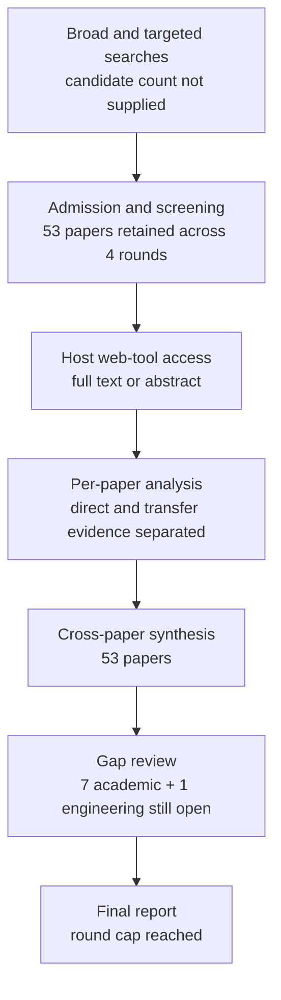

# Research Report: Incremental, Personalized and Priority-Aware Briefings from Workplace Communication

## Contents

- [Round History](#round-history)
- [Executive Summary](#executive-summary)
- [Research Question](#research-question)
- [Methodology](#methodology)
- [Papers Reviewed](#papers-reviewed)
- [Research Landscape](#research-landscape)
- [Confidence-Graded Findings](#confidence-graded-findings)
- [Research Gaps](#research-gaps)
- [Practical Recommendations](#practical-recommendations)
- [Evidence Map](#evidence-map)
- [References](#references)
- [Appendix: Run Metadata](#appendix-run-metadata)

## Round History

Iterative gap-closure loop (hard cap: 4 rounds). See
`references/iterative-synthesis.md` for the full loop definition.

| Round | Run ID | Topic / Gap Focus | New Papers | Gaps Addressed | Remaining Gaps |
|-------|--------|-------------------|------------|----------------|----------------|
| 1 | 48b3f0169bfb | incremental, personalized and priority-aware briefings from workplace communication: how accepted topic information is selected, updated, prioritized and summarized for a user over time, distinguishing new developments from still-open state without repeating superseded facts | 13 | initial shortlist | 7 academic, 1 engineering |
| 2 | 49f688a25a3f | longitudinal and cross-thread workplace briefing systems that track new, open, resolved, and superseded work-item state over repeated cycles, with adaptive user-specific prioritization, reminder value, uncertainty presentation, and omission/repetition evaluation | 16 | 0 resolved | 7 academic, 1 engineering |
| 3 | 9f57e4d7c3d9 | cycle-based cross-thread workplace briefing with explicit work-item state transitions: evidence for longitudinal new/open/resolved/superseded tracking, adaptive personalization, obligation-versus-preference prioritization, and joint omission/repetition evaluation | 14 | 0 resolved | 7 academic, 1 engineering |
| 4 | 229b747dc22e | Direct empirical evaluations of longitudinal cross-thread workplace briefing: cycle-by-cycle new/open/resolved/superseded work-item tracking, obligation-versus-preference selection, adaptive personalization under preference drift, and joint omission/repetition/false-alert evaluation. | 10 | academic gaps of the previous round | 7 academic, 1 engineering |

**Stop reason**: 4-round cap reached

## Executive Summary

This review investigated whether existing research is sufficient to support cycle-by-cycle workplace briefings that distinguish new developments from unresolved carry-forward work, suppress resolved or superseded material, personalize priority without confusing preference with obligation, and remain useful under changing user priorities. Across 53 admitted papers spanning 1998–2026, the strongest evidence is component-level: temporal summarization explicitly measures novelty, coverage, redundancy and latency; personalized email prioritization benefits from user-specific models; workplace reminder and task-management research exposes forgotten, stale and heterogeneous pending-work problems; and longitudinal update mechanisms are empirically demonstrated in news, clinical and recommender-system domains. [HIGH] [doi-10-6028-nist-sp-500-302-tempsumm-overview] [doi-10-1145-2063576-2063683] [2403.01365] [doi-10-18653-v1-2024-acl-long-390]

The evidence does **not** validate the integrated msgloom target behavior. No admitted study jointly evaluates repeated cross-thread workplace work items with explicit new/open/resolved/superseded state, hard obligations versus soft preferences, adaptation under preference drift, and simultaneous omission/repetition/false-alert measurement. [LOW] [doi-10-1145-383952-383954] [manual-50ed5dc808] [doi-10-1145-3705328-3748164]

The literature therefore supports a defensible design vocabulary, component mechanisms and evaluation requirements, but not a claim that an integrated personalized workplace briefing system has already been empirically validated. The most significant outstanding gap is direct longitudinal evaluation of the full work-item briefing contract over repeated workplace cycles.

**Scope**: 53 papers analyzed from arXiv, ACL Anthology, ACM/author-hosted publications, NIST/TREC, PMC/medical literature, Springer, ScienceDirect, Oxford Academic, JMIR, AAAI, Frontiers, ResearchGate and related scholarly sources over 1998–2026  
**Overall Confidence**: Medium  
**Verdict**: HAS_GAPS

## Research Question

The review asked:

> What empirical evidence supports selecting, updating, prioritizing and summarizing accepted Topic information for one user over repeated workplace-report cycles, such that new developments are distinguished from unchanged but still-open work, resolved or superseded facts are not unnecessarily repeated, explicit obligations and user rules remain distinct from softer personalized priority signals, changing preferences can be accommodated, and omission, repetition, false-alert and uncertainty costs can be evaluated?

The in-scope unit is a **stable work Topic or work item over time**, potentially spanning multiple messages, conversations or sources. Relevant evidence includes temporal/update summarization, workplace email triage, task/reminder systems, personalized prioritization, longitudinal summarization, preference drift, constrained ranking, prospective memory and uncertainty presentation.

Out of scope are generic one-message summaries without longitudinal state, pure novelty detection that permits unresolved critical work to disappear, response-likelihood prediction treated as equivalent to response obligation, popularity/recommendation ranking as an end goal, and action execution. Transfer-domain evidence is retained only as evidence for mechanisms or evaluation methods, not as an estimate of workplace-email production accuracy.

## Methodology

### Search Strategy

- **Sources**: arXiv, ACL Anthology, NIST/TREC, PMC, Springer, ScienceDirect, Oxford Academic, JMIR, AAAI, Frontiers, ResearchGate, ACM-linked or author-hosted publications, institutional repositories and other scholarly publication pages represented in the admitted corpus.
- **Query variants**:
  - `direct empirical evaluations longitudinal cross-thread workplace briefing: cycle-by-cycle new/open/resolved/superseded work-item tracking, obligation-versus-preference selection, adaptive personalization under drift, joint omission/repetition/false-alert evaluation.`
  - `direct empirical evaluations`
  - `direct longitudinal cross-thread workplace briefing: cycle-by-cycle new/open/resolved/superseded work-item tracking, obligation-versus-preference selection, adaptive personalization under drift, joint omission/repetition/false-alert evaluation.`
  - `empirical longitudinal cross-thread workplace briefing: cycle-by-cycle new/open/resolved/superseded work-item tracking, obligation-versus-preference selection, adaptive personalization under drift, joint omission/repetition/false-alert evaluation.`
  - `evaluations longitudinal cross-thread workplace briefing: cycle-by-cycle new/open/resolved/superseded work-item tracking, obligation-versus-preference selection, adaptive personalization under drift, joint omission/repetition/false-alert evaluation.`
  - `direct empirical evaluations longitudinal cross-thread`
  - `direct empirical evaluations workplace briefing:`
  - `direct empirical evaluations cycle-by-cycle new/open/resolved/superseded`
- **Time window**: 1998–2026.
- **Screening**: The supplied run metadata does not identify whether screening used BM25 only or BM25 plus a sub-agent; this field is therefore unknown rather than inferred.
- **Evidence discipline**: Findings distinguish direct workplace evidence from transfer evidence. Transfer results from news, clinical summarization, recommender systems, cybersecurity, robot planning, visualization and prospective-memory research are not treated as direct validation of workplace briefing.
- **Final-synthesis basis**: Pipeline workers read the admitted papers through the host's web tool at the access levels listed below. This final report was produced from the supplied cross-paper synthesis and reduced per-paper analyses rather than independently rereading all 53 papers.

### Paper Access Levels

| Paper | Access level |
|---|---|
| [1301.6707] | full_text |
| [2107.14691] | full_text |
| [2109.06896] | full_text |
| [2202.07088] | full_text |
| [2208.03828] | full_text |
| [2403.01365] | full_text |
| [2403.19795] | full_text |
| [2609.02465] | full_text |
| [doi-10-1007-978-3-319-67684-5-24] | abstract_only |
| [doi-10-1016-j-cag-2014-02-006] | abstract_only |
| [doi-10-1016-j-eswa-2021-114890] | full_text |
| [doi-10-1016-j-eswa-2021-115626] | abstract_only |
| [doi-10-1016-j-knosys-2013-02-015] | full_text |
| [doi-10-1093-jcmc-zmac001] | full_text |
| [doi-10-1098-rsos-181870] | full_text |
| [doi-10-1109-access-2022-3182390] | full_text |
| [doi-10-1109-fuzz-ieee-2016-7737835] | abstract_only |
| [doi-10-1136-amiajnl-2014-002945] | full_text |
| [doi-10-1145-1056808-1057071] | full_text |
| [doi-10-1145-1557019-1557124] | full_text |
| [doi-10-1145-2063576-2063683] | full_text |
| [doi-10-1145-2523813] | full_text |
| [doi-10-1145-290941-291025] | full_text |
| [doi-10-1145-2998181-2998251] | abstract_only |
| [doi-10-1145-3705328-3748164] | full_text |
| [doi-10-1145-383952-383954] | full_text |
| [doi-10-1145-634067-634150] | full_text |
| [doi-10-1145-642611-642672] | full_text |
| [doi-10-1155-2016-1340973] | full_text |
| [doi-10-1177-1071181322661236] | abstract_only |
| [doi-10-1186-s41235-019-0195-y] | full_text |
| [doi-10-1207-s15327051hci2001-2-3] | full_text |
| [doi-10-1609-icwsm-v12i1-15014] | full_text |
| [doi-10-18653-v1-2007-sigdial-1-4] | full_text |
| [doi-10-18653-v1-2020-acl-main-122] | full_text |
| [doi-10-18653-v1-2024-acl-long-390] | full_text |
| [doi-10-18653-v1-2026-acl-long-1149] | full_text |
| [doi-10-18653-v1-d19-1386] | full_text |
| [doi-10-2196-43977] | full_text |
| [doi-10-3389-fpsyg-2014-00657] | full_text |
| [doi-10-3758-bf03201140] | full_text |
| [doi-10-3758-s13421-025-01708-x] | full_text |
| [doi-10-3758-s13423-026-02985-6] | full_text |
| [doi-10-6028-nist-sp-500-302-tempsumm-overview] | full_text |
| [doi-10-64898-2025-11-28-25341233] | full_text |
| [manual-0839b98ee7] | full_text |
| [manual-13a21477e7] | full_text |
| [manual-1d6b22c7ad] | full_text |
| [manual-39435af3dd] | full_text |
| [manual-4cb48c423e] | full_text |
| [manual-50ed5dc808] | full_text |
| [manual-bdce973227] | full_text |
| [manual-c2f56a571b] | full_text |

### Pipeline Summary

| Metric | Count |
|--------|-------|
| Total candidates | Unknown |
| After screening | 53 admitted corpus records |
| Downloaded | Not supplied |
| Successfully converted | Not supplied |
| Deeply analyzed | 53 |
| Iterations (if system-building) | 4 |

## Papers Reviewed

Quality scores were not supplied by the pipeline and are therefore not fabricated. Relevance indicates relationship to Topic 09 rather than paper quality.

| # | Title | Authors | Year | Venue | Quality Score | Relevance |
|---|-------|---------|------|-------|--------------|-----------|
| 1 | Let it go: How trusted reminders alter intention maintenance [doi-10-3758-s13423-026-02985-6] | Connor Dupre, B. Hunter Ball | 2026 | Venue not supplied | Not supplied | MEDIUM |
| 2 | Examining the State-of-the-Art in News Timeline Summarization [doi-10-18653-v1-2020-acl-main-122] | Demian Gholipour Ghalandari, Georgiana Ifrim | 2020 | ACL publication | Not supplied | HIGH |
| 3 | Can Risk-Based Alerting Mitigate Cybersecurity Alert Fatigue? [2609.02465] | Rafael Uetz, Philipp Bönninghausen, Louis Hackländer-Jansen et al. | 2026 | arXiv / venue not supplied | Not supplied | MEDIUM |
| 4 | Effect of Personalized Email-Based Reminders on Participants’ Timeliness in an Online Education Program: Randomized Controlled Trial [doi-10-2196-43977] | Olle Bälter, Andreas Jemstedt, Feben Javan Abraham et al. | 2023 | JMIR publication | Not supplied | MEDIUM |
| 5 | Learning Human Preferences Over Robot Behavior as Soft Planning Constraints [2403.19795] | Austin Narcomey, Nathan Tsoi, Ruta Desai et al. | 2024 | arXiv / venue not supplied | Not supplied | MEDIUM |
| 6 | Attention-Sensitive Alerting [1301.6707] | Eric J. Horvitz, Andy Jacobs, David Hovel | 1999 | Venue not supplied | Not supplied | MEDIUM |
| 7 | Success of an Agent-Assisted System that Reduces Email Overload [manual-bdce973227] | Andrew Faulring, Brad A. Myers, Aaron Steinfeld | 2009 | Venue not supplied | Not supplied | HIGH |
| 8 | How Do Viewers Synthesize Conflicting Information from Data Visualizations? [2208.03828] | Prateek Mantri, Hariharan Subramonyam, Audrey L. Michal et al. | 2023 | arXiv / venue not supplied | Not supplied | MEDIUM |
| 9 | An End-to-End Personalized Preference Drift Aware Sequential Recommender System With Optimal Item Utilization [doi-10-1109-access-2022-3182390] | Saranya Maneeroj, Nakarin Sritrakool | 2022 | IEEE Access | Not supplied | MEDIUM |
| 10 | Temporal summaries of new topics [doi-10-1145-383952-383954] | James Allan, Rahul Gupta, Vikas Khandelwal | 2001 | ACM publication | Not supplied | HIGH |
| 11 | Summarize What You Are Interested In: An Optimization Framework for Interactive Personalized Summarization [manual-13a21477e7] | Rui Yan, Jian-Yun Nie, Xiaoming Li | 2011 | ACL Anthology publication | Not supplied | HIGH |
| 12 | Mining social networks for personalized email prioritization [doi-10-1145-1557019-1557124] | Shinjae Yoo, Yiming Yang, Frank Lin et al. | 2009 | ACM publication | Not supplied | HIGH |
| 13 | Modeling personalized email prioritization: Classification-based and regression-based approaches [doi-10-1145-2063576-2063683] | Shinjae Yoo, Yiming Yang, Jaime G. Carbonell | 2011 | ACM publication | Not supplied | HIGH |
| 14 | Measurement of Perceived Importance and Urgency of Email: An Employees’ Perspective [doi-10-1093-jcmc-zmac001] | Andre Lanctot, Linda Duxbury | 2022 | Journal of Computer-Mediated Communication | Not supplied | HIGH |
| 15 | Supporting Collaborative Task Management in E-mail [doi-10-1207-s15327051hci2001-2-3] | Steve Whittaker | 2005 | Human-Computer Interaction | Not supplied | HIGH |
| 16 | Summary Cloze: A New Task for Content Selection in Topic-Focused Summarization [doi-10-18653-v1-d19-1386] | Daniel Deutsch, Dan Roth | 2019 | ACL Anthology publication | Not supplied | HIGH |
| 17 | Summarizing Emails with Conversational Cohesion and Subjectivity [manual-c2f56a571b] | Giuseppe Carenini, Raymond T. Ng, Xiaodong Zhou | 2008 | ACL Anthology publication | Not supplied | HIGH |
| 18 | Detecting and Summarizing Action Items in Multi-Party Dialogue [doi-10-18653-v1-2007-sigdial-1-4] | Matthew Purver, John Dowding, John Niekrasz et al. | 2007 | SIGDIAL | Not supplied | HIGH |
| 19 | Beyond “From” and “Received”: Exploring the Dynamics of Email Triage [doi-10-1145-1056808-1057071] | Carman Neustaedter, A. J. Bernheim Brush, Marc A. Smith | 2005 | ACM publication | Not supplied | HIGH |
| 20 | Decision-Focused Summarization [2109.06896] | Chao-Chun Hsu, Chenhao Tan | 2021 | arXiv / venue not supplied | Not supplied | HIGH |
| 21 | The Use of MMR, Diversity-Based Reranking for Reordering Documents and Producing Summaries [doi-10-1145-290941-291025] | Jaime G. Carbonell, Jade Goldstein | 1998 | SIGIR / ACM publication | Not supplied | HIGH |
| 22 | AI-Powered Reminders for Collaborative Tasks: Experiences and Futures [2403.01365] | Katelyn Morrison, Shamsi T. Iqbal, Eric Horvitz | 2024 | arXiv / venue not supplied | Not supplied | HIGH |
| 23 | EmailSum: Abstractive Email Thread Summarization [2107.14691] | Shiyue Zhang, Asli Celikyilmaz, Jianfeng Gao et al. | 2021 | arXiv / venue not supplied | Not supplied | HIGH |
| 24 | RemindMe: Plugging a Reminder Manager into Email for Enhancing Workplace Responsiveness [doi-10-1007-978-3-319-67684-5-24] | Casey Dugan, Aabhas Sharma, Michael Muller et al. | 2017 | Springer publication | Not supplied | HIGH |
| 25 | HARVEST, a longitudinal patient record summarizer [doi-10-1136-amiajnl-2014-002945] | Jamie S. Hirsch, Jessica S. Tanenbaum, Sharon Lipsky Gorman et al. | 2014 | Medical informatics publication | Not supplied | MEDIUM |
| 26 | CLIN-SUMM: Incremental Longitudinal Summarization of Clinical Notes Enables Scalable Representation and Early Disease Prediction [doi-10-64898-2025-11-28-25341233] | Valentina D'Souza, Danielle F. Pace, Alaleh Azhir et al. | 2026 | medRxiv | Not supplied | MEDIUM |
| 27 | Communicating uncertainty about facts, numbers and science [doi-10-1098-rsos-181870] | Anne Marthe van der Bles, Sander van der Linden, Alexandra L. J. Freeman et al. | 2019 | Royal Society Open Science | Not supplied | MEDIUM |
| 28 | Corpus-Based Problem Selection for EHR Note Summarization [manual-1d6b22c7ad] | Tielman T. Van Vleck, Noémie Elhadad | 2010 | Medical informatics publication | Not supplied | MEDIUM |
| 29 | A case study of batch and incremental recommender systems in supermarket data under concept drifts and cold start [doi-10-1016-j-eswa-2021-114890] | Antônio David Viniski, Jean Paul Barddal, Alceu de Souza Britto Jr. et al. | 2021 | Expert Systems with Applications | Not supplied | MEDIUM |
| 30 | TREC 2013 Temporal Summarization [doi-10-6028-nist-sp-500-302-tempsumm-overview] | Javed A. Aslam, Matthew Ekstrand-Abueg, Virgil Pavlu et al. | 2013 | NIST / TREC | Not supplied | HIGH |
| 31 | Can You Verifi This? Studying Uncertainty and Decision-Making About Misinformation Using Visual Analytics [doi-10-1609-icwsm-v12i1-15014] | Alireza Karduni, Ryan Wesslen, Sashank Santhanam et al. | 2018 | ICWSM | Not supplied | MEDIUM |
| 32 | Interactive Multi-Objective Probabilistic Preference Learning with Soft and Hard Bounds [manual-4cb48c423e] | Edward Chen, Sang T. Truong, Natalie Dullerud et al. | 2026 | arXiv / venue not supplied | Not supplied | MEDIUM |
| 33 | Overview of the TAC 2008 Update Summarization Task [manual-39435af3dd] | Hoa Trang Dang, Karolina Owczarzak | 2008 | TAC / NIST | Not supplied | HIGH |
| 34 | Strategy-Specific Decision Making with Incomplete Information [doi-10-1177-1071181322661236] | William I.N. Sealy, Karen M. Feigh | 2022 | Venue not supplied | Not supplied | MEDIUM |
| 35 | Prospective memory: when reminders fail [doi-10-3758-bf03201140] | Melissa J. Guynn, Mark A. McDaniel, Gilles O. Einstein | 1998 | Venue not supplied | Not supplied | MEDIUM |
| 36 | Taking Email to Task: The Design and Evaluation of a Task Management Centered Email Tool [doi-10-1145-642611-642672] | Victoria Bellotti, Nicolas Ducheneaut, Mark Howard et al. | 2003 | ACM publication | Not supplied | HIGH |
| 37 | How important is importance for prospective memory? A review [doi-10-3389-fpsyg-2014-00657] | Stefan Walter, Beat Meier | 2014 | Frontiers in Psychology | Not supplied | MEDIUM |
| 38 | From Moments to Milestones: Incremental Timeline Summarization Leveraging Large Language Models [doi-10-18653-v1-2024-acl-long-390] | Qisheng Hu, Geonsik Moon, Hwee Tou Ng | 2024 | ACL | Not supplied | HIGH |
| 39 | A novel temporal recommender system based on multiple transitions in user preference drift and topic review evolution [doi-10-1016-j-eswa-2021-115626] | Charinya Wangwatcharakul, Sartra Wongthanavasu | 2021 | Expert Systems with Applications | Not supplied | MEDIUM |
| 40 | What Did I Ask You to Do, by When, and for Whom?: Passion and Compassion in Request Management [doi-10-1145-2998181-2998251] | Michael J. Muller, Casey Dugan, Michael Brenndoerfer et al. | 2017 | ACM publication | Not supplied | HIGH |
| 41 | Agent Newsroom: Efficient Chronological Report Generation via Dynamic Multi-Agent Collaboration [doi-10-18653-v1-2026-acl-long-1149] | Zhenhua Wang, Chunlei Wang, Yue Geng et al. | 2026 | ACL | Not supplied | MEDIUM |
| 42 | The Learning Behind Gmail Priority Inbox [manual-50ed5dc808] | Authors not supplied | 2010 | Google Research publication | Not supplied | HIGH |
| 43 | Exploiting relevance, coverage, and novelty for query-focused multi-document summarization [doi-10-1016-j-knosys-2013-02-015] | Wenjuan Luo, Fuzhen Zhuang, Qing He et al. | 2013 | Knowledge-Based Systems | Not supplied | HIGH |
| 44 | Can requests-for-action and commitments-to-act be reliably identified in email messages? [manual-0839b98ee7] | Andrew Lampert, Cécile Paris, Robert Dale | 2007 | Venue not supplied | Not supplied | HIGH |
| 45 | Scaling up Ranking under Constraints for Live Recommendations by Replacing Optimization with Prediction [2202.07088] | Yegor Tkachenko, Wassim Dhaouadi, Kamel Jedidi | 2022 | arXiv / venue not supplied | Not supplied | MEDIUM |
| 46 | Effects of visualizing uncertainty on decision-making in a target identification scenario [doi-10-1016-j-cag-2014-02-006] | Maria Riveiro, Tove Helldin, Göran Falkman et al. | 2014 | Computers & Graphics | Not supplied | MEDIUM |
| 47 | A survey on concept drift adaptation [doi-10-1145-2523813] | João Gama, Indrė Žliobaitė, Albert Bifet et al. | 2014 | ACM Computing Surveys | Not supplied | MEDIUM |
| 48 | Mining Sequential Update Summarization with Hierarchical Text Analysis [doi-10-1155-2016-1340973] | Chunyun Zhang, Zhongwei Si, Zhanyu Ma | 2016 | Venue not supplied | Not supplied | HIGH |
| 49 | Fuzzy user-interest drift detection based recommender systems [doi-10-1109-fuzz-ieee-2016-7737835] | Authors not supplied | 2016 | IEEE FUZZ | Not supplied | MEDIUM |
| 50 | Time to Split: Exploring Data Splitting Strategies for Offline Evaluation of Sequential Recommenders [doi-10-1145-3705328-3748164] | Danil Gusak, Anna Volodkevich, Anton Klenitskiy et al. | 2025 | ACM publication | Not supplied | MEDIUM |
| 51 | Confidence guides spontaneous cognitive offloading [doi-10-1186-s41235-019-0195-y] | Annika Boldt, Sam J. Gilbert | 2019 | Cognitive Research: Principles and Implications | Not supplied | MEDIUM |
| 52 | Supporting Prospective Information in Email [doi-10-1145-634067-634150] | Jacek Gwizdka | 2001 | ACM publication | Not supplied | HIGH |
| 53 | Strategic reminder setting for time-based intentions: Influence of metacognition, delay length, and cue visibility [doi-10-3758-s13421-025-01708-x] | Pei-Chun Tsai, Sam J. Gilbert | 2025 | Venue not supplied | Not supplied | MEDIUM |

## Research Landscape

### Theme 1: Temporal Update Summarization as a Multi-Objective Problem

**Coverage**: 7+ papers | **Confidence**: High  
**Supporting papers**: [doi-10-1145-383952-383954], [doi-10-6028-nist-sp-500-302-tempsumm-overview], [manual-39435af3dd], [doi-10-1155-2016-1340973], [doi-10-18653-v1-2020-acl-main-122], [doi-10-1016-j-knosys-2013-02-015], [doi-10-1145-290941-291025]

Temporal and update summarization research does not treat successful reporting as generic similarity to a reference summary. It separates novel/useful information, coverage, redundancy, irrelevant or off-event material, verbosity and timeliness, and observed systems trade precision-like gains against broader comprehensiveness. [HIGH] [doi-10-1145-383952-383954] [doi-10-6028-nist-sp-500-302-tempsumm-overview] [manual-39435af3dd] [doi-10-1155-2016-1340973]

Key findings:

1. [HIGH] Novelty and redundancy are distinct from coverage: suppressing repeated material alone is insufficient if important unresolved information disappears. [doi-10-6028-nist-sp-500-302-tempsumm-overview] [manual-39435af3dd]
2. [HIGH] Relevance, coverage and novelty can be optimized jointly, but the literature exhibits trade-offs rather than a single universally dominant objective. [doi-10-1016-j-knosys-2013-02-015] [doi-10-1145-290941-291025]
3. [HIGH] Timeline summarization evidence supplies evaluation concepts that transfer naturally to repeated briefings, but its event/news unit is not equivalent to a cross-thread workplace work item. [doi-10-18653-v1-2020-acl-main-122] [doi-10-6028-nist-sp-500-302-tempsumm-overview]

### Theme 2: Workplace Email Priority Is User-Dependent

**Coverage**: 6+ papers | **Confidence**: High  
**Supporting papers**: [manual-50ed5dc808], [doi-10-1145-1557019-1557124], [doi-10-1145-2063576-2063683], [doi-10-1145-1056808-1057071], [doi-10-1093-jcmc-zmac001], [manual-bdce973227]

Personalized email-priority research consistently treats user behavior and context as important. User-specific models can improve priority prediction over global or simpler alternatives in the evaluated datasets, while observational email-triage work documents substantial differences in individual practices. [HIGH] [manual-50ed5dc808] [doi-10-1145-1557019-1557124] [doi-10-1145-2063576-2063683] [doi-10-1145-1056808-1057071]

Key findings:

1. [HIGH] Personalized email-priority prediction is empirically preferable to assuming a single global priority function for all users in the evaluated settings. [manual-50ed5dc808] [doi-10-1145-1557019-1557124] [doi-10-1145-2063576-2063683]
2. [HIGH] Importance and urgency are user-facing constructs with workplace relevance, but they are not equivalent to a formal obligation to respond. [doi-10-1093-jcmc-zmac001]
3. [HIGH] The corpus does not justify converting a predicted response probability or inferred priority directly into a mandatory-work classification. [manual-50ed5dc808] [doi-10-1145-2063576-2063683]

### Theme 3: Pending Work and Reminder State Matter

**Coverage**: 9+ papers | **Confidence**: High  
**Supporting papers**: [2403.01365], [doi-10-1145-634067-634150], [doi-10-1207-s15327051hci2001-2-3], [doi-10-1145-642611-642672], [doi-10-1145-2998181-2998251], [doi-10-1007-978-3-319-67684-5-24], [manual-0839b98ee7]

Email is used not only for communication but also as an external representation of future work. Workplace studies describe retaining messages as prospective-task cues, request and commitment management, benefits from reminders for forgotten work, and operational problems when reminder state becomes stale or wrong. [HIGH] [2403.01365] [doi-10-1145-634067-634150] [doi-10-1207-s15327051hci2001-2-3] [doi-10-1145-642611-642672]

Key findings:

1. [HIGH] Unchanged information can retain high decision value because unresolved tasks continue to matter even when no new message has arrived. [doi-10-1145-634067-634150] [doi-10-1207-s15327051hci2001-2-3]
2. [HIGH] Stale reminder state is an important failure mode; a briefing must not assume that an earlier task representation remains current merely because it remains stored. [2403.01365]
3. [HIGH] Requests, commitments and action items are useful upstream signals, but extracting them is separate from deciding whether and how they should appear in a current briefing. [manual-0839b98ee7] [doi-10-18653-v1-2007-sigdial-1-4]

### Theme 4: Incremental Longitudinal Summarization Exists, but Mostly Outside Workplace Briefing

**Coverage**: 5+ papers | **Confidence**: High for mechanisms, Low for direct workplace transfer  
**Supporting papers**: [doi-10-18653-v1-2024-acl-long-390], [doi-10-64898-2025-11-28-25341233], [doi-10-18653-v1-2026-acl-long-1149], [doi-10-1136-amiajnl-2014-002945], [2107.14691]

Incremental processing is technically and empirically demonstrated in timeline and clinical settings. An LLM timeline pipeline processes newly arriving information, and CLIN-SUMM incrementally summarizes newly documented clinical information without future documentation. [HIGH] [doi-10-18653-v1-2024-acl-long-390] [doi-10-64898-2025-11-28-25341233]

Key findings:

1. [HIGH] Incremental summarization can be evaluated chronologically rather than by repeatedly regenerating an unconstrained summary from an entire future-known corpus. [doi-10-18653-v1-2024-acl-long-390] [doi-10-64898-2025-11-28-25341233]
2. [MEDIUM] Chronological report generation and adaptive scheduling are demonstrated in Agent Newsroom, but the supplied analysis does not establish true streaming incremental-arrival processing for that paper. [doi-10-18653-v1-2026-acl-long-1149]
3. [LOW] No admitted paper establishes that these mechanisms solve stable, cross-thread workplace work-item reporting. [doi-10-18653-v1-2024-acl-long-390] [doi-10-64898-2025-11-28-25341233] [2107.14691]

### Theme 5: Preference Drift Requires Chronological Adaptation

**Coverage**: 7+ papers | **Confidence**: High in transfer domains, Medium for workplace applicability  
**Supporting papers**: [doi-10-1016-j-eswa-2021-114890], [doi-10-1016-j-eswa-2021-115626], [doi-10-1109-access-2022-3182390], [doi-10-1109-fuzz-ieee-2016-7737835], [doi-10-1145-2523813], [doi-10-1145-3705328-3748164]

Recommender-system research provides substantial evidence that preferences change and that temporal or incremental adaptation can outperform static treatment in some datasets. It also shows that conclusions depend on data splits, history utilization and evaluation protocol. [HIGH] [doi-10-1016-j-eswa-2021-114890] [doi-10-1109-access-2022-3182390] [doi-10-1145-2523813] [doi-10-1145-3705328-3748164]

Key findings:

1. [HIGH] Evaluating adaptive personalization with random future-leaking splits is unsafe when the target problem is temporal adaptation. [doi-10-1145-3705328-3748164]
2. [HIGH] Drift-aware updating can improve recommendation outcomes in some transfer datasets, but gains are not uniform across conditions. [doi-10-1016-j-eswa-2021-114890] [doi-10-1109-access-2022-3182390]
3. [MEDIUM] These methods motivate a workplace experiment but do not establish long-term adaptation to changing roles, projects, managers or responsibilities in email briefing. [doi-10-1016-j-eswa-2021-115626] [doi-10-1145-2523813]

### Theme 6: Hard Requirements and Soft Preferences Should Remain Distinguishable

**Coverage**: 3 papers | **Confidence**: Medium  
**Supporting papers**: [2403.19795], [2202.07088], [manual-4cb48c423e]

Adjacent constrained-decision research explicitly represents mandatory or bounded constraints separately from learned soft preferences and shows that constrained ranking or planning can preserve hard requirements while optimizing softer objectives. [MEDIUM] [2403.19795] [2202.07088] [manual-4cb48c423e]

Key findings:

1. [MEDIUM] A hard-versus-soft decomposition is technically plausible and experimentally used in adjacent domains. [2403.19795] [2202.07088]
2. [LOW] The corpus does not establish that such a decomposition improves workplace briefing or correctly models response obligations. [2403.19795] [2202.07088]

### Theme 7: Uncertainty Presentation Changes Human Decisions

**Coverage**: 5+ papers | **Confidence**: Medium  
**Supporting papers**: [doi-10-1016-j-cag-2014-02-006], [doi-10-1609-icwsm-v12i1-15014], [doi-10-1098-rsos-181870], [2208.03828], [doi-10-1177-1071181322661236]

Uncertainty and conflicting evidence affect human decision processes, but presentation effects depend on task context. Visualizing uncertainty may alter prioritization or reasoning without necessarily increasing classification accuracy; conflicting cues can increase uncertainty and error; and communicating epistemic uncertainty does not uniformly reduce trust. [MEDIUM] [doi-10-1016-j-cag-2014-02-006] [doi-10-1609-icwsm-v12i1-15014] [doi-10-1098-rsos-181870] [2208.03828]

Key findings:

1. [MEDIUM] A briefing should not silently collapse disputed or incomplete evidence into a definite state merely for visual simplicity. [doi-10-1098-rsos-181870] [2208.03828]
2. [MEDIUM] There is no evidence in the admitted corpus for one universally optimal uncertainty visualization for workplace briefing. [doi-10-1016-j-cag-2014-02-006] [doi-10-1609-icwsm-v12i1-15014]

### Theme 8: Reminder Content, Reminder Use and Reminder Reliability Are Different Problems

**Coverage**: 5+ papers | **Confidence**: High for individual effects, Medium for briefing transfer  
**Supporting papers**: [doi-10-3758-bf03201140], [doi-10-1186-s41235-019-0195-y], [doi-10-3758-s13421-025-01708-x], [doi-10-3758-s13423-026-02985-6], [doi-10-3389-fpsyg-2014-00657]

Prospective-memory research separates three questions that should not be conflated: what reminder content aids prospective memory, what causes people to set reminders, and how reliance changes when reminders are highly reliable. [HIGH] [doi-10-3758-bf03201140] [doi-10-1186-s41235-019-0195-y] [doi-10-3758-s13421-025-01708-x] [doi-10-3758-s13423-026-02985-6]

Key findings:

1. [HIGH] In the tested reminder-content experiments, reminders combining the target event with the intended action produced stronger prospective-memory performance than target-only reminders and generally outperformed action-only reminders. [doi-10-3758-bf03201140]
2. [HIGH] Lower confidence, longer delays in a time-based paradigm and reduced cue visibility can increase reminder setting; these are determinants of offloading behavior, not general measures of reminder effectiveness. [doi-10-1186-s41235-019-0195-y] [doi-10-3758-s13421-025-01708-x]
3. [MEDIUM] Highly reliable reminders can reduce internally maintained intention-related thoughts; the reported performance cost when expected reminders were unexpectedly absent was suggestive rather than definitive. [doi-10-3758-s13423-026-02985-6]

## Methodology Comparison

| Approach | Papers | Strengths | Weaknesses | Best For | Performance |
|----------|--------|-----------|------------|----------|-------------|
| Temporal/update summarization | [doi-10-1145-383952-383954], [manual-39435af3dd], [doi-10-6028-nist-sp-500-302-tempsumm-overview], [doi-10-1155-2016-1340973] | Explicit novelty, redundancy, coverage and latency concepts | Event/news unit does not encode workplace obligations or persistent unresolved work | Delta selection and repeated-report evaluation | Multi-objective trade-offs reported; no single universal winner |
| Personalized email prioritization | [manual-50ed5dc808], [doi-10-1145-1557019-1557124], [doi-10-1145-2063576-2063683] | Direct workplace-email personalization evidence | Predicts importance/priority, not obligation or lifecycle state | Soft ordering and prioritization | Personalized models improve evaluated priority prediction relative to global/simpler baselines |
| Email task/reminder systems | [2403.01365], [doi-10-1145-634067-634150], [doi-10-1145-642611-642672], [doi-10-1007-978-3-319-67684-5-24] | Direct evidence of pending-work, forgotten-task and stale-state problems | Does not jointly solve summarization, cross-thread identity and lifecycle tracking | Carry-forward work and reminder design | Benefits and failure modes reported; no unified briefing benchmark |
| Thread summarization | [2107.14691], [manual-c2f56a571b] | Direct email summarization; conversational structure useful | Thread-centric; abstractive salience/faithfulness errors; weaker on long threads | Per-thread compression | Structure helps extractive selection; modern abstractive errors remain |
| Incremental longitudinal summarization | [doi-10-18653-v1-2024-acl-long-390], [doi-10-64898-2025-11-28-25341233] | Processes time-ordered new information without future context | Transfer domains; no workplace work-item obligations | Incremental state-to-summary pipelines | Empirical support in news and clinical settings |
| Drift-aware recommendation | [doi-10-1016-j-eswa-2021-114890], [doi-10-1109-access-2022-3182390], [doi-10-1145-2523813] | Strong temporal-adaptation literature | Objective is recommendation, not work completeness | Personalization adaptation mechanisms | Improvements vary by dataset and protocol |
| Hard/soft constrained decision models | [2403.19795], [2202.07088], [manual-4cb48c423e] | Makes mandatory versus preference signals explicit | Adjacent-domain evidence only | Architecture for obligation-preserving ranking | Constraint compliance demonstrated in adjacent tasks |
| Uncertainty presentation | [doi-10-1016-j-cag-2014-02-006], [doi-10-1098-rsos-181870], [doi-10-1609-icwsm-v12i1-15014], [2208.03828] | Human-facing evidence about uncertainty/conflict | Effects task-dependent | Presentation of disputed/incomplete states | Changes decision behavior; no uniform accuracy/trust improvement |
| Prospective-memory reminders | [doi-10-3758-bf03201140], [doi-10-1186-s41235-019-0195-y], [doi-10-3758-s13421-025-01708-x] | Controlled causal experiments | Laboratory paradigms; not workplace briefing | Reminder-content and forgetting-risk hypotheses | Target-plus-action reminder effect supported in tested paradigm |

## Confidence-Graded Findings

### 🟢 High Confidence (supported by 3+ papers with consistent results)

1. **[HIGH] Temporal briefing quality is inherently multi-objective.** Novelty, coverage, redundancy, irrelevant material and latency must be distinguished rather than collapsed into a generic summary-similarity measure. [doi-10-1145-383952-383954] [doi-10-6028-nist-sp-500-302-tempsumm-overview] [manual-39435af3dd] [doi-10-1155-2016-1340973]

2. **[HIGH] Workplace priority is user-dependent, and personalization can improve email-priority prediction.** User-specific models and heterogeneous triage behavior make a single global ranking policy inadequate for the evaluated data. [manual-50ed5dc808] [doi-10-1145-1557019-1557124] [doi-10-1145-2063576-2063683] [doi-10-1145-1056808-1057071]

3. **[HIGH] Novel information and important information are not equivalent.** Workplace email/task studies show that pending messages and reminders continue to represent future work even without new content, so novelty-only filtering can discard still-actionable state. [doi-10-1145-634067-634150] [doi-10-1207-s15327051hci2001-2-3] [doi-10-1145-642611-642672] [2403.01365]

4. **[HIGH] Incremental longitudinal processing is empirically feasible.** News and clinical systems demonstrate chronological processing of newly arriving or newly documented information without requiring later records for earlier summaries. [doi-10-18653-v1-2024-acl-long-390] [doi-10-64898-2025-11-28-25341233]

5. **[HIGH] Preference drift is a real evaluation concern in temporal personalization.** Recommender research demonstrates changing preferences, incremental adaptation and sensitivity to temporal evaluation methodology. [doi-10-1016-j-eswa-2021-114890] [doi-10-1109-access-2022-3182390] [doi-10-1145-2523813] [doi-10-1145-3705328-3748164]

6. **[HIGH] Email-thread summarization still exhibits content-selection and faithfulness risks.** Conversational cohesion can improve extraction, while abstractive thread summarizers can mishandle intention, roles, attribution and long-thread salience. [2107.14691] [manual-c2f56a571b]

7. **[HIGH] Reminder-content design matters.** In the tested prospective-memory experiments, including both the triggering target/context and intended action was more effective than target-only reminders and generally better than action-only reminders. [doi-10-3758-bf03201140]

8. **[HIGH] Reminder use is affected by metacognitive and temporal factors.** Lower confidence, longer delays in a tested time-based paradigm and reduced cue visibility can increase external reminder setting. [doi-10-1186-s41235-019-0195-y] [doi-10-3758-s13421-025-01708-x]

### 🟡 Medium Confidence (supported by 1-2 papers or with caveats)

1. **[MEDIUM] Explicitly separating hard requirements from soft learned preferences is a promising architecture.** Adjacent constrained-planning and ranking research demonstrates the decomposition, but it has not been directly tested for workplace response obligations. [2403.19795] [2202.07088]

2. **[MEDIUM] Uncertainty should be presented rather than silently collapsed.** Presentation can change decision behavior, and conflicting evidence can increase uncertainty and errors, but effects on accuracy and trust are context-specific. [doi-10-1016-j-cag-2014-02-006] [doi-10-1098-rsos-181870] [doi-10-1609-icwsm-v12i1-15014] [2208.03828]

3. **[MEDIUM] Highly reliable reminders may change users' internal intention-maintenance strategy.** Reduced intention-related thoughts were observed, while the cost of unexpectedly missing a trusted reminder was reported as suggestive rather than definitive. [doi-10-3758-s13423-026-02985-6]

4. **[MEDIUM] Chronological multi-agent report generation is relevant to briefing architecture, but it should not be described as established streaming incremental processing on the basis of the supplied analysis.** [doi-10-18653-v1-2026-acl-long-1149]

### 🔴 Low Confidence (preliminary, single-source, or contradicted)

1. **[LOW] The integrated target task is empirically validated.** The corpus does **not** support this claim: no admitted paper jointly evaluates repeated cross-thread workplace briefing with explicit lifecycle state, obligations versus preferences, preference drift and omission/repetition/false-alert outcomes. The low confidence here reflects absence of direct evidence, not evidence of failure. [doi-10-1145-383952-383954] [manual-50ed5dc808] [doi-10-1145-3705328-3748164]

2. **[LOW] Preference-drift results from recommender systems directly predict workplace-email behavior.** They provide mechanism-level transfer evidence only; direct workplace longitudinal adaptation remains untested. [doi-10-1016-j-eswa-2021-114890] [doi-10-1109-access-2022-3182390]

3. **[LOW] A generic reminder score can substitute for explicit work obligations.** The admitted reminder and prospective-memory literature does not establish that equivalence. [2403.01365] [doi-10-3389-fpsyg-2014-00657]

## Trade-Off Analysis

| Decision | Option A | Option B | Recommendation |
|----------|----------|----------|----------------|
| Novelty versus carry-forward | Show only changed material: concise but can lose unresolved work | Carry every open item: safer coverage but can create repetition fatigue | Preserve unresolved decision-essential state while separately marking whether it changed; temporal-summary and workplace-task evidence support treating novelty and continuing importance separately. [doi-10-6028-nist-sp-500-302-tempsumm-overview] [doi-10-1145-634067-634150] |
| Global versus personalized priority | Global ranking is simpler and stable | Personalized ranking reflects heterogeneous user behavior but can drift | Use personalization for soft ordering, evaluated chronologically; do not allow it to erase explicit rules. [doi-10-1145-2063576-2063683] [doi-10-1145-3705328-3748164] |
| Unified score versus hard/soft separation | One score is operationally simple but obscures obligation | Separate mandatory rules from preference signals | Keep obligations/rules structurally distinct from soft ranking signals; evidence is transfer-level, so benchmark the design rather than treating it as settled. [2403.19795] [2202.07088] |
| Full regeneration versus incremental update | Full regeneration can reconsider all context but risks repetition and temporal leakage in evaluation | Incremental update preserves chronology but depends on reliable state | Prefer an explicit cycle model with prior accepted state plus newly available evidence; evaluate against chronological gold. [doi-10-18653-v1-2024-acl-long-390] [doi-10-64898-2025-11-28-25341233] |
| Hide versus expose uncertainty | Hiding uncertainty creates simpler output but overstates confidence | Explicit uncertainty preserves epistemic state but can increase complexity | Preserve disputed, stale and incomplete states explicitly and test presentation variants with users. [doi-10-1098-rsos-181870] [2208.03828] |
| Short reminder versus contextual reminder | Minimal reminder reduces reading | Target/context plus intended action carries more actionable information | When an identified intention is surfaced, test a compact target/context-plus-action representation. [doi-10-3758-bf03201140] |

A suitable evaluation should not collapse all failures into one score. A project-level loss can instead be defined conceptually as

$L = \lambda_O O + \lambda_R R + \lambda_F F + \lambda_S S,$

where $O$ is decision-essential omission, $R$ is redundant repetition, $F$ is false-alert cost, and $S$ is lifecycle-state error. The weights $\lambda_O,\lambda_R,\lambda_F,\lambda_S$ are product-policy parameters, not values established by the reviewed papers. The literature supports evaluating these dimensions separately; it does not supply msgloom-specific weights. [doi-10-6028-nist-sp-500-302-tempsumm-overview] [manual-bdce973227]

## Points of Agreement

1. **[HIGH] Repeated summaries should distinguish novelty from coverage.** Temporal and update-summarization research consistently separates new/useful information from redundancy and comprehensiveness. [doi-10-1145-383952-383954] [manual-39435af3dd] [doi-10-6028-nist-sp-500-302-tempsumm-overview]

2. **[HIGH] Personal relevance is heterogeneous.** Email-triage and priority studies agree that user-specific behavior and relationships matter for priority modelling. [doi-10-1145-1056808-1057071] [doi-10-1145-1557019-1557124] [doi-10-1145-2063576-2063683]

3. **[HIGH] Pending work survives message novelty boundaries.** Email task-management research repeatedly shows that people use email as a prospective-work store rather than simply an information archive. [doi-10-1145-634067-634150] [doi-10-1207-s15327051hci2001-2-3] [doi-10-1145-642611-642672]

4. **[HIGH] Longitudinal evaluation should respect time.** Incremental summarization and sequential-recommendation evidence support chronological processing and evaluation rather than leaking future information into earlier decisions. [doi-10-18653-v1-2024-acl-long-390] [doi-10-64898-2025-11-28-25341233] [doi-10-1145-3705328-3748164]

5. **[MEDIUM] Uncertainty is decision-relevant rather than merely cosmetic.** Multiple studies show changes in reasoning, confidence or prioritization when uncertainty or conflicting information is surfaced. [doi-10-1016-j-cag-2014-02-006] [doi-10-1098-rsos-181870] [doi-10-1609-icwsm-v12i1-15014] [2208.03828]

## Points of Contradiction

1. **[MEDIUM] Scope-qualified tension in the role of delay in prospective-memory reminder paradigms**: [doi-10-3758-bf03201140] found no significant effect of reminder-to-target or instruction-to-task delay within its tested reminder-content experiments, whereas [doi-10-3758-s13421-025-01708-x] found in a different time-based-intention paradigm that longer delays reduced unaided first-response accuracy, lowered confidence, increased reminder use, and produced larger benefits from reminder setting.
   - **Possible explanation**: The papers use different prospective-memory paradigms, outcomes and delay manipulations, so this is not a clean same-experiment contradiction.
   - **Implication**: [MEDIUM] The evidence does not support a domain-general rule that delay either does or does not affect reminder effectiveness; msgloom should treat delay as an empirical variable rather than a settled monotonic priority factor. [doi-10-3758-bf03201140] [doi-10-3758-s13421-025-01708-x]

## Research Gaps

All eight gaps remain open. The four-round cap ended the literature loop; none of the gaps below is accepted as closed or answered by the current corpus.

| # | Gap | Type | Severity | Rounds Already Searched | Impact on Goals |
|---|-----|------|----------|-------------------------|----------------|
| 1 | No direct longitudinal workplace briefing evaluation distinguishing changed information, unchanged-but-open work, resolved state and superseded state across successive cycles | [ACADEMIC] | HIGH | 1, 2, 3, 4 | Core report-state contract remains unvalidated |
| 2 | No direct evidence for interaction between explicit user rules/response obligations and softer learned priority, reminder or forgetting signals | [ACADEMIC] | HIGH | 1, 2, 3, 4 | Cannot claim personalization will remain subordinate to obligations |
| 3 | Long-term personalization under changing workplace roles, projects, priorities and feedback is not evaluated | [ACADEMIC] | HIGH | 1, 2, 3, 4 | Static personalization may become stale |
| 4 | No end-to-end repeated-cycle evaluation jointly measuring decision-essential omission, redundant repetition, false alerts and unresolved-state preservation | [ACADEMIC] | HIGH | 1, 2, 3, 4 | Main safety/usability trade-off lacks direct benchmark evidence |
| 5 | No evidence for how reminder usefulness/forgetting risk combines with importance, urgency, recency and personalized priority for briefing selection | [ACADEMIC] | MEDIUM | 1, 2, 3, 4 | Soft prioritization policy remains underdetermined |
| 6 | No topic/work-item-level incremental briefing across multiple workplace conversations and sources | [ACADEMIC] | HIGH | 1, 2, 3, 4 | Cross-thread Topic contract remains untested |
| 7 | No workplace experiment comparing presentation of stale, disputed, uncertain or incompletely investigated state | [ACADEMIC] | HIGH | 1, 2, 3, 4 | User-facing uncertainty policy remains empirically unresolved |
| 8 | No reproducible unified cycle-based benchmark with chronological holdouts, independently labeled lifecycle state, user-specific priority labels and explicit omission/repetition errors | [ENGINEERING] | HIGH | 1, 2, 3; round 4 focused on academic gaps | Candidate mechanisms cannot yet be compared under the product's actual error contract |

### Academic Gaps (require more papers)

1. **[ACADEMIC] [HIGH] Gap 1 — Longitudinal new/open/resolved/superseded workplace briefing**: The literature has not answered this yet. Incremental news and clinical summarization are transfer evidence, not direct workplace validation. Searched in rounds 1–4. Suggested query: `"incremental summarization" longitudinal workplace email briefing "open" resolved superseded state`. [doi-10-18653-v1-2024-acl-long-390] [doi-10-64898-2025-11-28-25341233]

2. **[ACADEMIC] [HIGH] Gap 2 — Obligations and explicit rules versus soft preferences**: The literature has not answered this yet. The corpus separately studies personalized email priority and hard/soft constrained decision mechanisms but not their workplace combination. Searched in rounds 1–4. Suggested query: `"email prioritization" "response obligation" hard constraints soft preferences personalized triage reminder`. [manual-50ed5dc808] [2403.19795] [2202.07088]

3. **[ACADEMIC] [HIGH] Gap 3 — Workplace preference drift**: The literature has not answered this yet. Drift-aware methods are directly evaluated in recommender systems, not changing workplace roles, projects and responsibilities. Searched in rounds 1–4. Suggested query: `"longitudinal personalization" workplace email preference drift adaptive prioritization user feedback`. [doi-10-1016-j-eswa-2021-114890] [doi-10-1109-access-2022-3182390]

4. **[ACADEMIC] [HIGH] Gap 4 — Joint omission/repetition/false-alert/state evaluation**: The literature has not answered this yet. Individual dimensions occur in temporal summarization and email-assistance research, but not jointly over repeated workplace cycles. Searched in rounds 1–4. Suggested query: `"longitudinal summarization" omission redundancy false alerts unresolved state evaluation`. [doi-10-6028-nist-sp-500-302-tempsumm-overview] [manual-bdce973227]

5. **[ACADEMIC] [MEDIUM] Gap 5 — Combining reminder value with workplace priority**: The literature has not answered this yet. Importance, urgency, reminder utility, prospective-memory importance and offloading determinants are separately studied. Searched in rounds 1–4. Suggested query: `"email reminder" forgetting importance urgency recency personalized priority task selection`. [2403.01365] [doi-10-1093-jcmc-zmac001] [doi-10-1186-s41235-019-0195-y]

6. **[ACADEMIC] [HIGH] Gap 6 — Cross-thread, multi-source work-item briefing**: The literature has not answered this yet. Email summarization remains primarily thread/conversation level, while longitudinal evidence comes from transfer domains. Searched in rounds 1–4. Suggested query: `"cross-thread summarization" email multi-source incremental "work item" workplace`. [2107.14691] [manual-c2f56a571b] [doi-10-18653-v1-2024-acl-long-390]

7. **[ACADEMIC] [HIGH] Gap 7 — Presentation of stale, disputed and incomplete workplace state**: The literature has not answered this yet. General uncertainty, stale reminder and conflicting-cue evidence exists, but no admitted workplace-briefing experiment compares presentation strategies. Searched in rounds 1–4. Suggested query: `"uncertainty visualization" workplace decision support stale disputed incomplete information briefing`. [2403.01365] [doi-10-1098-rsos-181870] [2208.03828]

### Engineering Gaps (fillable without papers)

1. **[ENGINEERING] [HIGH] Gap 8 — Unified longitudinal briefing benchmark**: No admitted paper supplies the required benchmark, and the literature has not answered the integrated evaluation question. The immediate missing artifact can nevertheless be constructed without another publication: create independent chronological fixtures with stable Topic IDs, cycle-level new/open/resolved/superseded gold labels, obligations separated from preference labels, stale/disputed/uncertain categories and independently scored omissions, repetitions and false alerts. Candidate mechanisms should then be compared under identical holdouts. This benchmark can establish reproducible engineering performance but **cannot** establish production-workplace representativeness. The gap was exposed and searched around in rounds 1–3; round 4 explicitly targeted academic gaps. [doi-10-6028-nist-sp-500-302-tempsumm-overview] [doi-10-1145-3705328-3748164]

## Reproducibility Notes

The supplied synthesis did not provide a systematic audit of code repositories, dataset availability or licenses for all 53 papers. Unknown fields are therefore left unknown instead of inferred.

| Paper | Code Available | Data Available | Sufficient Detail | License |
|-------|---------------|----------------|-------------------|---------|
| [doi-10-6028-nist-sp-500-302-tempsumm-overview] | Unknown from supplied analysis | TREC evaluation resources implied, exact availability not audited | ⚠️ Not independently audited | Unknown |
| [doi-10-18653-v1-2024-acl-long-390] | Unknown from supplied analysis | Unknown | ⚠️ Not independently audited | Unknown |
| [2107.14691] | Unknown from supplied analysis | EmailSum dataset described in paper; present availability not audited | ⚠️ Not independently audited | Unknown |
| [manual-50ed5dc808] | Unknown from supplied analysis | Production Gmail data not assumed publicly available | ⚠️ Not independently audited | Unknown |
| [doi-10-1145-2063576-2063683] | Unknown from supplied analysis | Unknown | ⚠️ Not independently audited | Unknown |
| [doi-10-1016-j-eswa-2021-114890] | Unknown from supplied analysis | Dataset status not audited | ⚠️ Not independently audited | Unknown |
| [doi-10-1145-3705328-3748164] | Unknown from supplied analysis | Dataset status not audited | ⚠️ Not independently audited | Unknown |
| [doi-10-3758-bf03201140] | Unknown from supplied analysis | Unknown | ⚠️ Not independently audited | Unknown |
| Corpus overall | Not systematically audited | Not systematically audited | ⚠️ Reproduction metadata incomplete | Not systematically audited |

For msgloom, reproducibility should therefore be established independently of whether individual papers release code: freeze benchmark fixtures, separate model inputs from future/gold state, preserve chronological splits, version all labels, run clean-workspace reproductions, and include regression or mutation tests for lifecycle transitions.

## Practical Recommendations

1. **[HIGH] Model briefing selection explicitly by report cycle and work-item state, not as independent message summarization.** Use a prior accepted Topic view plus newly available evidence to decide whether an item is new/changed, unchanged-but-open, resolved, superseded, disputed or otherwise still decision-relevant. This recommendation is motivated by temporal-update evaluation and workplace pending-task evidence. [doi-10-6028-nist-sp-500-302-tempsumm-overview] [doi-10-1145-634067-634150] [2403.01365]

2. **[HIGH] Measure omission, repetition and false alerts separately.** A briefing that is concise by omitting critical open work is not better, and a briefing that preserves everything by repeating obsolete material is also defective. Use separate denominators and report lifecycle-state failures independently. [doi-10-1145-383952-383954] [doi-10-6028-nist-sp-500-302-tempsumm-overview] [manual-bdce973227]

3. **[MEDIUM] Keep explicit rules and response obligations outside the learned soft-preference score.** Learned priority, urgency, recency, relationship signals and forgetting risk can influence ordering after mandatory constraints have been applied. This is an architecture recommendation supported by direct personalization evidence plus transfer evidence from constrained planning/ranking; its workplace benefit still requires testing. [doi-10-1145-2063576-2063683] [2403.19795] [2202.07088]

4. **[HIGH] Evaluate personalization chronologically.** Train or update only from interactions available before the briefing cycle under evaluation; do not allow later feedback, later resolved state or future messages to influence earlier predictions. [doi-10-1145-3705328-3748164] [doi-10-1016-j-eswa-2021-114890]

5. **[HIGH] Preserve unchanged but unresolved important work as an explicit content class.** Do not equate "not new" with "safe to omit." [doi-10-1145-634067-634150] [doi-10-1207-s15327051hci2001-2-3] [doi-10-1145-642611-642672]

6. **[HIGH] Do not treat personalized priority prediction as obligation classification.** Priority models can support ordering but do not establish that the user must respond. [manual-50ed5dc808] [doi-10-1145-1557019-1557124] [doi-10-1145-2063576-2063683]

7. **[MEDIUM] Make stale, disputed, uncertain and incompletely investigated states visible instead of silently forcing them into open/resolved binaries.** The exact visualization remains an open academic question, so alternative presentations should be empirically compared. [2403.01365] [doi-10-1098-rsos-181870] [2208.03828]

8. **[HIGH] When a reminder is generated from a known intention, evaluate compact formulations that include both the trigger/context and intended action.** Controlled prospective-memory evidence supports this over target-only reminder content in the tested paradigm. [doi-10-3758-bf03201140]

9. **[HIGH] Maintain user correction paths for missed work, false positives, wrong priority and stale state.** Corrections should be retained as timestamped evidence for later evaluation and personalization rather than simply overwriting previous assessments. Workplace task/reminder studies and drift literature make such adaptation operationally important. [2403.01365] [doi-10-1016-j-eswa-2021-114890] [doi-10-1145-2523813]

10. **[HIGH] Keep direct and transfer evidence separate in all benchmark reports.** News, clinical, recommender, cybersecurity, robot-planning, visualization and prospective-memory experiments can justify mechanisms and test cases but must not be reported as workplace-email accuracy. [doi-10-18653-v1-2024-acl-long-390] [doi-10-64898-2025-11-28-25341233] [doi-10-1016-j-eswa-2021-114890] [2403.19795]

## Future Directions

1. **[ACADEMIC] [HIGH]** Run or identify a longitudinal workplace study using stable work-item identity and explicit cycle labels for new, unchanged-open, resolved and superseded information.
2. **[ACADEMIC] [HIGH]** Experimentally compare obligation-first versus fully learned ranking policies using the same workplace tasks and users.
3. **[ACADEMIC] [HIGH]** Study months-long preference adaptation under changing projects, roles and responsibilities rather than assuming stationarity.
4. **[ACADEMIC] [HIGH]** Evaluate user-facing representations for stale, disputed, uncertain and incomplete state with task-decision outcomes rather than preference ratings alone.
5. **[ACADEMIC] [MEDIUM]** Determine whether forgetting-risk or reminder-value estimates add utility after importance, urgency, obligation and recency are already represented.
6. **[ENGINEERING] [HIGH]** Build the unified cycle benchmark before comparing summarizers or rankers, with gold generated independently from the system under test.
7. **[ENGINEERING] [HIGH]** Add adversarial lifecycle fixtures: cancellation after approval, repeated unchanged urgent work, deadline changes, late-arriving corrections, contradictory completion claims, reopened work and preference drift.
8. **[ENGINEERING] [HIGH]** Treat benchmark performance and production representativeness as separate claims; a successful synthetic/public benchmark should authorize further evaluation, not a production-accuracy conclusion.

## Readiness Assessment (System-Building Mode)

### Verdict: HAS_GAPS

### Assessment Summary

The evidence is sufficient to design and implement a **testable architecture** using well-supported component principles: cycle-aware update selection, explicit carry-forward state, personalized soft ranking, chronological evaluation, redundancy control and visible uncertainty. It is not sufficient to claim that the integrated workplace briefing behavior is validated. Seven academic gaps and one engineering benchmark gap remain open, including the central end-to-end evaluation contract.

### Coverage Matrix

| Dimension | Status | Evidence |
|-----------|--------|----------|
| Architecture patterns | ⚠️ Partial | Temporal updates, personalized ranking, incremental summarization and hard/soft constraints exist separately [doi-10-6028-nist-sp-500-302-tempsumm-overview] [doi-10-1145-2063576-2063683] [doi-10-18653-v1-2024-acl-long-390] [2403.19795] |
| Technology stack | ❌ Missing | The corpus does not establish a msgloom implementation stack |
| Performance baselines | ⚠️ Partial | Component-domain baselines exist, but no integrated workplace benchmark [doi-10-6028-nist-sp-500-302-tempsumm-overview] [manual-50ed5dc808] |
| Security model | ❌ Missing | Security/permission architecture was not the research object of this topic |
| Trade-off map | ✅ Sufficient for experiment design | Novelty/coverage/redundancy, personalization, drift, reminders and uncertainty trade-offs are documented [doi-10-1145-383952-383954] [doi-10-1145-2523813] [doi-10-1098-rsos-181870] |
| Cross-thread work-item state | ❌ Missing direct evaluation | Thread-level email and transfer-domain longitudinal work do not establish it [2107.14691] [doi-10-18653-v1-2024-acl-long-390] |
| Obligation vs preference | ❌ Missing direct evaluation | Adjacent hard/soft constraint evidence only [2403.19795] [2202.07088] |
| Preference drift | ⚠️ Transfer evidence only | Recommender-system evidence, not longitudinal workplace evidence [doi-10-1016-j-eswa-2021-114890] [doi-10-1109-access-2022-3182390] |
| Omission/repetition/false-alert evaluation | ❌ Missing jointly | Dimensions appear separately but not under one repeated-cycle workplace protocol [doi-10-6028-nist-sp-500-302-tempsumm-overview] [manual-bdce973227] |
| Uncertainty presentation | ⚠️ Partial | General evidence exists; workplace briefing presentation remains open [doi-10-1098-rsos-181870] [2208.03828] |

### Gap Resolution Plan

| # | Gap | Type | Severity | Resolution |
|---|-----|------|----------|------------|
| 1 | New/open/resolved/superseded longitudinal briefing | ACADEMIC | HIGH | Direct longitudinal workplace study or suitably scoped new literature |
| 2 | Obligations/rules versus soft preferences | ACADEMIC | HIGH | Controlled workplace comparison of constrained versus unconstrained personalization |
| 3 | Long-term workplace preference drift | ACADEMIC | HIGH | Longitudinal adaptive-personalization study with chronological feedback |
| 4 | Joint omission/repetition/false-alert/state evaluation | ACADEMIC | HIGH | End-to-end repeated-cycle human or corpus evaluation |
| 5 | Reminder value combined with priority signals | ACADEMIC | MEDIUM | Factorial or ablation study of obligation, importance, urgency, recency and forgetting risk |
| 6 | Cross-thread multi-source Topic briefing | ACADEMIC | HIGH | Direct evaluation over stable work-item identities spanning conversations/sources |
| 7 | Stale/disputed/uncertain-state presentation | ACADEMIC | HIGH | Compare presentation variants using decision-quality outcomes |
| 8 | Unified benchmark | ENGINEERING | HIGH | Build independent chronological fixtures and compare candidate mechanisms reproducibly |

## Evidence Map

| Research Question Aspect | Representative Evidence 1 | Representative Evidence 2 | Representative Evidence 3 | Status |
|--------------------------|---------------------------|---------------------------|---------------------------|--------|
| Novel versus redundant update selection | [doi-10-1145-383952-383954] | [manual-39435af3dd] | [doi-10-6028-nist-sp-500-302-tempsumm-overview] | Strong component evidence |
| Coverage of important information | [doi-10-6028-nist-sp-500-302-tempsumm-overview] | [doi-10-1016-j-knosys-2013-02-015] | [doi-10-18653-v1-d19-1386] | Strong component evidence |
| Unchanged but still-open work | [doi-10-1145-634067-634150] | [doi-10-1207-s15327051hci2001-2-3] | [2403.01365] | Strong motivation; no briefing benchmark |
| Email personalization | [manual-50ed5dc808] | [doi-10-1145-1557019-1557124] | [doi-10-1145-2063576-2063683] | Strong for priority prediction |
| Importance/urgency | [doi-10-1093-jcmc-zmac001] | [doi-10-3389-fpsyg-2014-00657] | [2403.01365] | Partial |
| Response/action obligations | [manual-0839b98ee7] | [doi-10-18653-v1-2007-sigdial-1-4] | [doi-10-1145-2998181-2998251] | Extraction/task evidence; ranking interaction open |
| Hard obligations versus soft preferences | [2403.19795] | [2202.07088] | [manual-4cb48c423e] | Transfer only |
| Incremental longitudinal processing | [doi-10-18653-v1-2024-acl-long-390] | [doi-10-64898-2025-11-28-25341233] | [doi-10-1136-amiajnl-2014-002945] | Strong transfer evidence |
| Cross-thread workplace Topic briefing | [2107.14691] | [manual-c2f56a571b] | [doi-10-18653-v1-2024-acl-long-390] | Direct evidence missing |
| Preference drift | [doi-10-1016-j-eswa-2021-114890] | [doi-10-1109-access-2022-3182390] | [doi-10-1145-2523813] | Strong transfer evidence |
| Chronological evaluation | [doi-10-1145-3705328-3748164] | [doi-10-1016-j-eswa-2021-114890] | [doi-10-18653-v1-2024-acl-long-390] | Strong methodological support |
| Reminder content | [doi-10-3758-bf03201140] | [doi-10-3758-s13421-025-01708-x] | [doi-10-1186-s41235-019-0195-y] | Strong component evidence |
| Reminder reliability | [doi-10-3758-s13423-026-02985-6] | [2403.01365] | [doi-10-3758-bf03201140] | Partial |
| Stale state | [2403.01365] | [doi-10-1007-978-3-319-67684-5-24] | [doi-10-1145-642611-642672] | Workplace evidence of problem |
| Uncertainty presentation | [doi-10-1098-rsos-181870] | [doi-10-1016-j-cag-2014-02-006] | [doi-10-1609-icwsm-v12i1-15014] | Transfer evidence |
| Conflicting evidence | [2208.03828] | [doi-10-1609-icwsm-v12i1-15014] | [doi-10-1177-1071181322661236] | Transfer evidence |
| Joint omission/repetition/false-alert evaluation | [doi-10-6028-nist-sp-500-302-tempsumm-overview] | [doi-10-1145-383952-383954] | [manual-bdce973227] | Integrated evaluation missing |

## References

1. [doi-10-3758-s13423-026-02985-6] — *Let it go: How trusted reminders alter intention maintenance*. Connor Dupre, B. Hunter Ball. 2026.
2. [doi-10-18653-v1-2020-acl-main-122] — *Examining the State-of-the-Art in News Timeline Summarization*. Demian Gholipour Ghalandari, Georgiana Ifrim. 2020.
3. [2609.02465] — *Can Risk-Based Alerting Mitigate Cybersecurity Alert Fatigue?* Rafael Uetz, Philipp Bönninghausen, Louis Hackländer-Jansen et al. 2026.
4. [doi-10-2196-43977] — *Effect of Personalized Email-Based Reminders on Participants’ Timeliness in an Online Education Program: Randomized Controlled Trial*. Olle Bälter, Andreas Jemstedt, Feben Javan Abraham et al. 2023.
5. [2403.19795] — *Learning Human Preferences Over Robot Behavior as Soft Planning Constraints*. Austin Narcomey, Nathan Tsoi, Ruta Desai et al. 2024.
6. [1301.6707] — *Attention-Sensitive Alerting*. Eric J. Horvitz, Andy Jacobs, David Hovel. 1999.
7. [manual-bdce973227] — *Success of an Agent-Assisted System that Reduces Email Overload*. Andrew Faulring, Brad A. Myers, Aaron Steinfeld. 2009.
8. [2208.03828] — *How Do Viewers Synthesize Conflicting Information from Data Visualizations?* Prateek Mantri, Hariharan Subramonyam, Audrey L. Michal et al. 2023.
9. [doi-10-1109-access-2022-3182390] — *An End-to-End Personalized Preference Drift Aware Sequential Recommender System With Optimal Item Utilization*. Saranya Maneeroj, Nakarin Sritrakool. 2022.
10. [doi-10-1145-383952-383954] — *Temporal summaries of new topics*. James Allan, Rahul Gupta, Vikas Khandelwal. 2001.
11. [manual-13a21477e7] — *Summarize What You Are Interested In: An Optimization Framework for Interactive Personalized Summarization*. Rui Yan, Jian-Yun Nie, Xiaoming Li. 2011.
12. [doi-10-1145-1557019-1557124] — *Mining social networks for personalized email prioritization*. Shinjae Yoo, Yiming Yang, Frank Lin et al. 2009.
13. [doi-10-1145-2063576-2063683] — *Modeling personalized email prioritization: Classification-based and regression-based approaches*. Shinjae Yoo, Yiming Yang, Jaime G. Carbonell. 2011.
14. [doi-10-1093-jcmc-zmac001] — *Measurement of Perceived Importance and Urgency of Email: An Employees’ Perspective*. Andre Lanctot, Linda Duxbury. 2022.
15. [doi-10-1207-s15327051hci2001-2-3] — *Supporting Collaborative Task Management in E-mail*. Steve Whittaker. 2005.
16. [doi-10-18653-v1-d19-1386] — *Summary Cloze: A New Task for Content Selection in Topic-Focused Summarization*. Daniel Deutsch, Dan Roth. 2019.
17. [manual-c2f56a571b] — *Summarizing Emails with Conversational Cohesion and Subjectivity*. Giuseppe Carenini, Raymond T. Ng, Xiaodong Zhou. 2008.
18. [doi-10-18653-v1-2007-sigdial-1-4] — *Detecting and Summarizing Action Items in Multi-Party Dialogue*. Matthew Purver, John Dowding, John Niekrasz et al. 2007.
19. [doi-10-1145-1056808-1057071] — *Beyond “From” and “Received”: Exploring the Dynamics of Email Triage*. Carman Neustaedter, A. J. Bernheim Brush, Marc A. Smith. 2005.
20. [2109.06896] — *Decision-Focused Summarization*. Chao-Chun Hsu, Chenhao Tan. 2021.
21. [doi-10-1145-290941-291025] — *The Use of MMR, Diversity-Based Reranking for Reordering Documents and Producing Summaries*. Jaime G. Carbonell, Jade Goldstein. 1998.
22. [2403.01365] — *AI-Powered Reminders for Collaborative Tasks: Experiences and Futures*. Katelyn Morrison, Shamsi T. Iqbal, Eric Horvitz. 2024.
23. [2107.14691] — *EmailSum: Abstractive Email Thread Summarization*. Shiyue Zhang, Asli Celikyilmaz, Jianfeng Gao et al. 2021.
24. [doi-10-1007-978-3-319-67684-5-24] — *RemindMe: Plugging a Reminder Manager into Email for Enhancing Workplace Responsiveness*. Casey Dugan, Aabhas Sharma, Michael Muller et al. 2017.
25. [doi-10-1136-amiajnl-2014-002945] — *HARVEST, a longitudinal patient record summarizer*. Jamie S. Hirsch, Jessica S. Tanenbaum, Sharon Lipsky Gorman et al. 2014.
26. [doi-10-64898-2025-11-28-25341233] — *CLIN-SUMM: Incremental Longitudinal Summarization of Clinical Notes Enables Scalable Representation and Early Disease Prediction*. Valentina D'Souza, Danielle F. Pace, Alaleh Azhir et al. 2026.
27. [doi-10-1098-rsos-181870] — *Communicating uncertainty about facts, numbers and science*. Anne Marthe van der Bles, Sander van der Linden, Alexandra L. J. Freeman et al. 2019.
28. [manual-1d6b22c7ad] — *Corpus-Based Problem Selection for EHR Note Summarization*. Tielman T. Van Vleck, Noémie Elhadad. 2010.
29. [doi-10-1016-j-eswa-2021-114890] — *A case study of batch and incremental recommender systems in supermarket data under concept drifts and cold start*. Antônio David Viniski, Jean Paul Barddal, Alceu de Souza Britto Jr. et al. 2021.
30. [doi-10-6028-nist-sp-500-302-tempsumm-overview] — *TREC 2013 Temporal Summarization*. Javed A. Aslam, Matthew Ekstrand-Abueg, Virgil Pavlu et al. 2013.
31. [doi-10-1609-icwsm-v12i1-15014] — *Can You Verifi This? Studying Uncertainty and Decision-Making About Misinformation Using Visual Analytics*. Alireza Karduni, Ryan Wesslen, Sashank Santhanam et al. 2018.
32. [manual-4cb48c423e] — *Interactive Multi-Objective Probabilistic Preference Learning with Soft and Hard Bounds*. Edward Chen, Sang T. Truong, Natalie Dullerud et al. 2026.
33. [manual-39435af3dd] — *Overview of the TAC 2008 Update Summarization Task*. Hoa Trang Dang, Karolina Owczarzak. 2008.
34. [doi-10-1177-1071181322661236] — *Strategy-Specific Decision Making with Incomplete Information*. William I.N. Sealy, Karen M. Feigh. 2022.
35. [doi-10-3758-bf03201140] — *Prospective memory: when reminders fail*. Melissa J. Guynn, Mark A. McDaniel, Gilles O. Einstein. 1998.
36. [doi-10-1145-642611-642672] — *Taking Email to Task: The Design and Evaluation of a Task Management Centered Email Tool*. Victoria Bellotti, Nicolas Ducheneaut, Mark Howard et al. 2003.
37. [doi-10-3389-fpsyg-2014-00657] — *How important is importance for prospective memory? A review*. Stefan Walter, Beat Meier. 2014.
38. [doi-10-18653-v1-2024-acl-long-390] — *From Moments to Milestones: Incremental Timeline Summarization Leveraging Large Language Models*. Qisheng Hu, Geonsik Moon, Hwee Tou Ng. 2024.
39. [doi-10-1016-j-eswa-2021-115626] — *A novel temporal recommender system based on multiple transitions in user preference drift and topic review evolution*. Charinya Wangwatcharakul, Sartra Wongthanavasu. 2021.
40. [doi-10-1145-2998181-2998251] — *What Did I Ask You to Do, by When, and for Whom?: Passion and Compassion in Request Management*. Michael J. Muller, Casey Dugan, Michael Brenndoerfer et al. 2017.
41. [doi-10-18653-v1-2026-acl-long-1149] — *Agent Newsroom: Efficient Chronological Report Generation via Dynamic Multi-Agent Collaboration*. Zhenhua Wang, Chunlei Wang, Yue Geng et al. 2026.
42. [manual-50ed5dc808] — *The Learning Behind Gmail Priority Inbox*. Authors not supplied. 2010.
43. [doi-10-1016-j-knosys-2013-02-015] — *Exploiting relevance, coverage, and novelty for query-focused multi-document summarization*. Wenjuan Luo, Fuzhen Zhuang, Qing He et al. 2013.
44. [manual-0839b98ee7] — *Can requests-for-action and commitments-to-act be reliably identified in email messages?* Andrew Lampert, Cécile Paris, Robert Dale. 2007.
45. [2202.07088] — *Scaling up Ranking under Constraints for Live Recommendations by Replacing Optimization with Prediction*. Yegor Tkachenko, Wassim Dhaouadi, Kamel Jedidi. 2022.
46. [doi-10-1016-j-cag-2014-02-006] — *Effects of visualizing uncertainty on decision-making in a target identification scenario*. Maria Riveiro, Tove Helldin, Göran Falkman et al. 2014.
47. [doi-10-1145-2523813] — *A survey on concept drift adaptation*. João Gama, Indrė Žliobaitė, Albert Bifet et al. 2014.
48. [doi-10-1155-2016-1340973] — *Mining Sequential Update Summarization with Hierarchical Text Analysis*. Chunyun Zhang, Zhongwei Si, Zhanyu Ma. 2016.
49. [doi-10-1109-fuzz-ieee-2016-7737835] — *Fuzzy user-interest drift detection based recommender systems*. Authors not supplied. 2016.
50. [doi-10-1145-3705328-3748164] — *Time to Split: Exploring Data Splitting Strategies for Offline Evaluation of Sequential Recommenders*. Danil Gusak, Anna Volodkevich, Anton Klenitskiy et al. 2025.
51. [doi-10-1186-s41235-019-0195-y] — *Confidence guides spontaneous cognitive offloading*. Annika Boldt, Sam J. Gilbert. 2019.
52. [doi-10-1145-634067-634150] — *Supporting Prospective Information in Email*. Jacek Gwizdka. 2001.
53. [doi-10-3758-s13421-025-01708-x] — *Strategic reminder setting for time-based intentions: Influence of metacognition, delay length, and cue visibility*. Pei-Chun Tsai, Sam J. Gilbert. 2025.

## Appendix: Run Metadata

- **Run ID**: 229b747dc22e
- **Sources**: arXiv, ACL Anthology, NIST/TREC, PMC, Springer, ScienceDirect, Oxford Academic, JMIR, AAAI, Frontiers, ResearchGate, institutional repositories, ACM-linked and author-hosted scholarly publications
- **Pipeline version**: Not supplied
- **Date**: 2026-09-17
- **Artifacts**: `runs/229b747dc22e/`
- **Rounds completed**: 4
- **Corpus size**: 53 admitted papers
- **Open gaps at stop**: 7 academic, 1 engineering
- **Stop reason**: 4-round cap reached
- **Evidence boundary**: Inherited handoffs from Topics 06 and 08 were treated as project context only and were not used as evidence for findings or gap closure.
- **Final confidence statement**: [HIGH] for several component-level findings; [MEDIUM] for the assembled design guidance; [LOW] for any claim that the integrated longitudinal cross-thread workplace briefing task itself has already been empirically validated.
