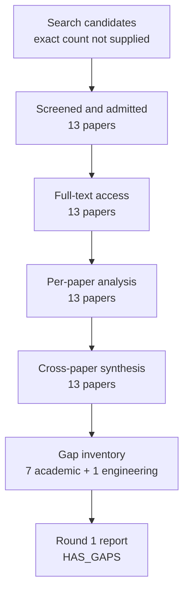

# Research Report: Incremental, Personalized and Priority-Aware Briefings from Workplace Communication

## Contents

- [Round History](#round-history)
- [Executive Summary](#executive-summary)
- [Research Question](#research-question)
- [Methodology](#methodology)
- [Papers Reviewed](#papers-reviewed)
- [Research Landscape](#research-landscape)
- [Confidence-Graded Findings](#confidence-graded-findings)
- [Research Gaps](#research-gaps)
- [Practical Recommendations](#practical-recommendations)
- [Evidence Map](#evidence-map)
- [References](#references)
- [Appendix: Run Metadata](#appendix-run-metadata)

## Round History

Iterative gap-closure loop (hard cap: 4 rounds). See
`references/iterative-synthesis.md` for the full loop definition.

| Round | Run ID | Topic / Gap Focus | New Papers | Gaps Addressed | Remaining Gaps |
|-------|--------|-------------------|------------|----------------|----------------|
| 1 | 48b3f0169bfb | incremental, personalized and priority-aware briefings from workplace communication: how accepted topic information is selected, updated, prioritized and summarized for a user over time, distinguishing new developments from still-open state without repeating superseded facts | None | initial shortlist | 7 academic, 1 engineering |

**Stop reason**: another round runs while open academic gaps remain and new papers appear

## Executive Summary

This review investigates how a workplace briefing can select, prioritize, update, and summarize accepted Topic information across repeated report cycles while separating genuinely new developments from unresolved state that remains important. The 13-paper corpus spans direct email and workplace studies plus transfer evidence from personalized summarization, novelty-aware ranking, decision-focused summarization, action-item extraction, and context-conditioned content selection. [HIGH] The strongest direct evidence is that workplace importance and triage are contextual and user-dependent, with work relevance, consequences of delay, recency, collaborators, projects, role, and individual processing strategies all affecting what users attend to [doi-10-1093-jcmc-zmac001] [doi-10-1145-1056808-1057071], while personalized email-priority models benefit from user-specific social and contextual features [doi-10-1145-1557019-1557124] [doi-10-1145-2063576-2063683]. [HIGH] The most significant unresolved gap is that no admitted paper directly evaluates a longitudinal workplace briefing that jointly preserves unchanged-but-still-open work, identifies new developments, suppresses resolved or superseded information, applies personalized priority, and measures decision-essential omission across successive cycles [2107.14691] [doi-10-18653-v1-d19-1386] [2403.01365].

**Scope**: 13 papers analyzed from 7 source hosts over publication years 1998–2024  
**Overall Confidence**: Medium  
**Verdict**: HAS_GAPS

## Research Question

The review asks:

> How should a personal workplace-information system select, update, prioritize, and summarize accepted Topic-level information across successive briefing cycles so that the user sees new developments and still-open important work without unnecessary repetition or reintroduction of resolved or superseded facts?

The in-scope concerns are longitudinal content selection, novelty and redundancy control, personalized priority, email triage, reminder value, unresolved-task visibility, discourse-aware email summarization, action-item preservation, decision-focused selection, and evaluation of briefing usefulness.

The review distinguishes several constructs that the evidence does not justify collapsing into one score: novelty is not equivalent to importance; reminder usefulness or likelihood of forgetting is not established as perceived priority; response probability is not evidence of response obligation; and summary brevity does not justify omission of decision-essential content. Static message or thread summarization is relevant only insofar as it informs the larger Topic-level longitudinal briefing problem.

External action execution, the correctness of upstream Topic identity, extraction of source state, source-permission enforcement, and multimodal extraction are outside this Topic's evidence boundary. Those components may supply information to a briefing, but this review evaluates the later selection, priority, incremental-update, and summarization problem.

## Methodology

### Search Strategy

- **Sources**: The admitted papers were read through the host's web tool. Full-text access came from arXiv, ACL Anthology, Oxford Academic, Microsoft Research, ResearchGate, the University of North Texas Digital Library, and Carnegie Mellon University-hosted material.
- **Query variants**:
  - `incremental, personalized priority-aware briefings workplace communication: accepted topic information selected, updated, prioritized summarized user over time, distinguishing developments still-open state without repeating superseded facts`
  - `incremental, personalized priority-aware`
  - `incremental, briefings workplace communication: accepted topic information selected, updated, prioritized summarized user over time, distinguishing developments still-open state without repeating superseded facts`
  - `personalized briefings workplace communication: accepted topic information selected, updated, prioritized summarized user over time, distinguishing developments still-open state without repeating superseded facts`
  - `priority-aware briefings workplace communication: accepted topic information selected, updated, prioritized summarized user over time, distinguishing developments still-open state without repeating superseded facts`
  - `incremental, personalized priority-aware briefings workplace`
  - `incremental, personalized priority-aware communication: accepted`
  - `incremental, personalized priority-aware topic information`
- **Time window**: The admitted corpus covers papers published from 1998 through 2024. No independent search-date restriction is specified in the supplied run material.
- **Screening**: The supplied final synthesis contains 13 admitted papers. The exact total-candidate count, BM25 ranking details, and pre-admission screening count were not supplied, so they are not reconstructed here.

All 13 admitted papers were available at **full-text** level through the host's web tool:

| Paper | Access level | Access source |
|---|---|---|
| [manual-13a21477e7] | full_text | ACL Anthology PDF |
| [doi-10-1145-1557019-1557124] | full_text | ResearchGate |
| [doi-10-1145-2063576-2063683] | full_text | University of North Texas Digital Library |
| [doi-10-1093-jcmc-zmac001] | full_text | Oxford Academic |
| [doi-10-1207-s15327051hci2001-2-3] | full_text | ResearchGate |
| [doi-10-18653-v1-d19-1386] | full_text | ACL Anthology PDF |
| [manual-c2f56a571b] | full_text | ACL Anthology PDF |
| [doi-10-18653-v1-2007-sigdial-1-4] | full_text | ACL Anthology PDF |
| [doi-10-1145-1056808-1057071] | full_text | Microsoft Research PDF |
| [2109.06896] | full_text | arXiv HTML |
| [doi-10-1145-290941-291025] | full_text | Carnegie Mellon University-hosted PDF |
| [2403.01365] | full_text | arXiv HTML |
| [2107.14691] | full_text | arXiv HTML |

### Pipeline Summary

| Metric | Count |
|--------|-------|
| Total candidates | Not supplied |
| After screening | 13 admitted papers |
| Downloaded | Not separately reported; 13 papers had full-text web access |
| Successfully converted | Not separately reported |
| Deeply analyzed | 13 |
| Iterations (if system-building) | 1 research round completed |

The synthesis distinguishes direct target-domain evidence from transfer evidence. Workplace email and reminder studies support claims about triage, perceived importance, personalization, forgotten-task recovery, stale state, and static email summarization. Wikipedia, news, restaurant-review, retrieval, and research-meeting studies supply candidate mechanisms rather than direct evidence that those mechanisms work in a longitudinal workplace briefing.

## Papers Reviewed

| # | Title | Authors | Year | Venue | Quality Score | Relevance |
|---|-------|---------|------|-------|--------------|-----------|
| 1 | Summarize What You Are Interested In: An Optimization Framework for Interactive Personalized Summarization [manual-13a21477e7] | Rui Yan, Jian-Yun Nie, Xiaoming Li | 2011 | Not specified in supplied synthesis | Not scored | MEDIUM — transfer evidence for interactive personalization |
| 2 | Mining social networks for personalized email prioritization [doi-10-1145-1557019-1557124] | Shinjae Yoo, Yiming Yang, Frank Lin et al. | 2009 | Not specified in supplied synthesis | Not scored | HIGH — direct personalized-email evidence |
| 3 | Modeling personalized email prioritization: Classification-based and regression-based approaches [doi-10-1145-2063576-2063683] | Shinjae Yoo, Yiming Yang, Jaime G. Carbonell | 2011 | Not specified in supplied synthesis | Not scored | HIGH — direct personalized-email evidence |
| 4 | Measurement of Perceived Importance and Urgency of Email: An Employees’ Perspective [doi-10-1093-jcmc-zmac001] | Andre Lanctot, Linda Duxbury | 2022 | Not specified in supplied synthesis | Not scored | HIGH — direct workplace-email evidence |
| 5 | Supporting Collaborative Task Management in E-mail [doi-10-1207-s15327051hci2001-2-3] | Steve Whittaker | 2005 | Not specified in supplied synthesis | Not scored | HIGH — direct workplace-email task-management evidence |
| 6 | Summary Cloze: A New Task for Content Selection in Topic-Focused Summarization [doi-10-18653-v1-d19-1386] | Daniel Deutsch, Dan Roth | 2019 | Not specified in supplied synthesis | Not scored | MEDIUM — transfer evidence for incremental content selection |
| 7 | Summarizing Emails with Conversational Cohesion and Subjectivity [manual-c2f56a571b] | Giuseppe Carenini, Raymond T. Ng, Xiaodong Zhou | 2008 | Not specified in supplied synthesis | Not scored | HIGH — direct static email-summarization evidence |
| 8 | Detecting and Summarizing Action Items in Multi-Party Dialogue [doi-10-18653-v1-2007-sigdial-1-4] | Matthew Purver, John Dowding, John Niekrasz et al. | 2007 | Not specified in supplied synthesis | Not scored | MEDIUM — transfer evidence for structured action-item extraction |
| 9 | Beyond “From” and “Received”: Exploring the Dynamics of Email Triage [doi-10-1145-1056808-1057071] | Carman Neustaedter, A. J. Bernheim Brush, Marc A. Smith | 2005 | Not specified in supplied synthesis | Not scored | HIGH — direct email-triage evidence |
| 10 | Decision-Focused Summarization [2109.06896] | Chao-Chun Hsu, Chenhao Tan | 2021 | Not specified in supplied synthesis | Not scored | MEDIUM — transfer evidence for decision-oriented content selection |
| 11 | The Use of MMR, Diversity-Based Reranking for Reordering Documents and Producing Summaries [doi-10-1145-290941-291025] | Jaime G. Carbonell, Jade Goldstein | 1998 | Not specified in supplied synthesis | Not scored | MEDIUM — transfer evidence for relevance/novelty trade-offs |
| 12 | AI-Powered Reminders for Collaborative Tasks: Experiences and Futures [2403.01365] | Katelyn Morrison, Shamsi T. Iqbal, Eric Horvitz | 2024 | Not specified in supplied synthesis | Not scored | HIGH — direct workplace-reminder evidence |
| 13 | EmailSum: Abstractive Email Thread Summarization [2107.14691] | Shiyue Zhang, Asli Celikyilmaz, Jianfeng Gao et al. | 2021 | Not specified in supplied synthesis | Not scored | HIGH — direct email-thread summarization evidence |

## Research Landscape

### Theme 1: Contextual and Personalized Priority in Workplace Email

**Coverage**: 4 papers | **Confidence**: High  
**Supporting papers**: [doi-10-1093-jcmc-zmac001], [doi-10-1145-1056808-1057071], [doi-10-1145-1557019-1557124], [doi-10-1145-2063576-2063683]

[HIGH] Workplace email priority is not supported as a single universal ranking function. Employees' perceived importance and urgency depend on contextual factors such as work relevance and consequences of delay, while observational work on triage shows sensitivity to recency, collaborators, projects, role, and individual processing strategies [doi-10-1093-jcmc-zmac001] [doi-10-1145-1056808-1057071].

[HIGH] Personalized email-priority models can exploit user-specific signals. Adding social-network information to conventional message features improved personalized prioritization in one direct email study [doi-10-1145-1557019-1557124], while another study found flexible order-based classification more accurate than support-vector ordinal regression on its personalized email data [doi-10-1145-2063576-2063683].

Key findings:

1. [HIGH] Priority and triage are user- and context-dependent rather than adequately captured by one global importance policy [doi-10-1093-jcmc-zmac001] [doi-10-1145-1056808-1057071].
2. [HIGH] User-specific social and contextual features can improve email-priority prediction [doi-10-1145-1557019-1557124].
3. [HIGH] Modeling assumptions do not transfer uniformly across datasets: classification beat ordinal regression on the personalized-email data in one study, while the same study found the reverse ordering on seven UCI-derived ordinal benchmarks [doi-10-1145-2063576-2063683].

### Theme 2: Incremental Selection, Novelty, and Repetition Control

**Coverage**: 4 papers | **Confidence**: Medium  
**Supporting papers**: [doi-10-18653-v1-d19-1386], [doi-10-1145-290941-291025], [manual-13a21477e7], [2109.06896]

[MEDIUM] Several transfer-domain mechanisms directly address pieces of the briefing-selection problem, but none validates the complete workplace setting. MMR formulates selection as a relevance-versus-novelty trade-off [doi-10-1145-290941-291025]; Summary Cloze shows that preceding summary context can improve next-content selection and generation and can be combined with coverage to discourage local repetition [doi-10-18653-v1-d19-1386]; interactive personalized summarization adapts content to user feedback [manual-13a21477e7]; and decision-focused summarization explicitly optimizes information useful for a downstream decision rather than generic overlap [2109.06896].

A generic novelty-aware content selector can be conceptualized as a trade-off such as

$S(x)=\lambda \operatorname{Rel}(x,u)+(1-\lambda)\operatorname{Novel}(x,H)$,

where $u$ is the user or current information need and $H$ is previously shown material. This formula is a synthesis-level abstraction of the relevance/novelty design space, not a formula validated by the reviewed corpus for longitudinal workplace reporting.

Key findings:

1. [HIGH] Prior-summary context improved learned content selection and generation in the Wikipedia-derived Summary Cloze experiments, although learned selection remained substantially below oracle extraction [doi-10-18653-v1-d19-1386].
2. [MEDIUM] Novelty-aware reranking, interactive personalization, and decision-focused selection are plausible components for a briefing selector, but they remain transfer mechanisms rather than validated target-domain solutions [doi-10-1145-290941-291025] [manual-13a21477e7] [2109.06896].
3. [MEDIUM] Novelty control alone cannot answer whether unchanged but unresolved work should remain visible; no paper in this theme directly evaluates that target distinction.

### Theme 3: Task Structure, Conversation Structure, and Reminder State

**Coverage**: 4 papers | **Confidence**: High for local mechanisms, Medium for longitudinal briefing transfer  
**Supporting papers**: [doi-10-1207-s15327051hci2001-2-3], [manual-c2f56a571b], [doi-10-18653-v1-2007-sigdial-1-4], [2403.01365]

[HIGH] Task-oriented organization can improve interaction with work email in specific settings. ContactMap produced higher task success and lower completion time than participants' normal email interfaces in its controlled evaluation, while TeleNotes produced qualitative evidence that users made use of task-oriented spatial piles and short reminder annotations while continuing to rely on ordinary chronological email for recent events [doi-10-1207-s15327051hci2001-2-3].

[HIGH] Static email summarization also benefits from conversational structure: local clue-word conversational cohesion outperformed the tested global PageRank variants on the Enron corpus, and subjective-language evidence improved pyramid precision [manual-c2f56a571b].

[HIGH] In a workplace reminder study, users valued reminders that recovered forgotten tasks, while stale or inaccurate surfaced state repeatedly caused dissatisfaction [2403.01365].

[MEDIUM] Structured action-item models in research-group meetings improved action-item detection and timeframe extraction, but task-description extraction remained weak and the domain is not email briefing [doi-10-18653-v1-2007-sigdial-1-4].

Key findings:

1. [HIGH] Users can benefit from task-oriented rather than purely chronological views of workplace communication [doi-10-1207-s15327051hci2001-2-3].
2. [HIGH] Recovering forgotten work is a source of reminder value, but stale or incorrect task state degrades usefulness [2403.01365].
3. [HIGH] Reminder usefulness and perceived email priority remain separate constructs in the admitted evidence; the reminder study did not establish forgetting or workstyle as determinants of perceived message importance [2403.01365] [doi-10-1093-jcmc-zmac001].
4. [MEDIUM] Action-item structure is promising for preserving actionable content, but transfer evidence does not establish complete workplace-email briefing behavior [doi-10-18653-v1-2007-sigdial-1-4].

### Theme 4: Summary Reliability and Evaluation

**Coverage**: 4 papers | **Confidence**: High  
**Supporting papers**: [2107.14691], [manual-13a21477e7], [doi-10-18653-v1-d19-1386], [2109.06896]

[HIGH] Generic overlap metrics are incomplete proxies for the target outcome. EmailSum reports weak correlation of ROUGE and BERTScore with human judgments [2107.14691]; interactive personalized news summarization can receive stronger user-specific ratings without producing the best ROUGE values [manual-13a21477e7]; and Summary Cloze observes that multiple valid continuations make single-reference ROUGE evaluation inherently incomplete [doi-10-18653-v1-d19-1386].

[HIGH] Static email-thread summarization remains vulnerable to precisely the information types a workplace briefing must preserve: EmailSum identifies errors in sender intention and sender/receiver attribution and reports declining performance with longer threads [2107.14691].

[MEDIUM] Decision-focused evaluation provides a useful transfer perspective because a summary can be judged by decision faithfulness and evidence representativeness rather than lexical overlap alone, although the experiments were conducted on restaurant reviews rather than workplace communication [2109.06896].

Key findings:

1. [HIGH] Automatic similarity scores alone are insufficient to establish that a briefing preserves decision-relevant information [2107.14691] [manual-13a21477e7] [doi-10-18653-v1-d19-1386].
2. [HIGH] Attribution and intent errors remain material failure modes in direct email summarization [2107.14691].
3. [MEDIUM] Evaluation should include decision-oriented and representativeness measures in addition to overlap, but the exact metric set for workplace briefing remains unvalidated [2109.06896].

## Methodology Comparison

| Approach | Papers | Strengths | Weaknesses | Best For | Performance |
|----------|--------|-----------|------------|----------|-------------|
| Personalized email-priority modeling | [doi-10-1145-1557019-1557124], [doi-10-1145-2063576-2063683] | Direct email evidence; supports user-specific features and ranking | Does not model longitudinal open/resolved/superseded state | Candidate soft-priority layer | [HIGH] Personalized social/context features helped in direct email experiments; model ordering was dataset-dependent |
| Workplace importance/triage modeling | [doi-10-1093-jcmc-zmac001], [doi-10-1145-1056808-1057071] | Direct evidence about user behavior and perceived importance | Does not supply a briefing-generation algorithm or obligation classifier | Priority-feature design and human factors | [HIGH] Strong qualitative/measurement evidence for contextual heterogeneity |
| Reminder-oriented task surfacing | [2403.01365] | Direct workplace evidence about forgotten-task recovery and stale state | Does not establish perceived-message priority or cycle-level briefing completeness | Candidate reminder-value signal and stale-state failure analysis | [HIGH] Users reported value from recovered forgotten tasks and dissatisfaction with stale/inaccurate state |
| Static email-thread summarization | [2107.14691], [manual-c2f56a571b] | Direct email summarization evidence; exposes intent, attribution, cohesion, and length problems | Static threads rather than longitudinal Topic briefing | Baseline summarization and failure analysis | [HIGH] Structure helps locally, but direct errors remain in attribution, intent, and long threads |
| Context-conditioned content selection | [doi-10-18653-v1-d19-1386] | Explicitly conditions next selection on previous summary; coverage reduces repetition | Wikipedia-derived transfer domain; learned selector below oracle | Candidate incremental-summary context mechanism | [HIGH] Positive transfer result, not workplace validation |
| Novelty-aware reranking | [doi-10-1145-290941-291025] | Explicit relevance/novelty trade-off | Does not represent unresolved state or obligations | Redundancy suppression | [MEDIUM] Established mechanism, target-domain longitudinal performance unknown |
| Interactive personalized summarization | [manual-13a21477e7] | Adapts summary selection to user feedback | News domain and limited evaluation population | Candidate preference adaptation | [MEDIUM] Transfer evidence only |
| Decision-focused summarization | [2109.06896] | Evaluates usefulness for decisions and evidence representativeness | Restaurant-review domain; coherence trade-off | Candidate decision-value objective | [MEDIUM] Positive transfer results, not workplace validation |
| Structured action-item extraction | [doi-10-18653-v1-2007-sigdial-1-4] | Explicit action and timeframe modeling | Research-meeting domain; weak task-description extraction | Preserving actionable elements | [MEDIUM] Partial transfer evidence |
| Task-oriented email interfaces | [doi-10-1207-s15327051hci2001-2-3] | Direct evidence that task organization can aid collaborative work | Interface study rather than longitudinal summarization | Presentation/navigation concepts | [HIGH] ContactMap improved task success and completion time in its controlled evaluation |

## Confidence-Graded Findings

### 🟢 High Confidence (supported by 3+ papers with consistent results)

1. **[HIGH] Workplace priority and triage are contextual and user-dependent rather than governed by one universal policy.** Direct studies identify work relevance, delay consequences, recency, collaborators, projects, role, and heterogeneous processing strategies as meaningful contextual factors [doi-10-1093-jcmc-zmac001] [doi-10-1145-1056808-1057071], while personalized modeling studies show value from per-user features [doi-10-1145-1557019-1557124] [doi-10-1145-2063576-2063683].

2. **[HIGH] User-specific modeling is justified as a component of email prioritization, but the choice of model must be validated on target data.** Social-network information improved personalized prioritization [doi-10-1145-1557019-1557124], and the relative performance of classification and ordinal regression changed between personalized email and UCI-derived ordinal datasets [doi-10-1145-2063576-2063683].

3. **[HIGH] Generic overlap metrics should not be treated as sufficient evidence of briefing usefulness or correctness.** EmailSum reports weak ROUGE/BERTScore correlation with human judgments [2107.14691], personalized summarization shows divergence between user-specific ratings and ROUGE [manual-13a21477e7], and Summary Cloze identifies multiple valid continuations as a limitation of single-reference evaluation [doi-10-18653-v1-d19-1386].

4. **[HIGH] Static email summarization can lose decision-relevant discourse information.** EmailSum reports sender-intention and attribution errors and degradation on longer threads [2107.14691], while conversational-structure modeling changes content-selection quality in Enron email [manual-c2f56a571b].

5. **[HIGH] Reminder value cannot safely be equated with perceived message priority.** Forgotten-task recovery was valuable and stale state harmful in the workplace reminder study [2403.01365], whereas perceived email importance and urgency were measured through a different construct and set of prototypical acts [doi-10-1093-jcmc-zmac001].

### 🟡 Medium Confidence (supported by 1-2 papers or with caveats)

1. **[MEDIUM] Prior-summary conditioning is a plausible mechanism for incremental briefing selection.** Summary Cloze found that preceding summary context improved learned selection and generation and that coverage could discourage local repetition, but the experiments used Wikipedia-derived data rather than workplace communication [doi-10-18653-v1-d19-1386].

2. **[MEDIUM] Novelty-aware reranking is useful as a candidate redundancy-control component but does not solve unresolved-state carry-forward.** MMR explicitly trades relevance against novelty, yet it does not model whether unchanged material remains actionably open [doi-10-1145-290941-291025].

3. **[MEDIUM] Decision-focused selection is a promising evaluation and optimization direction.** Decision-focused summarization improved decision faithfulness and evidence representativeness in restaurant-review experiments, with a coherence trade-off; direct workplace validation is absent [2109.06896].

4. **[MEDIUM] Interactive user feedback may support personalization over time.** Personalized summarization can adapt content based on feedback, but the admitted study used news-event collections and only a small evaluation population, so it does not establish workplace preference-drift handling [manual-13a21477e7].

5. **[MEDIUM] Explicit action-item structure should be considered when constructing briefing content.** Research-meeting models supported action detection and timeframe extraction, but task-description extraction remained weak and the domain differs from email [doi-10-18653-v1-2007-sigdial-1-4].

### 🔴 Low Confidence (preliminary, single-source, or contradicted)

No positive low-confidence finding was retained as an accepted result in the supplied cross-paper synthesis. Claims lacking adequate evidence are represented below as open research gaps rather than promoted to findings.

## Trade-Off Analysis

| Decision | Option A | Option B | Recommendation |
|----------|----------|----------|----------------|
| Newness versus unresolved importance | Prefer only novel material; minimizes repetition but can hide unchanged open work | Carry forward all open state; protects coverage but risks briefing overload | [MEDIUM] Evaluate an explicit three-way distinction among new developments, unchanged-but-open state, and no-longer-repeatable state. This is a hypothesis requiring gap-1 and gap-4 validation [doi-10-18653-v1-d19-1386] [doi-10-1145-290941-291025] |
| Hard user rules versus learned personalization | Collapse all signals into one learned priority score | Apply explicit constraints separately from soft learned ranking | [MEDIUM] Test separation rather than assuming equivalence. The corpus supports personalized soft ranking but does not establish how obligations or explicit rules should interact with it [doi-10-1145-1557019-1557124] [doi-10-1093-jcmc-zmac001] |
| Static versus adaptive personalization | Train one persistent per-user model | Continuously adapt to feedback, role, project, and behavior changes | [MEDIUM] Include adaptation experiments, because interactive personalization is promising but long-term workplace preference drift is unmeasured [manual-13a21477e7] [doi-10-1145-2063576-2063683] |
| Pure importance versus reminder value | Rank only by perceived importance/urgency | Include separate forgetting/reminder-benefit signals | [MEDIUM] Measure them as separate constructs before combining them. Forgotten-task recovery is valuable, but forgetting is not established as perceived priority [2403.01365] [doi-10-1093-jcmc-zmac001] |
| Brevity versus coverage | Aggressively minimize summary length | Preserve decision-essential open state even when unchanged | [HIGH] Optimize brevity only after essential coverage constraints are met; existing summarization evidence shows attribution, intention, and evaluation failures that make uncontrolled compression risky [2107.14691] [manual-c2f56a571b] |
| Generic overlap versus task-centered evaluation | ROUGE/BERTScore-style similarity | Omission, repetition, decision usefulness, evidence representativeness, and human judgment | [HIGH] Use overlap only as a secondary diagnostic; it is not an adequate primary objective for the target briefing problem [2107.14691] [manual-13a21477e7] [doi-10-18653-v1-d19-1386] [2109.06896] |

## Points of Agreement **[EVIDENCE REQUIRED]**

1. **[HIGH] Context and user identity matter to workplace communication priority.** Direct email studies consistently show heterogeneity in perceived importance, triage practices, and the value of personalized social/contextual features [doi-10-1093-jcmc-zmac001] [doi-10-1145-1056808-1057071] [doi-10-1145-1557019-1557124] [doi-10-1145-2063576-2063683].

2. **[HIGH] Content selection cannot be evaluated adequately by lexical overlap alone.** Human usefulness, personalized preference, multiple valid continuations, and decision faithfulness are not fully captured by generic overlap metrics [2107.14691] [manual-13a21477e7] [doi-10-18653-v1-d19-1386] [2109.06896].

3. **[HIGH] Structure matters.** Conversational cohesion improves static email extraction [manual-c2f56a571b], task-oriented interfaces improve or support specific collaborative-email activities [doi-10-1207-s15327051hci2001-2-3], and structured action representations assist detection of action items and timeframes in meeting dialogue [doi-10-18653-v1-2007-sigdial-1-4].

4. **[MEDIUM] Avoiding repetition and preserving decision value require different mechanisms.** Novelty-aware and prior-summary-conditioned methods address redundancy [doi-10-1145-290941-291025] [doi-10-18653-v1-d19-1386], while decision-focused summarization addresses downstream informational usefulness [2109.06896]. No admitted study shows that one mechanism subsumes the other.

## Points of Contradiction **[EVIDENCE REQUIRED]**

1. **[HIGH] No qualifying cross-paper contradiction was identified under comparable conditions.** The synthesis found scope qualifications rather than papers directly answering the same question with incompatible results.

   - **Possible explanation**: Some apparently conflicting observations arise from domain or construct differences. For example, classification outperformed ordinal regression on the personalized-email dataset but the same study reported the reverse ordering on seven UCI-derived ordinal benchmarks [doi-10-1145-2063576-2063683]. Likewise, low-importance or non-urgent tasks could still be forgotten and benefit from reminders [2403.01365], which does not contradict the separate construct of perceived email importance measured in [doi-10-1093-jcmc-zmac001].
   - **Implication**: Algorithm rankings and behavioral signals should not be transferred across domains or merged into one briefing-priority construct without target-domain evaluation.

## Research Gaps

All eight gaps remain open after Round 1. The literature reviewed in this run has **not answered them yet**. Seven are academic gaps requiring targeted literature follow-up and one is an engineering gap that can be addressed through benchmark construction and experimentation.

| # | Gap | Type | Severity | Rounds already searched | Impact on Goals |
|---|-----|------|----------|-------------------------|----------------|
| 1 | [ACADEMIC] No direct evaluation of successive workplace briefings that distinguish newly changed information, unchanged-but-still-open work, and resolved or superseded information that should no longer be repeated | ACADEMIC | HIGH | Round 1 | Central target behavior remains unvalidated |
| 2 | [ACADEMIC] No established policy for combining explicit user rules or response obligations with softer personalized importance, triage, reminder-value, or forgetting signals | ACADEMIC | HIGH | Round 1 | Risks conflating mandatory work with probabilistic preference signals |
| 3 | [ACADEMIC] Long-term adaptation to changes in user role, projects, priorities, feedback, and work patterns is not directly evaluated | ACADEMIC | HIGH | Round 1 | A stationary model may become misaligned over time |
| 4 | [ACADEMIC] No end-to-end briefing evaluation jointly measures decision-essential omission, redundant repetition, false alerts, and unresolved-state preservation over repeated cycles | ACADEMIC | HIGH | Round 1 | Core product failure costs cannot yet be compared in one evidence-based evaluation |
| 5 | [ACADEMIC] No evidence establishes how reminder usefulness or likelihood of forgetting should be combined with importance, urgency, recency, or personalized priority | ACADEMIC | MEDIUM | Round 1 | Reminder value may be confused with priority |
| 6 | [ACADEMIC] No admitted paper evaluates stable Topic/work-item incremental briefing across multiple conversations and sources | ACADEMIC | HIGH | Round 1 | Static-thread evidence does not validate the product's cross-thread Topic abstraction |
| 7 | [ACADEMIC] No experimental evidence establishes how stale, uncertain, disputed, or incompletely investigated state should be presented in a briefing | ACADEMIC | HIGH | Round 1 | Presentation choices could hide uncertainty or induce incorrect decisions |
| 8 | [ENGINEERING] Candidate mechanisms have not been compared on one reproducible chronological benchmark with independent new/open/resolved/superseded labels, user-specific priority labels, and explicit omission/repetition errors | ENGINEERING | HIGH | Round 1 | Without a common benchmark, architecture choices cannot be compared reliably |

### Academic Gaps (require more papers)

1. **[ACADEMIC][HIGH] Gap 1 — Longitudinal workplace briefing state transitions**: The literature has not answered how successive workplace briefings should jointly distinguish new developments, unchanged-but-still-open work, and state no longer eligible for repetition. Round searched: **1**. Suggested query: `"incremental summarization" workplace email longitudinal new developments unresolved superseded briefing`.

2. **[ACADEMIC][HIGH] Gap 2 — Hard obligations versus soft personalization**: The literature has not answered how explicit user rules or response obligations should interact with softer personalized importance, triage, reminder-value, or forgetting signals, nor whether separating these signal classes improves user outcomes. Round searched: **1**. Suggested query: `"response obligation" email priority personalization hard constraints user rules briefing triage`.

3. **[ACADEMIC][HIGH] Gap 3 — Longitudinal preference drift**: The literature has not answered how a workplace briefing model should adapt when user roles, projects, priorities, feedback, or work patterns change over long periods. Round searched: **1**. Suggested query: `"longitudinal" personalized email prioritization preference drift adaptive summarization workplace`.

4. **[ACADEMIC][HIGH] Gap 4 — Cycle-level omission/repetition evaluation**: The literature has not supplied an end-to-end evaluation that jointly measures missed decision-essential work, redundant or superseded repetition, false alerts, and continued coverage of unresolved important state. Round searched: **1**. Suggested query: `"coverage-aware summarization" omission redundancy unresolved actions longitudinal briefing evaluation`.

5. **[ACADEMIC][MEDIUM] Gap 5 — Combining forgetting and priority signals**: The literature has not answered how reminder usefulness or probability of forgetting should be combined with perceived importance, urgency, recency, or personalized priority for briefing selection. Round searched: **1**. Suggested query: `"email reminder" forgetting probability task priority importance selection personalized briefing`.

6. **[ACADEMIC][HIGH] Gap 6 — Cross-conversation, multi-source work-item briefing**: The literature has not directly evaluated incremental briefing at a stable Topic or work-item level across multiple workplace conversations and sources. Round searched: **1**. Suggested query: `"topic-focused summarization" cross-thread email workplace multi-source incremental work item`.

7. **[ACADEMIC][HIGH] Gap 7 — Presentation of stale and uncertain state**: The literature has not experimentally determined how stale, uncertain, disputed, or incompletely investigated state should be represented or how alternative representations affect user decisions. Round searched: **1**. Suggested query: `uncertainty stale disputed incomplete state display workplace briefing reminder user study`.

### Engineering Gaps (fillable without papers)

1. **[ENGINEERING][HIGH] Gap 8 — Reproducible cycle-based benchmark**: The candidate mechanisms identified in the corpus have not been compared on one chronological benchmark with independent labels for new, unchanged-open, resolved, and superseded state; per-user priority; and explicit omission and repetition errors. Round searched: **1**.

   Suggested resolution: construct an evaluation corpus in report cycles, keep prediction inputs temporally isolated from future/gold context, obtain independent gold labels, and score both false negatives and false positives. A candidate loss can explicitly expose product costs:

   $L=\alpha M+\beta R+\gamma F+\delta S+\epsilon P$,

   where $M$ is missed decision-essential content, $R$ is redundant or superseded repetition, $F$ is false-alert cost, $S$ is stale/uncertain-state presentation error, and $P$ is personalized-priority error. The weights are engineering parameters to be established empirically; the reviewed papers do not determine them.

## Reproducibility Notes

The supplied synthesis did not systematically record code repositories, public dataset availability, implementation licenses, or artifact licenses for every paper. Unknown fields are therefore left explicitly unknown rather than inferred from publication venue or access location.

| Paper | Code Available | Data Available | Sufficient Detail | License |
|-------|---------------|----------------|-------------------|---------|
| [manual-13a21477e7] | Unknown | Unknown | Not independently assessed | Unknown |
| [doi-10-1145-1557019-1557124] | Unknown | Unknown | Not independently assessed | Unknown |
| [doi-10-1145-2063576-2063683] | Unknown | Unknown | Not independently assessed | Unknown |
| [doi-10-1093-jcmc-zmac001] | Unknown | Unknown | Not independently assessed | Unknown |
| [doi-10-1207-s15327051hci2001-2-3] | Unknown | Unknown | Not independently assessed | Unknown |
| [doi-10-18653-v1-d19-1386] | Unknown | Unknown | Not independently assessed | Unknown |
| [manual-c2f56a571b] | Unknown | Unknown | Not independently assessed | Unknown |
| [doi-10-18653-v1-2007-sigdial-1-4] | Unknown | Unknown | Not independently assessed | Unknown |
| [doi-10-1145-1056808-1057071] | Unknown | Unknown | Not independently assessed | Unknown |
| [2109.06896] | Unknown | Unknown | Not independently assessed | Unknown |
| [doi-10-1145-290941-291025] | Unknown | Unknown | Not independently assessed | Unknown |
| [2403.01365] | Unknown | Unknown | Not independently assessed | Unknown |
| [2107.14691] | Unknown | Unknown | Not independently assessed | Unknown |

## Practical Recommendations **[EVIDENCE REQUIRED]**

1. **[MEDIUM] Evaluate briefing content using explicit cycle-state categories rather than treating update generation as text diffing.** At minimum, test separate labels for newly changed information, unchanged-but-still-open information, and information no longer eligible for repetition. Prior-summary conditioning and novelty mechanisms supply candidate techniques [doi-10-18653-v1-d19-1386] [doi-10-1145-290941-291025], but their combination with unresolved work is not yet validated.  
   *Confidence*: Medium

2. **[MEDIUM] Keep explicit user rules or obligations conceptually separate from learned soft-priority signals during experimentation.** Direct email research supports contextual and personalized priority [doi-10-1093-jcmc-zmac001] [doi-10-1145-1557019-1557124] [doi-10-1145-2063576-2063683], but no admitted study proves that an obligation can be represented safely as merely another learned importance feature. Treat the separation as a testable design hypothesis under gap-2 rather than as an established production rule.  
   *Confidence*: Medium

3. **[HIGH] Do not use novelty as the sole criterion for whether an item remains in the briefing.** Novelty-aware selection addresses redundancy [doi-10-1145-290941-291025] [doi-10-18653-v1-d19-1386], while direct workplace reminder evidence shows that resurfacing unfinished or forgotten work can be valuable [2403.01365]. The evidence therefore supports measuring novelty and continuing task value separately.  
   *Confidence*: High

4. **[HIGH] Treat reminder value and perceived priority as distinct experimental signals.** Users can value reminders because they recover forgotten work [2403.01365], while direct email studies characterize importance and urgency through different contextual constructs [doi-10-1093-jcmc-zmac001] [doi-10-1145-1056808-1057071].  
   *Confidence*: High

5. **[MEDIUM] Make stale, uncertain, disputed, or incompletely investigated state explicit in evaluation rather than silently presenting it as current fact.** The workplace reminder study documents dissatisfaction when surfaced task state was stale or inaccurate [2403.01365], but alternative presentation strategies remain an open academic question.  
   *Confidence*: Medium

6. **[HIGH] Preserve discourse-critical attribution and intent information during compression.** EmailSum directly reports sender-intention and sender/receiver attribution errors, particularly as threads become more difficult [2107.14691], and conversational-structure evidence indicates that local dialogue structure affects content selection [manual-c2f56a571b].  
   *Confidence*: High

7. **[MEDIUM] Use decision-focused and task-focused mechanisms as candidate components, not as proof of a production architecture.** Decision-focused summarization [2109.06896], interactive personalization [manual-13a21477e7], MMR [doi-10-1145-290941-291025], Summary Cloze [doi-10-18653-v1-d19-1386], and structured action extraction [doi-10-18653-v1-2007-sigdial-1-4] each demonstrate useful mechanisms in transfer settings, but none validates the combined workplace-briefing task.  
   *Confidence*: Medium

8. **[HIGH] Evaluate omission and repetition directly rather than relying on ROUGE or BERTScore as primary success criteria.** Direct and transfer studies consistently show that automatic overlap can diverge from human usefulness, personalized preference, and valid continuation quality [2107.14691] [manual-13a21477e7] [doi-10-18653-v1-d19-1386].  
   *Confidence*: High

9. **[MEDIUM] Include temporal holdouts and preference-drift scenarios in personalization experiments.** Existing personalized email and interactive summarization evidence supports per-user adaptation [doi-10-1145-1557019-1557124] [doi-10-1145-2063576-2063683] [manual-13a21477e7], but long-term changes in user role and project context have not been directly evaluated.  
   *Confidence*: Medium

## Future Directions

1. **[ACADEMIC][HIGH]** Search specifically for longitudinal update summarization in workplace, email, task, and case-management settings that distinguishes changed, unresolved, completed, revoked, and superseded content across successive summaries.

2. **[ACADEMIC][HIGH]** Investigate constrained or lexicographic ranking formulations in which explicit obligations and user rules are not interchangeable with probabilistic personalized importance.

3. **[ACADEMIC][HIGH]** Find longitudinal personalization studies that measure preference drift, role changes, project turnover, or concept drift rather than assuming stationary user preferences.

4. **[ACADEMIC][HIGH]** Investigate evaluation frameworks that measure decision-essential omissions and unnecessary repetition jointly over time.

5. **[ACADEMIC][MEDIUM]** Study reminder selection literature that explicitly distinguishes task importance, urgency, forgetting likelihood, interruption cost, and reminder utility.

6. **[ACADEMIC][HIGH]** Search for work-item-, case-, entity-, or event-centric summarization across multiple communication threads or sources, rather than only within one completed thread.

7. **[ACADEMIC][HIGH]** Investigate user-interface and decision-science evidence for displaying stale, disputed, uncertain, or pending-investigation information.

8. **[ENGINEERING][HIGH]** Build the cycle-based benchmark described in gap-8 so candidate mechanisms can be compared under identical temporal, state, personalization, omission, and repetition conditions.

## Readiness Assessment (System-Building Mode)

### Verdict: HAS_GAPS

### Assessment Summary

[HIGH] The corpus is sufficient to justify several component-level design hypotheses: personalized contextual ranking, explicit attention to reminder value and stale state, novelty-aware redundancy control, prior-summary conditioning, discourse-aware email summarization, and evaluation beyond lexical overlap [doi-10-1145-1557019-1557124] [2403.01365] [doi-10-18653-v1-d19-1386] [2107.14691]. [HIGH] It is not sufficient to claim that a complete longitudinal workplace briefing architecture has been academically validated, because every evidence-derived gap remains open and the central cycle-level behavior has not been directly evaluated.

### Coverage Matrix

| Dimension | Status | Evidence |
|-----------|--------|----------|
| Architecture patterns | ⚠️ Partial | Candidate mechanisms exist for personalization, novelty, prior-summary conditioning, task structure, and decision-focused selection [doi-10-1145-1557019-1557124] [doi-10-18653-v1-d19-1386] [doi-10-1145-290941-291025] [2109.06896], but no combined architecture is validated |
| Technology stack | ❌ Missing | The reviewed papers do not establish a msgloom implementation stack |
| Performance baselines | ⚠️ Partial | Component-level results exist for email priority, static summarization, task interfaces, reminders, and transfer summarization [doi-10-1145-2063576-2063683] [2107.14691] [doi-10-1207-s15327051hci2001-2-3] [2403.01365], but no cycle-level benchmark exists |
| Security model | ❌ Missing | Permission/security architecture is outside the admitted evidence for this Topic |
| Trade-off map | ⚠️ Partial | Evidence identifies relevance-versus-novelty, personalization, reminder value, decision faithfulness, coherence, and coverage considerations [doi-10-1145-290941-291025] [manual-13a21477e7] [2109.06896] [2403.01365], but their joint target-domain trade-offs are unmeasured |

### Gap Resolution Plan

| # | Gap | Type | Severity | Resolution |
|---|-----|------|----------|------------|
| 1 | Longitudinal new/open/resolved/superseded briefing behavior | ACADEMIC | HIGH | Round 2 targeted search for incremental/update/temporal summarization in workplace or analogous case/task domains |
| 2 | Hard rules or obligations versus soft personalized priority | ACADEMIC | HIGH | Search constrained ranking, obligation-aware email triage, and rule-plus-learning literature; retain as experimental hypothesis if direct evidence remains absent |
| 3 | Long-term personalization and preference drift | ACADEMIC | HIGH | Search longitudinal personalization, concept drift, role adaptation, and preference-update literature |
| 4 | Joint omission/repetition/false-alert/open-state evaluation | ACADEMIC | HIGH | Search coverage-aware, risk-aware, and longitudinal summarization evaluation literature |
| 5 | Reminder usefulness versus importance and urgency | ACADEMIC | MEDIUM | Target reminder utility, forgetting probability, task priority, and interruption literature |
| 6 | Cross-thread/multi-source Topic-level incremental briefing | ACADEMIC | HIGH | Search work-item-, case-, entity-, and event-centric multi-source summarization |
| 7 | Presentation of stale, disputed, uncertain, or incomplete state | ACADEMIC | HIGH | Search uncertainty communication and workplace reminder/decision-support user studies |
| 8 | Reproducible cycle-based benchmark | ENGINEERING | HIGH | Build chronological benchmark with independent state and priority gold, explicit omission/repetition metrics, clean temporal splits, and reproducible evaluation |

## Evidence Map

| Research Question Aspect | [manual-13a21477e7] | [doi-10-1145-1557019-1557124] | [doi-10-1145-2063576-2063683] | [doi-10-1093-jcmc-zmac001] | [doi-10-1207-s15327051hci2001-2-3] | [doi-10-18653-v1-d19-1386] | [manual-c2f56a571b] | [doi-10-18653-v1-2007-sigdial-1-4] | [doi-10-1145-1056808-1057071] | [2109.06896] | [doi-10-1145-290941-291025] | [2403.01365] | [2107.14691] |
|--------------------------|----------------------|------------------------------------|------------------------------------|--------------------------------|-------------------------------------|--------------------------------|----------------------|-----------------------------------------|-------------------------------------|----------------|--------------------------------|----------------|----------------|
| Personalized priority | ✓ interactive preference | ✓ direct | ✓ direct | ✓ importance construct |  |  |  |  | ✓ contextual triage |  |  | ✓ workstyle/reminder context |  |
| Workplace importance/urgency |  |  |  | ✓ direct |  |  |  |  | ✓ triage context |  |  | ✓ distinct reminder construct |  |
| Reminder/forgotten-task value |  |  |  |  |  |  |  |  |  |  |  |  | ✓ direct |  |
| Stale or inaccurate state |  |  |  |  |  |  |  |  |  |  |  |  | ✓ direct |  |
| Novelty/redundancy reduction |  |  |  |  |  |  | ✓ coverage/context |  |  |  |  | ✓ explicit novelty |  |  |
| Prior-summary/context conditioning |  |  |  |  |  |  | ✓ direct mechanism |  |  |  |  |  |  |  |
| Static email summarization |  |  |  |  |  |  |  | ✓ direct |  |  |  |  |  | ✓ direct |
| Conversational cohesion |  |  |  |  |  |  |  | ✓ direct |  |  |  |  |  |  |
| Action-item structure |  |  |  |  | ✓ task organization |  |  |  | ✓ transfer |  |  |  |  |  |
| Decision-focused selection |  |  |  |  |  |  |  |  |  |  | ✓ transfer |  |  |  |
| Human/automatic metric mismatch | ✓ user-specific ratings |  |  |  |  |  | ✓ multiple continuations |  |  |  | ✓ decision measures |  |  | ✓ human correlation |
| Longitudinal successive workplace briefing |  |  |  |  |  |  |  |  |  |  |  |  |  |  |
| Explicit new/open/resolved/superseded evaluation |  |  |  |  |  |  |  |  |  |  |  |  |  |  |
| Cross-thread/multi-source Topic briefing |  |  |  |  |  |  |  |  |  |  |  |  |  |  |

## References

1. [manual-13a21477e7] — *Summarize What You Are Interested In: An Optimization Framework for Interactive Personalized Summarization*. Rui Yan, Jian-Yun Nie, Xiaoming Li. 2011. Venue not specified in supplied synthesis.

2. [doi-10-1145-1557019-1557124] — *Mining social networks for personalized email prioritization*. Shinjae Yoo, Yiming Yang, Frank Lin et al. 2009. Venue not specified in supplied synthesis.

3. [doi-10-1145-2063576-2063683] — *Modeling personalized email prioritization: Classification-based and regression-based approaches*. Shinjae Yoo, Yiming Yang, Jaime G. Carbonell. 2011. Venue not specified in supplied synthesis.

4. [doi-10-1093-jcmc-zmac001] — *Measurement of Perceived Importance and Urgency of Email: An Employees’ Perspective*. Andre Lanctot, Linda Duxbury. 2022. Venue not specified in supplied synthesis.

5. [doi-10-1207-s15327051hci2001-2-3] — *Supporting Collaborative Task Management in E-mail*. Steve Whittaker. 2005. Venue not specified in supplied synthesis.

6. [doi-10-18653-v1-d19-1386] — *Summary Cloze: A New Task for Content Selection in Topic-Focused Summarization*. Daniel Deutsch, Dan Roth. 2019. Venue not specified in supplied synthesis.

7. [manual-c2f56a571b] — *Summarizing Emails with Conversational Cohesion and Subjectivity*. Giuseppe Carenini, Raymond T. Ng, Xiaodong Zhou. 2008. Venue not specified in supplied synthesis.

8. [doi-10-18653-v1-2007-sigdial-1-4] — *Detecting and Summarizing Action Items in Multi-Party Dialogue*. Matthew Purver, John Dowding, John Niekrasz et al. 2007. Venue not specified in supplied synthesis.

9. [doi-10-1145-1056808-1057071] — *Beyond “From” and “Received”: Exploring the Dynamics of Email Triage*. Carman Neustaedter, A. J. Bernheim Brush, Marc A. Smith. 2005. Venue not specified in supplied synthesis.

10. [2109.06896] — *Decision-Focused Summarization*. Chao-Chun Hsu, Chenhao Tan. 2021. Venue not specified in supplied synthesis.

11. [doi-10-1145-290941-291025] — *The Use of MMR, Diversity-Based Reranking for Reordering Documents and Producing Summaries*. Jaime G. Carbonell, Jade Goldstein. 1998. Venue not specified in supplied synthesis.

12. [2403.01365] — *AI-Powered Reminders for Collaborative Tasks: Experiences and Futures*. Katelyn Morrison, Shamsi T. Iqbal, Eric Horvitz. 2024. Venue not specified in supplied synthesis.

13. [2107.14691] — *EmailSum: Abstractive Email Thread Summarization*. Shiyue Zhang, Asli Celikyilmaz, Jianfeng Gao et al. 2021. Venue not specified in supplied synthesis.

## Appendix: Run Metadata

- **Run ID**: 48b3f0169bfb
- **Sources**: arXiv; ACL Anthology; Oxford Academic; Microsoft Research; ResearchGate; University of North Texas Digital Library; Carnegie Mellon University-hosted material
- **Pipeline version**: unknown; not supplied in the run material
- **Date**: 2026-09-17
- **Artifacts**: `runs/48b3f0169bfb/`
