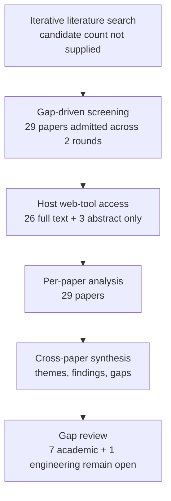

# Research Report: Incremental, Personalized and Priority-Aware Briefings from Workplace Communication

## Contents

- [Round History](#round-history)
- [Executive Summary](#executive-summary)
- [Research Question](#research-question)
- [Methodology](#methodology)
- [Papers Reviewed](#papers-reviewed)
- [Research Landscape](#research-landscape)
- [Methodology Comparison](#methodology-comparison)
- [Confidence-Graded Findings](#confidence-graded-findings)
- [Trade-Off Analysis](#trade-off-analysis)
- [Points of Agreement](#points-of-agreement)
- [Points of Contradiction](#points-of-contradiction)
- [Research Gaps](#research-gaps)
- [Reproducibility Notes](#reproducibility-notes)
- [Practical Recommendations](#practical-recommendations)
- [Future Directions](#future-directions)
- [Readiness Assessment (System-Building Mode)](#readiness-assessment-system-building-mode)
- [Evidence Map](#evidence-map)
- [References](#references)
- [Appendix: Run Metadata](#appendix-run-metadata)

## Round History

Iterative gap-closure loop (hard cap: 4 rounds). See `references/iterative-synthesis.md` for the full loop definition.

| Round | Run ID | Topic / Gap Focus | New Papers | Gaps Addressed | Remaining Gaps |
|-------|--------|-------------------|------------|----------------|----------------|
| 1 | 48b3f0169bfb | incremental, personalized and priority-aware briefings from workplace communication: how accepted topic information is selected, updated, prioritized and summarized for a user over time, distinguishing new developments from still-open state without repeating superseded facts | 13 | initial shortlist | 7 academic, 1 engineering |
| 2 | 49f688a25a3f | longitudinal and cross-thread workplace briefing systems that track new, open, resolved, and superseded work-item state over repeated cycles, with adaptive user-specific prioritization, reminder value, uncertainty presentation, and omission/repetition evaluation | 16 | academic gaps of the previous round | 7 academic, 1 engineering |

**Stop reason**: another round runs while open academic gaps remain and new papers appear

## Executive Summary

This review investigated how a workplace briefing system should select, update, prioritize, and summarize information about persistent work Topics across repeated report cycles, specifically separating new developments from unchanged-but-still-open work and suppressing resolved or superseded information. Twenty-nine papers accessed through 16 web hosts provide strong component-level evidence for task-centered email organization, personalized priority, reminder semantics, novelty/redundancy control, incremental temporal summarization, uncertainty communication, and omission-sensitive evaluation, but no paper evaluates their complete combination in a longitudinal cross-thread workplace briefing. [HIGH] The strongest result is that effective briefing selection cannot be reduced to novelty alone: user/context-dependent importance, persistent unresolved work, reminder value, prior presented context, and decision-relevant coverage are independently consequential in the studied settings [doi-10-1145-1056808-1057071] [doi-10-1093-jcmc-zmac001] [2403.01365] [doi-10-6028-nist-sp-500-302-tempsumm-overview]. [HIGH] The most significant gap is the absence of a direct cycle-by-cycle workplace evaluation that jointly tests new/open/resolved/superseded state, cross-thread Topic identity, user-specific prioritization, omission, false alerts, and redundant repetition.

**Scope**: 29 papers analyzed from 16 web-access hosts over 1998–2026  
**Overall Confidence**: Medium  
**Verdict**: HAS_GAPS

## Research Question

How should accepted information about a persistent workplace Topic be selected and rendered in successive user briefings so that the user sees:

- genuinely new developments;
- unchanged but still decision-relevant open work;
- actions, deadlines, conditions, risks, and pending investigation that remain material;
- enough prior context to interpret an update;
- personalized ordering consistent with explicit Triage rules;
- uncertainty, stale state, and unresolved evidence explicitly rather than silently resolved;

while avoiding:

- repetition of already accepted unchanged information;
- repetition of resolved or superseded facts;
- collapsing response likelihood into response obligation;
- personalization that overrides explicit user rules;
- omission of decision-essential information for the sake of brevity.

The review includes email/workplace studies and transfer evidence from timeline summarization, clinical longitudinal summarization, recommendation under preference drift, prospective memory, decision-focused summarization, uncertainty communication, and update summarization. It excludes claims that transfer-domain performance establishes production workplace accuracy, and it does not treat Topic identity, lifecycle-state extraction, multimodal evidence understanding, or external action execution as solved by this Topic.

## Methodology

### Search Strategy

- **Sources**: The admitted papers were read through the host's web tool. Access hosts included arXiv, ACL Anthology, NIST TREC/TAC, PubMed Central, medRxiv, ACM-related author copies, Microsoft Research, ResearchGate, ScienceDirect, Oxford Academic, SAGE, AAAI, Frontiers, Carnegie Mellon, University of North Texas, and an author-hosted publication page.
- **Query variants**:
  - `longitudinal cross-thread workplace briefing systems track new, open, resolved, superseded work-item state over repeated cycles, adaptive user-specific prioritization, reminder value, uncertainty presentation, omission/repetition`
  - `longitudinal cross-thread workplace`
  - `longitudinal briefing systems track new, open, resolved, superseded work-item state over repeated cycles, adaptive user-specific prioritization, reminder value, uncertainty presentation, omission/repetition`
  - `cross-thread briefing systems track new, open, resolved, superseded work-item state over repeated cycles, adaptive user-specific prioritization, reminder value, uncertainty presentation, omission/repetition`
  - `workplace briefing systems track new, open, resolved, superseded work-item state over repeated cycles, adaptive user-specific prioritization, reminder value, uncertainty presentation, omission/repetition`
  - `longitudinal cross-thread workplace briefing systems`
  - `longitudinal cross-thread workplace track new,`
  - `longitudinal cross-thread workplace open, resolved,`
- **Time window**: 1998–2026.
- **Screening**: Gap-driven iterative admission was used by the research pipeline. The supplied run metadata does not specify whether candidate ranking was BM25-only or BM25 plus a sub-agent, so that detail remains unknown.
- **Evidence boundary**: Findings in this report come only from the 29 admitted papers. Topic 06 and Topic 08 handoffs are project context, not evidence for findings or gap closure.
- **Access limitation**: Two admitted papers were available only at abstract level; all others were available as full text through the host's web tool.

### Access Level by Paper

| Paper ID | Access level |
|---|---|
| 2107.14691 | full_text |
| 2109.06896 | full_text |
| 2403.01365 | full_text |
| doi-10-1007-978-3-319-67684-5-24 | abstract_only |
| doi-10-1016-j-eswa-2021-114890 | full_text |
| doi-10-1016-j-eswa-2021-115626 | abstract_only |
| doi-10-1093-jcmc-zmac001 | full_text |
| doi-10-1098-rsos-181870 | full_text |
| doi-10-1136-amiajnl-2014-002945 | full_text |
| doi-10-1145-1056808-1057071 | full_text |
| doi-10-1145-1557019-1557124 | full_text |
| doi-10-1145-2063576-2063683 | full_text |
| doi-10-1145-290941-291025 | full_text |
| doi-10-1145-642611-642672 | full_text |
| doi-10-1177-1071181322661236 | abstract_only |
| doi-10-1207-s15327051hci2001-2-3 | full_text |
| doi-10-1609-icwsm-v12i1-15014 | full_text |
| doi-10-18653-v1-2007-sigdial-1-4 | full_text |
| doi-10-18653-v1-2024-acl-long-390 | full_text |
| doi-10-18653-v1-d19-1386 | full_text |
| doi-10-3389-fpsyg-2014-00657 | full_text |
| doi-10-3758-bf03201140 | full_text |
| doi-10-6028-nist-sp-500-302-tempsumm-overview | full_text |
| doi-10-64898-2025-11-28-25341233 | full_text |
| manual-13a21477e7 | full_text |
| manual-1d6b22c7ad | full_text |
| manual-39435af3dd | full_text |
| manual-4cb48c423e | full_text |
| manual-c2f56a571b | full_text |

### Pipeline Summary

| Metric | Count |
|--------|-------|
| Total candidates | unknown |
| After screening | 29 admitted papers |
| Downloaded | not applicable as a uniform step; papers were accessed through the host web tool |
| Successfully converted | unknown / not a required uniform step |
| Deeply analyzed | 29 |
| Iterations | 2 |

## Papers Reviewed

Quality scores were not supplied by the pipeline and are therefore marked unknown. Relevance below reflects this Topic's scope rather than a paper-quality judgment.

| # | Title | Authors | Year | Venue | Quality Score | Relevance |
|---|-------|---------|------|-------|---------------|-----------|
| 1 | RemindMe: Plugging a Reminder Manager into Email for Enhancing Workplace Responsiveness [doi-10-1007-978-3-319-67684-5-24] | Casey Dugan, Aabhas Sharma, Michael Muller et al. | 2017 | unknown | unknown | HIGH |
| 2 | HARVEST, a longitudinal patient record summarizer [doi-10-1136-amiajnl-2014-002945] | Jamie S. Hirsch, Jessica S. Tanenbaum, Sharon Lipsky Gorman et al. | 2014 | unknown | unknown | MEDIUM |
| 3 | CLIN-SUMM: Incremental Longitudinal Summarization of Clinical Notes Enables Scalable Representation and Early Disease Prediction [doi-10-64898-2025-11-28-25341233] | Valentina D'Souza, Danielle F. Pace, Alaleh Azhir et al. | 2026 | medRxiv preprint | unknown | MEDIUM |
| 4 | Communicating uncertainty about facts, numbers and science [doi-10-1098-rsos-181870] | Anne Marthe van der Bles, Sander van der Linden, Alexandra L. J. Freeman et al. | 2019 | unknown | unknown | MEDIUM |
| 5 | Corpus-Based Problem Selection for EHR Note Summarization [manual-1d6b22c7ad] | Tielman T. Van Vleck, Noémie Elhadad | 2010 | unknown | unknown | MEDIUM |
| 6 | A case study of batch and incremental recommender systems in supermarket data under concept drifts and cold start [doi-10-1016-j-eswa-2021-114890] | Antônio David Viniski, Jean Paul Barddal, Alceu de Souza Britto Jr. et al. | 2021 | unknown | unknown | MEDIUM |
| 7 | TREC 2013 Temporal Summarization [doi-10-6028-nist-sp-500-302-tempsumm-overview] | Javed A. Aslam, Matthew Ekstrand-Abueg, Virgil Pavlu et al. | 2013 | TREC / NIST | unknown | HIGH |
| 8 | Can You Verifi This? Studying Uncertainty and Decision-Making About Misinformation Using Visual Analytics [doi-10-1609-icwsm-v12i1-15014] | Alireza Karduni, Ryan Wesslen, Sashank Santhanam et al. | 2018 | ICWSM | unknown | MEDIUM |
| 9 | Interactive Multi-Objective Probabilistic Preference Learning with Soft and Hard Bounds [manual-4cb48c423e] | Edward Chen, Sang T. Truong, Natalie Dullerud et al. | 2026 | unknown | unknown | MEDIUM |
| 10 | Overview of the TAC 2008 Update Summarization Task [manual-39435af3dd] | Hoa Trang Dang, Karolina Owczarzak | 2008 | TAC | unknown | HIGH |
| 11 | Strategy-Specific Decision Making with Incomplete Information [doi-10-1177-1071181322661236] | William I.N. Sealy, Karen M. Feigh | 2022 | unknown | unknown | MEDIUM |
| 12 | Prospective memory: when reminders fail [doi-10-3758-bf03201140] | Melissa J. Guynn, Mark A. McDaniel, Gilles O. Einstein | 1998 | unknown | unknown | MEDIUM |
| 13 | Taking Email to Task: The Design and Evaluation of a Task Management Centered Email Tool [doi-10-1145-642611-642672] | Victoria Bellotti, Nicolas Ducheneaut, Mark Howard et al. | 2003 | unknown | unknown | HIGH |
| 14 | How important is importance for prospective memory? A review [doi-10-3389-fpsyg-2014-00657] | Stefan Walter, Beat Meier | 2014 | Frontiers in Psychology | unknown | MEDIUM |
| 15 | From Moments to Milestones: Incremental Timeline Summarization Leveraging Large Language Models [doi-10-18653-v1-2024-acl-long-390] | Qisheng Hu, Geonsik Moon, Hwee Tou Ng | 2024 | ACL | unknown | HIGH |
| 16 | A novel temporal recommender system based on multiple transitions in user preference drift and topic review evolution [doi-10-1016-j-eswa-2021-115626] | Charinya Wangwatcharakul, Sartra Wongthanavasu | 2021 | unknown | unknown | MEDIUM |
| 17 | Summarize What You Are Interested In: An Optimization Framework for Interactive Personalized Summarization [manual-13a21477e7] | Rui Yan, Jian-Yun Nie, Xiaoming Li | 2011 | ACL Anthology venue; exact venue not supplied | unknown | HIGH |
| 18 | Mining social networks for personalized email prioritization [doi-10-1145-1557019-1557124] | Shinjae Yoo, Yiming Yang, Frank Lin et al. | 2009 | unknown | unknown | HIGH |
| 19 | Modeling personalized email prioritization: Classification-based and regression-based approaches [doi-10-1145-2063576-2063683] | Shinjae Yoo, Yiming Yang, Jaime G. Carbonell | 2011 | unknown | unknown | HIGH |
| 20 | Measurement of Perceived Importance and Urgency of Email: An Employees’ Perspective [doi-10-1093-jcmc-zmac001] | Andre Lanctot, Linda Duxbury | 2022 | Journal of Computer-Mediated Communication | unknown | HIGH |
| 21 | Supporting Collaborative Task Management in E-mail [doi-10-1207-s15327051hci2001-2-3] | Steve Whittaker | 2005 | unknown | unknown | HIGH |
| 22 | Summary Cloze: A New Task for Content Selection in Topic-Focused Summarization [doi-10-18653-v1-d19-1386] | Daniel Deutsch, Dan Roth | 2019 | ACL Anthology venue; exact venue not supplied | unknown | HIGH |
| 23 | Summarizing Emails with Conversational Cohesion and Subjectivity [manual-c2f56a571b] | Giuseppe Carenini, Raymond T. Ng, Xiaodong Zhou | 2008 | ACL Anthology venue; exact venue not supplied | unknown | HIGH |
| 24 | Detecting and Summarizing Action Items in Multi-Party Dialogue [doi-10-18653-v1-2007-sigdial-1-4] | Matthew Purver, John Dowding, John Niekrasz et al. | 2007 | SIGDIAL | unknown | HIGH |
| 25 | Beyond “From” and “Received”: Exploring the Dynamics of Email Triage [doi-10-1145-1056808-1057071] | Carman Neustaedter, A. J. Bernheim Brush, Marc A. Smith | 2005 | unknown | unknown | HIGH |
| 26 | Decision-Focused Summarization [2109.06896] | Chao-Chun Hsu, Chenhao Tan | 2021 | arXiv / publication venue not supplied | unknown | HIGH |
| 27 | The Use of MMR, Diversity-Based Reranking for Reordering Documents and Producing Summaries [doi-10-1145-290941-291025] | Jaime G. Carbonell, Jade Goldstein | 1998 | unknown | unknown | HIGH |
| 28 | AI-Powered Reminders for Collaborative Tasks: Experiences and Futures [2403.01365] | Katelyn Morrison, Shamsi T. Iqbal, Eric Horvitz | 2024 | arXiv / publication venue not supplied | unknown | HIGH |
| 29 | EmailSum: Abstractive Email Thread Summarization [2107.14691] | Shiyue Zhang, Asli Celikyilmaz, Jianfeng Gao et al. | 2021 | arXiv / publication venue not supplied | unknown | HIGH |

## Research Landscape

### Theme 1: Incremental and Temporally Structured Summarization

**Coverage**: 4 primary papers plus supporting update-summarization work | **Confidence**: High for mechanism viability; Low for direct workplace lifecycle transfer  
**Supporting papers**: [doi-10-18653-v1-2024-acl-long-390], [doi-10-64898-2025-11-28-25341233], [doi-10-6028-nist-sp-500-302-tempsumm-overview], [manual-39435af3dd]

[HIGH] Incremental summarization is technically feasible in evolving information streams: LLM-TLS incrementally clusters and summarizes events in news/crisis streams, while CLIN-SUMM incrementally updates dated patient summaries as new notes arrive rather than rebuilding from future information [doi-10-18653-v1-2024-acl-long-390] [doi-10-64898-2025-11-28-25341233]. [HIGH] Temporal summarization evaluations explicitly distinguish useful new information from repeated updates and can separately account for comprehensiveness, latency, and verbosity [doi-10-6028-nist-sp-500-302-tempsumm-overview]. [LOW] These transfer results do not establish correct tracking of workplace work-item lifecycle states such as open, resolved, revoked, disputed, or superseded.

Key findings:

1. [HIGH] Incremental processing can operate over chronological input without requiring future documentation [doi-10-64898-2025-11-28-25341233].
2. [HIGH] Timeline summarization can build an evolving representation by clustering and summarizing new event material incrementally [doi-10-18653-v1-2024-acl-long-390].
3. [HIGH] Evaluation of an update stream benefits from separating novelty-oriented gain from comprehensiveness and latency rather than collapsing all behavior into one overlap score [doi-10-6028-nist-sp-500-302-tempsumm-overview].
4. [LOW] No admitted paper demonstrates the equivalent mechanism over stable cross-thread workplace Topic identities with explicit new/open/resolved/superseded state.

### Theme 2: Novelty, Prior Context, and Redundancy Control

**Coverage**: 4 papers | **Confidence**: High  
**Supporting papers**: [doi-10-1145-290941-291025], [doi-10-18653-v1-d19-1386], [doi-10-6028-nist-sp-500-302-tempsumm-overview], [manual-39435af3dd]

[HIGH] Novelty is inherently relative to information already selected or shown. MMR balances relevance against similarity to already selected material, Summary Cloze benefits from preceding-summary context, and temporal/update summarization evaluates information gain relative to previous updates [doi-10-1145-290941-291025] [doi-10-18653-v1-d19-1386] [doi-10-6028-nist-sp-500-302-tempsumm-overview].

Key findings:

1. [HIGH] Redundancy suppression requires memory of previously selected content, not just scoring each candidate independently [doi-10-1145-290941-291025].
2. [HIGH] Prior summary context can materially change which next content should be selected [doi-10-18653-v1-d19-1386].
3. [HIGH] Novelty and coverage are distinct objectives; maximizing one does not guarantee the other [doi-10-6028-nist-sp-500-302-tempsumm-overview].
4. [MEDIUM] For msgloom, the closest synthesis-derived analogue is to compare every candidate against the user's previous accepted Topic view rather than merely deduplicating strings.

### Theme 3: Workplace Priority Is Personalized and Context-Dependent

**Coverage**: 6 papers | **Confidence**: High  
**Supporting papers**: [doi-10-1145-1056808-1057071], [doi-10-1093-jcmc-zmac001], [doi-10-1145-1557019-1557124], [doi-10-1145-2063576-2063683], [manual-13a21477e7], [manual-4cb48c423e]

[HIGH] Email triage and priority are heterogeneous across users and situations. Workers use different triage approaches, perceived importance depends on active work and social context, and personalized sender/social-network information can improve priority prediction in evaluated email models [doi-10-1145-1056808-1057071] [doi-10-1093-jcmc-zmac001] [doi-10-1145-1557019-1557124].

Key findings:

1. [HIGH] A single universal ordering rule does not describe observed email triage behavior [doi-10-1145-1056808-1057071].
2. [HIGH] Perceived email importance and urgency are related but not interchangeable and are shaped by work context [doi-10-1093-jcmc-zmac001].
3. [HIGH] Personalized social-network features improved priority prediction in the evaluated personal-email setting [doi-10-1145-1557019-1557124].
4. [HIGH] Interactive personalization can move summaries toward individual preferences, although the demonstrated summarization evidence used news and only three evaluators [manual-13a21477e7].
5. [LOW] No admitted study determines how explicit obligations or hard Triage rules should constrain softer learned preferences in a repeated workplace briefing.

### Theme 4: Reminder Value Is Distinct from Urgency

**Coverage**: 4 papers | **Confidence**: High for the distinction; Medium for briefing transfer  
**Supporting papers**: [2403.01365], [doi-10-3758-bf03201140], [doi-10-3389-fpsyg-2014-00657], [doi-10-1007-978-3-319-67684-5-24]

[HIGH] Reminder utility cannot safely be approximated by urgency alone. Microsoft workers reported value from reminders for small, ad hoc, forgotten, or otherwise low-importance tasks, while prospective-memory experiments found that reminder content linking the triggering event to the intended action was more effective than target-only or action-only reminders [2403.01365] [doi-10-3758-bf03201140].

Key findings:

1. [HIGH] Low apparent importance does not imply zero future reminder value [2403.01365].
2. [HIGH] Reminder content matters: cue-plus-action representations outperformed weaker forms in the reported laboratory experiments [doi-10-3758-bf03201140].
3. [MEDIUM] The prospective-memory literature does not support treating task importance as a simple monotonic predictor of remembering [doi-10-3389-fpsyg-2014-00657].
4. [LOW] The literature has not answered how reminder value should be combined quantitatively with urgency, recency, explicit obligations, and personalized priority in a briefing.

### Theme 5: Task-Centered Structure Beats a Message-Only View for Some Workplace Tasks

**Coverage**: 4 direct workplace papers | **Confidence**: High within the evaluated studies  
**Supporting papers**: [doi-10-1207-s15327051hci2001-2-3], [doi-10-1145-642611-642672], [doi-10-18653-v1-2007-sigdial-1-4], [manual-c2f56a571b]

[HIGH] Small workplace evaluations support organizing communication around persistent tasks or action-bearing structures rather than treating every email as an isolated unit. ContactMap improved task success and reduced completion time in its controlled study, and Taskmaster users positively assessed task-centric collections and metadata such as reminders and deadlines [doi-10-1207-s15327051hci2001-2-3] [doi-10-1145-642611-642672].

Key findings:

1. [HIGH] Persistent task-centered organization can improve handling and retrieval in the evaluated email settings [doi-10-1207-s15327051hci2001-2-3] [doi-10-1145-642611-642672].
2. [MEDIUM] Action-item extraction provides a useful subcomponent for briefing selection, but dialogue-level action detection does not itself solve longitudinal Topic state [doi-10-18653-v1-2007-sigdial-1-4].
3. [MEDIUM] Conversational cohesion is relevant to email summary construction, but conversation-level summarization remains narrower than cross-thread Topic aggregation [manual-c2f56a571b].

### Theme 6: Decision-Essential Coverage and Summary Quality Are Multi-Objective

**Coverage**: 6 papers | **Confidence**: High  
**Supporting papers**: [2109.06896], [manual-1d6b22c7ad], [doi-10-6028-nist-sp-500-302-tempsumm-overview], [manual-39435af3dd], [doi-10-18653-v1-d19-1386], [2107.14691]

[HIGH] Different objectives favor different content-selection policies. Decision-Focused Summarization improved preservation and representativeness of decision evidence while sacrificing some grammaticality and coherence, and clinical problem selection changed preferred selectors when recall was weighted more heavily with $F_2$ [2109.06896] [manual-1d6b22c7ad].

Key findings:

1. [HIGH] Maximizing readability alone is not equivalent to preserving evidence needed for a decision [2109.06896].
2. [HIGH] Weighting recall more heavily can change which selector is preferable, demonstrating that omission cost affects method choice [manual-1d6b22c7ad].
3. [HIGH] Evaluation should separate redundancy/verbosity from coverage rather than assuming shortness implies quality [doi-10-6028-nist-sp-500-302-tempsumm-overview].
4. [HIGH] ROUGE-style overlap is insufficient as the primary acceptance criterion for this problem because multiple admitted studies report poor or incomplete correspondence with human judgments or valid personalized outputs [2107.14691] [manual-39435af3dd] [doi-10-18653-v1-d19-1386] [manual-13a21477e7].

### Theme 7: Uncertainty Presentation Is Context-Sensitive

**Coverage**: 4 papers | **Confidence**: High for context sensitivity; Low for workplace briefing policy  
**Supporting papers**: [doi-10-1098-rsos-181870], [doi-10-1609-icwsm-v12i1-15014], [doi-10-1177-1071181322661236], [doi-10-1136-amiajnl-2014-002945]

[HIGH] There is no empirically justified one-size-fits-all uncertainty presentation. A broad review found effects dependent on expression, audience, and context without a simple general loss of trust, while the Verifi experiment found conflicting cues associated with greater uncertainty and more inaccurate judgments [doi-10-1098-rsos-181870] [doi-10-1609-icwsm-v12i1-15014].

Key findings:

1. [HIGH] Explicit epistemic uncertainty does not uniformly reduce trust; outcome depends on how uncertainty is expressed and who receives it [doi-10-1098-rsos-181870].
2. [HIGH] Conflicting evidence can increase uncertainty and impair judgment in some decision settings [doi-10-1609-icwsm-v12i1-15014].
3. [LOW] No admitted controlled workplace study determines how stale, disputed, unresolved, or incompletely investigated Topic state should be rendered in a repeated briefing.

## Methodology Comparison

| Approach | Papers | Strengths | Weaknesses | Best For | Performance |
|----------|--------|-----------|------------|----------|-------------|
| Incremental timeline summarization | [doi-10-18653-v1-2024-acl-long-390] | Processes evolving streams chronologically; captures milestone-like events | Transfer domain; no explicit workplace lifecycle state | New-event accumulation over time | Reported as effective against evaluated timeline baselines; no workplace metric |
| Incremental longitudinal clinical summarization | [doi-10-64898-2025-11-28-25341233] | Dated updates; no future-note dependence | Clinical-domain structure differs from workplace Topics | Chronological carry-forward/update mechanisms | Technical viability demonstrated; direct workplace performance unknown |
| Temporal/update summarization evaluation | [doi-10-6028-nist-sp-500-302-tempsumm-overview], [manual-39435af3dd] | Separates novelty, comprehensiveness, latency, verbosity | Event/news tasks differ from persistent work items | Cycle-based evaluation design | Multiple complementary metrics; no target-domain end-to-end result |
| MMR novelty/relevance reranking | [doi-10-1145-290941-291025] | Explicit relevance-versus-redundancy control | No lifecycle/open-state semantics | Redundancy-aware candidate ranking | Qualitative transfer value supported; target metric unknown |
| Prior-summary-aware content selection | [doi-10-18653-v1-d19-1386] | Conditions next selection on prior summary context | Topic-focused benchmark, not workplace lifecycle | Delta-aware selection | Preceding context improved evaluated models |
| Personalized email prioritization | [doi-10-1145-1557019-1557124], [doi-10-1145-2063576-2063683] | User-specific sender/social/context signals | Priority prediction is not obligation classification | Soft ranking among otherwise eligible items | Improved evaluated personalized priority prediction; no briefing omission metric |
| Interactive personalized summarization | [manual-13a21477e7] | Learns explicit user preferences | Small evaluator set; news domain | Preference-aware content weighting | Personalized quality improved while generic ROUGE could decrease |
| Task-centered email organization | [doi-10-1207-s15327051hci2001-2-3], [doi-10-1145-642611-642672] | Organizes persistent work rather than isolated messages | Small/older workplace studies | User-facing work-item presentation | Controlled/task-study benefits reported |
| Reminder-oriented workplace support | [2403.01365], [doi-10-1007-978-3-319-67684-5-24] | Captures forgotten work and follow-up needs | Does not solve ranking/lifecycle integration | Carry-forward and reminder-value signals | Useful reminder behaviors reported; integrated briefing result absent |
| Decision-focused selection | [2109.06896] | Preserves evidence relevant to downstream decisions | Can sacrifice grammaticality/coherence | High-cost omission settings | Better evaluated decision faithfulness/representativeness |
| Static email thread summarization | [2107.14691], [manual-c2f56a571b] | Direct email summarization evidence | Thread-level; role/intent/length limitations | Summarizing bounded conversations | Strong baselines exist, but quality degrades with harder/longer threads |

## Confidence-Graded Findings

### 🟢 High Confidence (supported by 3+ papers with consistent results)

1. **[HIGH] Briefing selection is inherently multi-objective rather than a pure novelty problem.** Workplace importance varies by user and context, reminder utility can arise from forgotten low-importance work, and temporal summarization explicitly separates novelty from comprehensiveness [doi-10-1145-1056808-1057071] [doi-10-1093-jcmc-zmac001] [2403.01365] [doi-10-6028-nist-sp-500-302-tempsumm-overview].

2. **[HIGH] Redundancy control should be conditioned on what has already been selected or presented.** MMR compares candidates with previously selected content, Summary Cloze benefits from preceding-summary context, and temporal/update summarization evaluates new information relative to prior updates [doi-10-1145-290941-291025] [doi-10-18653-v1-d19-1386] [doi-10-6028-nist-sp-500-302-tempsumm-overview].

3. **[HIGH] Workplace priority is user- and context-dependent.** Triage behavior varies between users, perceived importance reflects active work and social context, and personalized email models benefit from user-specific social signals [doi-10-1145-1056808-1057071] [doi-10-1093-jcmc-zmac001] [doi-10-1145-1557019-1557124].

4. **[HIGH] Automatic overlap metrics are insufficient as the principal acceptance metric for this briefing problem.** Weak or incomplete correspondence with human or personalized judgments appears across email, update, and topic-focused summarization [2107.14691] [manual-39435af3dd] [doi-10-18653-v1-d19-1386] [manual-13a21477e7].

5. **[HIGH] The evaluation objective changes which content-selection policy appears preferable.** Decision-evidence preservation, recall-sensitive problem selection, temporal comprehensiveness, redundancy, and personalization reward different outputs [2109.06896] [manual-1d6b22c7ad] [doi-10-6028-nist-sp-500-302-tempsumm-overview] [manual-13a21477e7].

### 🟡 Medium Confidence (supported by 1-2 papers or with caveats)

1. **[MEDIUM] Maintaining a persistent prior accepted Topic view is a promising architecture for cycle-to-cycle delta selection.** Transfer evidence shows incremental chronology and preceding-summary context are useful, but the exact workplace Topic architecture has not been tested [doi-10-18653-v1-2024-acl-long-390] [doi-10-18653-v1-d19-1386].

2. **[MEDIUM] Reminder-like briefing entries should preserve both the triggering context and intended action.** Laboratory prospective-memory evidence supports cue-plus-action reminders, and workplace reminder interviews emphasize sufficient contextual information [doi-10-3758-bf03201140] [2403.01365].

3. **[MEDIUM] Personalized ranking should adapt chronologically rather than assume stable preferences.** Recommender-system studies show benefits from incremental or temporal preference modeling under drift, but this has not been directly validated for workplace briefings [doi-10-1016-j-eswa-2021-114890] [doi-10-1016-j-eswa-2021-115626].

### 🔴 Low Confidence (preliminary, single-source, or transfer-limited)

1. **[LOW] A specific optimal weighting among novelty, importance, reminder value, recency, uncertainty, and personalized preference is known.** The admitted literature does not establish such weights.

2. **[LOW] A production workplace system can safely infer response obligation from predicted priority or response behavior.** No admitted study establishes that equivalence.

3. **[LOW] A validated presentation policy exists for stale, disputed, unresolved, or incompletely investigated workplace Topic state.** Adjacent uncertainty evidence exists, but the target experiment has not been performed [doi-10-1098-rsos-181870] [doi-10-1609-icwsm-v12i1-15014].

4. **[LOW] Cross-thread work-item lifecycle briefing is solved by existing email thread summarization.** Direct email summarization remains primarily thread/conversation-level [2107.14691] [manual-c2f56a571b].

## Trade-Off Analysis

| Decision | Option A | Option B | Recommendation |
|----------|----------|----------|----------------|
| Novelty vs unresolved carry-forward | Show only changes: concise but can hide unchanged critical open work | Carry all open work: safer coverage but repetitive | Keep lifecycle carry-forward separate from novelty suppression; only redundancy-suppress content that is not needed to preserve open state |
| Generic ranking vs personalization | Stable and easy to audit; misses user context | Better individual relevance; vulnerable to drift and sparse feedback | Use personalization only inside boundaries imposed by explicit rules and lifecycle obligations [doi-10-1145-1557019-1557124] [manual-13a21477e7] |
| Single scalar priority vs inspectable objectives | Easy sorting; hides why an item ranked highly | Separate state, obligation, importance, reminder value, novelty, uncertainty | Prefer separately inspectable signals and deterministic precedence for hard constraints |
| Maximum brevity vs decision coverage | Lower reading load; higher omission risk | More complete; can overload user | Optimize brevity only after required Topic/state/action coverage is satisfied [2109.06896] [manual-1d6b22c7ad] |
| ROUGE-style evaluation vs task-aware evaluation | Cheap and reproducible | More expensive but measures omission, repetition, state, usefulness | Use overlap metrics only as secondary diagnostics [2107.14691] [manual-39435af3dd] |
| Hide uncertainty vs explicit uncertainty | Cleaner display; can imply false certainty | More faithful but presentation can affect interpretation | Preserve structured uncertainty and test presentation empirically [doi-10-1098-rsos-181870] [doi-10-1609-icwsm-v12i1-15014] |
| Rebuild whole summary vs incremental update | Simple conceptual pipeline; repeated computation and greater repetition risk | Maintains temporal continuity and prior-state context | Favor incremental state-aware processing, subject to target-domain benchmark validation [doi-10-18653-v1-2024-acl-long-390] [doi-10-64898-2025-11-28-25341233] |

## Points of Agreement **[EVIDENCE REQUIRED]**

1. [HIGH] **Previously presented context matters to future selection.** MMR, Summary Cloze, temporal summarization, and update summarization all operationalize some form of dependence on previously selected or previously known material [doi-10-1145-290941-291025] [doi-10-18653-v1-d19-1386] [doi-10-6028-nist-sp-500-302-tempsumm-overview] [manual-39435af3dd].

2. [HIGH] **Workplace importance cannot be represented by one generic global signal.** Direct email studies identify heterogeneous triage strategies, context-sensitive importance/urgency, and gains from personalized social features [doi-10-1145-1056808-1057071] [doi-10-1093-jcmc-zmac001] [doi-10-1145-1557019-1557124].

3. [HIGH] **Reminder value and immediate urgency are distinct concepts.** Workplace reminder evidence includes forgotten small or low-importance tasks, while prospective-memory work shows reminder content itself changes success [2403.01365] [doi-10-3758-bf03201140] [doi-10-3389-fpsyg-2014-00657].

4. [HIGH] **Evaluation requires more than lexical overlap.** Human usefulness, decision evidence, personalization, and valid next-content selection are incompletely represented by generic reference overlap [2107.14691] [manual-39435af3dd] [doi-10-18653-v1-d19-1386] [manual-13a21477e7] [2109.06896].

5. [HIGH] **Incremental processing is feasible, but target-domain validation is missing.** News and clinical systems demonstrate incremental summarization mechanisms, while workplace email literature does not directly evaluate equivalent cross-thread lifecycle briefings [doi-10-18653-v1-2024-acl-long-390] [doi-10-64898-2025-11-28-25341233] [2107.14691].

## Points of Contradiction **[EVIDENCE REQUIRED]**

1. [HIGH] **No direct cross-paper contradiction met the required same-question, comparable-condition criterion.** The corpus contains differences in outcomes under changed tasks, populations, datasets, and objectives, but the synthesis did not identify a pair that justifies treating one result as a direct contradiction of another.

2. [HIGH] **Uncertainty results are condition-dependent rather than directly contradictory.** The uncertainty review reports no simple universal loss of trust from communicating epistemic uncertainty, whereas the Verifi experiment reports that conflicting cues can increase uncertainty and inaccurate judgments [doi-10-1098-rsos-181870] [doi-10-1609-icwsm-v12i1-15014].
   - **Possible explanation**: the studies examine different forms of uncertainty, audiences, tasks, and decision contexts.
   - **Implication**: a workplace briefing should not adopt a universal uncertainty-display rule from either result alone.

## Research Gaps

Every gap below remains open. The literature reviewed so far has not answered it.

| # | Gap | Type | Severity | Rounds Already Searched / Assessed | Impact on Goals |
|---|-----|------|----------|----------------|----------------|
| 1 | No direct longitudinal workplace briefing evaluation distinguishes newly changed information, unchanged-but-still-open work, resolved state, and superseded state across successive cycles | ACADEMIC | HIGH | Rounds 1, 2 | Prevents evidence-based validation of the core report-update contract |
| 2 | No evidence establishes how hard user rules or response obligations should interact with softer importance, reminder-value, forgetting, or learned preference signals | ACADEMIC | HIGH | Rounds 1, 2 | Risks personalization overriding obligations or explicit Triage policy |
| 3 | Sustained adaptation to changing workplace roles, projects, priorities, feedback, and work patterns is unevaluated | ACADEMIC | HIGH | Rounds 1, 2 | Leaves long-term personalization behavior and drift handling unvalidated |
| 4 | No end-to-end repeated-cycle evaluation jointly measures missed decision-essential work, redundant repetition, false alerts, and preservation of unresolved important state | ACADEMIC | HIGH | Rounds 1, 2 | Prevents acceptance testing against the most important product failure modes |
| 5 | No admitted study determines how reminder usefulness/forgetting combines with importance, urgency, recency, and personalized priority for briefing selection | ACADEMIC | MEDIUM | Rounds 1, 2 | Leaves carry-forward/reminder selection policy underdetermined |
| 6 | No admitted paper evaluates Topic/work-item-level incremental briefing across multiple workplace conversations and sources | ACADEMIC | HIGH | Rounds 1, 2 | Thread summaries cannot be assumed to provide cross-thread Topic completeness |
| 7 | No controlled workplace experiment establishes how to present stale, uncertain, disputed, or incompletely investigated state | ACADEMIC | HIGH | Rounds 1, 2 | Presentation may either hide uncertainty or create avoidable confusion |
| 8 | No reproducible cycle-based benchmark compares candidate mechanisms using chronological holdouts and independently labeled new/open/resolved/superseded state, user-specific priority, omission, and repetition errors | ENGINEERING | HIGH | Rounds 1 and 2 assessed; Round 2 was not a dedicated engineering-literature search | Prevents direct mechanism comparison and regression testing |

### Academic Gaps (require more papers)

1. **[ACADEMIC] [HIGH] Gap 1 — longitudinal workplace lifecycle briefing**: The literature has not answered how repeated workplace briefings should distinguish new, unchanged-open, resolved, and superseded work-item state. Already searched in Rounds 1 and 2. Suggested query: `"incremental summarization" longitudinal workplace email briefing new developments unresolved resolved superseded`.

2. **[ACADEMIC] [HIGH] Gap 2 — hard rules versus soft preference signals**: The literature has not answered how explicit response obligations or user rules should constrain learned priority, reminder value, recency, or forgetting signals. Already searched in Rounds 1 and 2. Suggested query: `"email prioritization" hard constraints soft preferences response obligation personalized triage user rules`.

3. **[ACADEMIC] [HIGH] Gap 3 — long-term workplace personalization drift**: The literature has not answered how user-specific briefing behavior should adapt safely as roles, projects, priorities, and communication patterns change over longer periods. Already searched in Rounds 1 and 2. Suggested query: `"longitudinal personalization" email prioritization preference drift adaptive workplace summarization`.

4. **[ACADEMIC] [HIGH] Gap 4 — integrated omission/repetition evaluation**: The literature has not answered how to jointly evaluate missed essential work, false alerts, repetition, and unresolved-state preservation over successive workplace report cycles. Already searched in Rounds 1 and 2. Suggested query: `"longitudinal summarization" omission redundancy false alerts unresolved state evaluation briefing`.

5. **[ACADEMIC] [MEDIUM] Gap 5 — reminder-value integration**: The literature has not answered how reminder utility and forgetting likelihood should be combined with urgency, importance, recency, and personalized priority for briefing selection. Already searched in Rounds 1 and 2. Suggested query: `"email reminder" forgetting importance urgency recency personalized priority task selection`.

6. **[ACADEMIC] [HIGH] Gap 6 — cross-thread/cross-source Topic briefing**: The literature has not answered how one persistent workplace work item should be summarized incrementally when its evidence spans multiple conversations and sources. Already searched in Rounds 1 and 2. Suggested query: `"cross-thread summarization" email multi-source incremental topic work item workplace`.

7. **[ACADEMIC] [HIGH] Gap 7 — presentation of uncertain and stale state**: The literature has not answered how alternative displays of stale, disputed, unresolved, or incompletely investigated work-item state affect workplace decisions. Already searched in Rounds 1 and 2. Suggested query: `"uncertainty visualization" stale disputed incomplete information workplace decision support briefing`.

### Engineering Gaps (fillable without papers)

1. **[ENGINEERING] [HIGH] Gap 8 — cycle-based benchmark**: Candidate mechanisms have not been compared in a single reproducible benchmark with chronological holdouts, independent gold labels for new/open/resolved/superseded state, user-specific priority labels, and explicit omission/repetition errors. The gap was assessed across Rounds 1 and 2 but remains unperformed. Suggested resolution: construct an independent benchmark in which prediction inputs are structurally separated from future/gold evidence; score every cycle for missed essential Topics, missed open carry-forward, repeated unchanged material, stale/resolved false alerts, supersession failures, and incorrect personalized ordering.

## Reproducibility Notes

The supplied synthesis did not systematically record code repositories, downloadable datasets, or software licenses. Unknown fields are therefore left explicitly unknown rather than inferred from publication venue.

| Paper | Code Available | Data Available | Sufficient Detail | License |
|-------|---------------|----------------|-------------------|---------|
| [2107.14691] | unknown | unknown | full text available | unknown |
| [2109.06896] | unknown | unknown | full text available | unknown |
| [2403.01365] | unknown | unknown | full text available | unknown |
| [doi-10-1007-978-3-319-67684-5-24] | unknown | unknown | abstract only; detailed reproducibility cannot be verified | unknown |
| [doi-10-1016-j-eswa-2021-114890] | unknown | unknown | full text available | unknown |
| [doi-10-1016-j-eswa-2021-115626] | unknown | unknown | abstract only; detailed reproducibility cannot be verified | unknown |
| [doi-10-1093-jcmc-zmac001] | unknown | unknown | full text available | unknown |
| [doi-10-1098-rsos-181870] | unknown | unknown | full text available | unknown |
| [doi-10-1136-amiajnl-2014-002945] | unknown | unknown | full text available | unknown |
| [doi-10-1145-1056808-1057071] | unknown | unknown | full text available | unknown |
| [doi-10-1145-1557019-1557124] | unknown | unknown | full text available | unknown |
| [doi-10-1145-2063576-2063683] | unknown | unknown | full text available | unknown |
| [doi-10-1145-290941-291025] | unknown | unknown | full text available | unknown |
| [doi-10-1145-642611-642672] | unknown | unknown | full text available | unknown |
| [doi-10-1177-1071181322661236] | unknown | unknown | abstract only; detailed reproducibility cannot be verified | unknown |
| [doi-10-1207-s15327051hci2001-2-3] | unknown | unknown | full text available | unknown |
| [doi-10-1609-icwsm-v12i1-15014] | unknown | unknown | full text available | unknown |
| [doi-10-18653-v1-2007-sigdial-1-4] | unknown | unknown | full text available | unknown |
| [doi-10-18653-v1-2024-acl-long-390] | unknown | unknown | full text available | unknown |
| [doi-10-18653-v1-d19-1386] | unknown | unknown | full text available | unknown |
| [doi-10-3389-fpsyg-2014-00657] | unknown | unknown | full text available | unknown |
| [doi-10-3758-bf03201140] | unknown | unknown | full text available | unknown |
| [doi-10-6028-nist-sp-500-302-tempsumm-overview] | unknown | unknown | full text available | unknown |
| [doi-10-64898-2025-11-28-25341233] | unknown | unknown | full text available | unknown |
| [manual-13a21477e7] | unknown | unknown | full text available | unknown |
| [manual-1d6b22c7ad] | unknown | unknown | full text available | unknown |
| [manual-39435af3dd] | unknown | unknown | full text available | unknown |
| [manual-4cb48c423e] | unknown | unknown | full text available | unknown |
| [manual-c2f56a571b] | unknown | unknown | full text available | unknown |

## Practical Recommendations **[EVIDENCE REQUIRED]**

1. **[HIGH] Maintain an explicit previous accepted state for every Topic and compare each new cycle against it.** Prior-context-aware summarization and novelty methods consistently depend on what has already been selected or shown [doi-10-1145-290941-291025] [doi-10-18653-v1-d19-1386] [doi-10-6028-nist-sp-500-302-tempsumm-overview].  
   *Confidence*: High

2. **[HIGH] Separate lifecycle eligibility from novelty.** An unchanged item that remains open should not disappear merely because it is non-novel; temporal summarization distinguishes novelty from comprehensiveness, and workplace reminder evidence shows that old or small tasks can retain value [doi-10-6028-nist-sp-500-302-tempsumm-overview] [2403.01365].  
   *Confidence*: High

3. **[HIGH] Treat explicit Triage rules and response obligations as a hard decision layer, not just additional learned ranking features.** Personalized priority is demonstrably context-sensitive, but no paper establishes that predicted priority is equivalent to obligation [doi-10-1145-1056808-1057071] [doi-10-1093-jcmc-zmac001] [doi-10-1145-1557019-1557124].  
   *Confidence*: High for the separation principle; Low for any particular implementation.

4. **[MEDIUM] Represent soft selection as a multi-objective model with inspectable components.** A useful design abstraction is

   $$
   S_i =
   w_n N_i +
   w_p P_i +
   w_r R_i +
   w_d D_i -
   w_x X_i -
   w_u U_i
   $$

   where $N_i$ is novelty, $P_i$ personalized priority, $R_i$ reminder value, $D_i$ decision relevance, $X_i$ redundant repetition, and $U_i$ an uncertainty-dependent penalty or escalation term. Hard eligibility/obligation constraints should be applied outside this score. The literature supports the individual objectives and their trade-offs but does not validate these exact variables or weights [doi-10-1145-290941-291025] [manual-13a21477e7] [2109.06896] [2403.01365].  
   *Confidence*: Medium

5. **[HIGH] Evaluate cycle-level false negatives and false positives explicitly.** At minimum, independently count missed decision-essential Topics, missing unresolved carry-forward, repeated unchanged content, stale/resolved alerts, and omitted supersession. Existing work demonstrates that coverage, recall, redundancy, latency, and decision faithfulness can reward different outputs [doi-10-6028-nist-sp-500-302-tempsumm-overview] [manual-1d6b22c7ad] [2109.06896].  
   *Confidence*: High

6. **[MEDIUM] Evaluate personalization chronologically under preference drift.** Recommender studies demonstrate that incremental or temporal adaptation can help under drift, while interactive summarization shows that personalization can intentionally diverge from generic references [doi-10-1016-j-eswa-2021-114890] [doi-10-1016-j-eswa-2021-115626] [manual-13a21477e7].  
   *Confidence*: Medium because direct workplace briefing evidence is absent.

7. **[HIGH] Keep reminder value separate from urgency.** Include enough reminder-like context to identify both the triggering work item and the intended action [2403.01365] [doi-10-3758-bf03201140].  
   *Confidence*: High for the distinction; Medium for direct product transfer.

8. **[HIGH] Preserve uncertainty as explicit structured state rather than silently resolving it.** Evidence shows that uncertainty effects depend on presentation and decision context, and conflicting cues can impair judgment [doi-10-1098-rsos-181870] [doi-10-1609-icwsm-v12i1-15014].  
   *Confidence*: High for preserving uncertainty; Low for the optimal UI.

9. **[HIGH] Do not make ROUGE or similar lexical overlap the primary acceptance gate.** Use factual/semantic checks plus explicit Topic coverage, omission, repetition, lifecycle-transition, and user-task measures [2107.14691] [manual-39435af3dd] [doi-10-18653-v1-d19-1386] [manual-13a21477e7].  
   *Confidence*: High

## Future Directions

1. Conduct the next academic round as targeted gap closure rather than broad summarization search, prioritizing direct longitudinal workplace work-item briefing and cross-thread state-aware systems.

2. Search specifically for systems that distinguish hard constraints/obligations from soft learned preferences, rather than accepting generic email priority prediction as a substitute.

3. Search longitudinal personalization literature with chronological evaluation, role/project changes, explicit preference drift, and workplace communication as primary admission criteria.

4. Search evaluation research that jointly measures omission, false alerts, repetition, unresolved carry-forward, and state transitions across repeated outputs.

5. In parallel with literature work, implement the independent engineering benchmark for Gap 8 because it does not require the remaining academic questions to be fully settled.

6. Use synthetic/adversarial cycle sequences for cancellation, reopening, deadline changes, supersession, unchanged critical items, forgotten low-priority tasks, contradictory updates, and user-preference drift, while explicitly avoiding claims of production representativeness.

7. Compare at least three selector families on the same benchmark: rule-first multi-objective ranking, novelty/relevance reranking with lifecycle constraints, and learned personalized ranking constrained by hard eligibility.

8. Evaluate uncertainty presentation experimentally after the underlying state/provenance representation is stable; do not conflate uncertainty about work-item state with uncertainty about evidence completeness.

## Readiness Assessment (System-Building Mode)

### Verdict: HAS_GAPS

### Assessment Summary

The literature is sufficient to justify a modular prototype and a rigorous evaluation design, but it is not sufficient to claim that the complete briefing policy is validated. Component mechanisms for incrementality, novelty control, personalization, reminders, task-centered organization, uncertainty communication, and multi-objective evaluation are supported, yet the core longitudinal cross-thread workplace behavior remains directly untested.

### Coverage Matrix

| Dimension | Status | Evidence |
|-----------|--------|----------|
| Architecture patterns | ⚠️ Partial | Incremental state/update mechanisms and task-centered organization are supported separately [doi-10-18653-v1-2024-acl-long-390] [doi-10-64898-2025-11-28-25341233] [doi-10-1145-642611-642672] |
| Technology stack | ❌ Missing | The corpus does not prescribe a msgloom implementation stack |
| Performance baselines | ⚠️ Partial | Component/task baselines exist, but no unified longitudinal workplace benchmark exists [2107.14691] [doi-10-6028-nist-sp-500-302-tempsumm-overview] |
| Security model | ❌ Missing | Permissions/security were outside this literature focus |
| Trade-off map | ⚠️ Partial | Novelty/coverage, decision faithfulness/coherence, personalization/reference overlap, and uncertainty trade-offs are evidenced separately [doi-10-1145-290941-291025] [2109.06896] [manual-13a21477e7] [doi-10-1098-rsos-181870] |

### Gap Resolution Plan

| # | Gap | Type | Severity | Resolution |
|---|-----|------|----------|------------|
| 1 | Repeated workplace new/open/resolved/superseded briefing | ACADEMIC | HIGH | Target direct longitudinal workplace briefing/state-tracking literature in Round 3 |
| 2 | Hard obligations/rules versus soft preference signals | ACADEMIC | HIGH | Search constrained ranking, hard/soft preference, obligation-aware email triage, and rule-governed personalization |
| 3 | Long-term workplace preference drift | ACADEMIC | HIGH | Search longitudinal adaptive ranking/summarization under role/project drift |
| 4 | Integrated omission/repetition/false-alert evaluation | ACADEMIC | HIGH | Target evaluation studies with repeated outputs and asymmetric omission costs |
| 5 | Reminder value combined with importance/urgency/recency | ACADEMIC | MEDIUM | Search reminder prioritization and prospective-memory decision-support literature |
| 6 | Cross-thread/cross-source work-item briefing | ACADEMIC | HIGH | Search case-centric, entity-centric, work-item, and cross-conversation longitudinal summarization |
| 7 | Stale/disputed/incomplete-state presentation | ACADEMIC | HIGH | Search controlled workplace uncertainty and incomplete-information visualization studies |
| 8 | Reproducible cycle-based benchmark | ENGINEERING | HIGH | Build independent chronological benchmark and compare candidate mechanisms before production claims |

## Evidence Map

| Research Question Aspect | Representative Evidence | What It Supports |
|--------------------------|-------------------------|------------------|
| Incremental updates over time | [doi-10-18653-v1-2024-acl-long-390], [doi-10-64898-2025-11-28-25341233] | Incremental chronological summarization is technically viable in transfer domains |
| Novelty versus prior accepted context | [doi-10-1145-290941-291025], [doi-10-18653-v1-d19-1386], [doi-10-6028-nist-sp-500-302-tempsumm-overview] | Selection should depend on previously selected/presented material |
| Personalized workplace priority | [doi-10-1145-1056808-1057071], [doi-10-1093-jcmc-zmac001], [doi-10-1145-1557019-1557124], [doi-10-1145-2063576-2063683] | Importance/triage vary by user and context; personalization can improve prediction |
| Persistent task-centered organization | [doi-10-1207-s15327051hci2001-2-3], [doi-10-1145-642611-642672] | Organizing around tasks can improve handling compared with message-only views |
| Reminder value and forgetting | [2403.01365], [doi-10-3758-bf03201140], [doi-10-3389-fpsyg-2014-00657] | Reminder usefulness differs from static urgency/importance and depends on cue design |
| Decision-essential content | [2109.06896], [manual-1d6b22c7ad] | Omission-sensitive objectives can favor different selectors from fluency/generic similarity |
| Automatic metric limitations | [2107.14691], [manual-39435af3dd], [doi-10-18653-v1-d19-1386], [manual-13a21477e7] | Lexical overlap incompletely represents human/personalized/content-selection quality |
| Uncertainty presentation | [doi-10-1098-rsos-181870], [doi-10-1609-icwsm-v12i1-15014] | Effects of uncertainty/conflicting evidence depend on form and decision context |
| Direct cross-thread lifecycle briefing | none in admitted corpus | Gap remains open |
| Joint omission/repetition/state benchmark | none in admitted corpus | Engineering Gap 8 remains open |

## References

1. [doi-10-1007-978-3-319-67684-5-24] — *RemindMe: Plugging a Reminder Manager into Email for Enhancing Workplace Responsiveness*. Casey Dugan, Aabhas Sharma, Michael Muller et al. 2017. Venue not supplied.
2. [doi-10-1136-amiajnl-2014-002945] — *HARVEST, a longitudinal patient record summarizer*. Jamie S. Hirsch, Jessica S. Tanenbaum, Sharon Lipsky Gorman et al. 2014. Venue not supplied.
3. [doi-10-64898-2025-11-28-25341233] — *CLIN-SUMM: Incremental Longitudinal Summarization of Clinical Notes Enables Scalable Representation and Early Disease Prediction*. Valentina D'Souza, Danielle F. Pace, Alaleh Azhir et al. 2026. medRxiv preprint.
4. [doi-10-1098-rsos-181870] — *Communicating uncertainty about facts, numbers and science*. Anne Marthe van der Bles, Sander van der Linden, Alexandra L. J. Freeman et al. 2019. Venue not supplied.
5. [manual-1d6b22c7ad] — *Corpus-Based Problem Selection for EHR Note Summarization*. Tielman T. Van Vleck, Noémie Elhadad. 2010. Venue not supplied.
6. [doi-10-1016-j-eswa-2021-114890] — *A case study of batch and incremental recommender systems in supermarket data under concept drifts and cold start*. Antônio David Viniski, Jean Paul Barddal, Alceu de Souza Britto Jr. et al. 2021. Venue not supplied.
7. [doi-10-6028-nist-sp-500-302-tempsumm-overview] — *TREC 2013 Temporal Summarization*. Javed A. Aslam, Matthew Ekstrand-Abueg, Virgil Pavlu et al. 2013. TREC / NIST.
8. [doi-10-1609-icwsm-v12i1-15014] — *Can You Verifi This? Studying Uncertainty and Decision-Making About Misinformation Using Visual Analytics*. Alireza Karduni, Ryan Wesslen, Sashank Santhanam et al. 2018. ICWSM.
9. [manual-4cb48c423e] — *Interactive Multi-Objective Probabilistic Preference Learning with Soft and Hard Bounds*. Edward Chen, Sang T. Truong, Natalie Dullerud et al. 2026. Venue not supplied.
10. [manual-39435af3dd] — *Overview of the TAC 2008 Update Summarization Task*. Hoa Trang Dang, Karolina Owczarzak. 2008. TAC.
11. [doi-10-1177-1071181322661236] — *Strategy-Specific Decision Making with Incomplete Information*. William I.N. Sealy, Karen M. Feigh. 2022. Venue not supplied.
12. [doi-10-3758-bf03201140] — *Prospective memory: when reminders fail*. Melissa J. Guynn, Mark A. McDaniel, Gilles O. Einstein. 1998. Venue not supplied.
13. [doi-10-1145-642611-642672] — *Taking Email to Task: The Design and Evaluation of a Task Management Centered Email Tool*. Victoria Bellotti, Nicolas Ducheneaut, Mark Howard et al. 2003. Venue not supplied.
14. [doi-10-3389-fpsyg-2014-00657] — *How important is importance for prospective memory? A review*. Stefan Walter, Beat Meier. 2014. Frontiers in Psychology.
15. [doi-10-18653-v1-2024-acl-long-390] — *From Moments to Milestones: Incremental Timeline Summarization Leveraging Large Language Models*. Qisheng Hu, Geonsik Moon, Hwee Tou Ng. 2024. ACL.
16. [doi-10-1016-j-eswa-2021-115626] — *A novel temporal recommender system based on multiple transitions in user preference drift and topic review evolution*. Charinya Wangwatcharakul, Sartra Wongthanavasu. 2021. Venue not supplied.
17. [manual-13a21477e7] — *Summarize What You Are Interested In: An Optimization Framework for Interactive Personalized Summarization*. Rui Yan, Jian-Yun Nie, Xiaoming Li. 2011. Exact venue not supplied.
18. [doi-10-1145-1557019-1557124] — *Mining social networks for personalized email prioritization*. Shinjae Yoo, Yiming Yang, Frank Lin et al. 2009. Venue not supplied.
19. [doi-10-1145-2063576-2063683] — *Modeling personalized email prioritization: Classification-based and regression-based approaches*. Shinjae Yoo, Yiming Yang, Jaime G. Carbonell. 2011. Venue not supplied.
20. [doi-10-1093-jcmc-zmac001] — *Measurement of Perceived Importance and Urgency of Email: An Employees’ Perspective*. Andre Lanctot, Linda Duxbury. 2022. Journal of Computer-Mediated Communication.
21. [doi-10-1207-s15327051hci2001-2-3] — *Supporting Collaborative Task Management in E-mail*. Steve Whittaker. 2005. Venue not supplied.
22. [doi-10-18653-v1-d19-1386] — *Summary Cloze: A New Task for Content Selection in Topic-Focused Summarization*. Daniel Deutsch, Dan Roth. 2019. Exact ACL Anthology venue not supplied.
23. [manual-c2f56a571b] — *Summarizing Emails with Conversational Cohesion and Subjectivity*. Giuseppe Carenini, Raymond T. Ng, Xiaodong Zhou. 2008. Exact ACL Anthology venue not supplied.
24. [doi-10-18653-v1-2007-sigdial-1-4] — *Detecting and Summarizing Action Items in Multi-Party Dialogue*. Matthew Purver, John Dowding, John Niekrasz et al. 2007. SIGDIAL.
25. [doi-10-1145-1056808-1057071] — *Beyond “From” and “Received”: Exploring the Dynamics of Email Triage*. Carman Neustaedter, A. J. Bernheim Brush, Marc A. Smith. 2005. Venue not supplied.
26. [2109.06896] — *Decision-Focused Summarization*. Chao-Chun Hsu, Chenhao Tan. 2021. Publication venue not supplied.
27. [doi-10-1145-290941-291025] — *The Use of MMR, Diversity-Based Reranking for Reordering Documents and Producing Summaries*. Jaime G. Carbonell, Jade Goldstein. 1998. Venue not supplied.
28. [2403.01365] — *AI-Powered Reminders for Collaborative Tasks: Experiences and Futures*. Katelyn Morrison, Shamsi T. Iqbal, Eric Horvitz. 2024. Publication venue not supplied.
29. [2107.14691] — *EmailSum: Abstractive Email Thread Summarization*. Shiyue Zhang, Asli Celikyilmaz, Jianfeng Gao et al. 2021. Publication venue not supplied.

## Appendix: Run Metadata

- **Run ID**: `49f688a25a3f`
- **Round**: 2 of at most 4
- **Sources**: host web-tool access across arXiv, ACL Anthology, NIST TREC/TAC, PubMed Central, medRxiv, ResearchGate, ScienceDirect, Oxford Academic, SAGE, AAAI, Frontiers, Microsoft Research, Carnegie Mellon, University of North Texas, and author-hosted publication pages
- **Papers analyzed**: 29 total across Rounds 1–2
- **Access levels**: 26 full-text, 3 abstract-only
- **Pipeline version**: unknown
- **Date**: 2026-09-17
- **Artifacts**: `runs/49f688a25a3f/`
- **Open gaps**: 7 ACADEMIC, 1 ENGINEERING
- **Research status**: another round runs while open academic gaps remain and new papers appear
