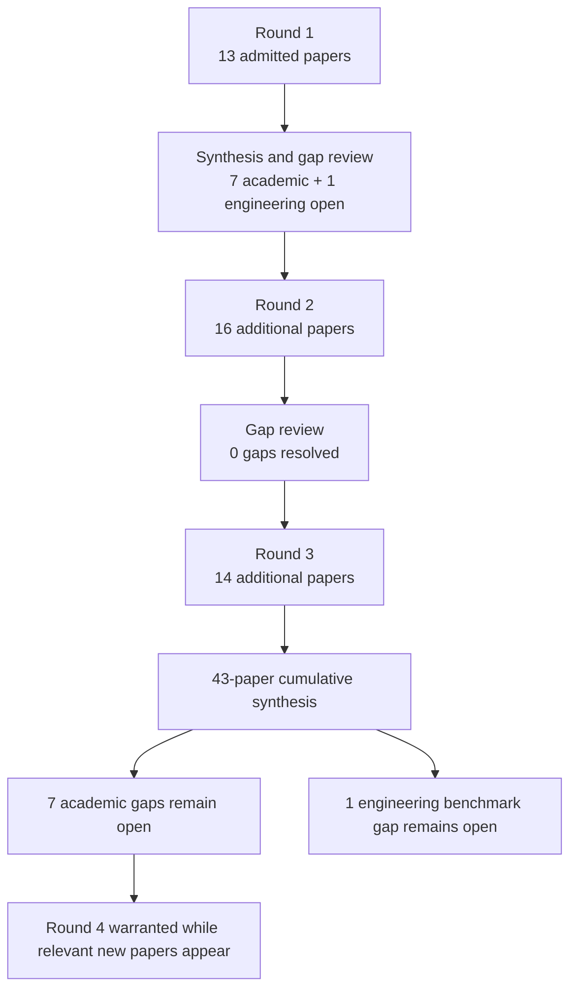

# Research Report: Incremental, Personalized and Priority-Aware Briefings from Workplace Communication

## Contents

- [Round History](#round-history)
- [Executive Summary](#executive-summary)
- [Research Question](#research-question)
- [Methodology](#methodology)
- [Papers Reviewed](#papers-reviewed)
- [Research Landscape](#research-landscape)
- [Confidence-Graded Findings](#confidence-graded-findings)
- [Research Gaps](#research-gaps)
- [Practical Recommendations](#practical-recommendations)
- [Evidence Map](#evidence-map)
- [References](#references)
- [Appendix: Run Metadata](#appendix-run-metadata)

## Round History

Iterative gap-closure loop (hard cap: 4 rounds). See
`references/iterative-synthesis.md` for the full loop definition.

| Round | Run ID | Topic / Gap Focus | New Papers | Gaps Addressed | Remaining Gaps |
|-------|--------|-------------------|------------|----------------|----------------|
| 1 | 48b3f0169bfb | incremental, personalized and priority-aware briefings from workplace communication: how accepted topic information is selected, updated, prioritized and summarized for a user over time, distinguishing new developments from still-open state without repeating superseded facts | 13 | initial shortlist | 7 academic, 1 engineering |
| 2 | 49f688a25a3f | longitudinal and cross-thread workplace briefing systems that track new, open, resolved, and superseded work-item state over repeated cycles, with adaptive user-specific prioritization, reminder value, uncertainty presentation, and omission/repetition evaluation | 16 | 0 resolved | 7 academic, 1 engineering |
| 3 | 9f57e4d7c3d9 | cycle-based cross-thread workplace briefing with explicit work-item state transitions: evidence for longitudinal new/open/resolved/superseded tracking, adaptive personalization, obligation-versus-preference prioritization, and joint omission/repetition evaluation | 14 | academic gaps of the previous round | 7 academic, 1 engineering |

**Stop reason**: another round runs while open academic gaps remain and new papers appear

## Executive Summary

[HIGH] Across 43 admitted papers spanning 1998–2026, the literature provides substantial component-level evidence for update-aware summarization, workplace task and reminder handling, personalized email prioritization, prospective-memory support, adaptive ranking, chronological evaluation, and explicit uncertainty presentation, but it does not validate their integration into one cycle-based cross-thread workplace briefing system. [doi-10-6028-nist-sp-500-302-tempsumm-overview] [manual-50ed5dc808] [2403.01365]

[HIGH] The strongest direct finding is that novelty, coverage, timeliness, redundancy, persistent task salience, and personalized importance are distinct concerns rather than interchangeable signals; a concise briefing therefore cannot safely be reduced to textual novelty or a generic priority score. [doi-10-1016-j-knosys-2013-02-015] [doi-10-1155-2016-1340973] [doi-10-1145-634067-634150] [doi-10-1093-jcmc-zmac001]

[MEDIUM] Transfer literature shows that incremental longitudinal summarization, preference-drift adaptation, temporal evaluation, decision-focused selection, and uncertainty communication are feasible mechanisms, but these results do not establish production accuracy for cross-thread Outlook/Teams work matters. [doi-10-18653-v1-2024-acl-long-390] [doi-10-64898-2025-11-28-25341233] [doi-10-1145-2523813] [2109.06896]

[LOW] The most significant unresolved question is the integrated one: the corpus has not answered whether a repeated-cycle workplace briefing can reliably preserve unchanged-but-open work, surface genuine developments, retire resolved or superseded state, obey hard user obligations before soft preferences, adapt over time, and jointly control omission, repetition, and false-alert costs.

**Scope**: 43 distinct papers analyzed from multiple publisher, repository, conference, and preprint sources; publication years 1998–2026.  
**Overall Confidence**: Medium  
**Verdict**: HAS_GAPS

## Research Question

The investigation asked how accepted Topic information in a personal workplace-information system should be selected, updated, prioritized, and summarized over successive reporting cycles so that the user sees genuine new developments while still seeing unresolved important work without repeatedly seeing stale, resolved, or superseded facts.

The in-scope questions were:

- how incremental or update summarization distinguishes novel information from persistent relevant state;
- how open requests, commitments, deadlines, reminders, and prospective information remain salient over time;
- how personalized importance and triage signals can influence ordering;
- how obligation-like signals differ from preference, predicted response, urgency, and reminder value;
- how personalization should adapt as user interests and work patterns change;
- how chronology, uncertainty, omission, redundancy, and false alerts should be evaluated;
- how transfer methods from temporal summarization, recommender systems, clinical longitudinal summarization, decision support, and prospective-memory research may inform candidate mechanisms.

The investigation did **not** treat similarity between messages as sufficient Topic identity, did not treat response likelihood as response obligation, did not assume novelty means importance, did not treat external action execution as part of the briefing problem, and did not use inherited findings from other msgloom Topics as evidence.

## Methodology

### Search Strategy

- **Sources**: the admitted papers were read through the host's web tool using arXiv, ACL Anthology, publisher sites, NIST/TREC, PMC, institutional repositories, ResearchGate, and other scholarly full-text or abstract pages recorded by the pipeline. The broader search-engine provenance was not supplied in the final synthesis and is therefore not reconstructed here.
- **Query variants**:
  - `cycle-based cross-thread workplace briefing explicit work-item state transitions: evidence longitudinal new/open/resolved/superseded tracking, adaptive personalization, obligation-versus-preference prioritization, joint omission/repetition`
  - `cycle-based cross-thread workplace`
  - `cycle-based briefing explicit work-item state transitions: evidence longitudinal new/open/resolved/superseded tracking, adaptive personalization, obligation-versus-preference prioritization, joint omission/repetition`
  - `cross-thread briefing explicit work-item state transitions: evidence longitudinal new/open/resolved/superseded tracking, adaptive personalization, obligation-versus-preference prioritization, joint omission/repetition`
  - `workplace briefing explicit work-item state transitions: evidence longitudinal new/open/resolved/superseded tracking, adaptive personalization, obligation-versus-preference prioritization, joint omission/repetition`
  - `cycle-based cross-thread workplace briefing explicit`
  - `cycle-based cross-thread workplace work-item state`
  - `cycle-based cross-thread workplace transitions: evidence`
- **Time window**: 1998–2026 based on the admitted corpus.
- **Screening**: the final corpus contains 43 distinct admitted papers. The supplied final artifacts do not specify enough detail to reconstruct candidate counts, the exact BM25/sub-agent configuration, or rejected-paper counts, so these are recorded as unknown rather than inferred.
- **Access**: 37 papers were available at `full_text` level and 6 at `abstract_only` level through the host's web tool.

### Pipeline Summary

| Metric | Count |
|--------|-------|
| Total candidates | Unknown from supplied run artifacts |
| After screening | 43 admitted cumulative papers |
| Downloaded | Unknown; access occurred through the host web tool using HTML, PDF, and publisher pages |
| Successfully converted | Unknown from supplied artifacts |
| Deeply analyzed | 43 |
| Iterations completed | 3 |
| Full-text access | 37 |
| Abstract-only access | 6 |

The final synthesis was generated from reduced per-paper analyses rather than a fresh complete-paper re-read at report-writing time. Consequently, details absent from those analyses were not reconstructed.

## Papers Reviewed

Quality scores were not supplied by the pipeline and are therefore reported as **Not scored** rather than invented. Relevance describes relationship to Topic 09: **HIGH** for direct workplace/email/task/briefing evidence and **MEDIUM** for admitted transfer mechanisms.

| # | Title | Authors | Year | Venue | Quality Score | Relevance | Access |
|---|-------|---------|------|-------|---------------|-----------|--------|
| 1 | What Did I Ask You to Do, by When, and for Whom?: Passion and Compassion in Request Management [doi-10-1145-2998181-2998251] | Michael J. Muller, Casey Dugan, Michael Brenndoerfer et al. | 2017 | Not provided | Not scored | HIGH | abstract_only |
| 2 | Agent Newsroom: Efficient Chronological Report Generation via Dynamic Multi-Agent Collaboration [doi-10-18653-v1-2026-acl-long-1149] | Zhenhua Wang, Chunlei Wang, Yue Geng et al. | 2026 | Not provided | Not scored | MEDIUM | full_text |
| 3 | The Learning Behind Gmail Priority Inbox [manual-50ed5dc808] | Authors not provided | 2010 | Not provided | Not scored | HIGH | full_text |
| 4 | Exploiting relevance, coverage, and novelty for query-focused multi-document summarization [doi-10-1016-j-knosys-2013-02-015] | Wenjuan Luo, Fuzhen Zhuang, Qing He et al. | 2013 | Not provided | Not scored | MEDIUM | full_text |
| 5 | Can requests-for-action and commitments-to-act be reliably identified in email messages? [manual-0839b98ee7] | Andrew Lampert, Cécile Paris, Robert Dale | 2007 | Not provided | Not scored | HIGH | full_text |
| 6 | Scaling up Ranking under Constraints for Live Recommendations by Replacing Optimization with Prediction [2202.07088] | Yegor Tkachenko, Wassim Dhaouadi, Kamel Jedidi | 2022 | Not provided | Not scored | MEDIUM | full_text |
| 7 | Effects of visualizing uncertainty on decision-making in a target identification scenario [doi-10-1016-j-cag-2014-02-006] | Maria Riveiro, Tove Helldin, Göran Falkman et al. | 2014 | Not provided | Not scored | MEDIUM | abstract_only |
| 8 | A survey on concept drift adaptation [doi-10-1145-2523813] | João Gama, Indrė Žliobaitė, Albert Bifet et al. | 2014 | Not provided | Not scored | MEDIUM | full_text |
| 9 | Mining Sequential Update Summarization with Hierarchical Text Analysis [doi-10-1155-2016-1340973] | Chunyun Zhang, Zhongwei Si, Zhanyu Ma | 2016 | Not provided | Not scored | MEDIUM | full_text |
| 10 | Fuzzy user-interest drift detection based recommender systems [doi-10-1109-fuzz-ieee-2016-7737835] | Authors not provided | 2016 | Not provided | Not scored | MEDIUM | abstract_only |
| 11 | Time to Split: Exploring Data Splitting Strategies for Offline Evaluation of Sequential Recommenders [doi-10-1145-3705328-3748164] | Danil Gusak, Anna Volodkevich, Anton Klenitskiy et al. | 2025 | Not provided | Not scored | MEDIUM | full_text |
| 12 | Confidence guides spontaneous cognitive offloading [doi-10-1186-s41235-019-0195-y] | Annika Boldt, Sam J. Gilbert | 2019 | Not provided | Not scored | MEDIUM | full_text |
| 13 | Supporting Prospective Information in Email [doi-10-1145-634067-634150] | Jacek Gwizdka | 2001 | Not provided | Not scored | HIGH | full_text |
| 14 | Strategic reminder setting for time-based intentions: Influence of metacognition, delay length, and cue visibility [doi-10-3758-s13421-025-01708-x] | Pei-Chun Tsai, Sam J. Gilbert | 2025 | Not provided | Not scored | MEDIUM | full_text |
| 15 | Summarize What You Are Interested In: An Optimization Framework for Interactive Personalized Summarization [manual-13a21477e7] | Rui Yan, Jian-Yun Nie, Xiaoming Li | 2011 | Not provided | Not scored | MEDIUM | full_text |
| 16 | Mining social networks for personalized email prioritization [doi-10-1145-1557019-1557124] | Shinjae Yoo, Yiming Yang, Frank Lin et al. | 2009 | Not provided | Not scored | HIGH | full_text |
| 17 | Modeling personalized email prioritization: Classification-based and regression-based approaches [doi-10-1145-2063576-2063683] | Shinjae Yoo, Yiming Yang, Jaime G. Carbonell | 2011 | Not provided | Not scored | HIGH | full_text |
| 18 | Measurement of Perceived Importance and Urgency of Email: An Employees’ Perspective [doi-10-1093-jcmc-zmac001] | Andre Lanctot, Linda Duxbury | 2022 | Not provided | Not scored | HIGH | full_text |
| 19 | Supporting Collaborative Task Management in E-mail [doi-10-1207-s15327051hci2001-2-3] | Steve Whittaker | 2005 | Not provided | Not scored | HIGH | full_text |
| 20 | Summary Cloze: A New Task for Content Selection in Topic-Focused Summarization [doi-10-18653-v1-d19-1386] | Daniel Deutsch, Dan Roth | 2019 | Not provided | Not scored | MEDIUM | full_text |
| 21 | Summarizing Emails with Conversational Cohesion and Subjectivity [manual-c2f56a571b] | Giuseppe Carenini, Raymond T. Ng, Xiaodong Zhou | 2008 | Not provided | Not scored | HIGH | full_text |
| 22 | Detecting and Summarizing Action Items in Multi-Party Dialogue [doi-10-18653-v1-2007-sigdial-1-4] | Matthew Purver, John Dowding, John Niekrasz et al. | 2007 | Not provided | Not scored | HIGH | full_text |
| 23 | Beyond “From” and “Received”: Exploring the Dynamics of Email Triage [doi-10-1145-1056808-1057071] | Carman Neustaedter, A. J. Bernheim Brush, Marc A. Smith | 2005 | Not provided | Not scored | HIGH | full_text |
| 24 | Decision-Focused Summarization [2109.06896] | Chao-Chun Hsu, Chenhao Tan | 2021 | Not provided | Not scored | MEDIUM | full_text |
| 25 | The Use of MMR, Diversity-Based Reranking for Reordering Documents and Producing Summaries [doi-10-1145-290941-291025] | Jaime G. Carbonell, Jade Goldstein | 1998 | Not provided | Not scored | MEDIUM | full_text |
| 26 | AI-Powered Reminders for Collaborative Tasks: Experiences and Futures [2403.01365] | Katelyn Morrison, Shamsi T. Iqbal, Eric Horvitz | 2024 | Not provided | Not scored | HIGH | full_text |
| 27 | EmailSum: Abstractive Email Thread Summarization [2107.14691] | Shiyue Zhang, Asli Celikyilmaz, Jianfeng Gao et al. | 2021 | Not provided | Not scored | HIGH | full_text |
| 28 | RemindMe: Plugging a Reminder Manager into Email for Enhancing Workplace Responsiveness [doi-10-1007-978-3-319-67684-5-24] | Casey Dugan, Aabhas Sharma, Michael Muller et al. | 2017 | Not provided | Not scored | HIGH | abstract_only |
| 29 | HARVEST, a longitudinal patient record summarizer [doi-10-1136-amiajnl-2014-002945] | Jamie S. Hirsch, Jessica S. Tanenbaum, Sharon Lipsky Gorman et al. | 2014 | Not provided | Not scored | MEDIUM | full_text |
| 30 | CLIN-SUMM: Incremental Longitudinal Summarization of Clinical Notes Enables Scalable Representation and Early Disease Prediction [doi-10-64898-2025-11-28-25341233] | Valentina D'Souza, Danielle F. Pace, Alaleh Azhir et al. | 2026 | Not provided | Not scored | MEDIUM | full_text |
| 31 | Communicating uncertainty about facts, numbers and science [doi-10-1098-rsos-181870] | Anne Marthe van der Bles, Sander van der Linden, Alexandra L. J. Freeman et al. | 2019 | Not provided | Not scored | MEDIUM | full_text |
| 32 | Corpus-Based Problem Selection for EHR Note Summarization [manual-1d6b22c7ad] | Tielman T. Van Vleck, Noémie Elhadad | 2010 | Not provided | Not scored | MEDIUM | full_text |
| 33 | A case study of batch and incremental recommender systems in supermarket data under concept drifts and cold start [doi-10-1016-j-eswa-2021-114890] | Antônio David Viniski, Jean Paul Barddal, Alceu de Souza Britto Jr. et al. | 2021 | Not provided | Not scored | MEDIUM | full_text |
| 34 | TREC 2013 Temporal Summarization [doi-10-6028-nist-sp-500-302-tempsumm-overview] | Javed A. Aslam, Matthew Ekstrand-Abueg, Virgil Pavlu et al. | 2013 | Not provided | Not scored | MEDIUM | full_text |
| 35 | Can You Verifi This? Studying Uncertainty and Decision-Making About Misinformation Using Visual Analytics [doi-10-1609-icwsm-v12i1-15014] | Alireza Karduni, Ryan Wesslen, Sashank Santhanam et al. | 2018 | Not provided | Not scored | MEDIUM | full_text |
| 36 | Interactive Multi-Objective Probabilistic Preference Learning with Soft and Hard Bounds [manual-4cb48c423e] | Edward Chen, Sang T. Truong, Natalie Dullerud et al. | 2026 | Not provided | Not scored | MEDIUM | full_text |
| 37 | Overview of the TAC 2008 Update Summarization Task [manual-39435af3dd] | Hoa Trang Dang, Karolina Owczarzak | 2008 | Not provided | Not scored | MEDIUM | full_text |
| 38 | Strategy-Specific Decision Making with Incomplete Information [doi-10-1177-1071181322661236] | William I.N. Sealy, Karen M. Feigh | 2022 | Not provided | Not scored | MEDIUM | abstract_only |
| 39 | Prospective memory: when reminders fail [doi-10-3758-bf03201140] | Melissa J. Guynn, Mark A. McDaniel, Gilles O. Einstein | 1998 | Not provided | Not scored | MEDIUM | full_text |
| 40 | Taking Email to Task: The Design and Evaluation of a Task Management Centered Email Tool [doi-10-1145-642611-642672] | Victoria Bellotti, Nicolas Ducheneaut, Mark Howard et al. | 2003 | Not provided | Not scored | HIGH | full_text |
| 41 | How important is importance for prospective memory? A review [doi-10-3389-fpsyg-2014-00657] | Stefan Walter, Beat Meier | 2014 | Not provided | Not scored | MEDIUM | full_text |
| 42 | From Moments to Milestones: Incremental Timeline Summarization Leveraging Large Language Models [doi-10-18653-v1-2024-acl-long-390] | Qisheng Hu, Geonsik Moon, Hwee Tou Ng | 2024 | Not provided | Not scored | MEDIUM | full_text |
| 43 | A novel temporal recommender system based on multiple transitions in user preference drift and topic review evolution [doi-10-1016-j-eswa-2021-115626] | Charinya Wangwatcharakul, Sartra Wongthanavasu | 2021 | Not provided | Not scored | MEDIUM | abstract_only |

## Research Landscape

### Theme 1: Incremental Selection Requires More Than Novelty

**Coverage**: 7+ papers | **Confidence**: High  
**Supporting papers**: [doi-10-6028-nist-sp-500-302-tempsumm-overview], [doi-10-1155-2016-1340973], [doi-10-1016-j-knosys-2013-02-015], [doi-10-1145-290941-291025], [manual-39435af3dd], [doi-10-18653-v1-2024-acl-long-390]

[HIGH] Update and temporal summarization consistently decompose the briefing-like problem into partially competing objectives such as relevance, information gain, novelty, coverage, timeliness, and redundancy. This is directly relevant to msgloom's distinction between “new” and “worth showing”: suppressing textual redundancy can improve compactness, but it does not establish that unchanged open work may safely disappear. [doi-10-6028-nist-sp-500-302-tempsumm-overview] [doi-10-1016-j-knosys-2013-02-015] [doi-10-1145-290941-291025]

[HIGH] Temporal summarization benchmarks also reveal a recurring tension between concise high-gain updates and comprehensive coverage, which supports treating briefing compression as constrained selection rather than unrestricted shortening. [doi-10-6028-nist-sp-500-302-tempsumm-overview] [manual-39435af3dd]

[MEDIUM] Incremental timeline and longitudinal summarization systems demonstrate that persistent histories can be updated as new evidence arrives, but these systems do not establish the required workplace work-item lifecycle semantics. [doi-10-18653-v1-2024-acl-long-390] [doi-10-64898-2025-11-28-25341233] [doi-10-1136-amiajnl-2014-002945]

Key findings:

1. [HIGH] Novelty, coverage, timeliness, and redundancy are distinct selection objectives rather than one interchangeable score. [doi-10-6028-nist-sp-500-302-tempsumm-overview] [doi-10-1016-j-knosys-2013-02-015] [doi-10-1155-2016-1340973]
2. [HIGH] Automatic update-summarization evaluation does not guarantee that concise output preserves every decision-relevant item. [manual-39435af3dd] [doi-10-6028-nist-sp-500-302-tempsumm-overview]
3. [MEDIUM] Incremental summarization mechanisms are technically plausible across longitudinal domains, but direct workplace cross-thread validation remains absent. [doi-10-18653-v1-2024-acl-long-390] [doi-10-64898-2025-11-28-25341233]

### Theme 2: Persistent Work and Reminder Value

**Coverage**: 10+ papers | **Confidence**: High  
**Supporting papers**: [doi-10-1145-634067-634150], [doi-10-1145-642611-642672], [2403.01365], [doi-10-1007-978-3-319-67684-5-24], [doi-10-3758-bf03201140], [doi-10-3758-s13421-025-01708-x], [doi-10-1186-s41235-019-0195-y], [doi-10-3389-fpsyg-2014-00657]

[HIGH] Workplace email research shows that users retain, revisit, and organize messages partly because email carries prospective work, and task-centered or reminder-oriented tools exist specifically because future actions must remain salient after the originating message ceases to be novel. [doi-10-1145-634067-634150] [doi-10-1145-642611-642672] [doi-10-1207-s15327051hci2001-2-3]

[HIGH] An AI-generated collaborative-task reminder study additionally reports stale or insufficiently current task state as a material practical problem, reinforcing that persistence without lifecycle updating can become harmful rather than helpful. [2403.01365]

[HIGH] Prospective-memory studies show that reminder value depends on factors beyond conventional urgency or importance, including confidence, delay, cue visibility, and cue properties. [doi-10-3758-bf03201140] [doi-10-3758-s13421-025-01708-x] [doi-10-1186-s41235-019-0195-y] [doi-10-3389-fpsyg-2014-00657]

Key findings:

1. [HIGH] Unchanged information can retain decision value when it corresponds to unresolved future work. [doi-10-1145-634067-634150] [doi-10-1145-642611-642672]
2. [HIGH] Reminder usefulness cannot be inferred solely from urgency or perceived importance. [2403.01365] [doi-10-3758-s13421-025-01708-x] [doi-10-1186-s41235-019-0195-y]
3. [HIGH] Stale task state is itself a user-facing failure mode, so persistence requires current-state control. [2403.01365]

### Theme 3: Personalization Is Useful but Distinct from Obligation

**Coverage**: 9+ papers | **Confidence**: High  
**Supporting papers**: [manual-50ed5dc808], [doi-10-1145-1557019-1557124], [doi-10-1145-2063576-2063683], [doi-10-1145-1056808-1057071], [doi-10-1093-jcmc-zmac001], [manual-0839b98ee7], [manual-13a21477e7]

[HIGH] Personalized email-priority models repeatedly outperform less-personalized alternatives in the studied settings, while email triage practices and perceived importance vary substantially between people and contexts. [manual-50ed5dc808] [doi-10-1145-1557019-1557124] [doi-10-1145-2063576-2063683] [doi-10-1145-1056808-1057071]

[HIGH] The evidence does not justify collapsing personalized importance into obligation. Request/commitment identification, perceived importance, and priority prediction are studied as separate constructs; requests-for-action can be annotated relatively reliably, while commitments are harder, and importance models address a different target. [manual-0839b98ee7] [doi-10-1093-jcmc-zmac001] [manual-50ed5dc808]

[MEDIUM] Interactive personalized summarization and multi-objective preference-learning methods provide candidate mechanisms for softer user preference, but they do not establish how hard workplace rules should override those preferences. [manual-13a21477e7] [manual-4cb48c423e]

Key findings:

1. [HIGH] Personalized prioritization is empirically useful in email but is user- and context-dependent. [manual-50ed5dc808] [doi-10-1145-1557019-1557124] [doi-10-1145-2063576-2063683]
2. [HIGH] Response/action evidence and personalized importance evidence are different signal families. [manual-0839b98ee7] [doi-10-1093-jcmc-zmac001]
3. [LOW] No admitted paper establishes the correct arbitration policy between explicit user rules, response obligation, importance, reminder value, and learned preferences.

### Theme 4: Adaptation and Chronological Evaluation

**Coverage**: 7+ papers | **Confidence**: Medium  
**Supporting papers**: [doi-10-1145-2523813], [doi-10-1016-j-eswa-2021-114890], [doi-10-1016-j-eswa-2021-115626], [doi-10-1109-fuzz-ieee-2016-7737835], [doi-10-1145-3705328-3748164], [2202.07088]

[MEDIUM] Drift-aware and continually updated recommender models demonstrate that preferences can change sufficiently to make static models suboptimal, and that adaptation mechanisms can outperform batch or static counterparts under some datasets and drift conditions. [doi-10-1145-2523813] [doi-10-1016-j-eswa-2021-114890] [doi-10-1016-j-eswa-2021-115626]

[MEDIUM] Sequential-system evaluation is sensitive to temporal splitting and target construction; different chronological protocols can materially change measured performance or model ordering. [doi-10-1145-3705328-3748164] [doi-10-1016-j-eswa-2021-114890]

[LOW] The admitted workplace-email literature does not directly measure adaptation across long-term changes in role, project portfolio, explicit corrections, working relationships, or personal thresholds.

Key findings:

1. [MEDIUM] Static personalization should not be assumed stable indefinitely. [doi-10-1145-2523813] [doi-10-1016-j-eswa-2021-114890]
2. [MEDIUM] Chronological holdout design is a substantive evaluation choice, not a bookkeeping detail. [doi-10-1145-3705328-3748164]
3. [LOW] Transfer-domain drift results do not establish production workplace adaptation accuracy.

### Theme 5: Evaluation Must Measure Decision Value, Not Only Text Similarity

**Coverage**: 10+ papers | **Confidence**: High  
**Supporting papers**: [2107.14691], [manual-13a21477e7], [manual-39435af3dd], [2109.06896], [doi-10-1177-1071181322661236], [doi-10-18653-v1-d19-1386]

[HIGH] Automatic summarization metrics alone do not consistently track human preference or update-summary quality. EmailSum reports that metric gains do not straightforwardly imply user-preference gains; personalized summarization can obtain stronger user judgments without dominating generic ROUGE; and TAC update evaluation found automatic metrics unable to reproduce some clear manual distinctions. [2107.14691] [manual-13a21477e7] [manual-39435af3dd]

[MEDIUM] Decision-focused summarization provides evidence that content selection can be optimized toward preservation of a downstream decision instead of generic textual similarity, while experiments with incomplete information show that both the quantity and structure of missing information can alter decisions. [2109.06896] [doi-10-1177-1071181322661236]

[LOW] No admitted study supplies an end-to-end repeated-cycle workplace metric jointly accounting for essential omission, unresolved-state omission, redundant repetition, false alerts, and inappropriate persistence of resolved/superseded state.

Key findings:

1. [HIGH] ROUGE-like similarity cannot serve as the only acceptance criterion for Topic 09. [2107.14691] [manual-13a21477e7] [manual-39435af3dd]
2. [MEDIUM] Decision-preservation objectives are a plausible complement to text quality metrics. [2109.06896] [doi-10-1177-1071181322661236]
3. [LOW] The required joint briefing-loss function remains unvalidated in the literature.

### Theme 6: Uncertainty and Incomplete State Need Explicit Presentation

**Coverage**: 4+ papers | **Confidence**: Medium  
**Supporting papers**: [doi-10-1016-j-cag-2014-02-006], [doi-10-1098-rsos-181870], [doi-10-1609-icwsm-v12i1-15014], [2403.01365]

[MEDIUM] Transfer decision-support evidence shows that communicating uncertainty can change decision processes or willingness to act, but effects depend on presentation and context and do not universally improve task accuracy. [doi-10-1016-j-cag-2014-02-006] [doi-10-1609-icwsm-v12i1-15014]

[MEDIUM] Broader uncertainty-communication evidence does not support a simple assumption that acknowledging epistemic uncertainty necessarily destroys trust. [doi-10-1098-rsos-181870]

[LOW] No admitted workplace experiment establishes how stale, disputed, uncertain, or incompletely investigated work-item state should be rendered in a recurring briefing.

Key findings:

1. [MEDIUM] Uncertainty presentation affects users, but its effect is context-dependent. [doi-10-1016-j-cag-2014-02-006] [doi-10-1098-rsos-181870]
2. [LOW] The appropriate workplace briefing representation for disputed or stale state remains unanswered.

## Methodology Comparison

| Approach | Papers | Strengths | Weaknesses | Best For | Performance |
|----------|--------|-----------|------------|----------|-------------|
| Update / temporal summarization | [doi-10-6028-nist-sp-500-302-tempsumm-overview], [manual-39435af3dd], [doi-10-1155-2016-1340973], [doi-10-1016-j-knosys-2013-02-015] | Explicit novelty, gain, coverage, redundancy, and temporal objectives | Does not preserve unchanged open workplace obligations by definition | Selecting new developments and limiting repetition | [HIGH] Established component-level trade-offs; no integrated workplace result |
| Diversity/redundancy reranking | [doi-10-1145-290941-291025] | Simple mechanism for balancing relevance and redundancy | Novelty suppression can remove still-important repeated state | Candidate-level redundancy control | [MEDIUM] Useful mechanism; insufficient as briefing policy |
| Email task/reminder support | [doi-10-1145-634067-634150], [doi-10-1145-642611-642672], [2403.01365], [doi-10-1007-978-3-319-67684-5-24] | Direct workplace evidence that future work requires persistence | State can become stale; limited cross-thread lifecycle evaluation | Carry-forward of unresolved work | [HIGH] Strong qualitative/product evidence |
| Personalized email prioritization | [manual-50ed5dc808], [doi-10-1145-1557019-1557124], [doi-10-1145-2063576-2063683] | User-specific ranking improves over less-personalized alternatives in studied settings | Priority is not obligation; long-term drift under-studied | Soft ordering and attention allocation | [HIGH] Consistent component-level benefit, dataset/user dependent |
| Request/action extraction | [manual-0839b98ee7], [doi-10-18653-v1-2007-sigdial-1-4] | Separates actionable content from generic importance | Commitments harder; extraction does not decide persistence policy | Obligation/action signals | [HIGH] Direct evidence for distinct action signal family |
| Drift adaptation | [doi-10-1145-2523813], [doi-10-1016-j-eswa-2021-114890], [doi-10-1016-j-eswa-2021-115626], [doi-10-1109-fuzz-ieee-2016-7737835] | Models changing user preferences over time | Mostly recommender transfer evidence | Adaptive soft personalization | [MEDIUM] Gains observed in transfer domains |
| Incremental longitudinal summarization | [doi-10-1136-amiajnl-2014-002945], [doi-10-64898-2025-11-28-25341233], [doi-10-18653-v1-2024-acl-long-390] | Maintains evolving histories rather than isolated documents | Clinical/news semantics differ from workplace work-item lifecycle | Candidate architecture for persistent Topic summaries | [MEDIUM] Feasible in transfer settings |
| Decision-focused selection | [2109.06896], [doi-10-1177-1071181322661236] | Optimizes preservation of downstream decision information | Downstream objective may not capture all workplace obligations | Evaluating decision-essential content | [MEDIUM] Promising transfer mechanism |
| Uncertainty visualization | [doi-10-1016-j-cag-2014-02-006], [doi-10-1098-rsos-181870], [doi-10-1609-icwsm-v12i1-15014] | Makes evidence limitations explicit | Effects depend on user/task/presentation | Pending, disputed, stale, incomplete state | [MEDIUM] Context-dependent effects |
| Prospective-memory models | [doi-10-3758-bf03201140], [doi-10-3758-s13421-025-01708-x], [doi-10-1186-s41235-019-0195-y], [doi-10-3389-fpsyg-2014-00657] | Explains why reminder value differs from conventional priority | Laboratory/cognitive evidence does not yield a workplace ranking policy | Reminder-value feature design | [MEDIUM] Strong mechanism evidence, indirect system evidence |

For engineering evaluation, the synthesis supports keeping error dimensions separate. A proposed, **not literature-validated**, cycle-level loss is:

$L_t = w_e O^{essential}_t + w_o O^{open}_t + w_r R_t + w_f F_t + w_s S^{stale}_t$

where $O^{essential}$ is omitted decision-essential content, $O^{open}$ is omitted unresolved state, $R$ is redundant repetition, $F$ is false-alert/over-reporting cost, and $S^{stale}$ is inappropriate stale/resolved/superseded carry-forward. The weights $w_*$ are product choices and should not be claimed as empirically established by this corpus.

## Confidence-Graded Findings

### 🟢 High Confidence (supported by 3+ papers with consistent results)

1. **[HIGH] Novelty, coverage, timeliness, and redundancy are distinct objectives in incremental summarization.** — Supported by [doi-10-6028-nist-sp-500-302-tempsumm-overview], [doi-10-1155-2016-1340973], [doi-10-1016-j-knosys-2013-02-015], and [doi-10-1145-290941-291025]. The literature consistently treats them separately rather than as one generic quality dimension.

2. **[HIGH] Unchanged future work can remain salient even when no new message development exists.** — Supported by [doi-10-1145-634067-634150], [doi-10-1145-642611-642672], and [2403.01365]. Workplace users maintain prospective information and reminders precisely because action value persists beyond novelty.

3. **[HIGH] Personalized email-priority models provide useful user-specific signal, but priorities vary substantially by user and context.** — Supported by [manual-50ed5dc808], [doi-10-1145-1557019-1557124], [doi-10-1145-2063576-2063683], and [doi-10-1145-1056808-1057071].

4. **[HIGH] Action/obligation-like evidence is not equivalent to perceived or predicted importance.** — Supported by [manual-0839b98ee7], [doi-10-1093-jcmc-zmac001], and [manual-50ed5dc808]. Requests and commitments constitute different annotation/prediction targets from importance.

5. **[HIGH] Reminder usefulness is not reducible to urgency or conventional importance.** — Supported by [2403.01365], [doi-10-3758-bf03201140], [doi-10-3758-s13421-025-01708-x], [doi-10-1186-s41235-019-0195-y], and [doi-10-3389-fpsyg-2014-00657].

6. **[HIGH] Similarity-based summarization metrics alone are insufficient evidence that decision-relevant update content is preserved.** — Supported by [2107.14691], [manual-13a21477e7], and [manual-39435af3dd].

### 🟡 Medium Confidence (supported by transfer studies or with substantial caveats)

1. **[MEDIUM] Continual and drift-aware adaptation is preferable to assuming permanently stable user preferences when preferences actually change.** — Supported by transfer evidence from [doi-10-1145-2523813], [doi-10-1016-j-eswa-2021-114890], [doi-10-1016-j-eswa-2021-115626], and [doi-10-1109-fuzz-ieee-2016-7737835]. The caveat is that these are principally recommender-system results.

2. **[MEDIUM] Incremental longitudinal summaries can preserve evolving histories and temporal organization while compressing accumulated information.** — Supported by [doi-10-1136-amiajnl-2014-002945], [doi-10-64898-2025-11-28-25341233], and [doi-10-18653-v1-2024-acl-long-390]. The domains are clinical and news/event timelines rather than workplace work items.

3. **[MEDIUM] Chronological evaluation choices can materially affect sequential-system conclusions.** — Supported by [doi-10-1145-3705328-3748164] and [doi-10-1016-j-eswa-2021-114890].

4. **[MEDIUM] Decision-focused content-selection objectives are promising for testing whether summaries preserve actionable information.** — Supported by [2109.06896] and [doi-10-1177-1071181322661236].

5. **[MEDIUM] Explicit uncertainty presentation can change decision behavior without having a uniform positive or negative effect.** — Supported by [doi-10-1016-j-cag-2014-02-006], [doi-10-1098-rsos-181870], and [doi-10-1609-icwsm-v12i1-15014].

### 🔴 Low Confidence (preliminary, indirect, or unvalidated end-to-end)

1. **[LOW] A single integrated policy can successfully combine new/open/resolved/superseded lifecycle state, obligation, preference, reminder value, and adaptive personalization.** — No admitted paper evaluates this complete combination; the literature has not answered it yet.

2. **[LOW] Cross-thread, multi-source workplace work items can be incrementally briefed with acceptable omission and repetition rates.** — Direct email summarization is primarily thread-level [2107.14691] [manual-c2f56a571b], while multi-cycle incremental evidence is largely transfer-domain [doi-10-18653-v1-2024-acl-long-390] [doi-10-64898-2025-11-28-25341233].

3. **[LOW] One optimal presentation exists for stale, disputed, uncertain, and incompletely investigated work-item state.** — No admitted workplace briefing experiment establishes this.

## Trade-Off Analysis

| Decision | Option A | Option B | Recommendation |
|----------|----------|----------|----------------|
| Novelty handling | Show only changed information; maximizes compactness but can hide persistent open work | Carry all unresolved information; safer coverage but can create repetition fatigue | [HIGH] Maintain separate `changed` and `still-open` classes, with different rendering/compression rules. [doi-10-6028-nist-sp-500-302-tempsumm-overview] [doi-10-1145-634067-634150] |
| Priority policy | One learned importance score | Hard obligation/rule layer plus softer personalized ranking | [HIGH] Keep obligation/rules structurally separate from preference signals until evaluated. [manual-0839b98ee7] [manual-50ed5dc808] [doi-10-1093-jcmc-zmac001] |
| Reminder selection | Rank by urgency/importance only | Include forgetting/reminder-value features | [MEDIUM] Evaluate both; prospective-memory evidence shows reminder utility is not equivalent to urgency. [doi-10-3758-s13421-025-01708-x] [doi-10-1186-s41235-019-0195-y] |
| Personalization | Static user model | Continually adapted user model | [MEDIUM] Test both chronologically; transfer evidence favors adaptation under drift but workplace evidence is missing. [doi-10-1145-2523813] [doi-10-1016-j-eswa-2021-114890] |
| Summary evaluation | ROUGE/similarity-centered | Decision-essential omission + repetition + false-alert + human utility scorecard | [HIGH] Use the multi-objective scorecard; similarity-only evaluation misses important distinctions. [2107.14691] [manual-39435af3dd] [2109.06896] |
| Uncertainty | Hide uncertainty to simplify report | Surface stale/disputed/incomplete status explicitly | [MEDIUM] Test explicit status conditions; transfer evidence does not justify silently collapsing uncertainty. [doi-10-1098-rsos-181870] [doi-10-1016-j-cag-2014-02-006] |
| Temporal evaluation | Random/offline split | Strict chronological report-cycle split | [MEDIUM] Prefer chronological holdouts for the main longitudinal benchmark. [doi-10-1145-3705328-3748164] [doi-10-1016-j-eswa-2021-114890] |

## Points of Agreement **[EVIDENCE REQUIRED]**

1. **[HIGH] Incremental summarization must explicitly control both information gain and redundancy rather than optimizing generic relevance alone.** — Confirmed by [doi-10-6028-nist-sp-500-302-tempsumm-overview], [doi-10-1155-2016-1340973], [doi-10-1016-j-knosys-2013-02-015], and [doi-10-1145-290941-291025].

2. **[HIGH] Workplace communication contains persistent prospective work that cannot safely be discarded merely because its source message is old.** — Confirmed by [doi-10-1145-634067-634150], [doi-10-1145-642611-642672], and [doi-10-1207-s15327051hci2001-2-3].

3. **[HIGH] Personalization matters for email prioritization, but users differ in what they consider important and how they triage.** — Confirmed by [manual-50ed5dc808], [doi-10-1145-1557019-1557124], [doi-10-1145-2063576-2063683], and [doi-10-1145-1056808-1057071].

4. **[HIGH] Importance/priority and explicit action/request evidence should not be assumed to denote the same thing.** — Supported by [manual-0839b98ee7], [doi-10-1093-jcmc-zmac001], and [manual-50ed5dc808].

5. **[HIGH] Generic automatic summary scores are inadequate as the sole evaluation target for an incremental briefing.** — Confirmed by [2107.14691], [manual-13a21477e7], and [manual-39435af3dd].

6. **[MEDIUM] Longitudinal systems require temporally valid evaluation, because drift and split protocol can change observed effectiveness.** — Supported by [doi-10-1145-3705328-3748164], [doi-10-1016-j-eswa-2021-114890], and [doi-10-1145-2523813].

## Points of Contradiction **[EVIDENCE REQUIRED]**

No qualifying direct contradiction was identified in the admitted corpus.

[MEDIUM] This does **not** mean that all studies report uniform effects. Personalization benefits, drift-adaptation gains, summary-metric behavior, and uncertainty effects vary by dataset, task, metric, and presentation. These differences arise under non-comparable experimental conditions and therefore were not classified as direct contradictions. [doi-10-1016-j-eswa-2021-114890] [doi-10-1016-j-eswa-2021-115626] [manual-50ed5dc808] [doi-10-1016-j-cag-2014-02-006] [doi-10-1098-rsos-181870]

## Research Gaps

All eight gaps below remain **open**. None is accepted as solved. The literature has not yet answered the seven academic gaps, and the engineering benchmark has not yet been executed.

| # | Gap | Type | Severity | Rounds Already Searched | Impact on Goals |
|---|-----|------|----------|-------------------------|-----------------|
| 1 | Successive-cycle briefing that distinguishes new change, unchanged-open work, resolved state, and superseded state | [ACADEMIC] | HIGH | 1, 2, 3 | Core longitudinal report contract remains unvalidated |
| 2 | Interaction between explicit user rules/response obligations and softer importance, preference, triage, reminder, or forgetting signals | [ACADEMIC] | HIGH | 1, 2, 3 | Cannot justify a combined ranking policy |
| 3 | Long-term adaptation to changing roles, projects, priorities, feedback, and work patterns | [ACADEMIC] | HIGH | 1, 2, 3 | Static personalization may become stale without known correction strategy |
| 4 | End-to-end repeated-cycle evaluation jointly measuring essential omission, unresolved-state omission, repetition, false alerts, and preserved open state | [ACADEMIC] | HIGH | 1, 2, 3 | Main safety/utility objective lacks direct benchmark evidence |
| 5 | Combined reminder-selection function over forgetting risk, importance, urgency, recency, and personalized priority | [ACADEMIC] | MEDIUM | 1, 2, 3 | Reminder value cannot yet be operationalized confidently |
| 6 | Topic/work-item-level incremental briefing across multiple workplace conversations and sources | [ACADEMIC] | HIGH | 1, 2, 3 | Direct evidence remains thread-level or transfer-domain |
| 7 | Presentation of stale, uncertain, disputed, and incompletely investigated workplace state | [ACADEMIC] | HIGH | 1, 2, 3 | User-facing treatment of unresolved evidence remains unvalidated |
| 8 | One reproducible cycle benchmark with chronological holdouts, independently labeled lifecycle state, personalized priority labels, and explicit omission/repetition accounting | [ENGINEERING] | HIGH | 1, 2 | Candidate mechanisms cannot yet be compared on the actual product objective |

### Academic Gaps (require more papers)

1. **[ACADEMIC] [HIGH] Gap 1 — Longitudinal lifecycle briefing**: The literature has not answered whether a workplace briefing can repeatedly distinguish newly changed information from unchanged-but-open work while suppressing resolved or superseded information. Incremental news, clinical, and reminder studies cover pieces of the problem but not the requested combination. [2403.01365] [doi-10-18653-v1-2024-acl-long-390] [doi-10-64898-2025-11-28-25341233] [doi-10-6028-nist-sp-500-302-tempsumm-overview]  
   **Rounds searched**: 1, 2, 3.  
   **Suggested query**: `"incremental summarization" longitudinal workplace email briefing "open" resolved superseded state`

2. **[ACADEMIC] [HIGH] Gap 2 — Obligation versus preference arbitration**: The literature has not answered how explicit rules or response obligations should interact with softer personalized importance, triage, reminder-value, or forgetting signals, nor whether keeping these classes separate improves outcomes. [manual-0839b98ee7] [doi-10-1093-jcmc-zmac001] [manual-50ed5dc808] [2403.01365]  
   **Rounds searched**: 1, 2, 3.  
   **Suggested query**: `"email prioritization" "response obligation" hard constraints soft preferences personalized triage reminder`

3. **[ACADEMIC] [HIGH] Gap 3 — Long-term workplace personalization drift**: The literature has not answered how a personalized workplace briefing should adapt across changing roles, projects, relationships, explicit feedback, work patterns, or personal thresholds. Existing adaptation evidence is predominantly transfer-domain. [doi-10-1016-j-eswa-2021-114890] [doi-10-1016-j-eswa-2021-115626] [doi-10-1145-2523813] [manual-50ed5dc808]  
   **Rounds searched**: 1, 2, 3.  
   **Suggested query**: `"longitudinal personalization" workplace email preference drift adaptive prioritization user feedback`

4. **[ACADEMIC] [HIGH] Gap 4 — Joint omission/repetition evaluation**: The literature has not answered how to evaluate repeated-cycle workplace briefing with one protocol that jointly measures decision-essential omissions, unresolved-state omissions, redundant repetitions, false alerts, and preserved open state. [doi-10-6028-nist-sp-500-302-tempsumm-overview] [doi-10-1155-2016-1340973] [manual-39435af3dd] [2107.14691]  
   **Rounds searched**: 1, 2, 3.  
   **Suggested query**: `"longitudinal summarization" omission redundancy false alerts unresolved state evaluation`

5. **[ACADEMIC] [MEDIUM] Gap 5 — Reminder value versus importance/urgency/recency**: The literature has not determined a briefing-selection function combining forgetting likelihood or reminder usefulness with importance, urgency, recency, and personalized priority. [2403.01365] [doi-10-3758-s13421-025-01708-x] [doi-10-1186-s41235-019-0195-y] [doi-10-1093-jcmc-zmac001]  
   **Rounds searched**: 1, 2, 3.  
   **Suggested query**: `"email reminder" forgetting importance urgency recency personalized priority task selection`

6. **[ACADEMIC] [HIGH] Gap 6 — Cross-thread/multi-source work-item briefing**: The literature has not answered how to incrementally brief a stable work item spanning multiple workplace conversations and sources. Direct email summarization remains primarily thread-level, and incremental evidence comes from other domains. [2107.14691] [manual-c2f56a571b] [doi-10-18653-v1-2024-acl-long-390] [doi-10-64898-2025-11-28-25341233]  
   **Rounds searched**: 1, 2, 3.  
   **Suggested query**: `"cross-thread summarization" email multi-source incremental "work item" workplace`

7. **[ACADEMIC] [HIGH] Gap 7 — Stale, disputed, uncertain, and incomplete state presentation**: The literature has not experimentally established how recurring workplace briefings should present stale, uncertain, disputed, or incompletely investigated work-item state, nor how presentation alternatives affect decisions. [2403.01365] [doi-10-1016-j-cag-2014-02-006] [doi-10-1098-rsos-181870] [doi-10-1609-icwsm-v12i1-15014]  
   **Rounds searched**: 1, 2, 3.  
   **Suggested query**: `"uncertainty visualization" workplace decision support stale disputed incomplete information briefing`

### Engineering Gaps (fillable without papers)

1. **[ENGINEERING] [HIGH] Gap 8 — Cycle-based benchmark**: No reproducible benchmark has yet compared the candidate mechanisms under chronological holdouts with independently labeled `new`, `open`, `resolved`, and `superseded` state, user-specific priority labels, and explicit omission/repetition accounting. The literature has not supplied this integrated benchmark. [doi-10-6028-nist-sp-500-302-tempsumm-overview] [doi-10-1145-3705328-3748164] [manual-50ed5dc808] [manual-39435af3dd]  
   **Rounds searched**: 1, 2.  
   **Suggested resolution**: construct an independent, cycle-ordered evaluation corpus; structurally separate prediction-time evidence from later gold evidence; label lifecycle state, obligations/rules, soft preferences, and reminder-value features independently; score essential omissions, unresolved-state omissions, repetitions, stale-state carry-forward, and false alerts separately; add mutation/regression tests and fresh independent review.

## Reproducibility Notes

The supplied per-paper analyses did not consistently record code repositories, dataset availability, or licenses. These fields are therefore not inferred.

| Paper | Code Available | Data Available | Sufficient Detail | License |
|-------|---------------|----------------|-------------------|---------|
| [doi-10-6028-nist-sp-500-302-tempsumm-overview] | Unknown from supplied analysis | Unknown from supplied analysis | ⚠️ Benchmark methodology available in full text; implementation detail not reassessed here | Unknown |
| [manual-39435af3dd] | Unknown | Unknown | ⚠️ Evaluation overview available in full text | Unknown |
| [manual-50ed5dc808] | Unknown | Unknown | ⚠️ Full text available; reproducibility package not assessed | Unknown |
| [doi-10-1145-3705328-3748164] | Unknown | Unknown | ⚠️ Full text available; artifacts not assessed | Unknown |
| [doi-10-1016-j-eswa-2021-114890] | Unknown | Unknown | ⚠️ Full text available; artifacts not assessed | Unknown |
| [2107.14691] | Unknown | Unknown | ⚠️ Full text available; artifacts not assessed | Unknown |
| [2109.06896] | Unknown | Unknown | ⚠️ Full text available; artifacts not assessed | Unknown |
| [doi-10-18653-v1-2024-acl-long-390] | Unknown | Unknown | ⚠️ Full text available; artifacts not assessed | Unknown |
| [2403.01365] | Unknown | Unknown | ⚠️ Full text available; artifacts not assessed | Unknown |

For Topic 09 itself, reproducibility should require chronological fixture generation, immutable gold labels, deterministic evaluation code, explicit versioning of accepted prior Topic state, and regression tests that prevent future-cycle evidence from leaking into earlier-cycle predictions.

## Practical Recommendations **[EVIDENCE REQUIRED]**

1. **[MEDIUM] Represent briefing generation as comparison against the user's prior accepted Topic view, not as summarization of the latest message batch.** — Update/temporal summarization and longitudinal systems support explicit change-oriented processing, while workplace reminder studies show why unchanged open state must remain available. [doi-10-6028-nist-sp-500-302-tempsumm-overview] [doi-10-18653-v1-2024-acl-long-390] [doi-10-1145-634067-634150]  
   *Confidence*: Medium, because the integrated workplace design remains untested.

2. **[MEDIUM] Maintain distinct candidate classes for `new/changed`, `still open`, `resolved`, and `superseded`, and evaluate each separately.** — Temporal summarization supplies novelty/redundancy mechanisms, while workplace reminder evidence shows that merely old information can still require attention. [doi-10-6028-nist-sp-500-302-tempsumm-overview] [2403.01365]  
   *Confidence*: Medium.

3. **[HIGH] Keep explicit user rules and obligation/action signals separate from softer importance, urgency, preference, predicted-response, and reminder-value signals.** — These constructs are studied separately, and the corpus supplies no evidence that they are interchangeable. [manual-0839b98ee7] [doi-10-1093-jcmc-zmac001] [manual-50ed5dc808]  
   *Confidence*: High for separation; low for any specific arbitration algorithm.

4. **[MEDIUM] Treat personalization as adaptive state rather than a permanently fixed profile, but validate adaptation chronologically before deployment.** — Drift literature supports adaptive mechanisms when preferences change, while sequential evaluation research shows that temporal protocol affects conclusions. [doi-10-1145-2523813] [doi-10-1016-j-eswa-2021-114890] [doi-10-1145-3705328-3748164]  
   *Confidence*: Medium because direct workplace longitudinal evidence is missing.

5. **[HIGH] Do not optimize Topic 09 solely against ROUGE or another summary-similarity aggregate.** — Multiple summarization studies show that automatic scores can diverge from human preference or update distinctions. [2107.14691] [manual-13a21477e7] [manual-39435af3dd]  
   *Confidence*: High.

6. **[MEDIUM] Build a multi-objective scorecard with separate counts for decision-essential omission, unresolved-state omission, redundant repetition, false alerts, stale-state persistence, and useful compression.** — This follows directly from the distinct objectives observed in temporal summarization and the shortcomings of text-similarity-only evaluation. [doi-10-6028-nist-sp-500-302-tempsumm-overview] [manual-39435af3dd] [2109.06896]  
   *Confidence*: Medium because the exact scorecard is an engineering synthesis, not a validated published metric.

7. **[MEDIUM] Include low-urgency or low-conventional-importance open items in reminder experiments instead of testing only highly ranked tasks.** — Prospective-memory and workplace reminder evidence indicates that forgetting risk and conventional importance are not the same signal. [2403.01365] [doi-10-3758-s13421-025-01708-x] [doi-10-1186-s41235-019-0195-y]  
   *Confidence*: Medium.

8. **[MEDIUM] Expose stale, disputed, uncertain, and incompletely investigated state as explicit experimental presentation conditions.** — Transfer uncertainty literature shows presentation can change decision behavior, while workplace reminder evidence identifies stale state as problematic. [doi-10-1016-j-cag-2014-02-006] [doi-10-1098-rsos-181870] [2403.01365]  
   *Confidence*: Medium.

9. **[HIGH] Use strict chronological evaluation fixtures and prevent future-cycle evidence from entering prediction inputs.** — Sequential recommender research demonstrates sensitivity to temporal split design. [doi-10-1145-3705328-3748164] [doi-10-1016-j-eswa-2021-114890]  
   *Confidence*: High as an evaluation principle; workplace-specific effect size remains unknown.

10. **[MEDIUM] Preserve traceability from each selected briefing item to the corresponding work-item state and source evidence.** — Longitudinal systems and decision-focused evaluation make temporal/source linkage useful for auditing what was retained or removed, although no admitted paper validates the complete msgloom lineage design. [doi-10-1136-amiajnl-2014-002945] [2109.06896]  
    *Confidence*: Medium.

## Future Directions

1. [ACADEMIC] Directly evaluate repeated workplace report cycles with independently annotated `new`, `unchanged-open`, `resolved`, and `superseded` state.
2. [ACADEMIC] Compare hard-constraint-first, weighted-mixture, and staged-ranking approaches for obligation-versus-preference arbitration.
3. [ACADEMIC] Run longitudinal personalization studies spanning role changes, project transitions, explicit corrections, and evolving user thresholds.
4. [ACADEMIC] Develop and validate joint omission/repetition/false-alert metrics against human judgments of missed decision-essential work.
5. [ACADEMIC] Study reminder value jointly with urgency, importance, recency, cue visibility, and predicted forgetting.
6. [ACADEMIC] Create cross-thread and cross-source workplace datasets organized around persistent work-item identity rather than conversation boundaries.
7. [ACADEMIC] Experimentally compare visual/textual presentations for stale, disputed, incomplete, and uncertain work-item state.
8. [ENGINEERING] Build the chronological cycle benchmark now, using independent synthetic/adversarial fixtures where production-domain data is unavailable, while explicitly avoiding claims of production representativeness.

## Readiness Assessment (System-Building Mode)

### Verdict: HAS_GAPS

### Assessment Summary

[MEDIUM] The synthesis is sufficient to define a defensible experimental architecture: explicit cycle comparison, separate lifecycle classes, hard-versus-soft priority signals, chronological evaluation, multi-objective omission/repetition metrics, and auditable evidence linkage all have component-level support.

[LOW] It is not sufficient to claim that the resulting integrated workplace briefing system is validated. Seven academic gaps remain open, and the core cross-thread repeated-cycle benchmark has not yet been executed.

### Coverage Matrix

| Dimension | Status | Evidence |
|-----------|--------|----------|
| Architecture patterns | ⚠️ Partial | Update summarization, longitudinal summaries, reminders, and personalized ranking supply candidate components [doi-10-6028-nist-sp-500-302-tempsumm-overview] [doi-10-1136-amiajnl-2014-002945] [manual-50ed5dc808] |
| Technology stack | ❌ Missing | The reviewed literature does not establish a msgloom implementation stack |
| Performance baselines | ⚠️ Partial | Component-level summary, prioritization, temporal, and recommender baselines exist, but no integrated workplace baseline [2107.14691] [manual-50ed5dc808] [doi-10-1145-3705328-3748164] |
| Security model | ❌ Missing | Security/permission architecture was outside this Topic's admitted evidence |
| Trade-off map | ✅ Sufficient for experimentation | Novelty/coverage/redundancy, hard-vs-soft signals, personalization drift, chronology, reminder value, and uncertainty all have supporting component evidence [doi-10-6028-nist-sp-500-302-tempsumm-overview] [manual-0839b98ee7] [doi-10-1145-2523813] [doi-10-1098-rsos-181870] |

### Gap Resolution Plan

| # | Gap | Type | Severity | Resolution |
|---|-----|------|----------|------------|
| 1 | Successive-cycle lifecycle briefing | [ACADEMIC] | HIGH | Round 4 targeted search; if still unresolved, retain as open and validate experimentally rather than assuming closure |
| 2 | Obligation versus preference arbitration | [ACADEMIC] | HIGH | Target constrained ranking, email obligation, triage, and hard/soft preference literature |
| 3 | Long-term workplace adaptation | [ACADEMIC] | HIGH | Target longitudinal workplace personalization and feedback adaptation; otherwise transfer cautiously and benchmark locally |
| 4 | Joint omission/repetition evaluation | [ACADEMIC] | HIGH | Search longitudinal evaluation work; in parallel define independent engineering scorecard |
| 5 | Reminder value combination | [ACADEMIC] | MEDIUM | Search workplace reminder-selection studies integrating importance/urgency/forgetting |
| 6 | Cross-thread multi-source work-item briefing | [ACADEMIC] | HIGH | Search work-item/case-centric cross-thread summarization; otherwise retain as direct-evidence gap |
| 7 | Uncertain/stale/disputed presentation | [ACADEMIC] | HIGH | Search workplace uncertainty and state-visualization experiments; benchmark alternative renderings |
| 8 | Reproducible cycle benchmark | [ENGINEERING] | HIGH | Build chronological independent-gold benchmark with mutation/regression testing and separate error denominators |

## Evidence Map

| Research Question Aspect | Representative Evidence | Evidence Status |
|--------------------------|-------------------------|-----------------|
| Novelty vs coverage vs redundancy | [doi-10-6028-nist-sp-500-302-tempsumm-overview], [doi-10-1016-j-knosys-2013-02-015], [doi-10-1155-2016-1340973], [doi-10-1145-290941-291025] | [HIGH] Direct methodological evidence |
| Unchanged but still-open work | [doi-10-1145-634067-634150], [doi-10-1145-642611-642672], [2403.01365] | [HIGH] Direct workplace component evidence |
| Stale task-state failure | [2403.01365] | [MEDIUM] Direct workplace evidence but limited study breadth |
| Personalized priority | [manual-50ed5dc808], [doi-10-1145-1557019-1557124], [doi-10-1145-2063576-2063683] | [HIGH] Direct email evidence |
| User/context variation in triage | [doi-10-1145-1056808-1057071], [doi-10-1093-jcmc-zmac001] | [HIGH] Direct workplace evidence |
| Obligation/action signal | [manual-0839b98ee7], [doi-10-18653-v1-2007-sigdial-1-4] | [HIGH] Direct component evidence |
| Obligation-versus-preference integration | [manual-0839b98ee7], [manual-50ed5dc808], [doi-10-1093-jcmc-zmac001] | [LOW] Separate evidence only; integration unanswered |
| Reminder value / forgetting | [2403.01365], [doi-10-3758-bf03201140], [doi-10-3758-s13421-025-01708-x], [doi-10-1186-s41235-019-0195-y] | [HIGH] Mechanism evidence; combined ranking unanswered |
| Preference drift | [doi-10-1145-2523813], [doi-10-1016-j-eswa-2021-114890], [doi-10-1016-j-eswa-2021-115626] | [MEDIUM] Transfer-domain evidence |
| Temporal evaluation | [doi-10-1145-3705328-3748164], [doi-10-1016-j-eswa-2021-114890] | [MEDIUM] Transfer-domain evidence |
| Longitudinal compression | [doi-10-1136-amiajnl-2014-002945], [doi-10-64898-2025-11-28-25341233], [doi-10-18653-v1-2024-acl-long-390] | [MEDIUM] Transfer-domain evidence |
| Thread-level email summarization | [2107.14691], [manual-c2f56a571b] | [HIGH] Direct email evidence, wrong granularity for cross-thread work items |
| Decision-essential content | [2109.06896], [doi-10-1177-1071181322661236] | [MEDIUM] Transfer evidence |
| Limits of similarity metrics | [2107.14691], [manual-13a21477e7], [manual-39435af3dd] | [HIGH] Consistent evidence |
| Uncertainty presentation | [doi-10-1016-j-cag-2014-02-006], [doi-10-1098-rsos-181870], [doi-10-1609-icwsm-v12i1-15014] | [MEDIUM] Transfer evidence |
| Integrated new/open/resolved/superseded workplace briefing | Component papers above | [LOW] No direct admitted study |
| Joint omission/repetition/false-alert benchmark | [doi-10-6028-nist-sp-500-302-tempsumm-overview], [manual-39435af3dd], [doi-10-1145-3705328-3748164] | [LOW] Component methods only; integrated benchmark absent |

## References

1. [doi-10-1145-2998181-2998251] — *What Did I Ask You to Do, by When, and for Whom?: Passion and Compassion in Request Management*. Michael J. Muller, Casey Dugan, Michael Brenndoerfer et al. 2017.
2. [doi-10-18653-v1-2026-acl-long-1149] — *Agent Newsroom: Efficient Chronological Report Generation via Dynamic Multi-Agent Collaboration*. Zhenhua Wang, Chunlei Wang, Yue Geng et al. 2026.
3. [manual-50ed5dc808] — *The Learning Behind Gmail Priority Inbox*. Authors not provided. 2010.
4. [doi-10-1016-j-knosys-2013-02-015] — *Exploiting relevance, coverage, and novelty for query-focused multi-document summarization*. Wenjuan Luo, Fuzhen Zhuang, Qing He et al. 2013.
5. [manual-0839b98ee7] — *Can requests-for-action and commitments-to-act be reliably identified in email messages?*. Andrew Lampert, Cécile Paris, Robert Dale. 2007.
6. [2202.07088] — *Scaling up Ranking under Constraints for Live Recommendations by Replacing Optimization with Prediction*. Yegor Tkachenko, Wassim Dhaouadi, Kamel Jedidi. 2022.
7. [doi-10-1016-j-cag-2014-02-006] — *Effects of visualizing uncertainty on decision-making in a target identification scenario*. Maria Riveiro, Tove Helldin, Göran Falkman et al. 2014.
8. [doi-10-1145-2523813] — *A survey on concept drift adaptation*. João Gama, Indrė Žliobaitė, Albert Bifet et al. 2014.
9. [doi-10-1155-2016-1340973] — *Mining Sequential Update Summarization with Hierarchical Text Analysis*. Chunyun Zhang, Zhongwei Si, Zhanyu Ma. 2016.
10. [doi-10-1109-fuzz-ieee-2016-7737835] — *Fuzzy user-interest drift detection based recommender systems*. Authors not provided. 2016.
11. [doi-10-1145-3705328-3748164] — *Time to Split: Exploring Data Splitting Strategies for Offline Evaluation of Sequential Recommenders*. Danil Gusak, Anna Volodkevich, Anton Klenitskiy et al. 2025.
12. [doi-10-1186-s41235-019-0195-y] — *Confidence guides spontaneous cognitive offloading*. Annika Boldt, Sam J. Gilbert. 2019.
13. [doi-10-1145-634067-634150] — *Supporting Prospective Information in Email*. Jacek Gwizdka. 2001.
14. [doi-10-3758-s13421-025-01708-x] — *Strategic reminder setting for time-based intentions: Influence of metacognition, delay length, and cue visibility*. Pei-Chun Tsai, Sam J. Gilbert. 2025.
15. [manual-13a21477e7] — *Summarize What You Are Interested In: An Optimization Framework for Interactive Personalized Summarization*. Rui Yan, Jian-Yun Nie, Xiaoming Li. 2011.
16. [doi-10-1145-1557019-1557124] — *Mining social networks for personalized email prioritization*. Shinjae Yoo, Yiming Yang, Frank Lin et al. 2009.
17. [doi-10-1145-2063576-2063683] — *Modeling personalized email prioritization: Classification-based and regression-based approaches*. Shinjae Yoo, Yiming Yang, Jaime G. Carbonell. 2011.
18. [doi-10-1093-jcmc-zmac001] — *Measurement of Perceived Importance and Urgency of Email: An Employees’ Perspective*. Andre Lanctot, Linda Duxbury. 2022.
19. [doi-10-1207-s15327051hci2001-2-3] — *Supporting Collaborative Task Management in E-mail*. Steve Whittaker. 2005.
20. [doi-10-18653-v1-d19-1386] — *Summary Cloze: A New Task for Content Selection in Topic-Focused Summarization*. Daniel Deutsch, Dan Roth. 2019.
21. [manual-c2f56a571b] — *Summarizing Emails with Conversational Cohesion and Subjectivity*. Giuseppe Carenini, Raymond T. Ng, Xiaodong Zhou. 2008.
22. [doi-10-18653-v1-2007-sigdial-1-4] — *Detecting and Summarizing Action Items in Multi-Party Dialogue*. Matthew Purver, John Dowding, John Niekrasz et al. 2007.
23. [doi-10-1145-1056808-1057071] — *Beyond “From” and “Received”: Exploring the Dynamics of Email Triage*. Carman Neustaedter, A. J. Bernheim Brush, Marc A. Smith. 2005.
24. [2109.06896] — *Decision-Focused Summarization*. Chao-Chun Hsu, Chenhao Tan. 2021.
25. [doi-10-1145-290941-291025] — *The Use of MMR, Diversity-Based Reranking for Reordering Documents and Producing Summaries*. Jaime G. Carbonell, Jade Goldstein. 1998.
26. [2403.01365] — *AI-Powered Reminders for Collaborative Tasks: Experiences and Futures*. Katelyn Morrison, Shamsi T. Iqbal, Eric Horvitz. 2024.
27. [2107.14691] — *EmailSum: Abstractive Email Thread Summarization*. Shiyue Zhang, Asli Celikyilmaz, Jianfeng Gao et al. 2021.
28. [doi-10-1007-978-3-319-67684-5-24] — *RemindMe: Plugging a Reminder Manager into Email for Enhancing Workplace Responsiveness*. Casey Dugan, Aabhas Sharma, Michael Muller et al. 2017.
29. [doi-10-1136-amiajnl-2014-002945] — *HARVEST, a longitudinal patient record summarizer*. Jamie S. Hirsch, Jessica S. Tanenbaum, Sharon Lipsky Gorman et al. 2014.
30. [doi-10-64898-2025-11-28-25341233] — *CLIN-SUMM: Incremental Longitudinal Summarization of Clinical Notes Enables Scalable Representation and Early Disease Prediction*. Valentina D'Souza, Danielle F. Pace, Alaleh Azhir et al. 2026.
31. [doi-10-1098-rsos-181870] — *Communicating uncertainty about facts, numbers and science*. Anne Marthe van der Bles, Sander van der Linden, Alexandra L. J. Freeman et al. 2019.
32. [manual-1d6b22c7ad] — *Corpus-Based Problem Selection for EHR Note Summarization*. Tielman T. Van Vleck, Noémie Elhadad. 2010.
33. [doi-10-1016-j-eswa-2021-114890] — *A case study of batch and incremental recommender systems in supermarket data under concept drifts and cold start*. Antônio David Viniski, Jean Paul Barddal, Alceu de Souza Britto Jr. et al. 2021.
34. [doi-10-6028-nist-sp-500-302-tempsumm-overview] — *TREC 2013 Temporal Summarization*. Javed A. Aslam, Matthew Ekstrand-Abueg, Virgil Pavlu et al. 2013.
35. [doi-10-1609-icwsm-v12i1-15014] — *Can You Verifi This? Studying Uncertainty and Decision-Making About Misinformation Using Visual Analytics*. Alireza Karduni, Ryan Wesslen, Sashank Santhanam et al. 2018.
36. [manual-4cb48c423e] — *Interactive Multi-Objective Probabilistic Preference Learning with Soft and Hard Bounds*. Edward Chen, Sang T. Truong, Natalie Dullerud et al. 2026.
37. [manual-39435af3dd] — *Overview of the TAC 2008 Update Summarization Task*. Hoa Trang Dang, Karolina Owczarzak. 2008.
38. [doi-10-1177-1071181322661236] — *Strategy-Specific Decision Making with Incomplete Information*. William I.N. Sealy, Karen M. Feigh. 2022.
39. [doi-10-3758-bf03201140] — *Prospective memory: when reminders fail*. Melissa J. Guynn, Mark A. McDaniel, Gilles O. Einstein. 1998.
40. [doi-10-1145-642611-642672] — *Taking Email to Task: The Design and Evaluation of a Task Management Centered Email Tool*. Victoria Bellotti, Nicolas Ducheneaut, Mark Howard et al. 2003.
41. [doi-10-3389-fpsyg-2014-00657] — *How important is importance for prospective memory? A review*. Stefan Walter, Beat Meier. 2014.
42. [doi-10-18653-v1-2024-acl-long-390] — *From Moments to Milestones: Incremental Timeline Summarization Leveraging Large Language Models*. Qisheng Hu, Geonsik Moon, Hwee Tou Ng. 2024.
43. [doi-10-1016-j-eswa-2021-115626] — *A novel temporal recommender system based on multiple transitions in user preference drift and topic review evolution*. Charinya Wangwatcharakul, Sartra Wongthanavasu. 2021.

## Appendix: Run Metadata

- **Run ID**: `9f57e4d7c3d9`
- **Sources**: host web tool access to arXiv, ACL Anthology, publisher sites, NIST/TREC, PMC, ResearchGate, institutional repositories, and other scholarly pages recorded in the paper-access manifest
- **Pipeline version**: Not provided in supplied run artifacts
- **Date**: 2026-09-17
- **Artifacts**: `runs/9f57e4d7c3d9/`
- **Round**: 3 of at most 4
- **Cumulative admitted papers**: 43
- **Full-text access**: 37
- **Abstract-only access**: 6
- **Open gaps**: 7 [ACADEMIC], 1 [ENGINEERING]
- **Synthesis confidence**: [HIGH] for update-summarization trade-offs, personalized email importance, workplace reminder practices, and limitations of similarity-only evaluation; [MEDIUM] for transfer of drift adaptation, longitudinal summarization, chronological evaluation, decision-focused selection, and uncertainty-presentation mechanisms; [LOW] for the integrated cross-thread repeated-cycle workplace briefing scheme because no admitted paper directly evaluates the complete combination.
- **Important limitation**: the final synthesis used the supplied reduced per-paper analyses rather than re-reading every full paper during final report generation. Inherited handoffs from Topics 06 and 08 were treated only as project context and were not used as evidence to establish findings or close gaps.
