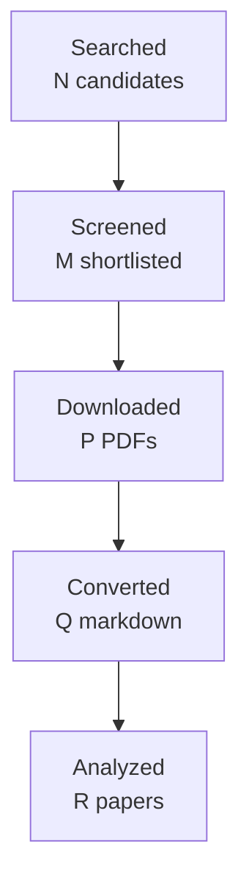

You are one worker inside an automated literature-review pipeline.
A script, not a person, reads your reply. Follow these rules exactly:
- Do the task completely in this single reply. Do not ask questions and do not
  wait for confirmation.
- Reply with the requested artifact block(s) only: no preamble, no commentary
  outside the blocks. Each block starts with a line `===BEGIN <name>===` and
  ends with a line `===END <name>===`; the content between those lines is
  written to a file verbatim.
- Never invent papers, identifiers, numbers, or quotes. Leave unknown fields
  out or mark them as unknown.
- Do not use your code tool, canvas, or connectors; plain text is enough.

# Task: write the final research report

Research topic: **evidence attribution, factuality, completeness and reliability evaluation for workplace communication systems: what exact evidence supports each decision-relevant statement, whether it is current and correctly attributed, what was omitted, and when the system should abstain**
Run id: `1b615a33607c`  Round: 4 of at most 4

Write the final report in Markdown following the template below exactly:
same section names in the same order, `[HIGH]`/`[MEDIUM]`/`[LOW]` confidence
tags on every finding, `[ACADEMIC]`/`[ENGINEERING]` labels on every gap, at
least one Mermaid `flowchart TD` diagram, LaTeX (`$...$`) for formulas, and
evidence citations as `[paper_id]`. Cite only the paper ids listed under
"Papers reviewed". In Methodology state that the papers were read through
the host's web tool and give the access level of each paper. Leave no
template placeholder in the output. Do not write a line that starts with
`===` inside the report.

Round History: use exactly these rows (they are computed by the pipeline):
| 1 | e601ba8b9b6f | evidence attribution, factuality, completeness and reliability evaluation for workplace communication systems: what exact evidence supports each decision-relevant statement, whether it is current and correctly attributed, what was omitted, and when the system should abstain | 17 | initial shortlist | 5 academic, 3 engineering |
| 2 | 6ee1939a8f1e | evaluation of calibrated abstention, evidence completeness, and omission for free-form multi-source generation under temporal and distributional change | 20 | 1 resolved | 4 academic, 3 engineering |
| 3 | 59261fd4011a | Integrated evaluation of evidence completeness and omission for temporally evolving multi-source free-form generation, with calibrated selective prediction under non-stationary distribution shift | 14 | 0 resolved | 4 academic, 3 engineering |
| 4 | 1b615a33607c | Joint evaluation and selective prediction for temporally evolving multi-source generation: evidence completeness for compound and partially supported claims, longitudinal omission of superseded or due work-item state, and online calibration under non-stationary streams | 13 | academic gaps of the previous round | 4 academic, 3 engineering |
Stop reason line: 4-round cap reached

Research Gaps: list every gap that is still open with its classification,
priority, and the rounds that already searched for it. An unresolved gap is
never presented as accepted or closed; say plainly that the literature has
not answered it yet.

Query variants used:
- joint selective prediction temporally evolving multi-source generation: evidence completeness compound partially supported claims, longitudinal omission superseded due work-item state, online calibration under non-stationary streams
- joint selective
- joint prediction temporally evolving multi-source generation: evidence completeness compound partially supported claims, longitudinal omission superseded due work-item state, online calibration under non-stationary streams
- selective prediction temporally evolving multi-source generation: evidence completeness compound partially supported claims, longitudinal omission superseded due work-item state, online calibration under non-stationary streams
- joint selective prediction temporally
- joint selective evolving multi-source
- joint selective generation: evidence
- joint selective completeness compound

## Project context you must work within

This is the project's own description of the problem, its boundaries,
and the distinctions it needs preserved. It governs what counts as
relevant; the academic task names alone do not.

# Topic 10 context — Evidence attribution, factuality, completeness, and reliability evaluation

## Why this Topic exists

Every earlier Topic can produce a plausible-looking but wrong result. msgloom therefore needs a cross-cutting evaluation discipline that asks: **what exact evidence supports each decision-relevant statement, is that evidence current and correctly attributed, what important evidence or Topic was omitted, and when should the system abstain?**

Topic 10 is not merely “LLM hallucination detection”. It owns the general evaluation framework for evidence attribution, claim correctness, completeness/coverage, uncertainty calibration, selective prediction, and user-reviewed acceptance across msgloom.

## Core research object

Decompose outputs into verifiable units and separately evaluate:

- claim correctness against source evidence;
- citation/source attribution correctness;
- citation/evidence completeness;
- current-state correctness after revisions/conflicts;
- Topic/report coverage and omitted important work;
- calibrated confidence / risk-coverage behavior;
- appropriate abstention and visible uncertainty;
- human-review protocols and representative evaluation samples.

These dimensions must not be collapsed into one “faithfulness” score.

## Direct handoffs from earlier Topics

Topic 01 explicitly handed off general calibration/reliability methodology while retaining relation-specific uncertainty. Topic 02 explicitly handed off general selective-prediction/calibration methodology while retaining assignment-specific diagnostics. Similar domain-specific outputs from Topics 03–09 should be evaluated here without moving their semantic ownership into Topic 10.

Topic 04 (completed 2026-09-16, 47 papers, 4 rounds) hands off two unresolved ENGINEERING gaps that are evaluation questions, not literature questions. Gap 2: a combined annotation and evaluation contract covering exact, partial, ambiguous, unsupported, discontinuous, multiple-antecedent, composite and no-link outcomes, scoring exact links, span overlap, zero-link outcomes and multi-antecedent partial credit separately. Gap 5: an abstention and asymmetric error-cost policy, since an over-broad approval link and a missed link do not cost the same. Topic 04 keeps ownership of what those outcomes *mean*; Topic 10 owns the general calibration and attribution methodology, and neither gap is closable by more papers.

Topic 03 (completed 2026-09-16, 50 papers, 4 rounds) hands off calibration under non-stationary workplace streams as general methodology, while retaining identity-specific uncertainty: the relative cost of a false merge against a false split is a Topic 03 decision, not a general calibration question.

**The full text of every inherited handoff is in [`INHERITED_HANDOFFS.md`](INHERITED_HANDOFFS.md)**, including what each sending Topic established, what it left open, and where the ownership boundary lies. Read it before planning; you do not need to open an earlier Topic's folder.

## Product and phase relevance

Topic 10 is cross-cutting across all phases. The design already states that schema validity and model confidence are **not evidence of semantic correctness**. Acceptance combines structural checks with user-reviewed work samples and measures missed important information, wrong grouping, unsupported relationships, lost actions/deadlines, report coverage, and recovery.

## Relationships to other Topics

| Topic | Reliability focus supplied to Topic 10 |
| --- | --- |
| 01 | reply/ancestry/quote-source attribution, preservation, relation uncertainty |
| 02 | span/Topic membership, overlap/non-contiguity, decision-scope preservation |
| 03 | false merge/split/new-Topic errors, identity confidence |
| 04 | antecedent correctness and partial-response scope |
| 05 | action/owner/deadline/condition extraction and missed obligations |
| 06 | factuality, temporal/current-state correctness, contradiction/supersession |
| 07 | retrieval relevance, answerability, evidence sufficiency, stopping/abstention |
| 08 | extraction/grounding completeness and multimodal source localization |
| 09 | report claim correctness, attribution, due-Topic coverage, omission/false-alert balance |

Topic 10 should define common evaluation machinery where useful but must not erase domain-specific denominators or semantics from the owning Topics.

## Key conceptual distinctions

- Factual correctness ≠ citation correctness.
- Citation correctness ≠ citation completeness.
- Evidence support ≠ current-state correctness.
- Current-state correctness ≠ report completeness.
- Confidence score ≠ calibrated probability.
- Calibration ≠ safe decision policy without coverage/risk analysis.
- Fluency ≠ reliability.
- LLM-as-judge agreement ≠ ground truth unless validated.
- No evidence found ≠ evidence of absence.

## High-value academic terminology

- factual consistency / factuality evaluation;
- summarization faithfulness / hallucination evaluation;
- claim decomposition / atomic claim extraction;
- claim verification / fact verification;
- attribution evaluation / source attribution;
- citation correctness / citation precision;
- citation completeness / citation recall / citation coverage;
- groundedness / evidence grounding;
- answer correctness vs context faithfulness (RAG evaluation literature, carefully interpreted);
- completeness / coverage evaluation; omission detection;
- Atomic Content Units (ACU), content units, proposition-level evaluation;
- selective prediction; selective classification; reject option;
- uncertainty calibration; expected calibration error (ECE); Brier score;
- risk-coverage curves; selective risk; abstention;
- conformal prediction (potential transfer, depending task);
- human evaluation reliability; inter-annotator agreement; adjudication;
- evaluation of retrieval-augmented generation / citation-grounded generation;
- decision-focused evaluation / utility-sensitive evaluation.

## Query families

- `"factual consistency" summarization evaluation`
- `"claim decomposition" verification LLM`
- `"claim verification" source attribution`
- `"citation correctness" "citation completeness"`
- `attribution evaluation grounded generation`
- `"evidence completeness" summarization`
- `"Atomic Content Units" evaluation`
- `"selective prediction" NLP abstention`
- `"risk coverage" language model`
- `"uncertainty calibration" NLP`
- `"RAG evaluation" citation groundedness completeness`
- `decision focused evaluation summarization omission`

## False friends / exclusions

- one aggregate “hallucination score” used as universal quality;
- model self-confidence with no calibration study;
- LLM-as-judge results without validation against human/ground truth;
- citation presence counted as citation correctness;
- schema validation counted as semantic correctness;
- generic benchmark accuracy replacing Topic-specific safety denominators;
- calibration research that ignores useful coverage.

## Gap-evaluation guidance

Prioritize evaluation gaps that could allow unsupported claims, omitted due Topics, hidden decision-changing evidence, false confidence, or incorrect “complete” status to pass unnoticed. Common metrics are useful only if they preserve Topic-specific semantics. Prefer decomposed, traceable evaluation with explicit denominators and user-reviewed representative examples. A strong Topic 10 result should help earlier Topics know when to abstain or request review without taking ownership of their domain logic.

## How to use this file

This file is the self-contained research context for this Topic. A future AI research agent should read **this file first**, then `BRIEF.md`, then any existing `CURRENT_STATUS.md`, gap decisions, reports, manifests, and prior-round artifacts in this folder. The aim is that an agent given only this Topic folder can reconstruct the project intent, Topic boundary, dependencies, search vocabulary, and gap-prioritization logic without relying on the original ChatGPT conversation.

If the full repository is available, the authoritative product documents remain `../../docs/design-brief.md`, `../../docs/design-principles.md`, `../../docs/design.md`, and `../../docs/phase-roadmap.md`. This file explains how those product constraints apply to this research Topic; it does not replace or approve changes to those design documents.

## Shared msgloom background

msgloom is a personal work-information system for one user. It is intended to process very large daily volumes of work communication, initially Outlook email and Microsoft Teams, while ensuring that **work requiring the user's response is not missed** and reducing how much the user must read to stay current.

The product is organized around **Topics**, not message summaries. A Topic is a concrete work matter described by information from one or more sources. One message can contain several Topics; one Topic can span many messages, conversations, attachments, groups, and eventually multiple sources. A conversation or Group is therefore not automatically one Topic.

The report contract is the ultimate product pressure on all ten research Topics. Reports must preserve every due Topic and the decision-relevant information needed to act on it, including developments, actions, deadlines, conditions, risks, uncertainty, and links back to exact source evidence. Missing or conflicting information must remain visible rather than being silently filled in.

The design decision order is important when evaluating research gaps: user permissions are fixed; then preserve correct meaning and report coverage; then traceability and recovery; then usability/maintenance; finally speed, brevity, and token savings. A method that is faster but loses a condition, deadline, branch, source relation, or important Topic is not an improvement for msgloom.

Important persistent principles:

- Use deterministic code for reliable mechanical relationships and AI for language understanding/judgement.
- Preserve source bytes, versions, stage history, identities, and lineage. New assessments do not erase old evidence.
- Group only on reliable relationships. Similar subjects, participants, wording, or model labels are not enough to prove Topic identity.
- Keep uncertain relationships separate and make the reason for uncertainty visible.
- Brevity must come from concise wording and layered detail, never from omitting decision-essential information.
- User-reviewed examples, missed important work, false alerts, wrong grouping, lost actions/deadlines, and evidence that changes a decision matter more than paper count or message throughput.

## Research-programme relationship

The ten Topics form a dependency network rather than ten independent literature reviews. A useful conceptual flow is:

```text
01 source/conversation structure
        ↓
02 within-message Topic spans/membership
        ↓
03 cross-thread/source Topic identity
        ↓
04 reference and response scope
        ↓
05 actions / requests / commitments / decisions
        ↓
06 state / factuality / time / revision
        ↓
07 retrieve missing context when needed
        ↘
08 understand attachments / tables / images
        ↓
09 incremental personalized briefing
        ↓
10 evidence, completeness, calibration, reliability evaluation
```

This is not a strict processing pipeline. Several Topics feed each other, and Topic 10 is cross-cutting. The numbering primarily gives a research order and ownership boundary so that one Topic does not silently absorb the whole product problem.

## Gap-evaluation rules inherited from Topics 01 and 02

The Research Pipeline must evaluate gaps using **project value**, not just academic novelty. The following rules are part of the context for every Topic:

1. A machine-classified `HIGH` or `ACADEMIC` gap does **not** automatically authorize another literature round.
2. After each academic round, perform a human/project-value review: decide whether the uncertainty is best addressed by more papers, engineering experiments, a later Topic, production-domain data, candidate-method selection, or no further current work.
3. Prefer targeted academic follow-up over broad searching. Do not fill paper quotas with weakly related literature.
4. Distinguish direct target-domain evidence from transfer methods/evaluation evidence. Transfer evidence can justify a mechanism or experiment, not production-email accuracy.
5. Engineering validation may use independent synthetic/adversarial fixtures and public data. Lack of production mailbox examples is not a reason to stop work that can be validly completed without them.
6. Never claim production representativeness from synthetic or transfer evidence. Record it as deferred until suitable authorized domain data exists.
7. If a gap belongs to another Topic, hand it off explicitly rather than duplicating research.
8. Research closure means **everything actionable at the current stage is complete and remaining work is explicitly deferred/handed off**. It does not mean literature exhaustion, production accuracy, or architecture approval.
9. For new academic work, use terminology refinement, strict paper admission, manual/controlled canonical acquisition, corpus freeze, fresh isolated Pipeline runs, direct-vs-transfer labels, independent review, strict validation, and post-round gap review. These are lessons learned from Topics 01 and 02.
10. For engineering research, keep gold independent from the component under test; structurally separate prediction inputs from evaluation gold/future context; count false positives and false negatives in end-to-end denominators; use clean-workspace reproducibility, mutation/regression tests, and fresh independent methodological review.

## Work handed to this topic by an earlier one

Treat each entry as a starting condition, not as something to
rediscover. Where a sending topic left a gap open it is still open:
do not report it as established. Respect the stated ownership
boundary and do not absorb what the sender still owns.

**None of this is evidence for your own report.** It scopes your
work; it does not support a finding or a gap. Only papers this
topic admitted can do that.

# Inherited handoffs

Everything an earlier Topic explicitly handed to this one, copied in full so
that this folder is enough on its own. You do not need to open an earlier
Topic's documents to start work here.

Each entry states what was handed over, what the sending Topic still owns, and
what it had established or left open at the time. A handoff is not a finding:
where the sender left a gap open, it is still open.

## From Topic 03 — Cross-thread Topic identity and incremental continuity

*Completed 2026-09-16. 4 rounds, 50 papers, report validated PASS 0.94.*

**Handed to Topic 10.** Calibration under non-stationary workplace streams,
as general methodology. Topic 03 records it as an open ACADEMIC gap (MEDIUM):
its corpus does not settle how confidence should behave when the stream's
distribution shifts.

**Boundary.** Topic 03 retains identity-specific uncertainty. The relative
cost of a false merge against a false split is a Topic 03 decision, not a
general calibration question.

## From Topic 04 — Reference resolution and response scope

*Completed 2026-09-16. 4 rounds, 47 papers, report validated PASS.*

**Handed to Topic 10.** Two open ENGINEERING gaps that are evaluation
questions rather than literature questions. Neither is closable by more
papers; Topic 04 searched four rounds and the required contract is
msgloom-specific.

- **A combined annotation and evaluation contract** covering exact, partial,
  ambiguous, unsupported, discontinuous, multiple-antecedent, composite and
  no-link outcomes. Exact links, span overlap, zero-link outcomes and
  multi-antecedent partial credit must be scored **separately**: a single
  aggregate can reward structurally unsafe behaviour and hide over-broad
  links. Topic 04 found the ingredients in the literature but not the
  combined scheme.
- **An abstention and asymmetric error-cost policy.** An over-broad approval
  link and a missed link do not cost the same, so a threshold cannot be read
  off a benchmark score. Topic 04's suggested form is to measure false-broad,
  missed and wrong-link errors separately against an explicit cost function,
  using independent synthetic and adversarial sets first and authorized
  workplace data later.

**Boundary.** Topic 10 owns the general calibration and attribution
methodology. Topic 04 keeps ownership of what the outcomes *mean*: which
proposition a response applies to, and what partial or absent scope is.

## From Topic 05 — Action items, requests, commitments and decisions

*Completed 2026-09-16. 4 rounds, 48 papers.*

**Handed to Topic 10.** Four open ENGINEERING gaps that are evaluation
questions rather than literature questions, and none closable by more papers:

- **G6** An argument-level benchmark and adversarial fixture suite covering
  implicit owners, several actions in one sentence, shared deadlines,
  conditional and negated actions, overlapping request/commitment labels,
  quoted-history contamination and attachment references. False positives,
  false negatives and each argument must be scored **separately**.
- **G7** Controlled comparison of sentence-local, message-level and
  selectively expanded thread context, with ablations, because the literature
  shows both context gains and context-induced degradation.
- **G8** Zoning author, quoted and forwarded content while preserving
  provenance, measuring both false-obligation reduction and recall loss.
- **G9** An uncertainty-preserving output with abstention, measuring whether
  leaving a field unresolved reduces false obligations without unacceptable
  recall loss.

**Boundary.** Topic 10 owns generic calibration and attribution methodology.
Topic 05 keeps ownership of what an action, owner, deadline or condition
means, and of what counts as a false obligation.

## From Topic 06 — Work-item state, event factuality, time, conflicting revisions

*Completed 2026-09-17. 4 rounds, 38 papers, no duplicate records. Every
round's synthesis was accepted by the independent review at the first attempt
— faithfulness 0.93 to 0.95 — which no earlier Topic managed. Stopped on
`round_cap_reached`. All eight gaps remain open and none was downgraded.*

**Handed to Topic 10.** Three open ENGINEERING gaps that are evaluation
questions rather than literature questions, and none closable by more papers.
This follows the pattern set by Topics 03, 04 and 05.

- **Gap 6** An end-to-end adversarial longitudinal suite covering
  plan→cancel, approve→revoke, deadline changes, contradictory same-time
  updates, out-of-order ingestion, stale late-arriving evidence, and
  completion claims later corrected. Topic 06's own suggested resolution
  requires that future evidence be **hidden from the prediction input**, that
  both false completion and failure-to-close be measured **separately**, and
  that the full evidence lineage be preserved.
- **Gap 7** A benchmark combining message time, effective/event time,
  deadline/constraint time and collection/version time, with fixtures where
  the four deliberately disagree, and current-state reconstruction evaluated
  at several observation cutoffs.
- **Gap 8** A provenance-preserving implementation with append-only
  observations and assessments, a reproducibly derived current-state
  projection, replay from empty state, and regression tests proving
  historical evidence cannot be silently overwritten.

**Also relevant to calibration.** Topic 06's Gap 5 — claimed versus
independently corroborated completion — is an abstention and confidence
question as much as an extraction one.

**Boundary.** Topic 10 owns generic attribution, calibration and selective
prediction methodology. Topic 06 keeps ownership of what a state, a
supersession or a corroborated completion *means*, and of what counts as a
false "completed".

*Basis: the ownership map — Topic 06's relationship table entry for 10, and
the precedent of Topics 03/04/05 routing their ENGINEERING gaps here — plus
Topic 06's Gaps 6, 7, 8 and their suggested resolutions, quoted from its
Research Gaps section. Topic 06's report does not name Topic 10 by number.*

## From Topic 08 — Email, image, table and attachment understanding

*Completed 2026-09-17. 4 rounds, 53 corpus records — **52 distinct papers**,
because one study was admitted twice under two identifiers. Rounds 2 and 4
were each rejected once and accepted after one repair; rounds 1 and 3 passed
at the first attempt. Stopped on `round_cap_reached`. All eight gaps remain
open and none was downgraded.*

**Handed to Topic 10.** Four open ENGINEERING gaps that are evaluation
questions rather than literature questions, following the pattern set by
Topics 03, 04, 05 and 06.

- **gap-5 (HIGH)** End-to-end behaviour when extraction or grounding is
  unsupported, incomplete or wrong. Unsupported extraction, missing evidence,
  failed localisation, ambiguous grounding and downstream reasoning failure
  must be **distinguishable outcomes**, not one bucket.
- **gap-6 (HIGH)** Robustness of candidate extraction and structure
  preservation on heterogeneous workplace-style documents.
- **gap-7 (MEDIUM)** Operational scaling on long documents, large tables and
  realistic workbooks. The corpus reports page-routing cost, evidence-graph
  overhead and document-length degradation, but no target-workload latency,
  memory or throughput.
- **gap-8 (HIGH)** One evaluation measuring semantic correctness, extraction
  completeness, exact provenance, unsupported-evidence handling and
  preservation together, rather than each alone.

**A methodological note Topic 10 should carry.** Topic 08 round 2 was
rejected because its synthesis cited one study twice — under a DOI and under
a bare `manual-` identifier — as independent corroboration. The structural
integrity checks passed; only the reader caught it. Evidence counting by
record rather than by distinct study is a live failure mode, and this topic's
own corpus still contains that pair.

**Boundary.** Topic 10 owns generic grounding-correctness, attribution and
completeness methodology. Topic 08 keeps ownership of what a correct
extraction, a grounded region or a preserved structure *means*.

*Basis: the ownership map — Topic 08's relationship table entry for 10
("evaluates extraction completeness, grounding/citation correctness, and
omission of multimodal evidence") and the precedent of Topics 03/04/05/06 —
plus Topic 08's gaps 5–8, quoted from gaps.json, and its round-2 review
verdict. The report does not name Topic 10 by number.*


Papers reviewed:
- paper_id `doi-10-1038-s41598-026-40637-w` — Conformal selective prediction with cost aware deferral for safe clinical triage under distribution shift (Hyun Kwon, Dae-Jin Kim; 2026)
- paper_id `2006.09462` — Selective Question Answering under Domain Shift (Amita Kamath, Robin Jia, Percy Liang; 2020)
- paper_id `doi-10-18653-v1-2021-acl-long-84` — The Art of Abstention: Selective Prediction and Error Regularization for Natural Language Processing (Ji Xin, Raphael Tang, Yaoliang Yu et al.; 2021)
- paper_id `doi-10-1609-aaai-v40i40-40667` — COIN: Uncertainty-Guarding Selective Question Answering for Foundation Models with Provable Risk Guarantees (Zhiyuan Wang, Jinhao Duan, Qingni Wang et al.; 2026)
- paper_id `manual-2be3626f9e` — Optimal Strategies for Reject Option Classifiers (Vojtech Franc, Daniel Prusa, Vaclav Voracek; 2023)
- paper_id `2208.02814` — Conformal Risk Control (Anastasios N. Angelopoulos, Stephen Bates, Adam Fisch et al.; 2022)
- paper_id `2606.27736` — ToE: A Hierarchical and Explainable Claim Verification Framework with Dynamic Multi-source Evidence Retrieval and Aggregation (Zhaoqi Wang, Zijian Zhang, Kun Zheng et al.; 2026)
- paper_id `doi-10-1016-j-jisa-2025-104120` — Conformal prediction for labelling and updating online models in the presence of concept drift in cybersecurity (; 2025)
- paper_id `2208.08401` — Conformal Inference for Online Prediction with Arbitrary Distribution Shifts (Isaac Gibbs, Emmanuel Candès; 2022)
- paper_id `2204.02007` — Fact Checking with Insufficient Evidence (Pepa Atanasova, Jakob Grue Simonsen, Christina Lioma et al.; 2022)
- paper_id `doi-10-1155-2016-1340973` — Mining Sequential Update Summarization with Hierarchical Text Analysis (; 2016)
- paper_id `2305.11859` — Complex Claim Verification with Evidence Retrieved in the Wild (Jifan Chen, Grace Kim, Aniruddh Sriram et al.; 2023)
- paper_id `2511.01101` — TSVer: A Benchmark for Fact Verification Against Time-Series Evidence (Marek Strong, Andreas Vlachos; 2025)
- paper_id `doi-10-32604-cmc-2026-086343` — Do LLMs Know When Evidence is Insufficient? An Evidence Sufficiency Benchmark for Answer-Abstention Calibration in Retrieval-Augmented Generation (Hantian Zhang, Wentai Wu; 2026)
- paper_id `2004.14974` — Fact or Fiction: Verifying Scientific Claims (David Wadden, Shanchuan Lin, Kyle Lo et al.; 2020)
- paper_id `2510.07238` — When Benchmarks Age: Temporal Misalignment through Large Language Model Factuality Evaluation (Xunyi Jiang, Dingyi Chang, Julian McAuley et al.; 2026)
- paper_id `manual-f5ce52cae2` — ReproHum #0892-01: The painful route to consistent results: A reproduction study of human evaluation in NLG (Irene Mondella, Huiyuan Lai, Malvina Nissim; 2024)
- paper_id `2410.14964` — ChronoFact: Timeline-based Temporal Fact Verification (Anab Maulana Barik, Wynne Hsu, Mong Li Lee; 2025)
- paper_id `1707.05555` — Runtime Verification of Temporal Properties over Out-of-order Data Streams (David Basin, Felix Klaedtke, Eugen Zălinescu; 2017)
- paper_id `1910.12840` — Evaluating the Factual Consistency of Abstractive Text Summarization (Wojciech Kryściński, Bryan McCann, Caiming Xiong et al.; 2020)
- paper_id `2212.08037` — Attributed Question Answering: Evaluation and Modeling for Attributed Large Language Models (Bernd Bohnet, Vinh Q. Tran, Pat Verga et al.; 2022)
- paper_id `2605.06635` — Cited but Not Verified: Parsing and Evaluating Source Attribution in LLM Deep Research Agents (Hailey Onweller, Elias Lumer, Austin Huber et al.; 2026)
- paper_id `2607.08700` — Do You Need a Frontier Model as a Citation Verifier? Benchmarking Rubric LLMs for Deep-Research Source Attribution (Ethan Leung, Elias Lumer, Corey Feld et al.; 2026)
- paper_id `doi-10-1017-s1351324909005051` — Formal and functional assessment of the pyramid method for summary content evaluation (Rebecca J. Passonneau; 2010)
- paper_id `2606.00093` — Agreement Metrics for LLM-as-Judge Evaluation: What to Report and Why (Delip Rao, Chris Callison-Burch; 2026)
- paper_id `2605.16354` — Augmenting Human Evaluation with LLM Judges: How Many Human Reviews Do You Need? (Jane Paik Kim; 2026)
- paper_id `2111.09525` — SummaC: Re-Visiting NLI-based Models for Inconsistency Detection in Summarization (Philippe Laban, Tobias Schnabel, Paul N. Bennett et al.; 2022)
- paper_id `2305.14627` — Enabling Large Language Models to Generate Text with Citations (Tianyu Gao, Howard Yen, Jiatong Yu et al.; 2023)
- paper_id `2406.07967` — Better than Random: Reliable NLG Human Evaluation with Constrained Active Sampling (Jie Ruan, Xiao Pu, Mingqi Gao et al.; 2024)
- paper_id `doi-10-1162-tacl-a-00407` — How Can We Know When Language Models Know? On the Calibration of Language Models for Question Answering (Zhengbao Jiang, Jun Araki, Haibo Ding et al.; 2021)
- paper_id `2404.00474` — Linguistic Calibration of Long-Form Generations (Neil Band, Xuechen Li, Tengyu Ma et al.; 2024)
- paper_id `2608.22483` — Claim-Level Confidence Calibration for Reliable Decision Making with Large Language Models (Toghrul Abbasli, Kentaroh Toyoda, Yuan Wang et al.; 2026)
- paper_id `2605.01749` — Only Say What You Know: Calibration-Aware Generation for Long-Form Factuality (Wen Luo, Guangyue Peng, Liang Wang et al.; 2026)
- paper_id `doi-10-1109-access-2026-3679691` — Program-Verifiable Evaluation for Temporal QA: Metrics for Evidence Validity (Beomseok Kim, Hoansuk Choi, Namhyun Yoo et al.; 2026)
- paper_id `2404.15588` — Minimal Evidence Group Identification for Claim Verification (Xiangci Li, Sihao Chen, Rajvi Kapadia et al.; 2025)
- paper_id `2605.03534` — SURE-RAG: Sufficiency and Uncertainty-Aware Evidence Verification for Selective Retrieval-Augmented Generation (Jingxi Qiu, Zeyu Han, Cheng Huang; 2026)
- paper_id `2508.20867` — MSRS: Evaluating Multi-Source Retrieval-Augmented Generation (Rohan Phanse, Yijie Zhou, Kejian Shi et al.; 2025)
- paper_id `2106.00170` — Adaptive Conformal Inference Under Distribution Shift (Isaac Gibbs, Emmanuel Candès; 2021)
- paper_id `2606.29054` — When Can Conformal Risk Control Certify LLM Outputs? Bounds, Impossibility, and Adaptation for Structured Generation (Varun Kotte; 2026)
- paper_id `2512.17776` — DEER: A Benchmark for Evaluating Deep Research Agents on Expert Report Generation (Janghoon Han, Heegyu Kim, Changho Lee et al.; 2025)
- paper_id `2509.26184` — Auto-ARGUE: LLM-Based Report Generation Evaluation (William Walden, Marc Mason, Orion Weller et al.; 2025)
- paper_id `2312.09300` — Self-Evaluation Improves Selective Generation in Large Language Models (Jie Ren, Yao Zhao, Tu Vu et al.; 2023)
- paper_id `2505.23912` — LoVeC: Reinforcement Learning for Better Verbalized Confidence in Long-Form Generation (Caiqi Zhang, Xiaochen Zhu, Chengzu Li et al.; 2025)
- paper_id `2607.19322` — Two-Level Meta-Rubrics for Evaluating Open-Ended Generation: GAMUT, a Benchmark for Factual Completeness (Xilun Chen, Zhaleh Feizollahi, Ross Goodwin et al.; 2026)
- paper_id `2307.09254` — Selective Generation for Controllable Language Models (Minjae Lee, Kyungmin Kim, Taesoo Kim et al.; 2023)
- paper_id `manual-32d5793dca` — Validating LLM-as-a-Judge Systems under Rating Indeterminacy (Luke Guerdan, Solon Barocas, Kenneth Holstein et al.; 2025)
- paper_id `2012.14983` — Reducing Conversational Agents’ Overconfidence Through Linguistic Calibration (Sabrina J. Mielke, Arthur Szlam, Emily Dinan et al.; 2022)
- paper_id `2604.12046` — Think Through Uncertainty: Improving Long-Form Generation Factuality via Reasoning Calibration (Xin Liu, Lu Wang; 2026)
- paper_id `doi-10-18653-v1-w19-8642` — Agreement is overrated: A plea for correlation to assess human evaluation reliability (Jacopo Amidei, Paul Piwek, Alistair Willis; 2019)
- paper_id `doi-10-18653-v1-2025-acl-long-837` — Can LLMs Evaluate Complex Attribution in QA? Automatic Benchmarking using Knowledge Graphs (Nan Hu, Jiaoyan Chen, Yike Wu et al.; 2025)
- paper_id `2510.12839` — FaStFACT: Faster, Stronger Long-Form Factuality Evaluations in LLMs (Yingjia Wan, Haochen Tan, Xiao Zhu et al.; 2025)
- paper_id `2511.16198` — SemanticCite: Citation Verification with AI-Powered Full-Text Analysis and Evidence-Based Reasoning (Sebastian Haan; 2025)
- paper_id `2408.08067` — RAGChecker: A Fine-grained Framework for Diagnosing Retrieval-Augmented Generation (Dongyu Ru, Lin Qiu, Xiangkun Hu et al.; 2024)
- paper_id `2602.16537` — Optimal training-conditional regret for online conformal prediction (Jiadong Liang, Zhimei Ren, Yuxin Chen; 2026)
- paper_id `2602.11908` — When Should LLMs Be Less Specific? Selective Abstraction for Reliable Long-Form Text Generation (Shani Goren, Ido Galil, Ran El-Yaniv; 2026)
- paper_id `2302.07869` — Improved Online Conformal Prediction via Strongly Adaptive Online Learning (Aadyot Bhatnagar, Huan Wang, Caiming Xiong et al.; 2023)
- paper_id `manual-39435af3dd` — Overview of the TAC 2008 Update Summarization Task (Hoa Trang Dang, Karolina K. Owczarzak; 2008)
- paper_id `2607.03870` — Evaluating LLM Uncertainty in Long-Form Generation Using Deterministic Ground Truth (Ido Amit, Ido Galil, Ran El-Yaniv; 2026)
- paper_id `doi-10-6028-nist-sp-500-321-realtime-overview` — Overview of the TREC 2016 Real-Time Summarization Track (Jimmy Lin, Adam Roegiest, Luchen Tan et al.; 2016)
- paper_id `2405.00982` — On the Evaluation of Machine-Generated Reports (James Mayfield, Eugene Yang, Dawn Lawrie et al.; 2024)
- paper_id `2604.03141` — Beyond Precision: Importance-Aware Recall for Factuality Evaluation in Long-Form LLM Generation (Nazanin Jafari, James Allan, Mohit Iyyer; 2026)
- paper_id `2105.00071` — Evaluating Attribution in Dialogue Systems: The BEGIN Benchmark (Nouha Dziri, Hannah Rashkin, Tal Linzen et al.; 2022)
- paper_id `2402.05629` — Merging Facts, Crafting Fallacies: Evaluating the Contradictory Nature of Aggregated Factual Claims in Long-Form Generations (Cheng-Han Chiang, Hung-yi Lee; 2024)
- paper_id `2608.11238` — Towards Query-Agnostic RAG Evaluation via Query Coverage and Claim Verifiability (Jeonghwan Choi, Taewon Yun, Minjeong Ban et al.; 2026)

Access level per paper:
- `1707.05555`: full_text via https://arxiv.org/html/1707.05555
- `1910.12840`: full_text via https://arxiv.org/html/1910.12840
- `2004.14974`: full_text via https://arxiv.org/html/2004.14974
- `2006.09462`: full_text via https://arxiv.org/html/2006.09462
- `2012.14983`: full_text via https://arxiv.org/html/2012.14983
- `2105.00071`: full_text via https://arxiv.org/html/2105.00071
- `2106.00170`: full_text via https://arxiv.org/html/2106.00170
- `2111.09525`: full_text via https://arxiv.org/html/2111.09525
- `2204.02007`: full_text via https://arxiv.org/html/2204.02007
- `2208.02814`: full_text via https://arxiv.org/html/2208.02814
- `2208.08401`: full_text via https://arxiv.org/html/2208.08401
- `2212.08037`: full_text via https://arxiv.org/html/2212.08037
- `2302.07869`: full_text via https://arxiv.org/html/2302.07869
- `2305.11859`: full_text via https://arxiv.org/html/2305.11859
- `2305.14627`: full_text via https://arxiv.org/html/2305.14627
- `2307.09254`: full_text via https://arxiv.org/html/2307.09254
- `2312.09300`: full_text via https://arxiv.org/html/2312.09300
- `2402.05629`: full_text via https://arxiv.org/html/2402.05629
- `2404.00474`: full_text via https://arxiv.org/html/2404.00474
- `2404.15588`: full_text via https://arxiv.org/html/2404.15588
- `2405.00982`: full_text via https://arxiv.org/html/2405.00982
- `2406.07967`: full_text via https://arxiv.org/html/2406.07967
- `2408.08067`: full_text via https://arxiv.org/html/2408.08067
- `2410.14964`: full_text via https://arxiv.org/html/2410.14964
- `2505.23912`: full_text via https://arxiv.org/html/2505.23912
- `2508.20867`: full_text via https://arxiv.org/html/2508.20867
- `2509.26184`: full_text via https://arxiv.org/html/2509.26184
- `2510.07238`: full_text via https://arxiv.org/html/2510.07238
- `2510.12839`: full_text via https://arxiv.org/html/2510.12839
- `2511.01101`: full_text via https://arxiv.org/html/2511.01101
- `2511.16198`: full_text via https://arxiv.org/html/2511.16198
- `2512.17776`: full_text via https://arxiv.org/html/2512.17776
- `2602.11908`: full_text via https://arxiv.org/html/2602.11908
- `2602.16537`: full_text via https://arxiv.org/html/2602.16537
- `2604.03141`: full_text via https://arxiv.org/html/2604.03141
- `2604.12046`: full_text via https://arxiv.org/html/2604.12046
- `2605.01749`: full_text via https://arxiv.org/html/2605.01749
- `2605.03534`: full_text via https://arxiv.org/html/2605.03534
- `2605.06635`: full_text via https://arxiv.org/html/2605.06635
- `2605.16354`: full_text via https://arxiv.org/html/2605.16354
- `2606.00093`: full_text via https://arxiv.org/html/2606.00093
- `2606.27736`: full_text via https://arxiv.org/html/2606.27736
- `2606.29054`: full_text via https://arxiv.org/html/2606.29054
- `2607.03870`: full_text via https://arxiv.org/html/2607.03870
- `2607.08700`: full_text via https://arxiv.org/html/2607.08700
- `2607.19322`: full_text via https://arxiv.org/html/2607.19322
- `2608.11238`: full_text via https://arxiv.org/html/2608.11238
- `2608.22483`: full_text via https://arxiv.org/html/2608.22483
- `doi-10-1016-j-jisa-2025-104120`: full_text via https://www.sciencedirect.com/science/article/pii/S2214212625001577
- `doi-10-1017-s1351324909005051`: full_text via https://www.researchgate.net/publication/220597319_Formal_and_functional_assessment_of_the_pyramid_method_for_summary_content_evaluation
- `doi-10-1038-s41598-026-40637-w`: full_text via https://www.nature.com/articles/s41598-026-40637-w
- `doi-10-1109-access-2026-3679691`: full_text via https://www.researchgate.net/publication/403423426_Program-Verifiable_Evaluation_for_Temporal_QA_Metrics_for_Evidence_Validity
- `doi-10-1155-2016-1340973`: full_text via https://onlinelibrary.wiley.com/doi/10.1155/2016/1340973
- `doi-10-1162-tacl-a-00407`: full_text via https://arxiv.org/html/2012.00955
- `doi-10-1609-aaai-v40i40-40667`: full_text via https://arxiv.org/html/2506.20178
- `doi-10-18653-v1-2021-acl-long-84`: full_text via https://aclanthology.org/2021.acl-long.84.pdf
- `doi-10-18653-v1-2025-acl-long-837`: full_text via https://aclanthology.org/2025.acl-long.837.pdf
- `doi-10-18653-v1-w19-8642`: full_text via https://aclanthology.org/W19-8642.pdf
- `doi-10-32604-cmc-2026-086343`: full_text via https://www.techscience.com/cmc/v89n1/68467/html
- `doi-10-6028-nist-sp-500-321-realtime-overview`: full_text via https://trec.nist.gov/pubs/trec25/papers/Overview-RT.pdf
- `manual-2be3626f9e`: full_text via https://arxiv.org/html/2101.12523
- `manual-32d5793dca`: full_text via https://proceedings.neurips.cc/paper_files/paper/2025/file/a309239c11a28c597d050bd4a1752d32-Paper-Conference.pdf
- `manual-39435af3dd`: full_text via https://tac.nist.gov/publications/2008/additional.papers/update_summ_overview08.proceedings.pdf
- `manual-f5ce52cae2`: full_text via https://aclanthology.org/2024.humeval-1.24.pdf

Cross-paper synthesis (the source of findings, gaps, and themes):
{
 "topic": "Joint evaluation and selective prediction for temporally evolving multi-source generation: evidence completeness for compound and partially supported claims, longitudinal omission of superseded or due work-item state, and online calibration under non-stationary streams",
 "paper_count": 64,
 "executive_summary": "Across 64 corpus records, the evidence consistently supports decomposed reliability evaluation rather than a single factuality score. Summarization, RAG, report-generation, attribution, and fact-verification studies separate claim correctness, source support, evidence recall, and omission; temporal studies further show that current-state validity can diverge from generic support. Selective-prediction work demonstrates useful risk-coverage control and improved calibration in several domains, but guarantees depend on confidence quality, calibration regime, and shift assumptions. Online conformal methods provide strong results for changing streams, while structured-generation studies show that static or simply adaptive methods can fail under severe cross-dataset shift. Report and update-summarization benchmarks evaluate omission and redundancy, yet none directly models longitudinal workplace work-item states. The corpus therefore supplies strong component-level evidence but does not validate a single joint scheme for compound, multi-source, temporally versioned, selectively generated workplace briefings.",
 "themes": [
  "Dimension-separated evaluation of factual correctness, attribution, evidence completeness, and omission",
  "Atomic-claim decomposition combined with cross-claim and aggregate consistency checks",
  "Evidence sufficiency, partial support, and complementary multi-source evidence",
  "Temporal validity, benchmark aging, chronological reasoning, and out-of-order evidence",
  "Omission, novelty, repetition, and content-unit coverage in reports and update summaries",
  "Selective prediction, abstention, and risk-coverage trade-offs",
  "Online calibration and conformal methods under distribution shift",
  "Human-review reliability and validation of automated evaluators",
  "Retrieval and generation as separable sources of end-to-end failure"
 ],
 "findings": [
  {
   "statement": "Across summarization, attributed QA, report evaluation, and RAG, claim correctness, attribution correctness, and completeness behave as distinct quantities; evaluated systems can score differently on these dimensions rather than collapsing to one quality signal.",
   "confidence": "HIGH",
   "evidence": [
    {
     "paper_id": "2212.08037",
     "section": "key_findings"
    },
    {
     "paper_id": "2305.14627",
     "section": "key_findings"
    },
    {
     "paper_id": "2405.00982",
     "section": "key_findings"
    },
    {
     "paper_id": "2408.08067",
     "section": "key_findings"
    }
   ]
  },
  {
   "statement": "Fine-grained or atomic decomposition improves factual-consistency diagnosis and evidence localization in several summarization and long-form evaluation settings, while independent atomic verification can miss aggregate errors such as entity mixing or contradictory composition.",
   "confidence": "HIGH",
   "evidence": [
    {
     "paper_id": "1910.12840",
     "section": "key_findings"
    },
    {
     "paper_id": "2111.09525",
     "section": "key_findings"
    },
    {
     "paper_id": "2402.05629",
     "section": "key_findings"
    },
    {
     "paper_id": "2510.12839",
     "section": "key_findings"
    },
    {
     "paper_id": "2604.03141",
     "section": "key_findings"
    }
   ]
  },
  {
   "statement": "Evidence-sufficiency and complex-verification studies show substantial error when available evidence is incomplete, partially supportive, or distributed across multiple sources; decomposition and explicit evidence-group modeling improve subsets of this problem but do not jointly cover every condition.",
   "confidence": "HIGH",
   "evidence": [
    {
     "paper_id": "2204.02007",
     "section": "key_findings"
    },
    {
     "paper_id": "2305.11859",
     "section": "key_findings"
    },
    {
     "paper_id": "2404.15588",
     "section": "key_findings"
    },
    {
     "paper_id": "2508.20867",
     "section": "key_findings"
    },
    {
     "paper_id": "doi-10-18653-v1-2025-acl-long-837",
     "section": "key_findings"
    },
    {
     "paper_id": "doi-10-32604-cmc-2026-086343",
     "section": "key_findings"
    }
   ]
  },
  {
   "statement": "Temporal evidence validity is separable from generic factual support: stale benchmark labels can penalize current answers, citations can support a fact yet be invalid for the queried time, and explicit chronological reasoning improves temporal fact verification in the studied benchmarks.",
   "confidence": "HIGH",
   "evidence": [
    {
     "paper_id": "2510.07238",
     "section": "key_findings"
    },
    {
     "paper_id": "doi-10-1109-access-2026-3679691",
     "section": "key_findings"
    },
    {
     "paper_id": "2410.14964",
     "section": "key_findings"
    },
    {
     "paper_id": "1707.05555",
     "section": "key_findings"
    }
   ]
  },
  {
   "statement": "Report and update-summarization evaluations can measure omission-like coverage separately from repetition or redundancy by using nuggets, content units, novelty judgments, or weighted coverage; the admitted studies do not directly evaluate omission of longitudinal workplace work-item states such as due, resolved, or superseded items.",
   "confidence": "HIGH",
   "evidence": [
    {
     "paper_id": "2405.00982",
     "section": "key_findings"
    },
    {
     "paper_id": "doi-10-1017-s1351324909005051",
     "section": "key_findings"
    },
    {
     "paper_id": "doi-10-1155-2016-1340973",
     "section": "key_findings"
    },
    {
     "paper_id": "doi-10-6028-nist-sp-500-321-realtime-overview",
     "section": "key_findings"
    },
    {
     "paper_id": "manual-39435af3dd",
     "section": "key_findings"
    },
    {
     "paper_id": "2607.19322",
     "section": "key_findings"
    }
   ]
  },
  {
   "statement": "Selective-prediction studies across QA, classification, RAG, and free-form generation show that confidence-based abstention can reduce accepted-answer risk, but raw sequence likelihood or uncalibrated probabilities are often poor selectors and performance varies by domain, model, and calibration regime.",
   "confidence": "HIGH",
   "evidence": [
    {
     "paper_id": "2006.09462",
     "section": "key_findings"
    },
    {
     "paper_id": "doi-10-1162-tacl-a-00407",
     "section": "key_findings"
    },
    {
     "paper_id": "2312.09300",
     "section": "key_findings"
    },
    {
     "paper_id": "doi-10-18653-v1-2021-acl-long-84",
     "section": "key_findings"
    },
    {
     "paper_id": "2605.03534",
     "section": "key_findings"
    },
    {
     "paper_id": "2608.22483",
     "section": "key_findings"
    }
   ]
  },
  {
   "statement": "Online conformal methods provide adaptive coverage results under changing distributions in election, forecasting, image-shift, and theoretical drift settings, but their guarantees differ in locality and assumptions, and structured LLM experiments show that static conformal risk control and ACI can violate emitted-risk targets under severe cross-dataset shift.",
   "confidence": "HIGH",
   "evidence": [
    {
     "paper_id": "2106.00170",
     "section": "key_findings"
    },
    {
     "paper_id": "2208.08401",
     "section": "key_findings"
    },
    {
     "paper_id": "2302.07869",
     "section": "key_findings"
    },
    {
     "paper_id": "2602.16537",
     "section": "key_findings"
    },
    {
     "paper_id": "2606.29054",
     "section": "key_findings"
    }
   ]
  },
  {
   "statement": "Verbalized or linguistic confidence can be trained to better track factual correctness or downstream reader beliefs, but calibration, ranking quality, and factual accuracy are distinct: interventions that improve one can leave another unchanged or degrade confidence ranking.",
   "confidence": "MEDIUM",
   "evidence": [
    {
     "paper_id": "2012.14983",
     "section": "key_findings"
    },
    {
     "paper_id": "2404.00474",
     "section": "key_findings"
    },
    {
     "paper_id": "2505.23912",
     "section": "key_findings"
    },
    {
     "paper_id": "2607.03870",
     "section": "key_findings"
    },
    {
     "paper_id": "2604.12046",
     "section": "key_findings"
    }
   ]
  },
  {
   "statement": "Automatic evaluators and LLM judges can reproduce useful system-level signals, but item-level agreement, abstention handling, rating indeterminacy, and directional false-positive or false-negative bias materially affect interpretation; controlled human sampling and human-grounded estimation can reduce review cost without treating the automatic judge as ground truth.",
   "confidence": "HIGH",
   "evidence": [
    {
     "paper_id": "2212.08037",
     "section": "key_findings"
    },
    {
     "paper_id": "2509.26184",
     "section": "key_findings"
    },
    {
     "paper_id": "2406.07967",
     "section": "key_findings"
    },
    {
     "paper_id": "2605.16354",
     "section": "key_findings"
    },
    {
     "paper_id": "2606.00093",
     "section": "key_findings"
    },
    {
     "paper_id": "2607.08700",
     "section": "key_findings"
    },
    {
     "paper_id": "manual-32d5793dca",
     "section": "key_findings"
    }
   ]
  },
  {
   "statement": "Retrieval and generation form separable bottlenecks in multi-source factual generation: stronger retrieval generally improves downstream quality, while oracle or near-oracle evidence access still leaves generation omissions, unsupported claims, and incomplete evidence use.",
   "confidence": "HIGH",
   "evidence": [
    {
     "paper_id": "2004.14974",
     "section": "key_findings"
    },
    {
     "paper_id": "2305.14627",
     "section": "key_findings"
    },
    {
     "paper_id": "2408.08067",
     "section": "key_findings"
    },
    {
     "paper_id": "2508.20867",
     "section": "key_findings"
    }
   ]
  }
 ],
 "contradictions": [],
 "gaps": [
  {
   "id": "gap-1",
   "description": "No admitted study validates one end-to-end evaluation scheme that jointly measures claim correctness, evidence attribution correctness, citation or evidence completeness, temporal or current-state correctness, omission, calibrated uncertainty, and abstention while preserving separate denominators for those dimensions. The corpus validates individual components and smaller combinations.",
   "classification": "ACADEMIC",
   "priority": "HIGH",
   "suggested_query": "\"joint evaluation framework\" factuality attribution completeness temporal correctness omission calibration abstention \"free-form generation\" multi-source"
  },
  {
   "id": "gap-2",
   "description": "The corpus contains no direct evaluation on private workplace email or Teams-style communication with realistic revisions, quoted history, conflicting updates, delayed or out-of-order arrival, versioned attachments, and permission-constrained evidence. Target-domain fixtures and gold data remain an engineering validation gap.",
   "classification": "ENGINEERING",
   "priority": "HIGH"
  },
  {
   "id": "gap-4",
   "description": "The corpus does not establish a general evidence-completeness method that jointly handles compound claims, partially supportive evidence, multiple complementary sources, and temporally versioned evidence. Separate studies cover subsets of these conditions.",
   "classification": "ACADEMIC",
   "priority": "HIGH",
   "suggested_query": "\"evidence completeness\" compound claims partial support complementary evidence multi-source temporal versioning provenance evaluation"
  },
  {
   "id": "gap-5",
   "description": "Report-level omission has substantial benchmark coverage, but the corpus still does not establish omission detection for evolving workplace work items, due information, superseded facts, or decision-relevant state across time.",
   "classification": "ACADEMIC",
   "priority": "HIGH",
   "suggested_query": "\"omission detection\" longitudinal summarization work-item state superseded facts due dates temporal updates decision-relevant information"
  },
  {
   "id": "gap-6",
   "description": "A target-domain human-review protocol remains an engineering gap: representative or risk-stratified sampling, minimum human-review volume, multi-rater adjudication, confusion matrices, abstention treatment, coverage reporting, and validation of any LLM-assisted judge against independent human judgments remain project-specific choices.",
   "classification": "ENGINEERING",
   "priority": "HIGH"
  },
  {
   "id": "gap-7",
   "description": "The corpus demonstrates evaluator-optimization effects, rating indeterminacy, abstention sensitivity, and directional judge bias but does not provide a project-specific procedure for preventing acceptance criteria from being overfit to the same automatic evaluator used during development. Independent holdouts, evaluator separation, and regression checks remain an engineering validation problem.",
   "classification": "ENGINEERING",
   "priority": "MEDIUM"
  },
  {
   "id": "gap-8",
   "description": "Calibration under continuing temporal or distributional change remains open for non-stationary free-form communication streams. The corpus supplies adaptive coverage results, cross-domain calibration studies, benchmark-aging evidence, and structured-generation risk-control results, but not one validated selective-prediction method for continuously changing workplace communication.",
   "classification": "ACADEMIC",
   "priority": "MEDIUM",
   "suggested_query": "\"selective prediction\" \"non-stationary\" free-form generation online calibration concept drift abstention adaptive conformal temporal stream"
  }
 ],
 "actionable_insights": [
  "Synthesis-derived recommendation: maintain separate evaluation denominators for claim correctness, attribution correctness, evidence completeness, temporal or current-state correctness, report omission, calibration, and abstention rather than combining them into one acceptance score.",
  "Synthesis-derived recommendation: evaluate both atomic units and their higher-level composition so that locally supported claims do not hide entity mixing, contradictory aggregation, or incorrect work-item-level synthesis.",
  "Synthesis-derived recommendation: represent evidence status with more than a binary supported/unsupported outcome, including partial support, insufficient evidence, conflicting evidence, and complementary multi-source support.",
  "Synthesis-derived recommendation: construct temporal evaluation at explicit observation cutoffs and include delayed arrival, out-of-order evidence, supersession, corrected completion, and disagreements between event time and collection time.",
  "Synthesis-derived recommendation: pair omission measurement with repetition or false-alert measurement on longitudinal work-item fixtures, including new, still-open, resolved, superseded, and due states.",
  "Synthesis-derived recommendation: evaluate confidence using risk-coverage or selective-risk behavior under both stable and shifted streams in addition to scalar calibration error.",
  "Synthesis-derived recommendation: keep automated development evaluators separate from final acceptance holdouts, and validate any LLM-assisted judge on independently reviewed samples with directional error reporting.",
  "Synthesis-derived recommendation: preserve abstention as an explicit evaluation outcome and report coverage alongside covered-case accuracy or agreement rather than silently excluding abstained cases."
 ],
 "confidence_summary": "Evidence is strong for several cross-domain design principles at the component level: reliability dimensions are empirically separable; omission and unsupported generation require different measurements; retrieval and generation contribute distinct failures; and selective prediction has meaningful risk-coverage behavior. Evidence is also strong that temporal validity and distribution shift can invalidate otherwise plausible evaluation signals. Confidence is medium for transfer from summarization, QA, RAG, scientific verification, clinical triage, forecasting, cybersecurity, and news-update tasks to workplace communication. The combined scheme named by this topic remains untested, so the corpus supports well-supported design principles and evaluation mechanisms rather than an empirically validated end-to-end workplace framework.",
 "limitations": [
  "The synthesis is based on the supplied reduced per-paper analyses rather than full papers, so methodological details, negative results, and scope qualifications not retained in those reductions may be missing.",
  "Most evidence comes from summarization, QA, RAG, scientific fact verification, open-web research, news updates, forecasting, clinical triage, cybersecurity, or synthetic benchmarks rather than private workplace email and Teams-style communication.",
  "No admitted paper jointly evaluates all target dimensions, so evidence from papers covering different components cannot be interpreted as validation of their combination.",
  "Results span different datasets, tasks, models, definitions of correctness, confidence, coverage, and abstention; numerical results are therefore not directly comparable across much of the corpus.",
  "No direct contradictions were identified under genuinely comparable questions and conditions. Apparent tensions, such as strong softmax performance in some in-domain classification settings versus overconfidence under shifted QA, or successful adaptive conformal coverage in forecasting versus ACI failures under structured-generation cross-dataset shift, are scope qualifications rather than contradictions [doi-10-18653-v1-2021-acl-long-84] [2006.09462] [2106.00170] [2606.29054].",
  "The supplied records do not contain enough bibliographic metadata for duplicate-study detection beyond the visible identifiers and titles, so paper_count denotes corpus records rather than a guaranteed count of distinct underlying studies.",
  "Inherited handoffs are treated only as project context and gap provenance; none is used as evidence for findings or for closing a gap."
 ],
 "gap_status": [
  {
   "id": "gap-1",
   "status": "open",
   "note": "Newer papers add component-level combinations such as completeness plus support, selective risk control, temporal validity, and report-wide evaluation, but no admitted study validates the full joint evaluation scheme named by the gap.",
   "evidence": [
    "2405.00982",
    "2509.26184",
    "2510.07238",
    "2606.29054",
    "2607.19322"
   ]
  },
  {
   "id": "gap-2",
   "status": "open",
   "note": "No admitted paper directly evaluates the stated private workplace email or Teams-style target domain with the full set of revisions, quoted history, conflicting updates, delayed arrival, attachment versioning, and permission constraints.",
   "evidence": []
  },
  {
   "id": "gap-4",
   "status": "open",
   "note": "The corpus separately covers compound-claim decomposition, partial support, minimal sufficient evidence, multi-source retrieval, and temporal evidence validity, but no admitted method jointly handles all of these evidence-completeness conditions.",
   "evidence": [
    "2305.11859",
    "2404.15588",
    "2508.20867",
    "doi-10-18653-v1-2025-acl-long-837",
    "doi-10-1109-access-2026-3679691"
   ]
  },
  {
   "id": "gap-5",
   "status": "open",
   "note": "Update summarization, report evaluation, real-time summarization, and factual-completeness benchmarks measure omission, novelty, redundancy, or temporal update coverage, but none directly evaluates evolving workplace work-item states, due obligations, or supersession chains.",
   "evidence": [
    "2405.00982",
    "2607.19322",
    "doi-10-1155-2016-1340973",
    "doi-10-6028-nist-sp-500-321-realtime-overview",
    "manual-39435af3dd"
   ]
  },
  {
   "id": "gap-6",
   "status": "open",
   "note": "The corpus supplies methods for active human sampling, LLM-assisted estimation, agreement measurement, reproducibility, and rating indeterminacy, but it does not determine the target-domain review volume, adjudication protocol, risk strata, or acceptance procedure.",
   "evidence": [
    "2406.07967",
    "2605.16354",
    "2606.00093",
    "manual-32d5793dca",
    "manual-f5ce52cae2"
   ]
  },
  {
   "id": "gap-7",
   "status": "open",
   "note": "Metric optimization effects, judge bias, abstention sensitivity, and rating indeterminacy are documented, but no admitted study supplies a project-specific evaluator-separation and holdout procedure for this system.",
   "evidence": [
    "2212.08037",
    "2606.00093",
    "2607.08700",
    "manual-32d5793dca"
   ]
  },
  {
   "id": "gap-8",
   "status": "open",
   "note": "Adaptive and strongly adaptive conformal methods now provide substantial evidence for non-stationary prediction, while structured-generation experiments document failure modes under cross-dataset shift. No admitted study validates one selective-prediction method on continuously changing free-form workplace communication.",
   "evidence": [
    "2106.00170",
    "2208.08401",
    "2302.07869",
    "2602.16537",
    "2606.29054"
   ]
  }
 ]
}

Report template:
## Final Research Report Template

The final report MUST follow this structure. Every section is required
unless marked (optional). Sections marked **[EVIDENCE REQUIRED]** must
cite specific papers with `[arxiv_id]` or `[Author, Year]` references.

````markdown
# Research Report: [Topic]

## Contents

- [Round History](#round-history)
- [Executive Summary](#executive-summary)
- [Research Question](#research-question)
- [Methodology](#methodology)
- [Papers Reviewed](#papers-reviewed)
- [Research Landscape](#research-landscape)
- [Confidence-Graded Findings](#confidence-graded-findings)
- [Research Gaps](#research-gaps)
- [Practical Recommendations](#practical-recommendations)
- [Evidence Map](#evidence-map)
- [References](#references)
- [Appendix: Run Metadata](#appendix-run-metadata)

## Round History

Iterative gap-closure loop (hard cap: 4 rounds). See
`references/iterative-synthesis.md` for the full loop definition.

| Round | Run ID | Topic / Gap Focus | New Papers | Gaps Addressed | Remaining Gaps |
|-------|--------|-------------------|------------|----------------|----------------|
| 1 | <run-id-1> | <original topic> | N | initial shortlist | A academic, E engineering |
| 2 | <run-id-2> | <academic gap focus> | N | … | … |

**Stop reason**: [converged — no open gaps | 4-round cap reached |
new search returned 0 relevant papers | remaining gaps marked out-of-scope]

## Executive Summary

[3-5 sentences: research question, scope (N papers from M sources),
key conclusion, and confidence level. Must mention the strongest finding
and the most significant gap.]

**Scope**: N papers analyzed from [sources] over [date range]
**Overall Confidence**: High / Medium / Low
**Verdict**: [IMPLEMENTATION_READY | HAS_GAPS | NOT_APPLICABLE]

## Research Question

[Precise statement of what was investigated. Include scope boundaries:
what's in vs. out.]

## Methodology

### Search Strategy
- **Sources**: [arXiv, Google Scholar, Semantic Scholar, ...]
- **Query variants**: [list the key queries used]
- **Time window**: [date range]
- **Screening**: [BM25 + sub-agent / BM25 only]

### Pipeline Summary



| Metric | Count |
|--------|-------|
| Total candidates | N |
| After screening | M |
| Downloaded | P |
| Successfully converted | Q |
| Deeply analyzed | R |
| Iterations (if system-building) | I |

## Papers Reviewed

| # | Title | Authors | Year | Venue | Quality Score | Relevance |
|---|-------|---------|------|-------|--------------|-----------|
| 1 | [Title] [arxiv_id] | First Author et al. | YYYY | Venue | X.X/5 | HIGH / MEDIUM / LOW |

## Research Landscape

### Theme 1: [Theme Name]

**Coverage**: N papers | **Confidence**: High / Medium / Low
**Supporting papers**: [arxiv_id_1], [arxiv_id_2], ...

[Narrative description of the theme with evidence citations.] **[EVIDENCE REQUIRED]**

Key findings:
1. [Finding with citation: "Paper A [arxiv_id] demonstrated X with Y% improvement"]
2. [Finding with citation]

### Theme 2: [Theme Name]
[Same structure as Theme 1]

## Methodology Comparison

| Approach | Papers | Strengths | Weaknesses | Best For | Performance |
|----------|--------|-----------|------------|----------|-------------|
| [Approach A] | [ids] | ... | ... | ... | [metric if available] |
| [Approach B] | [ids] | ... | ... | ... | [metric if available] |

## Confidence-Graded Findings

### 🟢 High Confidence (supported by 3+ papers with consistent results)

1. **[Finding]** — Supported by [paper_1], [paper_2], [paper_3].
   [Brief evidence summary with specific numbers if available.]

### 🟡 Medium Confidence (supported by 1-2 papers or with caveats)

1. **[Finding]** — Reported by [paper_1]. [Caveat or limitation.]

### 🔴 Low Confidence (preliminary, single-source, or contradicted)

1. **[Finding]** — Only reported by [paper_1]. [Why confidence is low.]

## Trade-Off Analysis

| Decision | Option A | Option B | Recommendation |
|----------|----------|----------|----------------|
| [Design choice] | [Pros/cons with evidence] | [Pros/cons with evidence] | [Which and why] |

## Points of Agreement **[EVIDENCE REQUIRED]**

1. [Consensus finding] — Confirmed by [paper_1], [paper_2], [paper_3].

## Points of Contradiction **[EVIDENCE REQUIRED]**

1. **[Topic]**: [Paper A] claims X, but [Paper B] shows Y.
   - **Possible explanation**: [Why they disagree — different datasets, metrics, scope]
   - **Implication**: [What this means for the reader]

## Research Gaps

| # | Gap | Type | Severity | Impact on Goals |
|---|-----|------|----------|----------------|
| 1 | [What's missing] | ACADEMIC / ENGINEERING | HIGH / MEDIUM / LOW | [Why it matters] |

### Academic Gaps (require more papers)

1. **[Gap]**: [Description]. Suggested queries: `"query 1"`, `"query 2"`.

### Engineering Gaps (fillable without papers)

1. **[Gap]**: [Description]. Suggested resolution: [approach].

## Reproducibility Notes

| Paper | Code Available | Data Available | Sufficient Detail | License |
|-------|---------------|----------------|-------------------|---------|
| [arxiv_id] | ✅ [link] / ❌ | ✅ [link] / ❌ | ✅ / ⚠️ / ❌ | [license] |

## Practical Recommendations **[EVIDENCE REQUIRED]**

1. **[Recommendation]** — Based on [evidence from papers].
   *Confidence*: High / Medium / Low

## Future Directions

1. [Research direction enabled by current findings]

## Readiness Assessment (System-Building Mode)

### Verdict: [IMPLEMENTATION_READY | HAS_GAPS | NOT_APPLICABLE]

### Assessment Summary
[2-3 sentences: Is the synthesis sufficient to design and build the system?]

### Coverage Matrix

| Dimension | Status | Evidence |
|-----------|--------|----------|
| Architecture patterns | ✅ Sufficient / ⚠️ Partial / ❌ Missing | [papers] |
| Technology stack | ✅ / ⚠️ / ❌ | [papers] |
| Performance baselines | ✅ / ⚠️ / ❌ | [papers] |
| Security model | ✅ / ⚠️ / ❌ | [papers] |
| Trade-off map | ✅ / ⚠️ / ❌ | [papers] |

### Gap Resolution Plan

| # | Gap | Type | Severity | Resolution |
|---|-----|------|----------|------------|
| 1 | ... | ENGINEERING / ACADEMIC | HIGH / MEDIUM / LOW | [action] |

## Evidence Map

| Research Question Aspect | Paper 1 | Paper 2 | Paper 3 | ... |
|--------------------------|---------|---------|---------|-----|
| [Aspect 1]               | ✓ (§3)  |         | ✓ (§4)  | ... |
| [Aspect 2]               |         | ✓ (§2)  |         | ... |

## References

1. [arxiv_id] — [Title]. [Authors]. [Year]. [Venue].
2. ...

## Appendix: Run Metadata

- **Run ID**: <RUN_ID>
- **Sources**: [list]
- **Pipeline version**: [version]
- **Date**: [date]
- **Artifacts**: `runs/<RUN_ID>/`
````


Reply format (one block containing the whole report):
===BEGIN msgloom-topic-10-evidence-and-reliability-evaluation-research-report.md===
<content>
===END msgloom-topic-10-evidence-and-reliability-evaluation-research-report.md===
