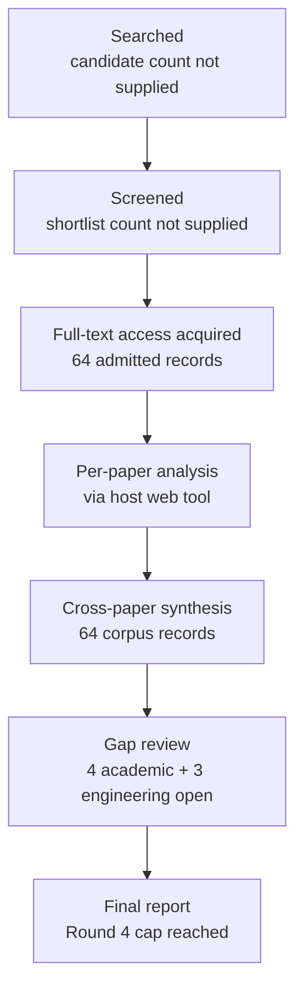

# Research Report: Evidence attribution, factuality, completeness and reliability evaluation for workplace communication systems

## Contents

- [Round History](#round-history)
- [Executive Summary](#executive-summary)
- [Research Question](#research-question)
- [Methodology](#methodology)
- [Papers Reviewed](#papers-reviewed)
- [Research Landscape](#research-landscape)
- [Confidence-Graded Findings](#confidence-graded-findings)
- [Research Gaps](#research-gaps)
- [Practical Recommendations](#practical-recommendations)
- [Evidence Map](#evidence-map)
- [References](#references)
- [Appendix: Run Metadata](#appendix-run-metadata)

## Round History

Iterative gap-closure loop (hard cap: 4 rounds). See `references/iterative-synthesis.md` for the full loop definition.

| Round | Run ID | Topic / Gap Focus | New Papers | Gaps Addressed | Remaining Gaps |
|-------|--------|-------------------|------------|----------------|----------------|
| 1 | e601ba8b9b6f | evidence attribution, factuality, completeness and reliability evaluation for workplace communication systems: what exact evidence supports each decision-relevant statement, whether it is current and correctly attributed, what was omitted, and when the system should abstain | 17 | initial shortlist | 5 academic, 3 engineering |
| 2 | 6ee1939a8f1e | evaluation of calibrated abstention, evidence completeness, and omission for free-form multi-source generation under temporal and distributional change | 20 | 1 resolved | 4 academic, 3 engineering |
| 3 | 59261fd4011a | Integrated evaluation of evidence completeness and omission for temporally evolving multi-source free-form generation, with calibrated selective prediction under non-stationary distribution shift | 14 | 0 resolved | 4 academic, 3 engineering |
| 4 | 1b615a33607c | Joint evaluation and selective prediction for temporally evolving multi-source generation: evidence completeness for compound and partially supported claims, longitudinal omission of superseded or due work-item state, and online calibration under non-stationary streams | 13 | academic gaps of the previous round | 4 academic, 3 engineering |

**Stop reason**: 4-round cap reached

## Executive Summary

This review investigated how a workplace communication system should separately evaluate factual correctness, evidence attribution, evidence completeness, temporal/current-state validity, omission, calibrated confidence, and abstention. Across 64 admitted corpus records spanning 2008–2026, the strongest conclusion is [HIGH] that these reliability dimensions must not be collapsed into a single factuality or faithfulness score: attribution correctness, claim correctness, evidence recall, temporal validity, and report coverage exhibit distinct failure modes [2212.08037] [2305.14627] [2405.00982] [2408.08067]. The literature also strongly supports selective prediction and risk-coverage evaluation, but its guarantees depend on calibration quality, task structure, and distribution-shift assumptions [2006.09462] [2106.00170] [2208.08401] [2606.29054]. The most significant unresolved issue is [HIGH] that no admitted study validates the full joint scheme required by msgloom for compound, multi-source, temporally versioned workplace briefings with omission detection and calibrated abstention. Consequently, the evidence is sufficient to define a decomposed evaluation architecture and engineering test programme, but not to claim an empirically validated end-to-end workplace reliability framework.

**Scope**: 64 corpus records analyzed from 9 full-text access hosts or repositories over 2008–2026  
**Overall Confidence**: Medium  
**Verdict**: HAS_GAPS

## Research Question

The review asked:

> How should msgloom evaluate each decision-relevant statement and report so that claim correctness, exact source attribution, evidence completeness, temporal/current-state correctness, omitted important work, uncertainty calibration, and appropriate abstention are measured independently and traceably, including under multi-source evidence, revisions, distribution shift, and longitudinal work-item change?

The investigation included factual-consistency evaluation, claim decomposition, evidence sufficiency, attribution and citation assessment, completeness and omission metrics, temporal fact verification, selective prediction, risk-coverage analysis, online/conformal calibration under drift, and validation of automated evaluators.

It excluded treating schema validity, fluency, citation presence, raw model confidence, or a single generic hallucination score as semantic correctness. It also did not redefine Topic-specific semantics such as what constitutes the same work item, a valid action, a supersession, a false completion, or a correct response antecedent. Those domain-specific denominators remain owned by the corresponding msgloom Topics.

## Methodology

### Search Strategy

- **Sources**: Papers were read through the host's web tool from full-text pages or full-text documents hosted by arXiv, publisher sites, ACL Anthology, NIST/TREC, NeurIPS proceedings, ResearchGate mirrors, and other supplied publisher repositories.
- **Query variants**:
  - `joint selective prediction temporally evolving multi-source generation: evidence completeness compound partially supported claims, longitudinal omission superseded due work-item state, online calibration under non-stationary streams`
  - `joint selective`
  - `joint prediction temporally evolving multi-source generation: evidence completeness compound partially supported claims, longitudinal omission superseded due work-item state, online calibration under non-stationary streams`
  - `selective prediction temporally evolving multi-source generation: evidence completeness compound partially supported claims, longitudinal omission superseded due work-item state, online calibration under non-stationary streams`
  - `joint selective prediction temporally`
  - `joint selective evolving multi-source`
  - `joint selective generation: evidence`
  - `joint selective completeness compound`
- **Time window**: 2008–2026.
- **Screening**: The supplied run metadata does not specify whether screening used BM25 only or BM25 plus a sub-agent; this detail is unknown.
- **Evidence handling**: The per-paper analysis stage read the admitted papers through the host's web tool. The cross-paper synthesis supplied to this final-report stage was based on the reduced per-paper analyses produced from those readings rather than on re-reading every full paper during report generation.
- **Gap policy**: Component-level transfer evidence was not treated as direct validation of private workplace email or Teams-style data. Open academic and engineering gaps remain explicitly open.

### Pipeline Summary

| Metric | Count |
|--------|-------|
| Total candidates | unknown |
| After screening | unknown |
| Downloaded / full-text accessed | 64 admitted records |
| Successfully converted | unknown |
| Deeply analyzed | 64 corpus records |
| Iterations | 4 |

### Access Level by Paper

Every admitted paper was available at `full_text` level through the host web tool.

| Paper ID | Access Level | Access Host / Repository |
|---|---|---|
| 1707.05555 | full_text | arXiv |
| 1910.12840 | full_text | arXiv |
| 2004.14974 | full_text | arXiv |
| 2006.09462 | full_text | arXiv |
| 2012.14983 | full_text | arXiv |
| 2105.00071 | full_text | arXiv |
| 2106.00170 | full_text | arXiv |
| 2111.09525 | full_text | arXiv |
| 2204.02007 | full_text | arXiv |
| 2208.02814 | full_text | arXiv |
| 2208.08401 | full_text | arXiv |
| 2212.08037 | full_text | arXiv |
| 2302.07869 | full_text | arXiv |
| 2305.11859 | full_text | arXiv |
| 2305.14627 | full_text | arXiv |
| 2307.09254 | full_text | arXiv |
| 2312.09300 | full_text | arXiv |
| 2402.05629 | full_text | arXiv |
| 2404.00474 | full_text | arXiv |
| 2404.15588 | full_text | arXiv |
| 2405.00982 | full_text | arXiv |
| 2406.07967 | full_text | arXiv |
| 2408.08067 | full_text | arXiv |
| 2410.14964 | full_text | arXiv |
| 2505.23912 | full_text | arXiv |
| 2508.20867 | full_text | arXiv |
| 2509.26184 | full_text | arXiv |
| 2510.07238 | full_text | arXiv |
| 2510.12839 | full_text | arXiv |
| 2511.01101 | full_text | arXiv |
| 2511.16198 | full_text | arXiv |
| 2512.17776 | full_text | arXiv |
| 2602.11908 | full_text | arXiv |
| 2602.16537 | full_text | arXiv |
| 2604.03141 | full_text | arXiv |
| 2604.12046 | full_text | arXiv |
| 2605.01749 | full_text | arXiv |
| 2605.03534 | full_text | arXiv |
| 2605.06635 | full_text | arXiv |
| 2605.16354 | full_text | arXiv |
| 2606.00093 | full_text | arXiv |
| 2606.27736 | full_text | arXiv |
| 2606.29054 | full_text | arXiv |
| 2607.03870 | full_text | arXiv |
| 2607.08700 | full_text | arXiv |
| 2607.19322 | full_text | arXiv |
| 2608.11238 | full_text | arXiv |
| 2608.22483 | full_text | arXiv |
| doi-10-1016-j-jisa-2025-104120 | full_text | ScienceDirect |
| doi-10-1017-s1351324909005051 | full_text | ResearchGate |
| doi-10-1038-s41598-026-40637-w | full_text | Nature |
| doi-10-1109-access-2026-3679691 | full_text | ResearchGate |
| doi-10-1155-2016-1340973 | full_text | Wiley |
| doi-10-1162-tacl-a-00407 | full_text | arXiv |
| doi-10-1609-aaai-v40i40-40667 | full_text | arXiv |
| doi-10-18653-v1-2021-acl-long-84 | full_text | ACL Anthology |
| doi-10-18653-v1-2025-acl-long-837 | full_text | ACL Anthology |
| doi-10-18653-v1-w19-8642 | full_text | ACL Anthology |
| doi-10-32604-cmc-2026-086343 | full_text | TechScience |
| doi-10-6028-nist-sp-500-321-realtime-overview | full_text | NIST/TREC |
| manual-2be3626f9e | full_text | arXiv |
| manual-32d5793dca | full_text | NeurIPS proceedings |
| manual-39435af3dd | full_text | NIST/TAC |
| manual-f5ce52cae2 | full_text | ACL Anthology |

For decomposed evaluation, useful conceptual quantities include evidence precision and recall:

$P_e=\frac{\text{correctly supporting cited evidence}}{\text{all cited evidence}}$

$R_e=\frac{\text{required supporting evidence represented}}{\text{all required supporting evidence}}$

These should not be substituted for claim correctness or temporal validity. Selective prediction additionally requires coverage and risk to be reported together:

$C(\tau)=P(s(x)\ge \tau)$

$R(\tau)=\mathbb{E}[\ell(\hat{y},y)\mid s(x)\ge\tau]$

where $s(x)$ is the acceptance score and $\ell$ is the application-relevant loss. Scalar calibration may also be summarized through quantities such as expected calibration error,

$\mathrm{ECE}=\sum_{b=1}^{B}\frac{|S_b|}{n}\left|\operatorname{acc}(S_b)-\operatorname{conf}(S_b)\right|$,

but the reviewed literature supports treating scalar calibration as complementary to, not a replacement for, risk-coverage analysis [2006.09462] [doi-10-1162-tacl-a-00407] [2608.22483].

## Papers Reviewed

| # | Title | Authors | Year | Venue | Quality Score | Relevance |
|---|-------|---------|------|-------|--------------|-----------|
| 1 | Conformal selective prediction with cost aware deferral for safe clinical triage under distribution shift [doi-10-1038-s41598-026-40637-w] | Hyun Kwon, Dae-Jin Kim | 2026 | unknown | unknown | admitted |
| 2 | Selective Question Answering under Domain Shift [2006.09462] | Amita Kamath, Robin Jia, Percy Liang | 2020 | unknown | unknown | admitted |
| 3 | The Art of Abstention: Selective Prediction and Error Regularization for Natural Language Processing [doi-10-18653-v1-2021-acl-long-84] | Ji Xin, Raphael Tang, Yaoliang Yu et al. | 2021 | unknown | unknown | admitted |
| 4 | COIN: Uncertainty-Guarding Selective Question Answering for Foundation Models with Provable Risk Guarantees [doi-10-1609-aaai-v40i40-40667] | Zhiyuan Wang, Jinhao Duan, Qingni Wang et al. | 2026 | unknown | unknown | admitted |
| 5 | Optimal Strategies for Reject Option Classifiers [manual-2be3626f9e] | Vojtech Franc, Daniel Prusa, Vaclav Voracek | 2023 | unknown | unknown | admitted |
| 6 | Conformal Risk Control [2208.02814] | Anastasios N. Angelopoulos, Stephen Bates, Adam Fisch et al. | 2022 | unknown | unknown | admitted |
| 7 | ToE: A Hierarchical and Explainable Claim Verification Framework with Dynamic Multi-source Evidence Retrieval and Aggregation [2606.27736] | Zhaoqi Wang, Zijian Zhang, Kun Zheng et al. | 2026 | unknown | unknown | admitted |
| 8 | Conformal prediction for labelling and updating online models in the presence of concept drift in cybersecurity [doi-10-1016-j-jisa-2025-104120] | authors unknown | 2025 | unknown | unknown | admitted |
| 9 | Conformal Inference for Online Prediction with Arbitrary Distribution Shifts [2208.08401] | Isaac Gibbs, Emmanuel Candès | 2022 | unknown | unknown | admitted |
| 10 | Fact Checking with Insufficient Evidence [2204.02007] | Pepa Atanasova, Jakob Grue Simonsen, Christina Lioma et al. | 2022 | unknown | unknown | admitted |
| 11 | Mining Sequential Update Summarization with Hierarchical Text Analysis [doi-10-1155-2016-1340973] | authors unknown | 2016 | unknown | unknown | admitted |
| 12 | Complex Claim Verification with Evidence Retrieved in the Wild [2305.11859] | Jifan Chen, Grace Kim, Aniruddh Sriram et al. | 2023 | unknown | unknown | admitted |
| 13 | TSVer: A Benchmark for Fact Verification Against Time-Series Evidence [2511.01101] | Marek Strong, Andreas Vlachos | 2025 | unknown | unknown | admitted |
| 14 | Do LLMs Know When Evidence is Insufficient? An Evidence Sufficiency Benchmark for Answer-Abstention Calibration in Retrieval-Augmented Generation [doi-10-32604-cmc-2026-086343] | Hantian Zhang, Wentai Wu | 2026 | unknown | unknown | admitted |
| 15 | Fact or Fiction: Verifying Scientific Claims [2004.14974] | David Wadden, Shanchuan Lin, Kyle Lo et al. | 2020 | unknown | unknown | admitted |
| 16 | When Benchmarks Age: Temporal Misalignment through Large Language Model Factuality Evaluation [2510.07238] | Xunyi Jiang, Dingyi Chang, Julian McAuley et al. | 2026 | unknown | unknown | admitted |
| 17 | ReproHum #0892-01: The painful route to consistent results: A reproduction study of human evaluation in NLG [manual-f5ce52cae2] | Irene Mondella, Huiyuan Lai, Malvina Nissim | 2024 | unknown | unknown | admitted |
| 18 | ChronoFact: Timeline-based Temporal Fact Verification [2410.14964] | Anab Maulana Barik, Wynne Hsu, Mong Li Lee | 2025 | unknown | unknown | admitted |
| 19 | Runtime Verification of Temporal Properties over Out-of-order Data Streams [1707.05555] | David Basin, Felix Klaedtke, Eugen Zălinescu | 2017 | unknown | unknown | admitted |
| 20 | Evaluating the Factual Consistency of Abstractive Text Summarization [1910.12840] | Wojciech Kryściński, Bryan McCann, Caiming Xiong et al. | 2020 | unknown | unknown | admitted |
| 21 | Attributed Question Answering: Evaluation and Modeling for Attributed Large Language Models [2212.08037] | Bernd Bohnet, Vinh Q. Tran, Pat Verga et al. | 2022 | unknown | unknown | admitted |
| 22 | Cited but Not Verified: Parsing and Evaluating Source Attribution in LLM Deep Research Agents [2605.06635] | Hailey Onweller, Elias Lumer, Austin Huber et al. | 2026 | unknown | unknown | admitted |
| 23 | Do You Need a Frontier Model as a Citation Verifier? Benchmarking Rubric LLMs for Deep-Research Source Attribution [2607.08700] | Ethan Leung, Elias Lumer, Corey Feld et al. | 2026 | unknown | unknown | admitted |
| 24 | Formal and functional assessment of the pyramid method for summary content evaluation [doi-10-1017-s1351324909005051] | Rebecca J. Passonneau | 2010 | unknown | unknown | admitted |
| 25 | Agreement Metrics for LLM-as-Judge Evaluation: What to Report and Why [2606.00093] | Delip Rao, Chris Callison-Burch | 2026 | unknown | unknown | admitted |
| 26 | Augmenting Human Evaluation with LLM Judges: How Many Human Reviews Do You Need? [2605.16354] | Jane Paik Kim | 2026 | unknown | unknown | admitted |
| 27 | SummaC: Re-Visiting NLI-based Models for Inconsistency Detection in Summarization [2111.09525] | Philippe Laban, Tobias Schnabel, Paul N. Bennett et al. | 2022 | unknown | unknown | admitted |
| 28 | Enabling Large Language Models to Generate Text with Citations [2305.14627] | Tianyu Gao, Howard Yen, Jiatong Yu et al. | 2023 | unknown | unknown | admitted |
| 29 | Better than Random: Reliable NLG Human Evaluation with Constrained Active Sampling [2406.07967] | Jie Ruan, Xiao Pu, Mingqi Gao et al. | 2024 | unknown | unknown | admitted |
| 30 | How Can We Know When Language Models Know? On the Calibration of Language Models for Question Answering [doi-10-1162-tacl-a-00407] | Zhengbao Jiang, Jun Araki, Haibo Ding et al. | 2021 | unknown | unknown | admitted |
| 31 | Linguistic Calibration of Long-Form Generations [2404.00474] | Neil Band, Xuechen Li, Tengyu Ma et al. | 2024 | unknown | unknown | admitted |
| 32 | Claim-Level Confidence Calibration for Reliable Decision Making with Large Language Models [2608.22483] | Toghrul Abbasli, Kentaroh Toyoda, Yuan Wang et al. | 2026 | unknown | unknown | admitted |
| 33 | Only Say What You Know: Calibration-Aware Generation for Long-Form Factuality [2605.01749] | Wen Luo, Guangyue Peng, Liang Wang et al. | 2026 | unknown | unknown | admitted |
| 34 | Program-Verifiable Evaluation for Temporal QA: Metrics for Evidence Validity [doi-10-1109-access-2026-3679691] | Beomseok Kim, Hoansuk Choi, Namhyun Yoo et al. | 2026 | unknown | unknown | admitted |
| 35 | Minimal Evidence Group Identification for Claim Verification [2404.15588] | Xiangci Li, Sihao Chen, Rajvi Kapadia et al. | 2025 | unknown | unknown | admitted |
| 36 | SURE-RAG: Sufficiency and Uncertainty-Aware Evidence Verification for Selective Retrieval-Augmented Generation [2605.03534] | Jingxi Qiu, Zeyu Han, Cheng Huang | 2026 | unknown | unknown | admitted |
| 37 | MSRS: Evaluating Multi-Source Retrieval-Augmented Generation [2508.20867] | Rohan Phanse, Yijie Zhou, Kejian Shi et al. | 2025 | unknown | unknown | admitted |
| 38 | Adaptive Conformal Inference Under Distribution Shift [2106.00170] | Isaac Gibbs, Emmanuel Candès | 2021 | unknown | unknown | admitted |
| 39 | When Can Conformal Risk Control Certify LLM Outputs? Bounds, Impossibility, and Adaptation for Structured Generation [2606.29054] | Varun Kotte | 2026 | unknown | unknown | admitted |
| 40 | DEER: A Benchmark for Evaluating Deep Research Agents on Expert Report Generation [2512.17776] | Janghoon Han, Heegyu Kim, Changho Lee et al. | 2025 | unknown | unknown | admitted |
| 41 | Auto-ARGUE: LLM-Based Report Generation Evaluation [2509.26184] | William Walden, Marc Mason, Orion Weller et al. | 2025 | unknown | unknown | admitted |
| 42 | Self-Evaluation Improves Selective Generation in Large Language Models [2312.09300] | Jie Ren, Yao Zhao, Tu Vu et al. | 2023 | unknown | unknown | admitted |
| 43 | LoVeC: Reinforcement Learning for Better Verbalized Confidence in Long-Form Generation [2505.23912] | Caiqi Zhang, Xiaochen Zhu, Chengzu Li et al. | 2025 | unknown | unknown | admitted |
| 44 | Two-Level Meta-Rubrics for Evaluating Open-Ended Generation: GAMUT, a Benchmark for Factual Completeness [2607.19322] | Xilun Chen, Zhaleh Feizollahi, Ross Goodwin et al. | 2026 | unknown | unknown | admitted |
| 45 | Selective Generation for Controllable Language Models [2307.09254] | Minjae Lee, Kyungmin Kim, Taesoo Kim et al. | 2023 | unknown | unknown | admitted |
| 46 | Validating LLM-as-a-Judge Systems under Rating Indeterminacy [manual-32d5793dca] | Luke Guerdan, Solon Barocas, Kenneth Holstein et al. | 2025 | unknown | unknown | admitted |
| 47 | Reducing Conversational Agents’ Overconfidence Through Linguistic Calibration [2012.14983] | Sabrina J. Mielke, Arthur Szlam, Emily Dinan et al. | 2022 | unknown | unknown | admitted |
| 48 | Think Through Uncertainty: Improving Long-Form Generation Factuality via Reasoning Calibration [2604.12046] | Xin Liu, Lu Wang | 2026 | unknown | unknown | admitted |
| 49 | Agreement is overrated: A plea for correlation to assess human evaluation reliability [doi-10-18653-v1-w19-8642] | Jacopo Amidei, Paul Piwek, Alistair Willis | 2019 | unknown | unknown | admitted |
| 50 | Can LLMs Evaluate Complex Attribution in QA? Automatic Benchmarking using Knowledge Graphs [doi-10-18653-v1-2025-acl-long-837] | Nan Hu, Jiaoyan Chen, Yike Wu et al. | 2025 | unknown | unknown | admitted |
| 51 | FaStFACT: Faster, Stronger Long-Form Factuality Evaluations in LLMs [2510.12839] | Yingjia Wan, Haochen Tan, Xiao Zhu et al. | 2025 | unknown | unknown | admitted |
| 52 | SemanticCite: Citation Verification with AI-Powered Full-Text Analysis and Evidence-Based Reasoning [2511.16198] | Sebastian Haan | 2025 | unknown | unknown | admitted |
| 53 | RAGChecker: A Fine-grained Framework for Diagnosing Retrieval-Augmented Generation [2408.08067] | Dongyu Ru, Lin Qiu, Xiangkun Hu et al. | 2024 | unknown | unknown | admitted |
| 54 | Optimal training-conditional regret for online conformal prediction [2602.16537] | Jiadong Liang, Zhimei Ren, Yuxin Chen | 2026 | unknown | unknown | admitted |
| 55 | When Should LLMs Be Less Specific? Selective Abstraction for Reliable Long-Form Text Generation [2602.11908] | Shani Goren, Ido Galil, Ran El-Yaniv | 2026 | unknown | unknown | admitted |
| 56 | Improved Online Conformal Prediction via Strongly Adaptive Online Learning [2302.07869] | Aadyot Bhatnagar, Huan Wang, Caiming Xiong et al. | 2023 | unknown | unknown | admitted |
| 57 | Overview of the TAC 2008 Update Summarization Task [manual-39435af3dd] | Hoa Trang Dang, Karolina K. Owczarzak | 2008 | unknown | unknown | admitted |
| 58 | Evaluating LLM Uncertainty in Long-Form Generation Using Deterministic Ground Truth [2607.03870] | Ido Amit, Ido Galil, Ran El-Yaniv | 2026 | unknown | unknown | admitted |
| 59 | Overview of the TREC 2016 Real-Time Summarization Track [doi-10-6028-nist-sp-500-321-realtime-overview] | Jimmy Lin, Adam Roegiest, Luchen Tan et al. | 2016 | unknown | unknown | admitted |
| 60 | On the Evaluation of Machine-Generated Reports [2405.00982] | James Mayfield, Eugene Yang, Dawn Lawrie et al. | 2024 | unknown | unknown | admitted |
| 61 | Beyond Precision: Importance-Aware Recall for Factuality Evaluation in Long-Form LLM Generation [2604.03141] | Nazanin Jafari, James Allan, Mohit Iyyer | 2026 | unknown | unknown | admitted |
| 62 | Evaluating Attribution in Dialogue Systems: The BEGIN Benchmark [2105.00071] | Nouha Dziri, Hannah Rashkin, Tal Linzen et al. | 2022 | unknown | unknown | admitted |
| 63 | Merging Facts, Crafting Fallacies: Evaluating the Contradictory Nature of Aggregated Factual Claims in Long-Form Generations [2402.05629] | Cheng-Han Chiang, Hung-yi Lee | 2024 | unknown | unknown | admitted |
| 64 | Towards Query-Agnostic RAG Evaluation via Query Coverage and Claim Verifiability [2608.11238] | Jeonghwan Choi, Taewon Yun, Minjeong Ban et al. | 2026 | unknown | unknown | admitted |

## Research Landscape

### Theme 1: Dimension-Separated Reliability Evaluation

**Coverage**: at least 4 directly supporting papers | **Confidence**: High  
**Supporting papers**: [2212.08037], [2305.14627], [2405.00982], [2408.08067]

[HIGH] Across attributed QA, citation-grounded generation, machine-generated reports, and RAG diagnosis, factual correctness, attribution correctness, evidence completeness, and omission are empirically separable dimensions rather than interchangeable labels [2212.08037] [2305.14627] [2405.00982] [2408.08067].

Key findings:

1. [HIGH] Attribution quality must evaluate whether the supplied evidence actually supports the claim, rather than merely checking whether a citation exists [2212.08037] [2305.14627].
2. [HIGH] Retrieval quality and generation quality require separate diagnosis because errors can arise from missing evidence or from failing to use available evidence correctly [2408.08067].
3. [HIGH] Report evaluation requires coverage or omission measures in addition to factual correctness [2405.00982].

### Theme 2: Atomic Claims, Composition, and Evidence Sufficiency

**Coverage**: at least 10 directly supporting papers | **Confidence**: High  
**Supporting papers**: [1910.12840], [2111.09525], [2402.05629], [2510.12839], [2604.03141], [2204.02007], [2305.11859], [2404.15588], [2508.20867], [doi-10-18653-v1-2025-acl-long-837], [doi-10-32604-cmc-2026-086343]

[HIGH] Fine-grained decomposition improves factual-consistency diagnosis and evidence localization, but atomic verification alone is insufficient when independently supported statements compose into an incorrect aggregate, mix entities, or conceal contradiction [1910.12840] [2111.09525] [2402.05629] [2510.12839] [2604.03141].

Key findings:

1. [HIGH] Incomplete or insufficient evidence is a distinct condition from contradiction or support and should be represented explicitly [2204.02007] [doi-10-32604-cmc-2026-086343].
2. [HIGH] Complex claims may require multiple complementary evidence items rather than one evidence passage [2305.11859] [2404.15588] [2508.20867].
3. [HIGH] Evaluation should operate at both the atomic-claim level and a higher compositional level because local support does not guarantee globally correct synthesis [2402.05629] [2604.03141].

### Theme 3: Temporal Validity and Current-State Correctness

**Coverage**: at least 4 directly supporting papers | **Confidence**: High  
**Supporting papers**: [2510.07238], [doi-10-1109-access-2026-3679691], [2410.14964], [1707.05555]

[HIGH] Temporal validity is separable from generic factual support: benchmark aging can make labels stale, an evidence item can support a fact without supporting it at the queried time, and out-of-order observations complicate current-state reconstruction [2510.07238] [doi-10-1109-access-2026-3679691] [2410.14964] [1707.05555].

Key findings:

1. [HIGH] Evidence validity should be evaluated relative to an explicit observation or query time, not only by semantic entailment [doi-10-1109-access-2026-3679691] [2410.14964].
2. [HIGH] Evaluation datasets themselves can become temporally misaligned with current truth [2510.07238].
3. [HIGH] Out-of-order arrival requires reasoning over event/order semantics rather than treating ingestion order as truth order [1707.05555].

### Theme 4: Omission, Coverage, Novelty, and Repetition

**Coverage**: at least 6 directly supporting papers | **Confidence**: High  
**Supporting papers**: [2405.00982], [doi-10-1017-s1351324909005051], [doi-10-1155-2016-1340973], [doi-10-6028-nist-sp-500-321-realtime-overview], [manual-39435af3dd], [2607.19322]

[HIGH] Report and update-summarization evaluation can measure content coverage separately from repetition or redundancy through content units, nuggets, novelty judgments, or completeness rubrics [2405.00982] [doi-10-1017-s1351324909005051] [doi-10-1155-2016-1340973] [doi-10-6028-nist-sp-500-321-realtime-overview] [manual-39435af3dd] [2607.19322].

Key findings:

1. [HIGH] Recall-like coverage is necessary because precision-oriented factuality alone does not identify missing important information [2405.00982] [2604.03141] [2607.19322].
2. [HIGH] Novelty and redundancy can be evaluated separately in incremental/update settings [doi-10-1155-2016-1340973] [doi-10-6028-nist-sp-500-321-realtime-overview] [manual-39435af3dd].
3. [HIGH] The admitted literature does not directly test omission of longitudinal workplace states such as open, due, resolved, or superseded work items; this remains an open gap rather than an established method.

### Theme 5: Selective Prediction and Abstention

**Coverage**: at least 6 directly supporting papers | **Confidence**: High  
**Supporting papers**: [2006.09462], [doi-10-1162-tacl-a-00407], [2312.09300], [doi-10-18653-v1-2021-acl-long-84], [2605.03534], [2608.22483]

[HIGH] Confidence-based selective prediction can lower risk among accepted outputs, but raw model likelihood and uncalibrated probabilities are unreliable selectors in important settings, especially under domain shift [2006.09462] [doi-10-1162-tacl-a-00407] [2312.09300] [doi-10-18653-v1-2021-acl-long-84] [2605.03534] [2608.22483].

Key findings:

1. [HIGH] Abstention must be evaluated together with coverage; evaluating only accepted-case accuracy can reward systems that simply reject difficult cases [2006.09462] [doi-10-18653-v1-2021-acl-long-84].
2. [HIGH] Calibration quality, discrimination/ranking quality, and factual accuracy are separate properties [doi-10-1162-tacl-a-00407] [2608.22483].
3. [HIGH] Evidence insufficiency can be used as an explicit trigger for selective answering rather than forcing a binary supported/unsupported generation decision [2605.03534].

### Theme 6: Online Calibration under Distribution Shift

**Coverage**: at least 5 directly supporting papers | **Confidence**: High  
**Supporting papers**: [2106.00170], [2208.08401], [2302.07869], [2602.16537], [2606.29054]

[HIGH] Online and adaptive conformal methods provide mechanisms for maintaining coverage-related guarantees under changing distributions, but the exact guarantees depend on assumptions and locality, and structured-generation experiments show that static conformal risk control or straightforward adaptive procedures can fail under severe cross-dataset shift [2106.00170] [2208.08401] [2302.07869] [2602.16537] [2606.29054].

Key findings:

1. [HIGH] Non-stationarity requires adaptation; one calibration threshold should not be assumed valid indefinitely [2106.00170] [2208.08401].
2. [HIGH] Strongly adaptive and online methods provide relevant theoretical mechanisms for changing streams [2302.07869] [2602.16537].
3. [HIGH] Transfer of these guarantees to structured free-form generation is not automatic, and failure under severe dataset shift is empirically documented [2606.29054].

### Theme 7: Linguistic and Verbalized Confidence

**Coverage**: at least 5 directly supporting papers | **Confidence**: Medium  
**Supporting papers**: [2012.14983], [2404.00474], [2505.23912], [2607.03870], [2604.12046]

[MEDIUM] Verbalized or linguistic confidence can be trained to better correspond to factual correctness or reader beliefs, but calibration, confidence ranking, and factual accuracy remain distinct objectives and can move differently under intervention [2012.14983] [2404.00474] [2505.23912] [2607.03870] [2604.12046].

Key findings:

1. [MEDIUM] User-visible uncertainty language can be calibrated more systematically than uncontrolled hedging [2012.14983] [2404.00474].
2. [MEDIUM] Improving verbalized confidence does not by itself prove improved factual accuracy or selective ranking [2505.23912] [2607.03870].
3. [MEDIUM] Reasoning- or calibration-oriented interventions can improve aspects of factual generation, but their transfer to workplace reliability remains unvalidated [2604.12046].

### Theme 8: Human Review and Automated Evaluator Validation

**Coverage**: at least 7 directly supporting papers | **Confidence**: High  
**Supporting papers**: [2212.08037], [2509.26184], [2406.07967], [2605.16354], [2606.00093], [2607.08700], [manual-32d5793dca]

[HIGH] Automated evaluators and LLM judges can provide useful aggregate signals, but item-level agreement, abstention handling, directional error bias, and rating indeterminacy materially affect interpretation; they therefore require human validation rather than being treated as ground truth [2212.08037] [2509.26184] [2406.07967] [2605.16354] [2606.00093] [2607.08700] [manual-32d5793dca].

Key findings:

1. [HIGH] System-level agreement can conceal item-level disagreement or directional error [2606.00093] [2607.08700].
2. [HIGH] Controlled sampling can reduce human-evaluation burden without eliminating human grounding [2406.07967] [2605.16354].
3. [HIGH] Rating indeterminacy requires explicit treatment rather than assuming one deterministic judge label is always correct [manual-32d5793dca].

### Theme 9: Retrieval and Generation as Separate Failure Sources

**Coverage**: at least 4 directly supporting papers | **Confidence**: High  
**Supporting papers**: [2004.14974], [2305.14627], [2408.08067], [2508.20867]

[HIGH] Retrieval and generation are separable bottlenecks: stronger evidence retrieval generally improves downstream factual performance, but access to high-quality or near-oracle evidence does not eliminate unsupported generation, evidence misuse, or omission [2004.14974] [2305.14627] [2408.08067] [2508.20867].

Key findings:

1. [HIGH] Retrieval recall should be evaluated independently from whether generated claims use retrieved evidence correctly [2408.08067].
2. [HIGH] Multi-source availability does not guarantee that all necessary evidence is integrated into the answer [2508.20867].
3. [HIGH] End-to-end failure attribution requires distinguishing retrieval insufficiency from generation failure [2004.14974] [2305.14627].

## Methodology Comparison

| Approach | Papers | Strengths | Weaknesses | Best For | Performance |
|----------|--------|-----------|------------|----------|-------------|
| Atomic / fine-grained factuality diagnosis | [1910.12840] [2111.09525] [2510.12839] | Localizes unsupported or inconsistent claims | Can miss composition-level contradiction or entity mixing | Claim-level correctness | Numerical results not compared across heterogeneous benchmarks |
| Attribution / citation evaluation | [2212.08037] [2305.14627] [2605.06635] [2607.08700] | Tests whether evidence actually supports generated claims | Does not by itself establish completeness or temporal validity | Evidence traceability | Cross-paper numerical comparison not valid |
| Evidence-sufficiency and multi-source verification | [2204.02007] [2305.11859] [2404.15588] [2508.20867] [2605.03534] | Handles insufficient and complementary evidence | No single admitted method jointly covers compound, partial, multi-source, and temporal evidence | Complex evidence status | Component-level evidence only |
| Content-unit / report coverage evaluation | [doi-10-1017-s1351324909005051] [2405.00982] [2604.03141] [2607.19322] | Measures omission and importance-aware recall | Target units are task-dependent | Report completeness | No common numerical scale across studies |
| Temporal verification | [2410.14964] [2510.07238] [doi-10-1109-access-2026-3679691] | Makes time validity explicit | Does not directly model all workplace revision semantics | Current-state evaluation | Dataset-specific |
| Selective prediction / reject option | [2006.09462] [doi-10-18653-v1-2021-acl-long-84] [manual-2be3626f9e] [2312.09300] | Explicit accuracy-coverage trade-off | Selector quality can degrade under shift | Abstention policy | Use risk-coverage curves rather than one aggregate number |
| Adaptive / online conformal methods | [2106.00170] [2208.08401] [2302.07869] [2602.16537] | Formal adaptation mechanisms for changing streams | Guarantees vary by assumptions and may not transfer directly to structured generation | Non-stationary calibration | Structured-generation caveat documented by [2606.29054] |
| LLM-assisted evaluation with human validation | [2406.07967] [2605.16354] [2606.00093] [manual-32d5793dca] | Can reduce human-review cost | Judge bias, indeterminacy, and evaluator overfitting remain | Scalable evaluation | Requires independent human validation |

## Confidence-Graded Findings

### 🟢 High Confidence (supported by 3+ papers with consistent results)

1. **[HIGH] Claim correctness, attribution correctness, evidence completeness, and report completeness are distinct evaluation dimensions.** — Supported by [2212.08037], [2305.14627], [2405.00982], [2408.08067]. A system can therefore be correct on one axis and fail on another.

2. **[HIGH] Atomic decomposition is useful but should be paired with composition-level checks.** — Supported by [1910.12840], [2111.09525], [2402.05629], [2510.12839], [2604.03141]. Independently supported atomic claims can still form a contradictory or incorrectly aggregated whole.

3. **[HIGH] Incomplete, partially supportive, and distributed multi-source evidence require richer status than binary support.** — Supported by [2204.02007], [2305.11859], [2404.15588], [2508.20867], [doi-10-18653-v1-2025-acl-long-837], [doi-10-32604-cmc-2026-086343].

4. **[HIGH] Temporal/current-state correctness is not implied by generic factual support.** — Supported by [2510.07238], [doi-10-1109-access-2026-3679691], [2410.14964], [1707.05555].

5. **[HIGH] Omission/coverage and repetition/redundancy can and should be measured separately.** — Supported by [2405.00982], [doi-10-1017-s1351324909005051], [doi-10-1155-2016-1340973], [doi-10-6028-nist-sp-500-321-realtime-overview], [manual-39435af3dd], [2607.19322].

6. **[HIGH] Selective prediction is better evaluated through the risk-coverage relationship than through accepted-case accuracy alone.** — Supported by [2006.09462], [doi-10-1162-tacl-a-00407], [2312.09300], [doi-10-18653-v1-2021-acl-long-84], [2605.03534], [2608.22483].

7. **[HIGH] Non-stationary streams require adaptive calibration mechanisms, but formal or empirical guarantees are regime-dependent.** — Supported by [2106.00170], [2208.08401], [2302.07869], [2602.16537], [2606.29054].

8. **[HIGH] Automated evaluators require independent human validation and directional error analysis.** — Supported by [2406.07967], [2605.16354], [2606.00093], [2607.08700], [manual-32d5793dca].

9. **[HIGH] Retrieval and generation errors should be diagnosed separately.** — Supported by [2004.14974], [2305.14627], [2408.08067], [2508.20867].

### 🟡 Medium Confidence (supported by 1-2 papers or with caveats)

1. **[MEDIUM] Linguistic or verbalized confidence can be useful as a user-facing uncertainty channel, but improvements in verbal calibration do not guarantee improved factuality or ranking quality.** — Supported across related but heterogeneous settings by [2012.14983], [2404.00474], [2505.23912], [2607.03870], [2604.12046]. The main caveat is transfer from benchmarked dialogue or long-form generation to workplace communication.

2. **[MEDIUM] The component-level techniques in this corpus are likely transferable as evaluation mechanisms to msgloom, but their absolute benchmark results are not evidence of production-email accuracy.** — This conclusion follows from the heterogeneity of the admitted task domains and the absence of direct private-workplace evaluation.

### 🔴 Low Confidence (preliminary, single-source, or contradicted)

1. **[LOW] No positive target-domain end-to-end claim is retained at low confidence.** The literature has not yet validated the complete msgloom evaluation scheme; those uncertainties are represented below as open gaps instead of being promoted into weak findings.

## Trade-Off Analysis

| Decision | Option A | Option B | Recommendation |
|----------|----------|----------|----------------|
| One aggregate reliability score vs decomposed metrics | Simple dashboard, but hides which failure occurred | Separate correctness, attribution, completeness, temporal, omission, and calibration denominators | Use decomposed metrics; aggregate only for presentation and never as the sole acceptance criterion [2212.08037] [2405.00982] [2408.08067] |
| Atomic verification vs whole-output verification | High localization and diagnostic value | Detects composition-level conflicts that atomic checks may miss | Run both levels [2402.05629] [2604.03141] |
| Binary evidence status vs multi-state evidence status | Simpler labels | Captures partial, insufficient, conflicting, and complementary evidence | Use multi-state evidence status [2204.02007] [2404.15588] [doi-10-32604-cmc-2026-086343] |
| Fixed threshold vs adaptive selective prediction | Operational simplicity | Better suited to distribution drift but more complex | Evaluate adaptive methods on shifted streams; do not assume stationary thresholds remain valid [2106.00170] [2208.08401] [2606.29054] |
| Automatic judge only vs human-grounded hybrid | Cheap and scalable | Higher validation cost but exposes judge bias and indeterminacy | Use automated judges for development/triage and independent human review for acceptance [2406.07967] [2605.16354] [manual-32d5793dca] |
| Accuracy alone vs risk plus coverage | Easy to report but can hide mass abstention | Makes accepted-risk/coverage trade-off visible | Report both $R(\tau)$ and $C(\tau)$ [2006.09462] [doi-10-18653-v1-2021-acl-long-84] |
| Current evidence snapshot vs cutoff-based temporal replay | Simpler benchmark | Detects stale, superseded, or late-arriving evidence problems | Evaluate at explicit observation cutoffs [1707.05555] [2410.14964] [doi-10-1109-access-2026-3679691] |

## Points of Agreement **[EVIDENCE REQUIRED]**

1. **[HIGH] Reliability is multidimensional rather than one universal factuality score.** — Confirmed across attributed QA, citation generation, report evaluation, and RAG diagnosis [2212.08037] [2305.14627] [2405.00982] [2408.08067].

2. **[HIGH] Evidence sufficiency is a first-class evaluation problem.** — Insufficient, partial, or distributed evidence produces failures not captured by simple claim-support classification [2204.02007] [2305.11859] [2404.15588] [doi-10-32604-cmc-2026-086343].

3. **[HIGH] Temporal validity must be evaluated explicitly.** — Current truth can diverge from stale labels or otherwise factually related evidence [2510.07238] [2410.14964] [doi-10-1109-access-2026-3679691].

4. **[HIGH] Selective systems must report coverage together with risk or accuracy.** — Abstention changes which cases are evaluated and therefore cannot be silently excluded [2006.09462] [doi-10-18653-v1-2021-acl-long-84] [2312.09300].

5. **[HIGH] Automatic evaluation should not be treated as independent ground truth without validation.** — Judge error, agreement choice, abstention handling, and rating indeterminacy affect conclusions [2606.00093] [2607.08700] [manual-32d5793dca] [2605.16354].

6. **[HIGH] Retrieval and generation should be separately observable in end-to-end evaluation.** — Oracle or improved evidence access does not remove generation-side omission or unsupported claims [2004.14974] [2305.14627] [2408.08067] [2508.20867].

## Points of Contradiction **[EVIDENCE REQUIRED]**

1. **[HIGH] No direct contradiction was identified under genuinely comparable task, dataset, and evaluation conditions.** Apparent tensions are better interpreted as scope qualifications:
   - Selective-prediction confidence can be effective in some settings [doi-10-18653-v1-2021-acl-long-84], while shifted QA exposes substantial overconfidence and selector degradation [2006.09462].
   - Adaptive conformal methods provide strong results for non-stationary prediction in their studied settings [2106.00170] [2208.08401], while structured-generation experiments show that static conformal risk control and ACI can violate emitted-risk targets under severe cross-dataset shift [2606.29054].
   - **Possible explanation**: datasets, loss functions, prediction structures, shift severity, and guarantee definitions differ.
   - **Implication**: these results should not be collapsed into a universal statement that conformal or confidence-based selective prediction either always succeeds or always fails.

## Research Gaps

The seven gaps below remain open. The literature has not answered them yet, and none is presented as accepted or closed.

| # | Gap | Type | Severity | Rounds Already Searched / Reviewed | Impact on Goals |
|---|-----|------|----------|------------------------------------|-----------------|
| 1 | No single validated end-to-end scheme jointly measures claim correctness, attribution, evidence completeness, temporal/current-state correctness, omission, calibrated uncertainty, and abstention with separate denominators. | [ACADEMIC] | HIGH | 1–4 | Prevents claiming that the complete msgloom reliability framework is empirically validated. |
| 2 | No direct target-domain evaluation on private workplace email or Teams-style communication with revisions, quoted history, conflicts, delayed/out-of-order arrival, versioned attachments, and permission constraints. | [ENGINEERING] | HIGH | 1–4 corpus reviewed; not literature-closable | Prevents production-domain claims and leaves adversarial target fixtures unvalidated. |
| 4 | No general evidence-completeness method jointly handles compound claims, partial support, complementary multi-source evidence, and temporal versioning. | [ACADEMIC] | HIGH | 1–4 | Risks calling a statement “supported” while omitting evidence needed for the complete compound claim. |
| 5 | No established omission detector for longitudinal workplace work-item state, including due information and superseded facts. | [ACADEMIC] | HIGH | 1–4 | Could allow due, unresolved, resolved, or superseded work to disappear from briefings without detection. |
| 6 | No project-specific target-domain human-review protocol covering representative/risk-stratified sampling, minimum review volume, adjudication, confusion matrices, abstention, and judge validation. | [ENGINEERING] | HIGH | 1–4 corpus reviewed; not literature-closable | Acceptance quality can be misleading if the review sample or adjudication process is weak. |
| 7 | No project-specific anti-overfitting procedure separating development evaluators from final acceptance holdouts. | [ENGINEERING] | MEDIUM | 1–4 corpus reviewed; not literature-closable | Repeated optimization against one automatic evaluator can create apparent gains that do not survive independent review. |
| 8 | No validated selective-prediction method for continuously changing free-form workplace communication streams. | [ACADEMIC] | MEDIUM | 1–4 | Confidence thresholds may become stale as topics, users, sources, and communication patterns drift. |

### Academic Gaps (require more papers)

1. **[ACADEMIC] [HIGH] Gap 1 — Joint end-to-end evaluation**: The literature has not answered this yet. Component-level combinations exist, but no admitted study jointly validates all required dimensions with separate denominators. Rounds searched/reviewed: **1–4**. Suggested query: `"joint evaluation framework" factuality attribution completeness temporal correctness omission calibration abstention "free-form generation" multi-source`.

2. **[ACADEMIC] [HIGH] Gap 4 — Evidence completeness for compound, partial, multi-source, temporally versioned claims**: The literature has not answered this yet. Separate studies address compound verification, partial support, minimal evidence groups, multi-source retrieval, and temporal evidence validity, but no admitted method jointly handles all conditions [2305.11859] [2404.15588] [2508.20867] [doi-10-18653-v1-2025-acl-long-837] [doi-10-1109-access-2026-3679691]. Rounds searched/reviewed: **1–4**. Suggested query: `"evidence completeness" compound claims partial support complementary evidence multi-source temporal versioning provenance evaluation`.

3. **[ACADEMIC] [HIGH] Gap 5 — Longitudinal work-item omission**: The literature has not answered this yet. Update summarization and report evaluation measure omission, novelty, redundancy, or temporal update coverage but do not directly evaluate evolving workplace work-item states, due obligations, or supersession chains [2405.00982] [2607.19322] [doi-10-1155-2016-1340973] [doi-10-6028-nist-sp-500-321-realtime-overview] [manual-39435af3dd]. Rounds searched/reviewed: **1–4**. Suggested query: `"omission detection" longitudinal summarization work-item state superseded facts due dates temporal updates decision-relevant information`.

4. **[ACADEMIC] [MEDIUM] Gap 8 — Calibration under continuing non-stationarity**: The literature has not answered this yet. Adaptive and strongly adaptive conformal methods offer substantial transfer evidence, while structured-generation studies document failure under severe cross-dataset shift, but no admitted paper validates a continuing workplace free-form communication stream [2106.00170] [2208.08401] [2302.07869] [2602.16537] [2606.29054]. Rounds searched/reviewed: **1–4**. Suggested query: `"selective prediction" "non-stationary" free-form generation online calibration concept drift abstention adaptive conformal temporal stream`.

### Engineering Gaps (fillable without papers)

1. **[ENGINEERING] [HIGH] Gap 2 — Target-domain benchmark and adversarial fixtures**: The literature has not answered this target-domain question. Build independent workplace-style fixtures covering revisions, quoted/forwarded history, conflicting updates, delayed and out-of-order arrival, versioned attachments, permission constraints, and explicit observation cutoffs. Rounds reviewed: **1–4**.

2. **[ENGINEERING] [HIGH] Gap 6 — Human-review acceptance protocol**: The literature has not determined the msgloom-specific protocol. Define representative and risk-stratified sampling, independent multi-rater review, adjudication, directional confusion matrices, explicit abstention accounting, coverage reporting, and minimum acceptance samples. Use methods from [2406.07967] [2605.16354] [2606.00093] [manual-32d5793dca] [manual-f5ce52cae2] as methodological inputs, not as substitutes for project-specific validation. Rounds reviewed: **1–4**.

3. **[ENGINEERING] [MEDIUM] Gap 7 — Evaluator separation and anti-overfitting controls**: The literature has not supplied a msgloom-specific procedure. Maintain independent acceptance holdouts, avoid training/tuning against the same judge used for release acceptance, rotate or cross-check evaluator families where useful, and use human-reviewed regression samples to detect metric gaming [2212.08037] [2606.00093] [2607.08700] [manual-32d5793dca]. Rounds reviewed: **1–4**.

## Reproducibility Notes

The supplied reduced analyses do not contain complete code, dataset, or licensing metadata for every paper. Unknown values are therefore reported as unknown rather than inferred.

| Paper | Code Available | Data Available | Sufficient Detail | License |
|-------|---------------|----------------|-------------------|---------|
| [2006.09462] | unknown | unknown | full text available | unknown |
| [2106.00170] | unknown | unknown | full text available | unknown |
| [2208.08401] | unknown | unknown | full text available | unknown |
| [2212.08037] | unknown | unknown | full text available | unknown |
| [2305.11859] | unknown | unknown | full text available | unknown |
| [2305.14627] | unknown | unknown | full text available | unknown |
| [2405.00982] | unknown | unknown | full text available | unknown |
| [2408.08067] | unknown | unknown | full text available | unknown |
| [2510.07238] | unknown | unknown | full text available | unknown |
| [2606.29054] | unknown | unknown | full text available | unknown |
| [2607.19322] | unknown | unknown | full text available | unknown |
| [manual-32d5793dca] | unknown | unknown | full text available | unknown |
| [manual-f5ce52cae2] | unknown | unknown | full text available | unknown |

A further reproducibility limitation is that the supplied corpus metadata is insufficient to guarantee that 64 records correspond to 64 distinct underlying studies. Duplicate-study detection beyond visible identifiers and titles was not established in this report.

## Practical Recommendations **[EVIDENCE REQUIRED]**

1. **Maintain separate reliability denominators.** Evaluate claim correctness, attribution correctness, evidence completeness, temporal/current-state correctness, report omission, calibration, and abstention separately rather than using one acceptance score [2212.08037] [2305.14627] [2405.00982] [2408.08067].  
   *Confidence*: High

2. **Evaluate both atomic claims and higher-level composition.** Atomic claim verification should localize individual errors, while work-item/report-level checks should detect entity mixing, contradictory aggregation, and incorrect synthesis across individually supported claims [1910.12840] [2402.05629] [2604.03141].  
   *Confidence*: High

3. **Use multi-state evidence labels.** Distinguish fully supported, partially supported, insufficient evidence, conflicting evidence, complementary multi-source support, and unsupported outcomes rather than mapping everything to a binary supported/unsupported flag [2204.02007] [2305.11859] [2404.15588] [doi-10-32604-cmc-2026-086343].  
   *Confidence*: High

4. **Evaluate time at explicit observation cutoffs.** Construct fixtures where event time, message time, collection/version time, and current evaluation time can disagree; include delayed arrival, out-of-order arrival, supersession, correction, and stale evidence [1707.05555] [2410.14964] [2510.07238] [doi-10-1109-access-2026-3679691].  
   *Confidence*: High

5. **Measure omission and false-alert/repetition behaviour together but separately.** A briefing can achieve high recall by repeating or over-reporting irrelevant material; both failure directions should therefore remain visible [2405.00982] [doi-10-1155-2016-1340973] [doi-10-6028-nist-sp-500-321-realtime-overview] [2607.19322].  
   *Confidence*: High

6. **Use risk-coverage curves for abstention.** Report selective risk and coverage jointly rather than choosing a confidence threshold solely from calibration error or raw confidence [2006.09462] [doi-10-18653-v1-2021-acl-long-84] [2312.09300] [2608.22483].  
   *Confidence*: High

7. **Stress calibration under simulated drift before production reliance.** Test stable periods, abrupt domain shifts, gradual concept drift, and recurring regimes because adaptive calibration performance depends on the shift and method assumptions [2106.00170] [2208.08401] [2302.07869] [2606.29054].  
   *Confidence*: High

8. **Keep retrieval and generation diagnostics separate.** For every end-to-end error, preserve whether required evidence was unavailable/retrieval-missed, retrieved but ignored, misinterpreted, or correctly available but omitted from generation [2004.14974] [2305.14627] [2408.08067] [2508.20867].  
   *Confidence*: High

9. **Validate automated evaluators against independently reviewed human samples.** Report directional false positives/false negatives, agreement measures, abstentions, and ambiguous cases rather than using a single correlation or judge score as ground truth [2406.07967] [2605.16354] [2606.00093] [2607.08700] [manual-32d5793dca].  
   *Confidence*: High

10. **Preserve abstention as an explicit outcome.** Do not silently discard unresolved items from denominators; report how often the system abstains and the error rate among accepted cases [2006.09462] [doi-10-18653-v1-2021-acl-long-84] [2605.03534].  
    *Confidence*: High

## Future Directions

1. Search specifically for joint evaluation frameworks that combine attribution precision, evidence recall, temporal validity, omission, and selective risk without collapsing their denominators.
2. Investigate evidence-completeness methods that operate over compound claims requiring complementary evidence from multiple temporally versioned sources.
3. Develop longitudinal workplace-style benchmarks whose gold state changes over observation cutoffs and explicitly labels open, due, resolved, superseded, corrected, and uncertain items.
4. Evaluate online calibration under controlled synthetic communication drift before using fixed or adaptive thresholds on production communication.
5. Establish an independent human-review and evaluator-governance protocol before using LLM judges as release gates.
6. Measure end-to-end failure attribution across retrieval, evidence selection, verification, synthesis, omission, and abstention.
7. Revisit the literature if future work directly evaluates private or realistically simulated workplace communication streams; the current corpus is mainly transfer evidence rather than target-domain validation.

## Readiness Assessment (System-Building Mode)

### Verdict: HAS_GAPS

### Assessment Summary

The synthesis is sufficient to design a decomposed reliability-evaluation architecture and to begin engineering the target-domain benchmark, observability, human-review, and selective-risk infrastructure. It is not sufficient to claim that one empirically validated end-to-end method exists for msgloom's compound, temporally evolving, multi-source workplace briefing problem. The four academic and three engineering gaps therefore remain explicit release-risk items.

### Coverage Matrix

| Dimension | Status | Evidence |
|-----------|--------|----------|
| Architecture patterns | ✅ Sufficient | Strong component-level evidence supports decomposed evaluation, multi-level claim checks, temporal evaluation, and explicit abstention [2212.08037] [2405.00982] [2408.08067] [2410.14964] |
| Technology stack | ⚠️ Partial | Papers establish methods, not a msgloom-specific implementation stack; no target-domain stack is validated |
| Performance baselines | ❌ Missing | Cross-paper numerical baselines are not comparable, and no direct workplace benchmark is admitted |
| Security model | ❌ Missing | Permission-constrained workplace evidence is part of the project boundary but not directly validated in the admitted corpus |
| Trade-off map | ⚠️ Partial | Risk-coverage, omission/redundancy, calibration/coverage, and automated/human evaluation trade-offs are supported, but target-domain cost weights remain engineering choices [2006.09462] [2405.00982] [2606.00093] |

### Gap Resolution Plan

| # | Gap | Type | Severity | Resolution |
|---|-----|------|----------|------------|
| 1 | Joint end-to-end reliability evaluation scheme | [ACADEMIC] | HIGH | Keep dimensions separate now; perform future targeted literature search for genuine joint schemes rather than broad paper accumulation |
| 2 | Target-domain workplace evaluation | [ENGINEERING] | HIGH | Build independent workplace-style synthetic/adversarial and, when authorized, production-derived fixtures |
| 4 | Compound/partial/multi-source/temporal evidence completeness | [ACADEMIC] | HIGH | Target literature specifically combining these four conditions; until then, compose separately validated checks without claiming joint validation |
| 5 | Longitudinal work-item omission | [ACADEMIC] | HIGH | Search update/longitudinal summarization and temporal state-tracking literature; meanwhile create explicit new/open/due/resolved/superseded gold fixtures |
| 6 | Human-review protocol | [ENGINEERING] | HIGH | Define risk-stratified samples, rater independence, adjudication, directional confusion matrices, abstention handling, and coverage reporting |
| 7 | Evaluator overfitting | [ENGINEERING] | MEDIUM | Separate development metrics from acceptance holdouts and validate automated judges against independently reviewed samples |
| 8 | Non-stationary free-form calibration | [ACADEMIC] | MEDIUM | Evaluate adaptive/online conformal candidates under controlled communication drift and continue targeted literature monitoring |

## Evidence Map

| Research Question Aspect | Representative Papers | Evidence Role |
|--------------------------|-------------------------|---------------|
| Claim factual correctness | [1910.12840] [2111.09525] [2510.12839] | Fine-grained factual-consistency diagnosis |
| Attribution correctness | [2212.08037] [2305.14627] [2605.06635] [2607.08700] | Whether cited evidence actually supports claims |
| Evidence completeness | [2204.02007] [2404.15588] [2508.20867] [2605.03534] | Insufficient, complementary, and multi-source evidence |
| Compound/compositional correctness | [2305.11859] [2402.05629] [doi-10-18653-v1-2025-acl-long-837] | Complex claims and aggregate contradictions |
| Temporal/current-state validity | [1707.05555] [2410.14964] [2510.07238] [doi-10-1109-access-2026-3679691] | Time validity, chronological reasoning, out-of-order evidence |
| Omission and content coverage | [doi-10-1017-s1351324909005051] [2405.00982] [2604.03141] [2607.19322] | Content-unit and importance-aware recall |
| Incremental novelty/redundancy | [doi-10-1155-2016-1340973] [manual-39435af3dd] [doi-10-6028-nist-sp-500-321-realtime-overview] | Update coverage and repetition |
| Selective prediction / abstention | [2006.09462] [doi-10-18653-v1-2021-acl-long-84] [2312.09300] [2605.03534] | Risk-coverage and acceptance/rejection behaviour |
| Calibration | [doi-10-1162-tacl-a-00407] [2404.00474] [2608.22483] | Probability/confidence alignment |
| Online adaptation under shift | [2106.00170] [2208.08401] [2302.07869] [2602.16537] [2606.29054] | Adaptive coverage and limitations under shift |
| Human-review reliability | [2406.07967] [2605.16354] [2606.00093] [manual-32d5793dca] [manual-f5ce52cae2] | Sampling, agreement, judge validation, reproducibility |
| Retrieval vs generation failure | [2004.14974] [2305.14627] [2408.08067] [2508.20867] | Separating evidence acquisition from evidence use |
| Direct workplace validation | none admitted | Open [ENGINEERING] gap; literature has not answered it yet |
| Full joint framework | none admitted | Open [ACADEMIC] gap; literature has not answered it yet |

## References

1. [doi-10-1038-s41598-026-40637-w] — *Conformal selective prediction with cost aware deferral for safe clinical triage under distribution shift*. Hyun Kwon, Dae-Jin Kim. 2026. Venue not supplied in pipeline metadata.
2. [2006.09462] — *Selective Question Answering under Domain Shift*. Amita Kamath, Robin Jia, Percy Liang. 2020. Venue not supplied in pipeline metadata.
3. [doi-10-18653-v1-2021-acl-long-84] — *The Art of Abstention: Selective Prediction and Error Regularization for Natural Language Processing*. Ji Xin, Raphael Tang, Yaoliang Yu et al. 2021. Venue not supplied in pipeline metadata.
4. [doi-10-1609-aaai-v40i40-40667] — *COIN: Uncertainty-Guarding Selective Question Answering for Foundation Models with Provable Risk Guarantees*. Zhiyuan Wang, Jinhao Duan, Qingni Wang et al. 2026. Venue not supplied in pipeline metadata.
5. [manual-2be3626f9e] — *Optimal Strategies for Reject Option Classifiers*. Vojtech Franc, Daniel Prusa, Vaclav Voracek. 2023. Venue not supplied in pipeline metadata.
6. [2208.02814] — *Conformal Risk Control*. Anastasios N. Angelopoulos, Stephen Bates, Adam Fisch et al. 2022. Venue not supplied in pipeline metadata.
7. [2606.27736] — *ToE: A Hierarchical and Explainable Claim Verification Framework with Dynamic Multi-source Evidence Retrieval and Aggregation*. Zhaoqi Wang, Zijian Zhang, Kun Zheng et al. 2026. Venue not supplied in pipeline metadata.
8. [doi-10-1016-j-jisa-2025-104120] — *Conformal prediction for labelling and updating online models in the presence of concept drift in cybersecurity*. Authors not supplied. 2025. Venue not supplied in pipeline metadata.
9. [2208.08401] — *Conformal Inference for Online Prediction with Arbitrary Distribution Shifts*. Isaac Gibbs, Emmanuel Candès. 2022. Venue not supplied in pipeline metadata.
10. [2204.02007] — *Fact Checking with Insufficient Evidence*. Pepa Atanasova, Jakob Grue Simonsen, Christina Lioma et al. 2022. Venue not supplied in pipeline metadata.
11. [doi-10-1155-2016-1340973] — *Mining Sequential Update Summarization with Hierarchical Text Analysis*. Authors not supplied. 2016. Venue not supplied in pipeline metadata.
12. [2305.11859] — *Complex Claim Verification with Evidence Retrieved in the Wild*. Jifan Chen, Grace Kim, Aniruddh Sriram et al. 2023. Venue not supplied in pipeline metadata.
13. [2511.01101] — *TSVer: A Benchmark for Fact Verification Against Time-Series Evidence*. Marek Strong, Andreas Vlachos. 2025. Venue not supplied in pipeline metadata.
14. [doi-10-32604-cmc-2026-086343] — *Do LLMs Know When Evidence is Insufficient? An Evidence Sufficiency Benchmark for Answer-Abstention Calibration in Retrieval-Augmented Generation*. Hantian Zhang, Wentai Wu. 2026. Venue not supplied in pipeline metadata.
15. [2004.14974] — *Fact or Fiction: Verifying Scientific Claims*. David Wadden, Shanchuan Lin, Kyle Lo et al. 2020. Venue not supplied in pipeline metadata.
16. [2510.07238] — *When Benchmarks Age: Temporal Misalignment through Large Language Model Factuality Evaluation*. Xunyi Jiang, Dingyi Chang, Julian McAuley et al. 2026. Venue not supplied in pipeline metadata.
17. [manual-f5ce52cae2] — *ReproHum #0892-01: The painful route to consistent results: A reproduction study of human evaluation in NLG*. Irene Mondella, Huiyuan Lai, Malvina Nissim. 2024. Venue not supplied in pipeline metadata.
18. [2410.14964] — *ChronoFact: Timeline-based Temporal Fact Verification*. Anab Maulana Barik, Wynne Hsu, Mong Li Lee. 2025. Venue not supplied in pipeline metadata.
19. [1707.05555] — *Runtime Verification of Temporal Properties over Out-of-order Data Streams*. David Basin, Felix Klaedtke, Eugen Zălinescu. 2017. Venue not supplied in pipeline metadata.
20. [1910.12840] — *Evaluating the Factual Consistency of Abstractive Text Summarization*. Wojciech Kryściński, Bryan McCann, Caiming Xiong et al. 2020. Venue not supplied in pipeline metadata.
21. [2212.08037] — *Attributed Question Answering: Evaluation and Modeling for Attributed Large Language Models*. Bernd Bohnet, Vinh Q. Tran, Pat Verga et al. 2022. Venue not supplied in pipeline metadata.
22. [2605.06635] — *Cited but Not Verified: Parsing and Evaluating Source Attribution in LLM Deep Research Agents*. Hailey Onweller, Elias Lumer, Austin Huber et al. 2026. Venue not supplied in pipeline metadata.
23. [2607.08700] — *Do You Need a Frontier Model as a Citation Verifier? Benchmarking Rubric LLMs for Deep-Research Source Attribution*. Ethan Leung, Elias Lumer, Corey Feld et al. 2026. Venue not supplied in pipeline metadata.
24. [doi-10-1017-s1351324909005051] — *Formal and functional assessment of the pyramid method for summary content evaluation*. Rebecca J. Passonneau. 2010. Venue not supplied in pipeline metadata.
25. [2606.00093] — *Agreement Metrics for LLM-as-Judge Evaluation: What to Report and Why*. Delip Rao, Chris Callison-Burch. 2026. Venue not supplied in pipeline metadata.
26. [2605.16354] — *Augmenting Human Evaluation with LLM Judges: How Many Human Reviews Do You Need?* Jane Paik Kim. 2026. Venue not supplied in pipeline metadata.
27. [2111.09525] — *SummaC: Re-Visiting NLI-based Models for Inconsistency Detection in Summarization*. Philippe Laban, Tobias Schnabel, Paul N. Bennett et al. 2022. Venue not supplied in pipeline metadata.
28. [2305.14627] — *Enabling Large Language Models to Generate Text with Citations*. Tianyu Gao, Howard Yen, Jiatong Yu et al. 2023. Venue not supplied in pipeline metadata.
29. [2406.07967] — *Better than Random: Reliable NLG Human Evaluation with Constrained Active Sampling*. Jie Ruan, Xiao Pu, Mingqi Gao et al. 2024. Venue not supplied in pipeline metadata.
30. [doi-10-1162-tacl-a-00407] — *How Can We Know When Language Models Know? On the Calibration of Language Models for Question Answering*. Zhengbao Jiang, Jun Araki, Haibo Ding et al. 2021. Venue not supplied in pipeline metadata.
31. [2404.00474] — *Linguistic Calibration of Long-Form Generations*. Neil Band, Xuechen Li, Tengyu Ma et al. 2024. Venue not supplied in pipeline metadata.
32. [2608.22483] — *Claim-Level Confidence Calibration for Reliable Decision Making with Large Language Models*. Toghrul Abbasli, Kentaroh Toyoda, Yuan Wang et al. 2026. Venue not supplied in pipeline metadata.
33. [2605.01749] — *Only Say What You Know: Calibration-Aware Generation for Long-Form Factuality*. Wen Luo, Guangyue Peng, Liang Wang et al. 2026. Venue not supplied in pipeline metadata.
34. [doi-10-1109-access-2026-3679691] — *Program-Verifiable Evaluation for Temporal QA: Metrics for Evidence Validity*. Beomseok Kim, Hoansuk Choi, Namhyun Yoo et al. 2026. Venue not supplied in pipeline metadata.
35. [2404.15588] — *Minimal Evidence Group Identification for Claim Verification*. Xiangci Li, Sihao Chen, Rajvi Kapadia et al. 2025. Venue not supplied in pipeline metadata.
36. [2605.03534] — *SURE-RAG: Sufficiency and Uncertainty-Aware Evidence Verification for Selective Retrieval-Augmented Generation*. Jingxi Qiu, Zeyu Han, Cheng Huang. 2026. Venue not supplied in pipeline metadata.
37. [2508.20867] — *MSRS: Evaluating Multi-Source Retrieval-Augmented Generation*. Rohan Phanse, Yijie Zhou, Kejian Shi et al. 2025. Venue not supplied in pipeline metadata.
38. [2106.00170] — *Adaptive Conformal Inference Under Distribution Shift*. Isaac Gibbs, Emmanuel Candès. 2021. Venue not supplied in pipeline metadata.
39. [2606.29054] — *When Can Conformal Risk Control Certify LLM Outputs? Bounds, Impossibility, and Adaptation for Structured Generation*. Varun Kotte. 2026. Venue not supplied in pipeline metadata.
40. [2512.17776] — *DEER: A Benchmark for Evaluating Deep Research Agents on Expert Report Generation*. Janghoon Han, Heegyu Kim, Changho Lee et al. 2025. Venue not supplied in pipeline metadata.
41. [2509.26184] — *Auto-ARGUE: LLM-Based Report Generation Evaluation*. William Walden, Marc Mason, Orion Weller et al. 2025. Venue not supplied in pipeline metadata.
42. [2312.09300] — *Self-Evaluation Improves Selective Generation in Large Language Models*. Jie Ren, Yao Zhao, Tu Vu et al. 2023. Venue not supplied in pipeline metadata.
43. [2505.23912] — *LoVeC: Reinforcement Learning for Better Verbalized Confidence in Long-Form Generation*. Caiqi Zhang, Xiaochen Zhu, Chengzu Li et al. 2025. Venue not supplied in pipeline metadata.
44. [2607.19322] — *Two-Level Meta-Rubrics for Evaluating Open-Ended Generation: GAMUT, a Benchmark for Factual Completeness*. Xilun Chen, Zhaleh Feizollahi, Ross Goodwin et al. 2026. Venue not supplied in pipeline metadata.
45. [2307.09254] — *Selective Generation for Controllable Language Models*. Minjae Lee, Kyungmin Kim, Taesoo Kim et al. 2023. Venue not supplied in pipeline metadata.
46. [manual-32d5793dca] — *Validating LLM-as-a-Judge Systems under Rating Indeterminacy*. Luke Guerdan, Solon Barocas, Kenneth Holstein et al. 2025. Venue not supplied in pipeline metadata.
47. [2012.14983] — *Reducing Conversational Agents’ Overconfidence Through Linguistic Calibration*. Sabrina J. Mielke, Arthur Szlam, Emily Dinan et al. 2022. Venue not supplied in pipeline metadata.
48. [2604.12046] — *Think Through Uncertainty: Improving Long-Form Generation Factuality via Reasoning Calibration*. Xin Liu, Lu Wang. 2026. Venue not supplied in pipeline metadata.
49. [doi-10-18653-v1-w19-8642] — *Agreement is overrated: A plea for correlation to assess human evaluation reliability*. Jacopo Amidei, Paul Piwek, Alistair Willis. 2019. Venue not supplied in pipeline metadata.
50. [doi-10-18653-v1-2025-acl-long-837] — *Can LLMs Evaluate Complex Attribution in QA? Automatic Benchmarking using Knowledge Graphs*. Nan Hu, Jiaoyan Chen, Yike Wu et al. 2025. Venue not supplied in pipeline metadata.
51. [2510.12839] — *FaStFACT: Faster, Stronger Long-Form Factuality Evaluations in LLMs*. Yingjia Wan, Haochen Tan, Xiao Zhu et al. 2025. Venue not supplied in pipeline metadata.
52. [2511.16198] — *SemanticCite: Citation Verification with AI-Powered Full-Text Analysis and Evidence-Based Reasoning*. Sebastian Haan. 2025. Venue not supplied in pipeline metadata.
53. [2408.08067] — *RAGChecker: A Fine-grained Framework for Diagnosing Retrieval-Augmented Generation*. Dongyu Ru, Lin Qiu, Xiangkun Hu et al. 2024. Venue not supplied in pipeline metadata.
54. [2602.16537] — *Optimal training-conditional regret for online conformal prediction*. Jiadong Liang, Zhimei Ren, Yuxin Chen. 2026. Venue not supplied in pipeline metadata.
55. [2602.11908] — *When Should LLMs Be Less Specific? Selective Abstraction for Reliable Long-Form Text Generation*. Shani Goren, Ido Galil, Ran El-Yaniv. 2026. Venue not supplied in pipeline metadata.
56. [2302.07869] — *Improved Online Conformal Prediction via Strongly Adaptive Online Learning*. Aadyot Bhatnagar, Huan Wang, Caiming Xiong et al. 2023. Venue not supplied in pipeline metadata.
57. [manual-39435af3dd] — *Overview of the TAC 2008 Update Summarization Task*. Hoa Trang Dang, Karolina K. Owczarzak. 2008. Venue not supplied in pipeline metadata.
58. [2607.03870] — *Evaluating LLM Uncertainty in Long-Form Generation Using Deterministic Ground Truth*. Ido Amit, Ido Galil, Ran El-Yaniv. 2026. Venue not supplied in pipeline metadata.
59. [doi-10-6028-nist-sp-500-321-realtime-overview] — *Overview of the TREC 2016 Real-Time Summarization Track*. Jimmy Lin, Adam Roegiest, Luchen Tan et al. 2016. Venue not supplied in pipeline metadata.
60. [2405.00982] — *On the Evaluation of Machine-Generated Reports*. James Mayfield, Eugene Yang, Dawn Lawrie et al. 2024. Venue not supplied in pipeline metadata.
61. [2604.03141] — *Beyond Precision: Importance-Aware Recall for Factuality Evaluation in Long-Form LLM Generation*. Nazanin Jafari, James Allan, Mohit Iyyer. 2026. Venue not supplied in pipeline metadata.
62. [2105.00071] — *Evaluating Attribution in Dialogue Systems: The BEGIN Benchmark*. Nouha Dziri, Hannah Rashkin, Tal Linzen et al. 2022. Venue not supplied in pipeline metadata.
63. [2402.05629] — *Merging Facts, Crafting Fallacies: Evaluating the Contradictory Nature of Aggregated Factual Claims in Long-Form Generations*. Cheng-Han Chiang, Hung-yi Lee. 2024. Venue not supplied in pipeline metadata.
64. [2608.11238] — *Towards Query-Agnostic RAG Evaluation via Query Coverage and Claim Verifiability*. Jeonghwan Choi, Taewon Yun, Minjeong Ban et al. 2026. Venue not supplied in pipeline metadata.

## Appendix: Run Metadata

- **Run ID**: `1b615a33607c`
- **Round**: 4 of at most 4
- **Sources**: host web tool; full-text access through arXiv, ScienceDirect, ResearchGate, Nature, Wiley, ACL Anthology, TechScience, NIST/TREC/TAC, and NeurIPS proceedings
- **Pipeline version**: unknown
- **Date**: 2026-09-17
- **Artifacts**: `runs/1b615a33607c/`
- **Corpus records**: 64
- **Stop reason**: 4-round cap reached
- **Remaining gaps**: 4 [ACADEMIC], 3 [ENGINEERING]
- **Confidence note**: Component-level evidence is strong, but transfer to private workplace communication is only indirect. The full joint framework remains unvalidated.
- **Corpus-integrity note**: `paper_count` denotes corpus records. The supplied metadata does not provide enough information to guarantee that all records represent distinct underlying studies.
- **Evidence-boundary note**: Inherited handoffs were used only to define project scope and ownership. They were not treated as evidence for findings or as grounds for closing any gap.
