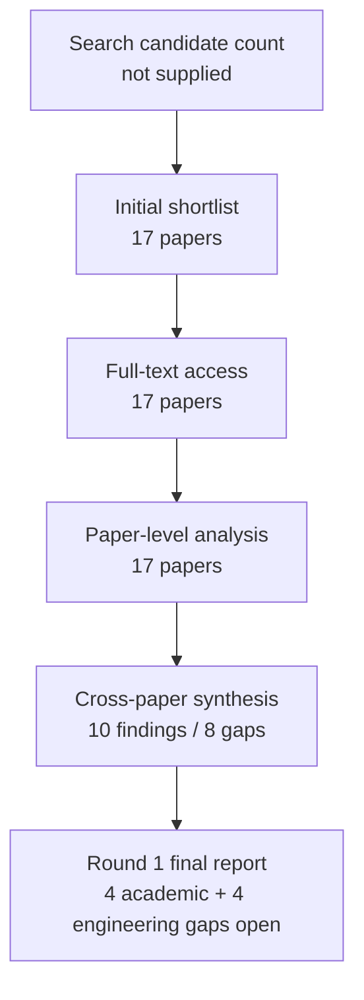

# Research Report: evidence attribution, factuality, completeness and reliability evaluation for workplace communication systems: what exact evidence supports each decision-relevant statement, whether it is current and correctly attributed, what was omitted, and when the system should abstain

## Contents

- [Round History](#round-history)
- [Executive Summary](#executive-summary)
- [Research Question](#research-question)
- [Methodology](#methodology)
- [Papers Reviewed](#papers-reviewed)
- [Research Landscape](#research-landscape)
- [Methodology Comparison](#methodology-comparison)
- [Confidence-Graded Findings](#confidence-graded-findings)
- [Trade-Off Analysis](#trade-off-analysis)
- [Points of Agreement](#points-of-agreement)
- [Points of Contradiction](#points-of-contradiction)
- [Research Gaps](#research-gaps)
- [Reproducibility Notes](#reproducibility-notes)
- [Practical Recommendations](#practical-recommendations)
- [Future Directions](#future-directions)
- [Readiness Assessment (System-Building Mode)](#readiness-assessment-system-building-mode)
- [Evidence Map](#evidence-map)
- [References](#references)
- [Appendix: Run Metadata](#appendix-run-metadata)

## Round History

Iterative gap-closure loop (hard cap: 4 rounds). See `references/iterative-synthesis.md` for the full loop definition.

| Round | Run ID | Topic / Gap Focus | New Papers | Gaps Addressed | Remaining Gaps |
|-------|--------|-------------------|------------|----------------|----------------|
| 1 | e601ba8b9b6f | evidence attribution, factuality, completeness and reliability evaluation for workplace communication systems: what exact evidence supports each decision-relevant statement, whether it is current and correctly attributed, what was omitted, and when the system should abstain | 17 | initial shortlist | 4 academic, 4 engineering |

**Stop reason**: another round runs while open academic gaps remain and new papers appear

## Executive Summary

This review examined how a workplace communication system should evaluate claim correctness, evidence attribution, evidence completeness, temporal/current-state validity, omission, confidence calibration, abstention, and human-review reliability without collapsing them into a single “faithfulness” score. Seventeen papers published from 2010 through 2026 were analyzed, spanning factual-consistency evaluation, scientific verification, attributed question answering, citation-grounded generation, temporal fact verification, calibration and answer abstention, runtime monitoring, automatic-judge validation, and human-evaluation methodology. The strongest finding is [HIGH] that reliability is intrinsically multidimensional: answer correctness, evidence support, citation precision, evidence coverage, source accessibility, temporal validity, calibrated confidence, and abstention expose different failure modes and therefore require separate measurement [2212.08037] [2305.14627] [2605.06635]. The most significant unresolved issue is that no admitted study validates the complete combination required by msgloom on private, evolving workplace communication; four academic and four engineering gaps remain open.

**Scope**: 17 papers analyzed through four full-text hosting routes represented in the supplied access records—arXiv, TechScience, ResearchGate, and ACL Anthology—covering publication years 2010–2026.  
**Overall Confidence**: Medium — High for the component-level methodological conclusions, but substantially lower for direct transfer to private workplace email and Teams-style streams.  
**Verdict**: HAS_GAPS

## Research Question

The review investigated:

> How should a workplace communication system evaluate what exact evidence supports each decision-relevant statement, whether that evidence is correctly attributed and temporally current, whether important evidence or work has been omitted, how confidence should be calibrated, and when the system should abstain or request human review?

The scope includes:

- claim-level factual or semantic correctness against evidence;
- evidence and citation attribution correctness;
- citation/evidence completeness and coverage;
- temporal validity, ordering, revision, and current-state correctness;
- report/content completeness and omission;
- uncertainty calibration and selective prediction;
- explicit abstention under insufficient, contradictory, or unresolved evidence;
- human evaluation, representative sampling, adjudication, and validation of automatic judges.

The scope deliberately does **not** treat schema validity, citation presence, language-model self-confidence, fluency, or an aggregate hallucination score as sufficient evidence of semantic correctness. Domain-specific semantics remain owned by their originating research Topics: Topic 10 evaluates reliability machinery but does not redefine what an action, Topic identity, response scope, state transition, document region, or due work item means.

## Methodology

### Search Strategy

- **Sources**: Papers were read through the host's web tool. Full-text access was provided through arXiv HTML for thirteen papers, TechScience HTML for one paper, ResearchGate full text for one paper, ACL Anthology PDF for one paper, and an arXiv HTML version for the TACL DOI paper.
- **Query variants**:
  - `evidence attribution, factuality, completeness reliability workplace communication systems: exact evidence supports each decision-relevant statement, whether current correctly attributed, omitted, should abstain`
  - `evidence attribution, factuality,`
  - `evidence completeness reliability workplace communication systems: exact evidence supports each decision-relevant statement, whether current correctly attributed, omitted, should abstain`
  - `attribution, completeness reliability workplace communication systems: exact evidence supports each decision-relevant statement, whether current correctly attributed, omitted, should abstain`
  - `factuality, completeness reliability workplace communication systems: exact evidence supports each decision-relevant statement, whether current correctly attributed, omitted, should abstain`
  - `evidence attribution, factuality, completeness reliability`
  - `evidence attribution, factuality, workplace communication`
  - `evidence attribution, factuality, systems: exact`
- **Time window**: Admitted publications span 2010–2026.
- **Screening**: The pipeline supplied an initial shortlist of 17 admitted papers. Candidate-pool size and the exact mechanical screening implementation were not supplied, so they are reported as unknown rather than reconstructed.
- **Evidence discipline**: Findings in this report derive only from the 17 admitted papers. Inherited project handoffs were treated as scope and ownership context, not as evidence.

### Full-Text Access Audit

Every admitted paper was read at the stated access level through the host's web tool.

| Paper | Access level | Access route |
|---|---|---|
| [1707.05555] | full_text | arXiv HTML |
| [1910.12840] | full_text | arXiv HTML |
| [2004.14974] | full_text | arXiv HTML |
| [2111.09525] | full_text | arXiv HTML |
| [2212.08037] | full_text | arXiv HTML |
| [2305.14627] | full_text | arXiv HTML |
| [2406.07967] | full_text | arXiv HTML |
| [2410.14964] | full_text | arXiv HTML |
| [2510.07238] | full_text | arXiv HTML |
| [2605.06635] | full_text | arXiv HTML |
| [2605.16354] | full_text | arXiv HTML |
| [2606.00093] | full_text | arXiv HTML |
| [2607.08700] | full_text | arXiv HTML |
| [doi-10-1017-s1351324909005051] | full_text | ResearchGate full text |
| [doi-10-1162-tacl-a-00407] | full_text | arXiv HTML version |
| [doi-10-32604-cmc-2026-086343] | full_text | TechScience HTML |
| [manual-f5ce52cae2] | full_text | ACL Anthology PDF |

### Pipeline Summary

| Metric | Count |
|--------|-------|
| Total candidates | unknown |
| After screening | 17 |
| Downloaded | not required by the supplied web-reading workflow / unknown |
| Successfully converted | not required by the supplied web-reading workflow / unknown |
| Full-text papers accessed | 17 |
| Deeply analyzed | 17 |
| Iterations completed for this report | 1 |

### Evaluation Decomposition

The literature does not validate one unified equation for msgloom, but it supports keeping several denominators separate. A practical implementation can therefore track metrics such as:

- citation or evidence precision  
  $P_{\mathrm{evidence}}=\frac{\text{supported evidence links}}{\text{evidence links evaluated}}$;
- evidence coverage or recall  
  $R_{\mathrm{evidence}}=\frac{\text{claims requiring support with adequate support}}{\text{claims requiring support}}$;
- calibration error, for probabilistic outputs, for example  
  $\mathrm{ECE}=\sum_{m=1}^{M}\frac{|B_m|}{n}\left|\operatorname{acc}(B_m)-\operatorname{conf}(B_m)\right|$;
- Brier score for binary probabilistic predictions  
  $\mathrm{Brier}=\frac{1}{n}\sum_{i=1}^{n}(p_i-y_i)^2$;
- selective risk at accepted coverage $c$  
  $R(c)=\mathbb{E}[L(\hat{y},y)\mid \text{prediction accepted at coverage }c]$.

These formulas are implementation-oriented representations of the dimensions discussed in the corpus; they are **not** evidence that a single combined score has been validated for this project. In particular, citation support and coverage are separately evaluated in attributed/citation-grounded generation [2212.08037] [2305.14627], while probability calibration is a distinct problem [doi-10-1162-tacl-a-00407].

## Papers Reviewed

No per-paper quality score or relevance grade was supplied by the pipeline. Those fields are therefore reported as unscored rather than invented.

| # | Title | Authors | Year | Venue | Quality Score | Relevance |
|---|-------|---------|------|-------|--------------|-----------|
| 1 | Do LLMs Know When Evidence is Insufficient? An Evidence Sufficiency Benchmark for Answer-Abstention Calibration in Retrieval-Augmented Generation [doi-10-32604-cmc-2026-086343] | Hantian Zhang, Wentai Wu | 2026 | not supplied | not scored | admitted; not separately scored |
| 2 | Fact or Fiction: Verifying Scientific Claims [2004.14974] | David Wadden, Shanchuan Lin, Kyle Lo et al. | 2020 | not supplied | not scored | admitted; not separately scored |
| 3 | When Benchmarks Age: Temporal Misalignment through Large Language Model Factuality Evaluation [2510.07238] | Xunyi Jiang, Dingyi Chang, Julian McAuley et al. | 2026 | not supplied | not scored | admitted; not separately scored |
| 4 | ReproHum #0892-01: The painful route to consistent results: A reproduction study of human evaluation in NLG [manual-f5ce52cae2] | Irene Mondella, Huiyuan Lai, Malvina Nissim | 2024 | not supplied | not scored | admitted; not separately scored |
| 5 | ChronoFact: Timeline-based Temporal Fact Verification [2410.14964] | Anab Maulana Barik, Wynne Hsu, Mong Li Lee | 2025 | not supplied | not scored | admitted; not separately scored |
| 6 | Runtime Verification of Temporal Properties over Out-of-order Data Streams [1707.05555] | David Basin, Felix Klaedtke, Eugen Zălinescu | 2017 | not supplied | not scored | admitted; not separately scored |
| 7 | Evaluating the Factual Consistency of Abstractive Text Summarization [1910.12840] | Wojciech Kryściński, Bryan McCann, Caiming Xiong et al. | 2020 | not supplied | not scored | admitted; not separately scored |
| 8 | Attributed Question Answering: Evaluation and Modeling for Attributed Large Language Models [2212.08037] | Bernd Bohnet, Vinh Q. Tran, Pat Verga et al. | 2022 | not supplied | not scored | admitted; not separately scored |
| 9 | Cited but Not Verified: Parsing and Evaluating Source Attribution in LLM Deep Research Agents [2605.06635] | Hailey Onweller, Elias Lumer, Austin Huber et al. | 2026 | not supplied | not scored | admitted; not separately scored |
| 10 | Do You Need a Frontier Model as a Citation Verifier? Benchmarking Rubric LLMs for Deep-Research Source Attribution [2607.08700] | Ethan Leung, Elias Lumer, Corey Feld et al. | 2026 | not supplied | not scored | admitted; not separately scored |
| 11 | Formal and functional assessment of the pyramid method for summary content evaluation [doi-10-1017-s1351324909005051] | Rebecca J. Passonneau | 2010 | not supplied | not scored | admitted; not separately scored |
| 12 | Agreement Metrics for LLM-as-Judge Evaluation: What to Report and Why [2606.00093] | Delip Rao, Chris Callison-Burch | 2026 | not supplied | not scored | admitted; not separately scored |
| 13 | Augmenting Human Evaluation with LLM Judges: How Many Human Reviews Do You Need? [2605.16354] | Jane Paik Kim | 2026 | not supplied | not scored | admitted; not separately scored |
| 14 | SummaC: Re-Visiting NLI-based Models for Inconsistency Detection in Summarization [2111.09525] | Philippe Laban, Tobias Schnabel, Paul N. Bennett et al. | 2022 | not supplied | not scored | admitted; not separately scored |
| 15 | Enabling Large Language Models to Generate Text with Citations [2305.14627] | Tianyu Gao, Howard Yen, Jiatong Yu et al. | 2023 | not supplied | not scored | admitted; not separately scored |
| 16 | Better than Random: Reliable NLG Human Evaluation with Constrained Active Sampling [2406.07967] | Jie Ruan, Xiao Pu, Mingqi Gao et al. | 2024 | not supplied | not scored | admitted; not separately scored |
| 17 | How Can We Know When Language Models Know? On the Calibration of Language Models for Question Answering [doi-10-1162-tacl-a-00407] | Zhengbao Jiang, Jun Araki, Haibo Ding et al. | 2021 | not supplied | not scored | admitted; not separately scored |

## Research Landscape

### Theme 1: Reliability Requires Separate Dimensions

**Coverage**: 3 primary papers plus supporting evaluation literature | **Confidence**: High  
**Supporting papers**: [2212.08037], [2305.14627], [2605.06635]

Attributed QA, citation-generation, and deep-research evaluation independently separate concepts such as answer correctness, whether a cited passage actually supports a claim, whether necessary claims have citations, citation precision, accessibility, and relevance. The combined evidence strongly argues against treating “a citation exists” as equivalent to “the claim is correct and completely supported” [2212.08037] [2305.14627] [2605.06635].

Key findings:

1. [HIGH] **Answer correctness, evidence support, citation precision, citation completeness/recall, accessibility, and relevance expose distinct failure modes.** Their separation reveals errors hidden by a single aggregate attribution score [2212.08037] [2305.14627] [2605.06635].
2. [HIGH] **Attribution establishes a claim-to-source relationship but does not establish the independent truth, authority, or currency of the cited source.** This limitation is explicitly recognized across attributed QA, scientific verification, and deep-research citation evaluation [2212.08037] [2004.14974] [2605.06635].

### Theme 2: Claim-Level Evidence Localization and Factual Verification

**Coverage**: 3 directly relevant verification/factual-consistency papers | **Confidence**: High  
**Supporting papers**: [1910.12840], [2004.14974], [2111.09525]

The factual-consistency and claim-verification literature operates below whole-document fluency, evaluating propositions, sentences, rationales, or localized evidence. Scientific verification associates verdicts with evidence, while FactCC explicitly evaluates explanatory evidence spans; the broader summarization-consistency literature represented in this corpus reinforces that factual inconsistency is a distinct evaluation target rather than a stylistic one [1910.12840] [2004.14974] [2111.09525].

Key findings:

1. [HIGH] **Verification systems can associate verdicts with sentence- or span-level evidence rather than returning only an unsupported label.** [1910.12840] [2004.14974].
2. [HIGH] **In the reported FactCC human study, exposing predicted evidence spans reduced mean annotation time and increased inter-annotator agreement.** This supports evidence localization as a human-review aid, although it does not itself establish source truth or freshness [1910.12840].

### Theme 3: Retrieval Quality and Evidence Use Are Different Failure Sources

**Coverage**: 3 primary papers | **Confidence**: High  
**Supporting papers**: [2004.14974], [2305.14627], [2605.06635]

The corpus shows that obtaining relevant evidence and using it correctly are separate stages. Oracle retrieval or rationales improve scientific verification; citation-generation experiments show that relevant evidence in the prompt does not guarantee correct use; and deep-research ablations demonstrate that retrieving more information can coincide with worse factual citation support [2004.14974] [2305.14627] [2605.06635].

Key findings:

1. [HIGH] **Retrieval failure and evidence-use failure must be measured separately.** Better or oracle evidence can improve verification, but available relevant evidence can still be ignored or misused [2004.14974] [2305.14627].
2. [HIGH] **More context is not monotonically safer.** ALCE reports that additional passages need not improve performance, while a two-model deep-research search-depth ablation found citation support decreasing as depth increased [2305.14627] [2605.06635].

### Theme 4: Temporal Reliability Is Not Static Fact Checking

**Coverage**: 3 primary papers | **Confidence**: High  
**Supporting papers**: [1707.05555], [2410.14964], [2510.07238]

A proposition can be locally supported yet still be wrong for the required observation time or current state. Chronological ordering improves temporal verification; benchmark aging can cause stale answers or context to penalize later-correct information; and runtime monitoring formalizes unresolved truth over out-of-order observations rather than forcing an immediate Boolean conclusion [1707.05555] [2410.14964] [2510.07238].

Key findings:

1. [HIGH] **Temporal ordering can change factual verdicts even where individual events appear independently supported.** ChronoFact's chronological-order component materially improved temporal fact verification [2410.14964].
2. [HIGH] **Benchmark or evidence age can change the evaluation target itself.** Stale gold answers and stale context can redirect or penalize responses matching later information [2510.07238].
3. [HIGH] **Unknown can be a principled truth state when observations are incomplete.** In the formal runtime-monitoring setting, an explicit unknown value is retained until observations permit resolution, with soundness and observational completeness defined for that monitoring semantics [1707.05555].

### Theme 5: Calibration, Abstention, and Selective Reliability

**Coverage**: 2 primary papers | **Confidence**: High for the studied QA conditions; transfer remains open  
**Supporting papers**: [doi-10-1162-tacl-a-00407], [doi-10-32604-cmc-2026-086343]

Task accuracy and confidence are not interchangeable. The calibration study reports overconfidence among generative QA systems and imperfect cross-domain calibration transfer. The evidence-sufficiency benchmark tests whether models refrain from answering when evidence is insufficient or conflicting and exposes substantial over-answering under conflict [doi-10-1162-tacl-a-00407] [doi-10-32604-cmc-2026-086343].

Key findings:

1. [HIGH] **High task accuracy does not imply calibrated confidence.** Generative QA models can remain overconfident when wrong, and calibration can degrade under domain transfer [doi-10-1162-tacl-a-00407].
2. [HIGH] **Controlled evidence conflict exposes unsafe answering behavior.** All seven models in the evidence-sufficiency benchmark over-answered more than 65% of conflicting-evidence cases [doi-10-32604-cmc-2026-086343].
3. [HIGH] **Calibration and abstention are distinct requirements.** A numerical confidence score must be evaluated for probabilistic calibration, while a deployment policy must additionally specify what risks are tolerated at different coverage levels [doi-10-1162-tacl-a-00407] [doi-10-32604-cmc-2026-086343].

### Theme 6: Automatic Judges Need Human Validation and Directional Error Analysis

**Coverage**: 4 primary papers | **Confidence**: High  
**Supporting papers**: [2212.08037], [2606.00093], [2607.08700], [2605.16354]

Automatic evaluators can reduce cost but cannot simply be equated with ground truth. AutoAIS demonstrated strong system-level correlation while exhibiting weaker instance-level agreement and problems for systems optimized against it. Citation-verifier models with similar aggregate scores can have different false-positive and false-negative tendencies. Agreement methodology changes when abstentions are included, and human-augmented statistical frameworks explicitly retain human ratings as the inferential target [2212.08037] [2606.00093] [2607.08700] [2605.16354].

Key findings:

1. [HIGH] **Aggregate judge scores can conceal materially different directional biases.** Citation judges with similar aggregate F1 can have different false-positive, false-negative, and pass-rate tendencies [2607.08700].
2. [HIGH] **Abstention handling changes what an agreement or accuracy statistic estimates.** Reconstructed evaluations show large differences under alternative handling rules [2606.00093].
3. [HIGH] **LLM judges are useful auxiliary measurements, not interchangeable human ground truth.** Human-targeted statistical sampling and direct judge-validation evidence support keeping independent human assessment in the evaluation loop [2212.08037] [2605.16354] [2607.08700].

### Theme 7: Human Evaluation Depends on Sampling, Granularity, and Reproducibility

**Coverage**: 3 primary papers | **Confidence**: High  
**Supporting papers**: [2406.07967], [doi-10-1017-s1351324909005051], [manual-f5ce52cae2]

Human evaluation itself is not automatically reliable. Sampling strategy can affect whether system rankings from a reduced evaluation reproduce full-dataset rankings; Pyramid evaluations distinguish content-unit coverage from surface similarity; and reproduction work shows that stable aggregate ordering can coexist with considerably weaker agreement on individual items [2406.07967] [doi-10-1017-s1351324909005051] [manual-f5ce52cae2].

Key findings:

1. [HIGH] **Sampling strategy affects evaluation reliability.** Constrained active sampling preserved full-dataset NLG rankings better than random sampling in the reported experiments [2406.07967].
2. [HIGH] **System-level robustness does not imply item-level agreement.** Pyramid evaluation was robust at the system level to annotator choice, while the reproduction study recovered aggregate ordering despite substantially weaker individual-item agreement [doi-10-1017-s1351324909005051] [manual-f5ce52cae2].

## Methodology Comparison

| Approach | Papers | Strengths | Weaknesses | Best For | Performance |
|----------|--------|-----------|------------|----------|-------------|
| Claim/evidence factual-consistency verification | [1910.12840], [2004.14974], [2111.09525] | Localizes factual errors and can link judgments to source sentences or spans | Static support does not by itself establish source truth, freshness, or report completeness | Claim-level semantic verification | FactCC evidence spans improved human annotation efficiency/agreement; SciFact benefits from better/oracle evidence retrieval [1910.12840] [2004.14974] |
| Attributed QA and citation-grounded generation evaluation | [2212.08037], [2305.14627], [2605.06635], [2607.08700] | Separates answer quality, citation support, citation coverage/precision, accessibility, and relevance | Web sources can be wrong/stale; automatic citation judges have directional error | Evidence-linked answers and reports | Relevant context does not guarantee correct evidence use; aggregate judge metrics can hide bias [2305.14627] [2607.08700] |
| Temporal/current-state evaluation | [1707.05555], [2410.14964], [2510.07238] | Models ordering, observation refinement, changing facts, stale targets, and unresolved states | Evaluated domains differ substantially from private workplace streams | Revisions, cancellations, contradictory updates, delayed observations | Chronological reasoning improved temporal verification; aging can change the appropriate factual target [2410.14964] [2510.07238] |
| Confidence calibration and answer abstention | [doi-10-1162-tacl-a-00407], [doi-10-32604-cmc-2026-086343] | Separates confidence from raw accuracy; exposes unsafe over-answering | Evidence for open-ended free-form workplace generation is missing | Risk/coverage decisions and insufficient-evidence handling | Cross-domain calibration is imperfect; all seven benchmarked models over-answered more than 65% of conflicting-evidence cases [doi-10-1162-tacl-a-00407] [doi-10-32604-cmc-2026-086343] |
| Human and LLM-assisted evaluation methodology | [doi-10-1017-s1351324909005051], [manual-f5ce52cae2], [2406.07967], [2606.00093], [2605.16354], [2607.08700] | Makes sampling, aggregation, abstention, judge bias, and human-validation assumptions explicit | Protocol changes can materially alter conclusions; item-level reliability can be lower than system-level stability | Acceptance testing and evaluation governance | Active sampling improved ranking preservation; judge handling/bias materially changes reported reliability [2406.07967] [2606.00093] [2607.08700] |

## Confidence-Graded Findings

The confidence tags below preserve the cross-paper synthesis ratings. They are not assigned mechanically by paper count: a formally established result in a narrowly defined setting may be [HIGH] even when supported by one paper, while transfer to msgloom remains a separate limitation.

### 🟢 High Confidence (supported by consistent evidence within the reviewed scope)

1. [HIGH] **Reliability evaluation must keep answer correctness, evidence support, citation coverage/recall, citation precision, accessibility, and topical relevance distinct.** Attributed-QA, citation-generation, and deep-research evaluation expose different failures across these dimensions [2212.08037] [2305.14627] [2605.06635].

2. [HIGH] **Sentence- or span-level evidence localization can make factual-verification judgments more traceable and can improve human review.** SciFact uses evidence rationales, while FactCC's human study reports lower annotation time and higher inter-annotator agreement when predicted evidence spans are shown [1910.12840] [2004.14974].

3. [HIGH] **Retrieval and evidence use are separate sources of error.** Oracle or better evidence improves scientific verification, but relevant retrieved passages do not guarantee correct use, and increasing search depth/context does not necessarily improve citation support [2004.14974] [2305.14627] [2605.06635].

4. [HIGH] **Temporal correctness cannot be reduced to isolated static claim support.** Chronological ordering can alter temporal-verification results, while benchmark aging can make stale gold or context disagree with later-correct information [2410.14964] [2510.07238].

5. [HIGH] **An explicit unresolved state is technically viable for incomplete out-of-order evidence.** The runtime-monitoring work defines a three-valued semantics in which unknown remains unresolved while additional observations refine the result, with soundness and observational completeness under the paper's formal model [1707.05555].

6. [HIGH] **Accuracy does not imply calibrated confidence or safe abstention.** Generative QA systems can be overconfident and transfer calibration imperfectly, while controlled evidence-conflict testing reveals extensive over-answering [doi-10-1162-tacl-a-00407] [doi-10-32604-cmc-2026-086343].

7. [HIGH] **Evaluator protocol choices materially alter measured reliability.** Abstention treatment changes the estimand, and citation judges with similar aggregate F1 can exhibit different directional biases [2606.00093] [2607.08700].

8. [HIGH] **Human-evaluation results depend on sampling and reporting granularity.** Constrained active sampling improved preservation of full-data rankings, and aggregate system-order stability can coexist with substantially lower item-level agreement [2406.07967] [doi-10-1017-s1351324909005051] [manual-f5ce52cae2].

9. [HIGH] **LLM judges are useful auxiliary evaluators but should not be treated as interchangeable with human ground truth.** System-level correlation can mask item-level disagreement or evaluator gaming, citation judges can be directionally biased, and human-augmented estimators retain human ratings as the target [2212.08037] [2607.08700] [2605.16354].

10. [HIGH] **Claim-to-source attribution does not independently establish source truth, authority, or currency.** This limitation is explicit across attributed QA, scientific verification, and deep-research citation evaluation [2212.08037] [2004.14974] [2605.06635].

### 🟡 Medium Confidence (supported by 1-2 papers or with caveats)

No additional [MEDIUM] finding was asserted in the supplied cross-paper synthesis. The principal uncertainty concerns **transfer to the target workplace domain**, and it is retained as open research and engineering gaps rather than converted into a weaker factual finding.

### 🔴 Low Confidence (preliminary, single-source, or contradicted)

No [LOW] finding was asserted in the supplied cross-paper synthesis. Unsupported extrapolations to production email/Teams behavior are intentionally excluded rather than presented as low-confidence conclusions.

## Trade-Off Analysis

| Decision | Option A | Option B | Recommendation |
|----------|----------|----------|----------------|
| Aggregate reliability score vs decomposed evaluation | One score is easier to report but can allow one strong dimension to mask another | Separate correctness, attribution, completeness, temporal validity, omission, calibration, and abstention preserve error visibility | [HIGH] Use decomposed metrics and retain raw component outcomes [2212.08037] [2305.14627] [2605.06635] |
| Force a verdict vs preserve unresolved state | Maximizes apparent coverage but creates false certainty under missing/conflicting evidence | Explicit unknown/abstention reduces forced errors but lowers coverage | [HIGH] Preserve unknown/insufficient/conflicting outcomes and evaluate risk against useful coverage [1707.05555] [doi-10-32604-cmc-2026-086343] |
| More retrieval vs bounded evidence acquisition | More passages may improve recall but can increase noise and synthesis errors | Bounded, evaluated retrieval may miss evidence if stopping is too aggressive | [HIGH] Do not optimize retrieval volume alone; separately measure retrieval recall and downstream evidence use [2004.14974] [2305.14627] [2605.06635] |
| Automatic judge as acceptance authority vs auxiliary judge | Lower cost and higher throughput, but exposed to bias, disagreement, abstention artifacts, and gaming | Human ground truth costs more but provides an independent acceptance target | [HIGH] Keep automatic judges auxiliary and validate them against independent human judgments [2212.08037] [2607.08700] [2605.16354] |
| Static fact support vs time-indexed current-state evaluation | Simpler and adequate for immutable facts | Captures revisions, stale evidence, reordered observations, and changing truth targets | [HIGH] Evaluate decision-relevant facts at explicit observation/version cutoffs [1707.05555] [2410.14964] [2510.07238] |
| Random human sampling vs deliberately representative/risk-aware sampling | Operationally simple but may waste review budget and miss hard cases | More deliberate sampling can improve representativeness or ranking recovery but requires protocol design | [HIGH] Define the target population and sampling scheme explicitly; do not infer reliability from convenience samples [2406.07967] [manual-f5ce52cae2] |

## Points of Agreement **[EVIDENCE REQUIRED]**

1. [HIGH] **Factual correctness and citation correctness are not interchangeable.** Multiple attribution-oriented studies distinguish the quality of the generated answer from whether its cited source actually supports it [2212.08037] [2305.14627] [2605.06635].

2. [HIGH] **Citation correctness and citation completeness are not interchangeable.** A system can cite accurately where it cites while still leaving unsupported claims uncovered [2212.08037] [2305.14627].

3. [HIGH] **Evidence availability is not the same as correct evidence use.** Relevant or oracle evidence improves some tasks, but models can still fail to use available evidence correctly [2004.14974] [2305.14627] [2605.06635].

4. [HIGH] **Current-state correctness requires temporal information beyond static proposition matching.** Ordering, delayed observations, and stale evaluation targets all affect reliability [1707.05555] [2410.14964] [2510.07238].

5. [HIGH] **Model confidence is not automatically a calibrated probability.** Accuracy, confidence, domain transfer, and abstention behavior must be evaluated separately [doi-10-1162-tacl-a-00407] [doi-10-32604-cmc-2026-086343].

6. [HIGH] **Automatic evaluation requires validation rather than blind adoption.** Aggregate agreement can conceal directional bias, item-level disagreement, handling-rule sensitivity, or evaluator gaming [2212.08037] [2606.00093] [2607.08700].

7. [HIGH] **Human evaluation itself needs a reproducible protocol.** Sampling, annotator choice, aggregation level, and reporting granularity materially influence what conclusions are justified [2406.07967] [doi-10-1017-s1351324909005051] [manual-f5ce52cae2].

## Points of Contradiction **[EVIDENCE REQUIRED]**

No direct paper-to-paper contradiction was identified in the supplied cross-paper synthesis.

1. [HIGH] **There is a methodological tension, not a contradiction, between strong system-level evaluation stability and weaker item-level reliability.** Pyramid evaluation reports strong system-level robustness to annotator choice, while the ReproHum reproduction obtained aggregate system-order consistency despite substantially weaker agreement on individual examples [doi-10-1017-s1351324909005051] [manual-f5ce52cae2].
   - **Possible explanation**: system-level aggregation and item-level agreement answer different questions and use different denominators.
   - **Implication**: msgloom should report both aggregate acceptance behavior and instance-level disagreement/error categories rather than treating one as a substitute for the other.

2. [HIGH] **There is a methodological tension, not a contradiction, between adding evidence and improving reliability.** Better/oracle retrieval helps scientific verification, yet additional passages or search depth can fail to improve and can even reduce downstream citation support [2004.14974] [2305.14627] [2605.06635].
   - **Possible explanation**: retrieval recall and evidence-selection/reasoning quality are separate stages; extra context can introduce distractors or synthesis burden.
   - **Implication**: retrieval volume should not be used as a proxy for evidence sufficiency.

## Research Gaps

All eight gaps below remain **open**. None is accepted, closed, or treated as solved. For every gap, the literature reviewed so far has **not answered it yet**. The four engineering gaps are classified as implementation/validation work rather than gaps expected to close through additional papers.

| # | Gap | Type | Severity | Rounds Already Searched | Impact on Goals |
|---|-----|------|----------|-------------------------|----------------|
| 1 | One end-to-end scheme jointly measuring correctness, attribution, completeness, temporal validity, omission, calibration, and abstention while preserving separate denominators | [ENGINEERING] | HIGH | Round 1 | Without it, a strong result on one dimension can hide an unsafe failure on another |
| 2 | Direct target-domain evaluation on private workplace email/Teams streams with revisions, quoted history, delayed/out-of-order evidence, attachments, versions, and permissions | [ENGINEERING] | HIGH | Round 1 | Production-transfer validity is unknown |
| 3 | Calibration/selective prediction for unconstrained free-form generation | [ACADEMIC] | HIGH | Round 1 | msgloom cannot safely interpret confidence or set review thresholds for open-ended outputs from this corpus alone |
| 4 | Evidence-completeness evaluation for compound, partially supported, multi-source, temporally versioned claims | [ACADEMIC] | HIGH | Round 1 | A report may appear cited while still lacking adequate support for parts of a decision-relevant claim |
| 5 | Report-level omission and coverage evaluation for evolving decision-relevant work | [ACADEMIC] | HIGH | Round 1 | Due Topics or decision-changing evidence could be silently omitted |
| 6 | Project-specific human-review protocol covering representative/risk-stratified sampling, minimum volume, adjudication, confusion matrices, abstention, coverage, and judge validation | [ENGINEERING] | HIGH | Round 1 | Acceptance conclusions could depend on an under-specified sample or evaluation protocol |
| 7 | Procedure preventing optimization against the same automatic evaluator used for acceptance | [ENGINEERING] | MEDIUM | Round 1 | Development could overfit evaluator artifacts rather than true reliability |
| 8 | Calibration under continuing temporal/distributional change in non-stationary communication streams | [ACADEMIC] | MEDIUM | Round 1 | Confidence may silently become invalid as workplace distributions and facts shift |

### Academic Gaps (require more papers)

1. **[ACADEMIC] [HIGH] Gap 3 — Calibration and selective prediction for free-form generation**  
   **Status**: OPEN — the literature has not answered it yet. Round 1 searched this area, but the admitted calibration work excludes free-form abstractive QA, and the evidence-sufficiency benchmark evaluates behavioral abstention under controlled QA conditions rather than calibrated probabilities for unconstrained outputs [doi-10-1162-tacl-a-00407] [doi-10-32604-cmc-2026-086343].  
   **Suggested query**: `"selective prediction" free-form generation calibration domain shift NLP abstention risk coverage`

2. **[ACADEMIC] [HIGH] Gap 4 — Evidence completeness for compound, partial, multi-source, temporally versioned claims**  
   **Status**: OPEN — the literature has not answered it yet. Round 1 established narrower attribution and citation-recall methods but not the general case required by msgloom [2212.08037] [2305.14627].  
   **Suggested query**: `"citation completeness" multi-source partial support compound claims temporal versioned evidence attribution evaluation`

3. **[ACADEMIC] [HIGH] Gap 5 — Decision-relevant report omission and coverage**  
   **Status**: OPEN — the literature has not answered it yet. Round 1 contains content-unit evaluation and citation-coverage methods, but not omission detection for evolving workplace obligations, risks, deadlines, conditions, and due Topics [doi-10-1017-s1351324909005051] [2305.14627].  
   **Suggested query**: `"summary completeness" omission detection content units decision-focused evaluation factual coverage`

4. **[ACADEMIC] [MEDIUM] Gap 8 — Calibration under non-stationary temporal/distribution shift**  
   **Status**: OPEN — the literature has not answered it yet. Round 1 shows imperfect cross-domain calibration transfer and factual-target drift as benchmarks age, but no admitted work establishes selective calibration for a continuously changing communication stream [doi-10-1162-tacl-a-00407] [2510.07238].  
   **Suggested query**: `"uncertainty calibration" non-stationary streams temporal distribution shift language models selective prediction`

### Engineering Gaps (fillable without papers)

1. **[ENGINEERING] [HIGH] Gap 1 — Unified but decomposed evaluation contract**  
   **Status**: OPEN — the literature has not answered it yet as an end-to-end scheme.  
   **Suggested resolution**: define one evaluation record per decision-relevant claim with independent fields and denominators for semantic correctness, attribution correctness, evidence completeness, current-state validity, omission, confidence, abstention, and human-review status. Preserve component confusion matrices instead of collapsing them into one acceptance score.

2. **[ENGINEERING] [HIGH] Gap 2 — Target-domain workplace benchmark and fixtures**  
   **Status**: OPEN — the literature has not answered it yet; direct target-domain evidence is absent.  
   **Suggested resolution**: build independently authored longitudinal fixtures and authorized human-reviewed samples covering quoted history, revisions, cancellation, contradictory same-time updates, late-arriving evidence, out-of-order ingestion, versioned attachments, permission boundaries, and source disappearance. Synthetic/adversarial fixtures can validate mechanics but must not be claimed as production representativeness.

3. **[ENGINEERING] [HIGH] Gap 6 — Human-review and acceptance protocol**  
   **Status**: OPEN — the literature has not answered the msgloom-specific protocol yet.  
   **Suggested resolution**: predefine the target population, representative or risk-stratified sampling, minimum human-review volume, independent gold creation, adjudication, item-level and system-level reporting, abstention handling, coverage, false-positive/false-negative matrices, and periodic revalidation of automatic judges [2406.07967] [2606.00093] [2605.16354].

4. **[ENGINEERING] [MEDIUM] Gap 7 — Evaluator overfitting protection**  
   **Status**: OPEN — the literature has not answered the project-specific acceptance procedure yet.  
   **Suggested resolution**: separate development evaluators from acceptance evaluators, keep independently reviewed holdouts, rotate/adversarially extend regression sets, preserve raw predictions, and test for directional bias and reward hacking before any automatic judge is used as a release gate [2212.08037] [2607.08700].

## Reproducibility Notes

The supplied material establishes full-text access but does not provide a verified audit of code repositories, dataset availability, implementation sufficiency, or licenses. Those fields are therefore marked unknown rather than inferred.

| Paper | Code Available | Data Available | Sufficient Detail | License |
|-------|---------------|----------------|-------------------|---------|
| [doi-10-32604-cmc-2026-086343] | unknown | unknown | not assessed | unknown |
| [2004.14974] | unknown | unknown | not assessed | unknown |
| [2510.07238] | unknown | unknown | not assessed | unknown |
| [manual-f5ce52cae2] | unknown | unknown | not assessed | unknown |
| [2410.14964] | unknown | unknown | not assessed | unknown |
| [1707.05555] | unknown | unknown | not assessed | unknown |
| [1910.12840] | unknown | unknown | not assessed | unknown |
| [2212.08037] | unknown | unknown | not assessed | unknown |
| [2605.06635] | unknown | unknown | not assessed | unknown |
| [2607.08700] | unknown | unknown | not assessed | unknown |
| [doi-10-1017-s1351324909005051] | unknown | unknown | not assessed | unknown |
| [2606.00093] | unknown | unknown | not assessed | unknown |
| [2605.16354] | unknown | unknown | not assessed | unknown |
| [2111.09525] | unknown | unknown | not assessed | unknown |
| [2305.14627] | unknown | unknown | not assessed | unknown |
| [2406.07967] | unknown | unknown | not assessed | unknown |
| [doi-10-1162-tacl-a-00407] | unknown | unknown | not assessed | unknown |

## Practical Recommendations **[EVIDENCE REQUIRED]**

1. **Maintain separate reliability outputs rather than one aggregate “faithfulness” score.** Track claim correctness, attribution correctness, evidence completeness, temporal/current-state validity, omission, calibrated uncertainty, and abstention independently [2212.08037] [2305.14627] [2605.06635].  
   *Confidence*: High for the decomposition principle; Medium for its exact msgloom implementation.

2. **Represent each decision-relevant generated statement as an independently reviewable claim linked to exact supporting evidence.** Permit multiple evidence items, partial support, and unresolved support instead of forcing a one-citation/one-claim model [1910.12840] [2004.14974] [2212.08037].  
   *Confidence*: High for claim/evidence localization; Medium for the complete workplace schema.

3. **Separate retrieval failure from evidence-selection and reasoning failure.** A missing source, retrieved-but-unused support, unsupported reasoning step, stale source, and report omission should be distinct error categories so one stage cannot conceal another [2004.14974] [2305.14627] [2605.06635].  
   *Confidence*: High.

4. **Make unknown, conflicting, insufficient, and not-yet-resolvable evidence visible first-class states.** Do not coerce them into “supported” or “unsupported” merely to maximize coverage [1707.05555] [doi-10-32604-cmc-2026-086343].  
   *Confidence*: High for the general principle; Medium for target-domain policy thresholds.

5. **Evaluate temporal correctness at explicit observation and version cutoffs.** A claim should be judged against what was knowable and current at the relevant time, not against a timeless merged evidence pool [1707.05555] [2410.14964] [2510.07238].  
   *Confidence*: High.

6. **Keep automatic judges auxiliary to independently defined human or gold targets.** Report directional false-positive/false-negative behavior and raw contingency information instead of only correlation, F1, or agreement aggregates [2212.08037] [2606.00093] [2607.08700] [2605.16354].  
   *Confidence*: High.

7. **Use held-out, independently reviewed acceptance samples and include difficult disagreement cases.** Do not validate only on the same evaluator or examples optimized during development [2212.08037] [2406.07967] [manual-f5ce52cae2] [2607.08700].  
   *Confidence*: High for evaluator separation; Medium for the optimal msgloom sampling design.

8. **Record evaluation-protocol metadata alongside every result.** At minimum record target population, source/version cutoff, judgment scale, abstention rule, accepted coverage, aggregation procedure, sample-selection method, annotator/adjudication process, and automatic-judge version or prompt where applicable [2406.07967] [2606.00093] [manual-f5ce52cae2].  
   *Confidence*: High.

9. **Do not treat source support as proof of source truth or freshness.** Evidence evaluation should have a distinct currentness/authority stage where those properties matter to the owning Topic [2212.08037] [2004.14974] [2605.06635].  
   *Confidence*: High.

10. **Do not optimize retrieval depth as a reliability metric.** Measure whether required evidence was found and whether the generation used it correctly; more retrieved material can introduce additional failure opportunities [2004.14974] [2305.14627] [2605.06635].  
    *Confidence*: High.

## Future Directions

1. **[ACADEMIC] [HIGH] Extend the literature search to selective prediction for free-form generation**, especially work reporting risk-coverage behavior under domain shift rather than confidence alone.

2. **[ACADEMIC] [HIGH] Search specifically for compound-claim and multi-source evidence-completeness evaluation**, including partial entailment and versioned/temporal evidence.

3. **[ACADEMIC] [HIGH] Investigate content-coverage and omission-detection methods at report or work-item level**, prioritizing decision-focused evaluation over generic semantic similarity.

4. **[ACADEMIC] [MEDIUM] Investigate calibration methods for non-stationary language streams**, including temporal distribution shift, recalibration triggers, and selective-risk monitoring.

5. **[ENGINEERING] [HIGH] Build a longitudinal msgloom reliability fixture suite** in which prediction inputs are separated from evaluation gold/future context and each evidence/version transition can be replayed.

6. **[ENGINEERING] [HIGH] Design the combined annotation/evaluation contract** so that unsupported claims, incomplete evidence, stale evidence, omission, ambiguous state, abstention, and judge disagreement remain separately observable.

7. **[ENGINEERING] [HIGH] Establish a human-review acceptance process** with independent gold creation, explicit sampling denominators, adjudication, and periodic evaluator revalidation.

8. **[ENGINEERING] [MEDIUM] Add evaluator-regression and anti-gaming tests**, ensuring that development does not optimize directly against the only judge used for acceptance.

## Readiness Assessment (System-Building Mode)

### Verdict: HAS_GAPS

### Assessment Summary

The literature is sufficient to justify a **component architecture for reliability evaluation**: claim-level evidence links, decomposed correctness/coverage metrics, explicit temporal and unresolved states, calibrated-confidence evaluation, abstention reporting, and independent validation of automatic judges are all supported at the methodological level [1910.12840] [2212.08037] [1707.05555] [doi-10-1162-tacl-a-00407] [2607.08700]. It is **not** sufficient to declare the complete msgloom acceptance framework validated because no admitted paper tests the required combination on private workplace communication, and four academic plus four engineering gaps remain open.

### Coverage Matrix

| Dimension | Status | Evidence |
|-----------|--------|----------|
| Architecture patterns | ⚠️ Partial | Decomposed attribution, factuality, temporal, calibration, and human-evaluation components are supported, but no unified end-to-end scheme is validated [2212.08037] [2410.14964] [2606.00093] |
| Technology stack | ❌ Missing | The reviewed literature does not establish a msgloom implementation stack |
| Performance baselines | ⚠️ Partial | Task-specific results exist, but no realistic workplace-stream latency, throughput, or reliability baseline exists [doi-10-32604-cmc-2026-086343] [2605.06635] |
| Security model | ❌ Missing | Permission-constrained workplace evidence evaluation is not directly addressed by the admitted corpus |
| Trade-off map | ⚠️ Partial | Calibration/coverage, retrieval depth, abstention, automatic-vs-human judging, and temporal evaluation trade-offs are evidenced, but project-specific utility/cost thresholds remain open [2305.14627] [doi-10-32604-cmc-2026-086343] [2607.08700] |

### Gap Resolution Plan

| # | Gap | Type | Severity | Resolution |
|---|-----|------|----------|------------|
| 1 | Unified decomposed end-to-end evaluation contract | [ENGINEERING] | HIGH | Define separate denominators and error taxonomies; validate with independent fixtures and human-reviewed examples |
| 2 | Workplace target-domain evaluation | [ENGINEERING] | HIGH | Build longitudinal email/Teams-style synthetic/adversarial fixtures first, then authorized representative user-reviewed samples |
| 3 | Free-form selective prediction and calibration | [ACADEMIC] | HIGH | Run targeted Round 2 search on free-form generation, risk-coverage, abstention, and domain shift |
| 4 | Compound/multi-source/temporal evidence completeness | [ACADEMIC] | HIGH | Run targeted Round 2 search on citation completeness, partial support, multi-source entailment, and versioned evidence |
| 5 | Decision-relevant omission and report coverage | [ACADEMIC] | HIGH | Run targeted Round 2 search on summary completeness, omission detection, content units, and decision-focused evaluation |
| 6 | Human-review protocol | [ENGINEERING] | HIGH | Pre-register sampling, denominators, adjudication, abstention handling, coverage, and judge validation |
| 7 | Evaluator gaming/overfitting protection | [ENGINEERING] | MEDIUM | Separate development and acceptance evaluators; maintain independent hidden holdouts and mutation/regression tests |
| 8 | Calibration under non-stationarity | [ACADEMIC] | MEDIUM | Run targeted Round 2 search on temporal/domain shift calibration and selective prediction in streams |

## Evidence Map

| Research Question Aspect | Primary Evidence | What the Evidence Establishes |
|--------------------------|------------------|-------------------------------|
| Claim-level factual consistency | [1910.12840], [2004.14974], [2111.09525] | Factual consistency/verification can be evaluated separately from fluency, including localized evidence or rationales |
| Exact evidence localization | [1910.12840], [2004.14974] | Verdicts can be associated with sentence/span evidence; localized evidence can assist human verification |
| Answer correctness vs attribution correctness | [2212.08037], [2305.14627], [2605.06635] | Answer quality and claim-to-source support require separate evaluation |
| Citation/evidence completeness | [2212.08037], [2305.14627] | Citation support/precision and coverage/recall are distinct dimensions |
| Source support vs source truth | [2212.08037], [2004.14974], [2605.06635] | Attribution does not establish source authority, independent truth, or currentness |
| Retrieval vs evidence use | [2004.14974], [2305.14627], [2605.06635] | Evidence acquisition and correct downstream use are separate failure modes |
| Temporal ordering | [2410.14964] | Event chronology affects temporal-verification quality |
| Benchmark/evidence aging | [2510.07238] | Stale gold/context can mis-evaluate or redirect later-correct answers |
| Out-of-order observations and unresolved truth | [1707.05555] | Unknown can be retained under incomplete observations; monitoring can operate without ordered arrival |
| Confidence calibration | [doi-10-1162-tacl-a-00407] | Accuracy and probabilistic confidence are distinct; cross-domain calibration transfer is imperfect |
| Evidence insufficiency and abstention | [doi-10-32604-cmc-2026-086343] | Models can over-answer substantially under conflicting evidence |
| Automatic-judge agreement methodology | [2606.00093] | Abstention handling and agreement reporting choices alter the estimand and reported result |
| Citation-judge directional bias | [2607.08700] | Similar aggregate scores can conceal materially different FP/FN and pass-rate biases |
| Human-plus-LLM evaluation | [2605.16354] | LLM judgments can be auxiliary while human ratings remain the inferential target |
| System-level vs item-level evaluation reliability | [doi-10-1017-s1351324909005051], [manual-f5ce52cae2] | Aggregate robustness does not imply high per-item agreement |
| Evaluation sampling | [2406.07967] | Sampling strategy influences reliability of reduced human-evaluation sets |
| Full target-domain workplace reliability | none in admitted corpus | [ENGINEERING] [HIGH] Gap remains open; the literature has not answered it yet |

## References

1. [doi-10-32604-cmc-2026-086343] — *Do LLMs Know When Evidence is Insufficient? An Evidence Sufficiency Benchmark for Answer-Abstention Calibration in Retrieval-Augmented Generation*. Hantian Zhang, Wentai Wu. 2026. Venue not supplied.
2. [2004.14974] — *Fact or Fiction: Verifying Scientific Claims*. David Wadden, Shanchuan Lin, Kyle Lo et al. 2020. Venue not supplied.
3. [2510.07238] — *When Benchmarks Age: Temporal Misalignment through Large Language Model Factuality Evaluation*. Xunyi Jiang, Dingyi Chang, Julian McAuley et al. 2026. Venue not supplied.
4. [manual-f5ce52cae2] — *ReproHum #0892-01: The painful route to consistent results: A reproduction study of human evaluation in NLG*. Irene Mondella, Huiyuan Lai, Malvina Nissim. 2024. Venue not supplied.
5. [2410.14964] — *ChronoFact: Timeline-based Temporal Fact Verification*. Anab Maulana Barik, Wynne Hsu, Mong Li Lee. 2025. Venue not supplied.
6. [1707.05555] — *Runtime Verification of Temporal Properties over Out-of-order Data Streams*. David Basin, Felix Klaedtke, Eugen Zălinescu. 2017. Venue not supplied.
7. [1910.12840] — *Evaluating the Factual Consistency of Abstractive Text Summarization*. Wojciech Kryściński, Bryan McCann, Caiming Xiong et al. 2020. Venue not supplied.
8. [2212.08037] — *Attributed Question Answering: Evaluation and Modeling for Attributed Large Language Models*. Bernd Bohnet, Vinh Q. Tran, Pat Verga et al. 2022. Venue not supplied.
9. [2605.06635] — *Cited but Not Verified: Parsing and Evaluating Source Attribution in LLM Deep Research Agents*. Hailey Onweller, Elias Lumer, Austin Huber et al. 2026. Venue not supplied.
10. [2607.08700] — *Do You Need a Frontier Model as a Citation Verifier? Benchmarking Rubric LLMs for Deep-Research Source Attribution*. Ethan Leung, Elias Lumer, Corey Feld et al. 2026. Venue not supplied.
11. [doi-10-1017-s1351324909005051] — *Formal and functional assessment of the pyramid method for summary content evaluation*. Rebecca J. Passonneau. 2010. Venue not supplied.
12. [2606.00093] — *Agreement Metrics for LLM-as-Judge Evaluation: What to Report and Why*. Delip Rao, Chris Callison-Burch. 2026. Venue not supplied.
13. [2605.16354] — *Augmenting Human Evaluation with LLM Judges: How Many Human Reviews Do You Need?*. Jane Paik Kim. 2026. Venue not supplied.
14. [2111.09525] — *SummaC: Re-Visiting NLI-based Models for Inconsistency Detection in Summarization*. Philippe Laban, Tobias Schnabel, Paul N. Bennett et al. 2022. Venue not supplied.
15. [2305.14627] — *Enabling Large Language Models to Generate Text with Citations*. Tianyu Gao, Howard Yen, Jiatong Yu et al. 2023. Venue not supplied.
16. [2406.07967] — *Better than Random: Reliable NLG Human Evaluation with Constrained Active Sampling*. Jie Ruan, Xiao Pu, Mingqi Gao et al. 2024. Venue not supplied.
17. [doi-10-1162-tacl-a-00407] — *How Can We Know When Language Models Know? On the Calibration of Language Models for Question Answering*. Zhengbao Jiang, Jun Araki, Haibo Ding et al. 2021. Venue not supplied.

## Appendix: Run Metadata

- **Run ID**: e601ba8b9b6f
- **Round**: 1 of at most 4
- **Topic**: evidence attribution, factuality, completeness and reliability evaluation for workplace communication systems: what exact evidence supports each decision-relevant statement, whether it is current and correctly attributed, what was omitted, and when the system should abstain
- **Papers analyzed**: 17
- **Publication range**: 2010–2026
- **Sources / full-text access hosts**: arXiv, TechScience, ResearchGate, ACL Anthology
- **Access method**: all 17 papers were read through the host's web tool at the supplied `full_text` access level
- **Open gaps after Round 1**: 4 [ACADEMIC], 4 [ENGINEERING]
- **Stop reason**: another round runs while open academic gaps remain and new papers appear
- **Pipeline version**: unknown
- **Date**: 2026-09-17
- **Artifacts**: `runs/e601ba8b9b6f/`
- **Evidence boundary**: inherited handoffs were used only as project context and were not treated as supporting evidence
- **Duplicate handling**: no duplicate titles were present among the 17 supplied analyses; no stronger claim of bibliographic independence is made
- **Target-domain limitation**: no admitted paper directly evaluates a private email-and-Teams communication stream with the project's combined requirements for permissions, revisions, versions, temporal state, omissions, and user-specific decision relevance
