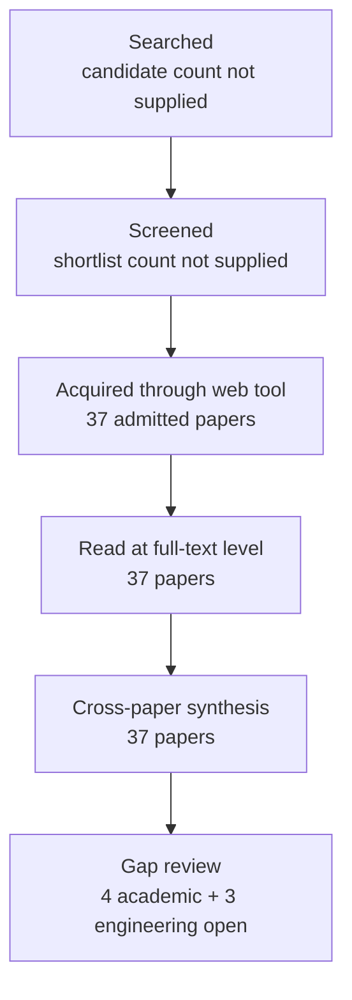

# Research Report: Evidence Attribution, Factuality, Completeness and Reliability Evaluation for Workplace Communication Systems

## Contents

- [Round History](#round-history)
- [Executive Summary](#executive-summary)
- [Research Question](#research-question)
- [Methodology](#methodology)
- [Papers Reviewed](#papers-reviewed)
- [Research Landscape](#research-landscape)
- [Confidence-Graded Findings](#confidence-graded-findings)
- [Research Gaps](#research-gaps)
- [Practical Recommendations](#practical-recommendations)
- [Evidence Map](#evidence-map)
- [References](#references)
- [Appendix: Run Metadata](#appendix-run-metadata)

## Round History

Iterative gap-closure loop (hard cap: 4 rounds). See `references/iterative-synthesis.md` for the full loop definition.

| Round | Run ID | Topic / Gap Focus | New Papers | Gaps Addressed | Remaining Gaps |
|-------|--------|-------------------|------------|----------------|----------------|
| 1 | e601ba8b9b6f | evidence attribution, factuality, completeness and reliability evaluation for workplace communication systems: what exact evidence supports each decision-relevant statement, whether it is current and correctly attributed, what was omitted, and when the system should abstain | 17 | initial shortlist | 5 academic, 3 engineering |
| 2 | 6ee1939a8f1e | evaluation of calibrated abstention, evidence completeness, and omission for free-form multi-source generation under temporal and distributional change | 20 | academic gaps of the previous round | 4 academic, 3 engineering |

**Stop reason**: another round runs while open academic gaps remain and new papers appear

## Executive Summary

This review investigated how a workplace communication system should evaluate claim correctness, exact evidence attribution, evidence completeness, temporal/current-state validity, omission, calibrated uncertainty, and abstention without collapsing those properties into one undifferentiated reliability score. Thirty-seven papers from five full-text host/source families were analyzed across two rounds, spanning factuality, attribution, multi-source generation, selective prediction, conformal methods, temporal verification, report completeness, and human/LLM evaluation. The strongest [HIGH] finding is that these reliability dimensions are empirically separable and require distinct evaluation denominators: a response can be factually plausible while incorrectly attributed, incompletely supported, temporally stale, incomplete at report level, or overconfident [2212.08037] [2305.14627] [doi-10-1109-access-2026-3679691] [2509.26184] [2512.17776] [2607.19322]. The most significant open [ACADEMIC] gap is that no admitted study validates one end-to-end scheme joining all required dimensions, and the most significant [ENGINEERING] gap is absence of direct validation on realistic private workplace communication with revisions, quoted history, delayed evidence, attachments, and permission constraints.

**Scope**: 37 papers analyzed from arXiv, ResearchGate-hosted full text, ACL Anthology, TechScience, and NeurIPS Proceedings over 2010–2026  
**Overall Confidence**: Medium — High for general evaluation principles, Medium for transfer to the target workplace domain  
**Verdict**: HAS_GAPS

## Research Question

The review asked:

> How should a workplace communication system evaluate each decision-relevant output so that factual correctness, source attribution, evidence completeness, temporal/current-state correctness, omission, confidence calibration, and abstention are measured separately and traceably, including under multi-source evidence, temporal change, and distribution shift?

The in-scope questions were claim decomposition, fact verification, attribution correctness, evidence/citation completeness, report-level omission, temporal validity, uncertainty calibration, selective prediction, risk-coverage behavior, abstention, and validation of human or LLM-assisted evaluators.

The review did not attempt to redefine domain semantics owned elsewhere in the project: what constitutes a Topic, action, deadline, response scope, supersession, or correct multimodal grounding remains the responsibility of the corresponding upstream Topic. It also did not treat schema validity, model confidence, citation presence, or LLM-judge agreement as substitutes for semantic correctness.

## Methodology

### Search Strategy

- **Sources**: arXiv; ResearchGate-hosted full text; ACL Anthology; TechScience; NeurIPS Proceedings.
- **Query variants**:
  - `calibrated abstention, evidence completeness, omission free-form multi-source generation under temporal distributional change`
  - `calibrated abstention,`
  - `calibrated evidence completeness, omission free-form multi-source generation under temporal distributional change`
  - `abstention, evidence completeness, omission free-form multi-source generation under temporal distributional change`
  - `calibrated abstention, evidence completeness,`
  - `calibrated abstention, omission free-form`
  - `calibrated abstention, multi-source generation`
  - `calibrated abstention, under temporal`
- **Time window**: 2010–2026.
- **Screening**: pipeline-provided shortlist and relevance admission. The exact BM25/sub-agent screening configuration is not supplied in the final run metadata and is therefore not reconstructed here.
- **Paper reading**: the admitted papers were read through the host's web tool. Every paper in the final corpus was available at `full_text` access level through the URL recorded by the pipeline.

### Access Levels

| Paper | Access level | Full-text host |
|---|---|---|
| [1707.05555] | `full_text` | arXiv HTML |
| [1910.12840] | `full_text` | arXiv HTML |
| [2004.14974] | `full_text` | arXiv HTML |
| [2012.14983] | `full_text` | arXiv HTML |
| [2106.00170] | `full_text` | arXiv HTML |
| [2111.09525] | `full_text` | arXiv HTML |
| [2212.08037] | `full_text` | arXiv HTML |
| [2305.14627] | `full_text` | arXiv HTML |
| [2307.09254] | `full_text` | arXiv HTML |
| [2312.09300] | `full_text` | arXiv HTML |
| [2404.00474] | `full_text` | arXiv HTML |
| [2404.15588] | `full_text` | arXiv HTML |
| [2406.07967] | `full_text` | arXiv HTML |
| [2410.14964] | `full_text` | arXiv HTML |
| [2505.23912] | `full_text` | arXiv HTML |
| [2508.20867] | `full_text` | arXiv HTML |
| [2509.26184] | `full_text` | arXiv HTML |
| [2510.07238] | `full_text` | arXiv HTML |
| [2512.17776] | `full_text` | arXiv HTML |
| [2604.12046] | `full_text` | arXiv HTML |
| [2605.01749] | `full_text` | arXiv HTML |
| [2605.03534] | `full_text` | arXiv HTML |
| [2605.06635] | `full_text` | arXiv HTML |
| [2605.16354] | `full_text` | arXiv HTML |
| [2606.00093] | `full_text` | arXiv HTML |
| [2606.29054] | `full_text` | arXiv HTML |
| [2607.08700] | `full_text` | arXiv HTML |
| [2607.19322] | `full_text` | arXiv HTML |
| [2608.22483] | `full_text` | arXiv HTML |
| [doi-10-1017-s1351324909005051] | `full_text` | ResearchGate |
| [doi-10-1109-access-2026-3679691] | `full_text` | ResearchGate |
| [doi-10-1162-tacl-a-00407] | `full_text` | arXiv HTML |
| [doi-10-18653-v1-2025-acl-long-837] | `full_text` | ACL Anthology PDF |
| [doi-10-18653-v1-w19-8642] | `full_text` | ACL Anthology PDF |
| [doi-10-32604-cmc-2026-086343] | `full_text` | TechScience HTML |
| [manual-32d5793dca] | `full_text` | NeurIPS Proceedings PDF |
| [manual-f5ce52cae2] | `full_text` | ACL Anthology PDF |

### Pipeline Summary

| Metric | Count |
|--------|-------|
| Total candidates | Not supplied |
| After screening | Not supplied |
| Downloaded / acquired | 37 admitted full-text papers |
| Successfully converted | Not applicable / not supplied |
| Deeply analyzed | 37 |
| Iterations | 2 |

The synthesis treats dimensions independently. For selective prediction, a useful generic representation is coverage

$C(\tau)=\frac{1}{N}\sum_{i=1}^{N}\mathbf{1}[s_i\ge\tau]$

and selective risk

$R(\tau)=\frac{\sum_{i=1}^{N}\ell_i\mathbf{1}[s_i\ge\tau]}{\sum_{i=1}^{N}\mathbf{1}[s_i\ge\tau]}$,

where $s_i$ is an acceptance/confidence score, $\ell_i$ is task-specific loss, and $\tau$ is an acceptance threshold. The literature reviewed here supports examining the full risk-coverage relation rather than interpreting a confidence threshold in isolation [2307.09254] [2605.01749] [2606.29054].

Likewise, calibration and correctness are distinct. A conventional binned calibration diagnostic can be written as

$\mathrm{ECE}=\sum_{b=1}^{B}\frac{|B_b|}{N}\left|\mathrm{acc}(B_b)-\mathrm{conf}(B_b)\right|$,

but low calibration error alone does not establish safe selective behavior, evidence completeness, or correct attribution [doi-10-1162-tacl-a-00407] [2106.00170] [2606.29054].

## Papers Reviewed

| # | Title | Authors | Year | Venue | Quality Score | Relevance |
|---|-------|---------|------|-------|--------------|-----------|
| 1 | Linguistic Calibration of Long-Form Generations [2404.00474] | Neil Band, Xuechen Li, Tengyu Ma et al. | 2024 | Not supplied | Not supplied | Admitted; per-paper grade not supplied |
| 2 | Claim-Level Confidence Calibration for Reliable Decision Making with Large Language Models [2608.22483] | Toghrul Abbasli, Kentaroh Toyoda, Yuan Wang et al. | 2026 | Not supplied | Not supplied | Admitted; per-paper grade not supplied |
| 3 | Only Say What You Know: Calibration-Aware Generation for Long-Form Factuality [2605.01749] | Wen Luo, Guangyue Peng, Liang Wang et al. | 2026 | Not supplied | Not supplied | Admitted; per-paper grade not supplied |
| 4 | Program-Verifiable Evaluation for Temporal QA: Metrics for Evidence Validity [doi-10-1109-access-2026-3679691] | Beomseok Kim, Hoansuk Choi, Namhyun Yoo et al. | 2026 | Not supplied | Not supplied | Admitted; per-paper grade not supplied |
| 5 | Minimal Evidence Group Identification for Claim Verification [2404.15588] | Xiangci Li, Sihao Chen, Rajvi Kapadia et al. | 2025 | Not supplied | Not supplied | Admitted; per-paper grade not supplied |
| 6 | SURE-RAG: Sufficiency and Uncertainty-Aware Evidence Verification for Selective Retrieval-Augmented Generation [2605.03534] | Jingxi Qiu, Zeyu Han, Cheng Huang | 2026 | Not supplied | Not supplied | Admitted; per-paper grade not supplied |
| 7 | MSRS: Evaluating Multi-Source Retrieval-Augmented Generation [2508.20867] | Rohan Phanse, Yijie Zhou, Kejian Shi et al. | 2025 | Not supplied | Not supplied | Admitted; per-paper grade not supplied |
| 8 | Adaptive Conformal Inference Under Distribution Shift [2106.00170] | Isaac Gibbs, Emmanuel Candès | 2021 | Not supplied | Not supplied | Admitted; per-paper grade not supplied |
| 9 | When Can Conformal Risk Control Certify LLM Outputs? Bounds, Impossibility, and Adaptation for Structured Generation [2606.29054] | Varun Kotte | 2026 | Not supplied | Not supplied | Admitted; per-paper grade not supplied |
| 10 | DEER: A Benchmark for Evaluating Deep Research Agents on Expert Report Generation [2512.17776] | Janghoon Han, Heegyu Kim, Changho Lee et al. | 2025 | Not supplied | Not supplied | Admitted; per-paper grade not supplied |
| 11 | Auto-ARGUE: LLM-Based Report Generation Evaluation [2509.26184] | William Walden, Marc Mason, Orion Weller et al. | 2025 | Not supplied | Not supplied | Admitted; per-paper grade not supplied |
| 12 | Self-Evaluation Improves Selective Generation in Large Language Models [2312.09300] | Jie Ren, Yao Zhao, Tu Vu et al. | 2023 | Not supplied | Not supplied | Admitted; per-paper grade not supplied |
| 13 | LoVeC: Reinforcement Learning for Better Verbalized Confidence in Long-Form Generation [2505.23912] | Caiqi Zhang, Xiaochen Zhu, Chengzu Li et al. | 2025 | Not supplied | Not supplied | Admitted; per-paper grade not supplied |
| 14 | Two-Level Meta-Rubrics for Evaluating Open-Ended Generation: GAMUT, a Benchmark for Factual Completeness [2607.19322] | Xilun Chen, Zhaleh Feizollahi, Ross Goodwin et al. | 2026 | Not supplied | Not supplied | Admitted; per-paper grade not supplied |
| 15 | Selective Generation for Controllable Language Models [2307.09254] | Minjae Lee, Kyungmin Kim, Taesoo Kim et al. | 2023 | Not supplied | Not supplied | Admitted; per-paper grade not supplied |
| 16 | Validating LLM-as-a-Judge Systems under Rating Indeterminacy [manual-32d5793dca] | Luke Guerdan, Solon Barocas, Kenneth Holstein et al. | 2025 | Not supplied | Not supplied | Admitted; per-paper grade not supplied |
| 17 | Reducing Conversational Agents’ Overconfidence Through Linguistic Calibration [2012.14983] | Sabrina J. Mielke, Arthur Szlam, Emily Dinan et al. | 2022 | Not supplied | Not supplied | Admitted; per-paper grade not supplied |
| 18 | Think Through Uncertainty: Improving Long-Form Generation Factuality via Reasoning Calibration [2604.12046] | Xin Liu, Lu Wang | 2026 | Not supplied | Not supplied | Admitted; per-paper grade not supplied |
| 19 | Agreement is overrated: A plea for correlation to assess human evaluation reliability [doi-10-18653-v1-w19-8642] | Jacopo Amidei, Paul Piwek, Alistair Willis | 2019 | Not supplied | Not supplied | Admitted; per-paper grade not supplied |
| 20 | Can LLMs Evaluate Complex Attribution in QA? Automatic Benchmarking using Knowledge Graphs [doi-10-18653-v1-2025-acl-long-837] | Nan Hu, Jiaoyan Chen, Yike Wu et al. | 2025 | Not supplied | Not supplied | Admitted; per-paper grade not supplied |
| 21 | Do LLMs Know When Evidence is Insufficient? An Evidence Sufficiency Benchmark for Answer-Abstention Calibration in Retrieval-Augmented Generation [doi-10-32604-cmc-2026-086343] | Hantian Zhang, Wentai Wu | 2026 | Not supplied | Not supplied | Admitted; per-paper grade not supplied |
| 22 | Fact or Fiction: Verifying Scientific Claims [2004.14974] | David Wadden, Shanchuan Lin, Kyle Lo et al. | 2020 | Not supplied | Not supplied | Admitted; per-paper grade not supplied |
| 23 | When Benchmarks Age: Temporal Misalignment through Large Language Model Factuality Evaluation [2510.07238] | Xunyi Jiang, Dingyi Chang, Julian McAuley et al. | 2026 | Not supplied | Not supplied | Admitted; per-paper grade not supplied |
| 24 | ReproHum #0892-01: The painful route to consistent results: A reproduction study of human evaluation in NLG [manual-f5ce52cae2] | Irene Mondella, Huiyuan Lai, Malvina Nissim | 2024 | Not supplied | Not supplied | Admitted; per-paper grade not supplied |
| 25 | ChronoFact: Timeline-based Temporal Fact Verification [2410.14964] | Anab Maulana Barik, Wynne Hsu, Mong Li Lee | 2025 | Not supplied | Not supplied | Admitted; per-paper grade not supplied |
| 26 | Runtime Verification of Temporal Properties over Out-of-order Data Streams [1707.05555] | David Basin, Felix Klaedtke, Eugen Zălinescu | 2017 | Not supplied | Not supplied | Admitted; per-paper grade not supplied |
| 27 | Evaluating the Factual Consistency of Abstractive Text Summarization [1910.12840] | Wojciech Kryściński, Bryan McCann, Caiming Xiong et al. | 2020 | Not supplied | Not supplied | Admitted; per-paper grade not supplied |
| 28 | Attributed Question Answering: Evaluation and Modeling for Attributed Large Language Models [2212.08037] | Bernd Bohnet, Vinh Q. Tran, Pat Verga et al. | 2022 | Not supplied | Not supplied | Admitted; per-paper grade not supplied |
| 29 | Cited but Not Verified: Parsing and Evaluating Source Attribution in LLM Deep Research Agents [2605.06635] | Hailey Onweller, Elias Lumer, Austin Huber et al. | 2026 | Not supplied | Not supplied | Admitted; per-paper grade not supplied |
| 30 | Do You Need a Frontier Model as a Citation Verifier? Benchmarking Rubric LLMs for Deep-Research Source Attribution [2607.08700] | Ethan Leung, Elias Lumer, Corey Feld et al. | 2026 | Not supplied | Not supplied | Admitted; per-paper grade not supplied |
| 31 | Formal and functional assessment of the pyramid method for summary content evaluation [doi-10-1017-s1351324909005051] | Rebecca J. Passonneau | 2010 | Not supplied | Not supplied | Admitted; per-paper grade not supplied |
| 32 | Agreement Metrics for LLM-as-Judge Evaluation: What to Report and Why [2606.00093] | Delip Rao, Chris Callison-Burch | 2026 | Not supplied | Not supplied | Admitted; per-paper grade not supplied |
| 33 | Augmenting Human Evaluation with LLM Judges: How Many Human Reviews Do You Need? [2605.16354] | Jane Paik Kim | 2026 | Not supplied | Not supplied | Admitted; per-paper grade not supplied |
| 34 | SummaC: Re-Visiting NLI-based Models for Inconsistency Detection in Summarization [2111.09525] | Philippe Laban, Tobias Schnabel, Paul N. Bennett et al. | 2022 | Not supplied | Not supplied | Admitted; per-paper grade not supplied |
| 35 | Enabling Large Language Models to Generate Text with Citations [2305.14627] | Tianyu Gao, Howard Yen, Jiatong Yu et al. | 2023 | Not supplied | Not supplied | Admitted; per-paper grade not supplied |
| 36 | Better than Random: Reliable NLG Human Evaluation with Constrained Active Sampling [2406.07967] | Jie Ruan, Xiao Pu, Mingqi Gao et al. | 2024 | Not supplied | Not supplied | Admitted; per-paper grade not supplied |
| 37 | How Can We Know When Language Models Know? On the Calibration of Language Models for Question Answering [doi-10-1162-tacl-a-00407] | Zhengbao Jiang, Jun Araki, Haibo Ding et al. | 2021 | Not supplied | Not supplied | Admitted; per-paper grade not supplied |

## Research Landscape

### Theme 1: Reliability Must Be Decomposed

**Coverage**: 6 directly supporting papers | **Confidence**: High  
**Supporting papers**: [2212.08037], [2305.14627], [doi-10-1109-access-2026-3679691], [2509.26184], [2512.17776], [2607.19322]

[HIGH] Across attributed QA, citation-grounded generation, temporal QA, and report-generation evaluation, factual correctness, attribution support, evidence completeness, temporal validity, and omission behave as distinct properties rather than interchangeable manifestations of one global quality score [2212.08037] [2305.14627] [doi-10-1109-access-2026-3679691] [2509.26184] [2512.17776] [2607.19322].

Key findings:

1. [HIGH] Correct answer content does not by itself establish that the cited source supports that content, and citation presence does not establish attribution correctness [2212.08037] [2305.14627].
2. [HIGH] Evidence can be semantically relevant yet temporally invalid for the time at which a claim is being evaluated [doi-10-1109-access-2026-3679691].
3. [HIGH] Report-level completeness exposes omitted content that factuality-oriented checking alone does not capture [2512.17776] [2607.19322].

### Theme 2: Fine-Grained Units Improve Diagnostic Resolution

**Coverage**: 5 directly supporting papers | **Confidence**: High  
**Supporting papers**: [1910.12840], [2004.14974], [2111.09525], [2608.22483], [doi-10-1017-s1351324909005051]

[HIGH] Sentence-, claim-, rationale-, evidence-group-, and content-unit-level evaluation yields more diagnostic information than treating a complete report or response as a single indivisible unit in the evaluated settings [1910.12840] [2004.14974] [2111.09525] [2608.22483] [doi-10-1017-s1351324909005051].

Key findings:

1. [HIGH] Claim or sentence decomposition makes local support and inconsistency failures observable instead of hiding them within an aggregate document score [1910.12840] [2111.09525].
2. [HIGH] Content-unit approaches allow coverage to be assessed against explicit expected information rather than fluency or semantic resemblance alone [doi-10-1017-s1351324909005051].
3. [HIGH] Claim-level confidence provides a more localized reliability signal for long-form outputs than one response-wide confidence value in the reported work [2608.22483].

### Theme 3: Retrieval Coverage and Generation Reliability Are Separate Failure Sources

**Coverage**: 6 directly supporting papers | **Confidence**: High  
**Supporting papers**: [2004.14974], [2305.14627], [2508.20867], [doi-10-1109-access-2026-3679691], [2512.17776], [2607.19322]

[HIGH] Retrieval or candidate-evidence coverage constrains downstream reliability, but strong or oracle evidence access does not eliminate misuse, unsupported generation, or omission [2004.14974] [2305.14627] [2508.20867] [doi-10-1109-access-2026-3679691].

Key findings:

1. [HIGH] End-to-end evaluation should distinguish failure to retrieve evidence from failure to use available evidence correctly [2004.14974] [2305.14627].
2. [HIGH] Multi-source synthesis can omit major or minor details even when relevant evidence is available [2508.20867].
3. [HIGH] Report-generation benchmarks expose missing rubric or content elements that cannot be diagnosed merely by measuring source retrieval quality [2512.17776] [2607.19322].

### Theme 4: Free-Form Calibration and Selective Generation Are Now Directly Studied

**Coverage**: 10 directly supporting papers | **Confidence**: High  
**Supporting papers**: [2012.14983], [2312.09300], [2404.00474], [2505.23912], [2604.12046], [2605.01749], [2307.09254], [2606.29054], [2106.00170], [doi-10-1162-tacl-a-00407]

[HIGH] Raw likelihood or unvalidated confidence is unreliable as a safety signal, while self-evaluation, linguistic or verbalized calibration, claim-level selective commitment, and explicit risk-control methods improve ranking or risk-coverage behavior within the particular tasks and assumptions studied [2012.14983] [2312.09300] [2404.00474] [2505.23912] [2604.12046] [2605.01749] [doi-10-1162-tacl-a-00407].

Key findings:

1. [HIGH] Free-form selective generation has direct methodological evidence; the previous question of whether selective methods exist beyond fixed-label classification is no longer open [2307.09254] [2604.12046] [2605.01749] [2606.29054].
2. [HIGH] Selective methods expose an explicit accuracy/risk-versus-coverage trade-off rather than providing a cost-free confidence improvement [2307.09254] [2605.01749].
3. [HIGH] Formal guarantees depend on assumptions, feasibility, calibration data, and the type of distribution shift; they should not be treated as universal guarantees for arbitrary free-form outputs [2106.00170] [2606.29054].

### Theme 5: Temporal Validity Is a Separate Correctness Dimension

**Coverage**: 4 directly relevant papers | **Confidence**: High  
**Supporting papers**: [1707.05555], [2410.14964], [doi-10-1109-access-2026-3679691], [2510.07238]

[HIGH] A claim may be supported by an otherwise relevant source but still be wrong for the observation time, and out-of-order arrival or benchmark aging makes static factuality evaluation insufficient for changing information [1707.05555] [2410.14964] [doi-10-1109-access-2026-3679691] [2510.07238].

Key findings:

1. [HIGH] Explicit chronology and temporal evidence checks enable distinctions that ordinary answer-correctness metrics omit [2410.14964] [doi-10-1109-access-2026-3679691].
2. [HIGH] Out-of-order observations require semantics that do not equate ingestion order with event order [1707.05555].
3. [HIGH] Factuality benchmarks themselves can become temporally misaligned as real-world facts change [2510.07238].

### Theme 6: Omission Requires Explicit Evaluation

**Coverage**: 4 directly supporting papers | **Confidence**: High  
**Supporting papers**: [2508.20867], [2509.26184], [2512.17776], [2607.19322]

[HIGH] Multi-source and long-form report evaluation increasingly measures missing required information explicitly rather than assuming a factually correct subset constitutes a complete answer [2508.20867] [2509.26184] [2512.17776] [2607.19322].

Key findings:

1. [HIGH] A report can contain only supported claims yet still be unsafe or ineffective because required evidence or decision-relevant content was omitted [2508.20867] [2512.17776].
2. [HIGH] Structured report rubrics and factual-completeness frameworks provide report-level signals complementary to claim factuality [2509.26184] [2607.19322].
3. [MEDIUM] Transfer from these report benchmarks to evolving workplace work items remains unvalidated because the evaluated domains do not reproduce the target stream's lifecycle and permission constraints.

### Theme 7: Evaluator Reliability Is Itself an Evaluation Problem

**Coverage**: 8 relevant papers | **Confidence**: High  
**Supporting papers**: [2212.08037], [2406.07967], [2605.16354], [2606.00093], [2607.08700], [manual-32d5793dca], [manual-f5ce52cae2], [doi-10-18653-v1-w19-8642]

[HIGH] Human and automatic evaluators cannot be treated as transparent ground truth: agreement level, rating indeterminacy, abstention treatment, directional bias, sampling strategy, and evaluator optimization can materially change conclusions [2212.08037] [2406.07967] [2605.16354] [2606.00093] [2607.08700] [manual-32d5793dca] [manual-f5ce52cae2] [doi-10-18653-v1-w19-8642].

Key findings:

1. [HIGH] Aggregate agreement or system-level correlation can conceal important instance-level disagreement and directional errors [doi-10-18653-v1-w19-8642] [2606.00093] [2607.08700].
2. [HIGH] Targeted human sampling can reduce review burden while preserving inference on human ratings when the sampling design is handled explicitly [2406.07967] [2605.16354].
3. [MEDIUM] Automatic evaluation proxies can become unreliable under optimization: reranking against an automatic attribution evaluator produced automatic-human outliers, and increased deep-research search depth could reduce factual-support accuracy despite comparatively stable link validity or relevance [2212.08037] [2605.06635].

## Methodology Comparison

| Approach | Papers | Strengths | Weaknesses | Best For | Performance |
|----------|--------|-----------|------------|----------|-------------|
| Claim/sentence-level factuality checking | [1910.12840], [2111.09525], [2004.14974] | Localizes unsupported or inconsistent propositions | Does not by itself measure omitted content, attribution provenance, or temporal validity | Claim correctness diagnostics | [HIGH] Diagnostic gains reported; no common cross-paper metric |
| Content-unit / rubric completeness | [doi-10-1017-s1351324909005051], [2509.26184], [2512.17776], [2607.19322] | Makes expected-content coverage explicit | Gold/rubric construction is costly and domain dependent | Report completeness and omission | [HIGH] Explicit omission measurement supported; metrics not numerically comparable |
| Attribution/citation verification | [2212.08037], [2305.14627], [2605.06635], [2607.08700], [doi-10-18653-v1-2025-acl-long-837] | Separates citation presence from actual support | Automatic verifiers themselves require validation | Source-to-claim support checking | [HIGH] Strong support for separate attribution evaluation |
| Minimal/complementary evidence reasoning | [2404.15588], [2508.20867], [doi-10-18653-v1-2025-acl-long-837] | Captures multi-evidence support better than single-passage matching | Compound, partial, temporal, and versioned completeness are not jointly resolved | Multi-source claim verification | [MEDIUM] Components validated separately |
| Temporal validity / chronological verification | [1707.05555], [2410.14964], [doi-10-1109-access-2026-3679691], [2510.07238] | Separates current-at-time correctness from ordinary relevance | Transfer to workplace revisions and attachment versions remains unvalidated | Changing facts and out-of-order evidence | [HIGH] Temporal distinction strongly supported |
| Self-evaluation / learned confidence | [2012.14983], [2312.09300], [2404.00474], [2505.23912], [2604.12046], [2608.22483] | Produces more useful confidence ordering in studied settings | Calibration can degrade under task or distribution change | Claim/output confidence | [HIGH] Improvements reported but task-dependent |
| Selective generation / abstention | [2307.09254], [2605.01749], [2605.03534], [doi-10-32604-cmc-2026-086343] | Makes answer-versus-abstain behavior explicit | Contradictory evidence is substantially harder than simple absence; policy costs remain application-specific | Bounded-risk answering | [HIGH] Risk/coverage framing directly supported |
| Adaptive/conformal risk control | [2106.00170], [2606.29054] | Offers explicit statistical risk/coverage formulations | Guarantees differ by setting; infeasibility and genuine shift can break desired control | Sequential or structured selective prediction | [HIGH] Formal results exist, but transfer assumptions matter |
| Human/LLM judge validation | [2406.07967], [2605.16354], [2606.00093], [manual-32d5793dca], [manual-f5ce52cae2] | Quantifies evaluator uncertainty and can reduce human workload | Review design, adjudication, directional bias, and domain transfer remain application-specific | Acceptance evaluation | [HIGH] Strong evidence that judge validation cannot be skipped |

## Confidence-Graded Findings

### 🟢 High Confidence (supported by 3+ papers with consistent results)

1. **[HIGH] Reliability dimensions should not be collapsed into a single faithfulness or hallucination score.** Answer correctness, attribution support, completeness, temporal validity, and omission expose different failures across the reviewed tasks [2212.08037] [2305.14627] [doi-10-1109-access-2026-3679691] [2509.26184] [2512.17776] [2607.19322].

2. **[HIGH] Fine-grained evaluation units improve diagnosis.** Sentence-, claim-, rationale-, evidence-group-, and content-unit methods reveal local support or coverage failures that response-level treatment can hide [1910.12840] [2004.14974] [2111.09525] [2608.22483] [doi-10-1017-s1351324909005051].

3. **[HIGH] Retrieval quality and generation quality must be measured separately.** Better evidence coverage reduces one class of failures but does not eliminate incorrect evidence use or omission [2004.14974] [2305.14627] [2508.20867] [doi-10-1109-access-2026-3679691].

4. **[HIGH] Report-level omission remains substantial even when evidence is available.** Multi-source and expert-report benchmarks demonstrate missing details or required rubric elements despite access to relevant information [2508.20867] [2512.17776] [2607.19322].

5. **[HIGH] Raw likelihood or unvalidated confidence is inadequate as a reliability policy.** Task-specific self-evaluation, linguistic/verbalized calibration, and claim-level calibration improve confidence-quality ordering or risk-coverage behavior in the tested settings [2012.14983] [2312.09300] [2404.00474] [2505.23912] [2604.12046] [2605.01749] [doi-10-1162-tacl-a-00407].

6. **[HIGH] Free-form selective generation is a directly studied methodology, not merely a transfer from classification.** Entailment-based selection, selective commitment, long-form claim filtering, and structured-output risk control explicitly trade useful coverage against error or risk [2307.09254] [2604.12046] [2605.01749] [2606.29054].

7. **[HIGH] Distribution-shift guarantees are method- and assumption-dependent.** Long-run adaptive coverage, held-out linguistic-calibration transfer, imperfect QA calibration transfer, and structured-generation failure under genuine cross-dataset shift are distinct results and must not be merged into one claim of robustness [2106.00170] [2404.00474] [2606.29054] [doi-10-1162-tacl-a-00407].

8. **[HIGH] Temporal validity must be evaluated separately from ordinary answer correctness or source relevance.** Chronology, evidence-validity windows, out-of-order observations, and aging factual targets can change whether a claim is correct at a given cutoff [1707.05555] [2410.14964] [doi-10-1109-access-2026-3679691] [2510.07238].

9. **[HIGH] Evaluator validity must be measured rather than assumed.** Agreement definitions, abstention handling, directional bias, rating ambiguity, and human sampling materially affect evaluator conclusions [2406.07967] [2605.16354] [2606.00093] [2607.08700] [manual-32d5793dca] [doi-10-18653-v1-w19-8642].

### 🟡 Medium Confidence (supported by 1-2 papers or with caveats)

1. **[MEDIUM] Automatic evaluation can become a development target rather than a faithful proxy for the real objective.** Attribution reranking produced automatic-human outliers, while deeper search in a deep-research setting reduced factual-support accuracy despite comparatively stable link validity and topical relevance [2212.08037] [2605.06635]. The precise magnitude and generality of this effect remain evaluator- and system-dependent.

2. **[MEDIUM] Contradictory evidence is a particularly difficult abstention condition.** In the reported evidence-sufficiency benchmark, models over-answered under conflict and passage ordering affected most evaluated systems [doi-10-32604-cmc-2026-086343]. This is highly relevant to workplace revision streams, but that target-domain transfer has not been directly tested.

### 🔴 Low Confidence (preliminary, single-source, or contradicted)

1. **[LOW] The reviewed methods can be assumed to work end to end on continuously changing private workplace email and Teams-style communication.** The corpus does not support that inference. Relevant evidence comes from adjacent domains such as multi-source RAG, expert-report generation, temporal verification, and out-of-order monitoring rather than the target deployment setting [1707.05555] [2508.20867] [2512.17776] [2605.06635].

## Trade-Off Analysis

| Decision | Option A | Option B | Recommendation |
|----------|----------|----------|----------------|
| Reliability aggregation | One overall faithfulness score is simple but can hide attribution, omission, temporal, and abstention failures | Separate denominators preserve failure identity but produce more metrics | [HIGH] Use separate denominators and only aggregate later for explicitly defined operational decisions [2212.08037] [2512.17776] [2607.19322] |
| Evaluation granularity | Response-level scoring is cheaper | Claim/content-unit scoring is more diagnostic but requires decomposition | [HIGH] Use claim-level evaluation for support/calibration and a separate report-level coverage layer [1910.12840] [2608.22483] [doi-10-1017-s1351324909005051] |
| Retrieval evaluation | End-to-end score alone reflects user-visible output | Oracle-evidence comparison isolates generation/evidence-use errors | [HIGH] Run both end-to-end and oracle/controlled-evidence conditions where feasible [2004.14974] [2305.14627] [2508.20867] |
| Abstention threshold | Fixed confidence threshold is operationally simple | Risk-coverage analysis exposes error/coverage trade-offs and threshold fragility | [HIGH] Select thresholds from explicit risk/coverage and application costs, not raw confidence alone [2307.09254] [2605.01749] [2606.29054] |
| Temporal evaluation | Static benchmark snapshot is easier | Chronological replay with observation cutoffs prevents future leakage and exposes drift | [HIGH] Use chronological cutoffs and versioned evidence for changing work-state evaluation [1707.05555] [2410.14964] [2510.07238] |
| Evaluator strategy | LLM-only judge minimizes human cost | Independent human review is slower but supplies validation and exposes bias | [HIGH] Use validated LLM assistance plus independent human holdouts, not an unvalidated LLM judge as ground truth [2406.07967] [2605.16354] [2606.00093] |
| Evaluator reuse | Same evaluator for development and acceptance simplifies iteration | Separated acceptance evaluator/holdout reduces proxy overfitting | [MEDIUM] Separate development and acceptance evaluation and retain adversarial regression cases [2212.08037] [2607.08700] |

## Points of Agreement **[EVIDENCE REQUIRED]**

1. [HIGH] **Correctness and attribution are different questions.** A correct-looking answer does not establish that its citation supports it [2212.08037] [2305.14627] [2605.06635].

2. [HIGH] **Fine-grained units are needed for reliable diagnosis.** Claim-, sentence-, rationale-, or content-unit decomposition appears repeatedly across factuality and completeness evaluation [1910.12840] [2004.14974] [2111.09525] [2608.22483] [doi-10-1017-s1351324909005051].

3. [HIGH] **Omission cannot be inferred from factuality alone.** Explicit completeness or report-coverage mechanisms are required to detect content that never appears in the output [2508.20867] [2512.17776] [2607.19322].

4. [HIGH] **Abstention must be evaluated jointly with useful coverage.** Selective-generation work treats improved accuracy at lower coverage as a trade-off rather than an unconditional win [2307.09254] [2605.01749] [2606.29054].

5. [HIGH] **Temporal or distribution shift requires separate testing.** Static calibration or static factuality results do not prove continued validity when the data-generating process or correct factual target changes [2106.00170] [2510.07238] [2606.29054] [doi-10-1162-tacl-a-00407].

6. [HIGH] **Automatic evaluators need validation against independent judgments.** Aggregate judge scores alone are insufficient because agreement structure, abstentions, directional bias, and rating ambiguity can change conclusions [2606.00093] [2607.08700] [manual-32d5793dca] [doi-10-18653-v1-w19-8642].

## Points of Contradiction **[EVIDENCE REQUIRED]**

[HIGH] No direct contradiction was identified where two admitted papers answer the same research question under sufficiently comparable assumptions, datasets, and metrics. Several apparent tensions are important scope qualifications rather than contradictions:

1. **Adaptive coverage versus shift-induced certification failure**: adaptive conformal inference provides long-run sequential coverage properties in its specified setting [2106.00170], whereas structured-generation conformal risk control can fail to meet a requested risk level under genuine cross-dataset shift or infeasible targets [2606.29054].
   - **Possible explanation**: the tasks, guarantees, loss functions, and shift assumptions differ.
   - **Implication**: [HIGH] A guarantee must be attached to its exact assumptions; “conformal” is not itself evidence of universal robustness.

2. **Calibration transfer successes versus imperfect transfer**: linguistic calibration retains improvements on several held-out tasks [2404.00474], while post-hoc QA calibration does not transfer uniformly across settings [doi-10-1162-tacl-a-00407].
   - **Possible explanation**: calibration mechanisms, tasks, and distribution shifts differ.
   - **Implication**: [HIGH] Calibration must be re-evaluated under the target operating distribution rather than inherited by method name.

3. **Better evidence access versus deeper-search degradation**: stronger retrieval or evidence coverage helps end-to-end verification and generation in several settings [2004.14974] [2508.20867], but deeper search in a deep-research setting can reduce factual-support accuracy even while link validity or topical relevance remains comparatively stable [2605.06635].
   - **Possible explanation**: evidence quantity and evidence quality/use are different variables; additional context can increase noise or synthesis complexity.
   - **Implication**: [MEDIUM] Retrieval depth should not be used as a proxy for evidence sufficiency.

## Research Gaps

All gaps below remain open. None is presented as accepted, solved, or closed by the current literature.

| # | Gap | Type | Severity | Rounds already searched / checked | Impact on Goals |
|---|-----|------|----------|-----------------------------------|-----------------|
| 1 | No validated end-to-end scheme jointly measures claim correctness, attribution correctness, evidence completeness, temporal/current-state correctness, omission, calibrated uncertainty, and abstention while keeping separate denominators | [ACADEMIC] | HIGH | Rounds 1 and 2 | A combined reliability contract cannot yet claim literature-level validation |
| 2 | No direct target-domain evaluation on realistic private workplace email/Teams streams with revisions, quoted history, conflicts, delayed/out-of-order arrival, versioned attachments, and permission constraints | [ENGINEERING] | HIGH | Round 1 identified; Round 2 corpus rechecked but not targeted as an academic search | Production representativeness and failure rates remain unknown |
| 4 | No general evidence-completeness method jointly handles compound claims, partial support, complementary sources, and temporally versioned evidence | [ACADEMIC] | HIGH | Rounds 1 and 2 | “Complete evidence” cannot yet be operationalized generally for complex workplace claims |
| 5 | Report-level omission is better covered, but evolving work-item omission, due information, superseded facts, and decision-relevant temporal state remain unresolved | [ACADEMIC] | HIGH | Rounds 1 and 2 | A report may silently omit work that still requires action |
| 6 | Target-domain human-review protocol remains unspecified: sampling, review volume, adjudication, confusion matrices, abstention treatment, coverage, and validation of LLM-assisted judges | [ENGINEERING] | HIGH | Round 1 identified; Round 2 corpus rechecked but not targeted as an academic search | Acceptance results may be unreliable or non-representative |
| 7 | No project-specific procedure prevents development from overfitting to the same automatic evaluator later used for acceptance | [ENGINEERING] | MEDIUM | Round 1 identified; Round 2 corpus rechecked but not targeted as an academic search | Proxy optimization can make acceptance metrics look better without improving real reliability |
| 8 | No validated selective-prediction method covers a continuously changing non-stationary free-form workplace communication stream | [ACADEMIC] | MEDIUM | Rounds 1 and 2 | Calibration and abstention may drift after deployment |

### Academic Gaps (require more papers)

1. **[ACADEMIC] [HIGH] Gap 1 — Combined end-to-end evaluation scheme**: The literature has not answered how to validate one integrated scheme spanning factual correctness, attribution, evidence completeness, temporal correctness, omission, uncertainty calibration, and abstention while preserving separate denominators. Existing work validates components and smaller combinations [2509.26184] [2512.17776] [2607.19322] [2608.22483] [doi-10-1109-access-2026-3679691].  
   **Rounds searched**: 1, 2.  
   **Suggested query**: `"evaluation framework" factuality attribution citation completeness temporal correctness omission uncertainty abstention free-form generation`.

2. **[ACADEMIC] [HIGH] Gap 4 — General evidence completeness for complex support structures**: The literature has not answered a unified method covering compound claims, partially supportive evidence, complementary multi-source support, and temporally versioned evidence [2404.15588] [2508.20867] [doi-10-1109-access-2026-3679691] [doi-10-18653-v1-2025-acl-long-837].  
   **Rounds searched**: 1, 2.  
   **Suggested query**: `"evidence completeness" compound claims partial support multi-source temporal versioned evidence attribution evaluation`.

3. **[ACADEMIC] [HIGH] Gap 5 — Temporal omission for evolving work items**: The literature has not answered omission detection for evolving workplace work items, due-state preservation, supersession, or decision-relevant temporal information. DEER, Auto-ARGUE, GAMUT, and MSRS strengthen general report-level completeness evidence but do not cover this lifecycle [2508.20867] [2509.26184] [2512.17776] [2607.19322].  
   **Rounds searched**: 1, 2.  
   **Suggested query**: `"report completeness" omission evolving information decision-relevant temporal summarization workplace`.

4. **[ACADEMIC] [MEDIUM] Gap 8 — Calibration under continuing non-stationarity**: The literature has not answered calibrated selective prediction for a continuously changing workplace stream. Adaptive sequential coverage, out-of-domain calibration, benchmark aging, and structured-generation risk-control studies cover adjacent pieces but not the complete target setting [2106.00170] [2404.00474] [2510.07238] [2606.29054] [doi-10-1162-tacl-a-00407].  
   **Rounds searched**: 1, 2.  
   **Suggested query**: `"selective prediction" non-stationary stream free-form generation temporal distribution shift calibration abstention`.

### Engineering Gaps (fillable without papers)

1. **[ENGINEERING] [HIGH] Gap 2 — Target-domain adversarial evaluation corpus**: The literature has not supplied the required workplace benchmark, so the project must construct authorized or independent synthetic/adversarial fixtures covering quoted history, revisions, conflicts, out-of-order evidence, versioned attachments, partial support, and permission-restricted evidence. Gold/future context must remain structurally separated from prediction inputs. Adjacent-domain methods can guide the design but cannot establish production accuracy [1707.05555] [2508.20867] [2605.06635] [doi-10-1109-access-2026-3679691].

2. **[ENGINEERING] [HIGH] Gap 6 — Human-review and adjudication contract**: The project must specify representative or risk-stratified sampling, minimum independent human review, adjudication, confusion matrices, abstention treatment, covered and total error, and validation of any LLM-assisted judge. The literature informs these choices but does not determine the target-domain contract [2406.07967] [2605.16354] [2606.00093] [manual-32d5793dca] [manual-f5ce52cae2] [doi-10-18653-v1-w19-8642].

3. **[ENGINEERING] [MEDIUM] Gap 7 — Development/acceptance evaluator separation**: The project must establish independent acceptance holdouts and regression cases so that improvements against a development-time judge cannot silently redefine success. Directional false positives and false negatives should be retained rather than summarized only by aggregate agreement [2212.08037] [2607.08700].

## Reproducibility Notes

The supplied synthesis did not provide normalized code, dataset, or license metadata for the individual papers. Unknown fields are therefore left as unknown rather than inferred from paper URLs or publication venues.

| Paper | Code Available | Data Available | Sufficient Detail | License |
|-------|---------------|----------------|-------------------|---------|
| [2212.08037] | Unknown | Unknown | Unknown from supplied synthesis | Unknown |
| [2307.09254] | Unknown | Unknown | Unknown from supplied synthesis | Unknown |
| [2404.00474] | Unknown | Unknown | Unknown from supplied synthesis | Unknown |
| [2508.20867] | Unknown | Unknown | Unknown from supplied synthesis | Unknown |
| [2512.17776] | Unknown | Unknown | Unknown from supplied synthesis | Unknown |
| [2605.01749] | Unknown | Unknown | Unknown from supplied synthesis | Unknown |
| [2606.29054] | Unknown | Unknown | Unknown from supplied synthesis | Unknown |
| [2607.19322] | Unknown | Unknown | Unknown from supplied synthesis | Unknown |
| [2608.22483] | Unknown | Unknown | Unknown from supplied synthesis | Unknown |
| [doi-10-1109-access-2026-3679691] | Unknown | Unknown | Unknown from supplied synthesis | Unknown |

## Practical Recommendations **[EVIDENCE REQUIRED]**

1. **[HIGH] Maintain separate evaluation denominators for claim correctness, attribution correctness, evidence completeness/omission, temporal validity, calibration, and abstention/coverage.** A single reliability score can hide structurally different failures [2212.08037] [2305.14627] [doi-10-1109-access-2026-3679691] [2512.17776] [2607.19322].  
   *Confidence*: High

2. **[HIGH] Evaluate both claim-level reliability and report-level coverage.** Use fine-grained claims/content units for support and confidence diagnostics, while retaining a separate report-wide mechanism for detecting decision-relevant information that never appears [1910.12840] [2608.22483] [doi-10-1017-s1351324909005051] [2512.17776] [2607.19322].  
   *Confidence*: High

3. **[HIGH] Separate retrieval failure from generation/evidence-use failure.** Pair normal end-to-end evaluation with controlled or oracle-evidence conditions where feasible so that missing evidence is not confused with failure to use available evidence [2004.14974] [2305.14627] [2508.20867].  
   *Confidence*: High

4. **[HIGH] Evaluate abstention using risk-coverage behavior rather than confidence accuracy alone.** Report useful coverage, covered error, false-answer counts, false-abstention counts, and how abstained cases are treated [2307.09254] [2605.01749] [2606.29054].  
   *Confidence*: High

5. **[HIGH] Include contradictory, partial, complementary, stale, and missing evidence in abstention tests.** Testing only complete evidence versus no evidence misses conflict-sensitive behavior and the harder multi-source support conditions [2404.15588] [doi-10-32604-cmc-2026-086343] [2508.20867].  
   *Confidence*: High

6. **[HIGH] Evaluate temporal correctness at explicit observation cutoffs.** Evidence available only later must not leak into earlier predictions, and event/effective time should not be replaced by ingestion order [1707.05555] [2410.14964] [doi-10-1109-access-2026-3679691].  
   *Confidence*: High

7. **[HIGH] Re-evaluate calibration over chronological windows or controlled distribution shifts.** A threshold calibrated once should not be assumed to retain its operating characteristics as facts, topics, or distributions change [2106.00170] [2510.07238] [2606.29054] [doi-10-1162-tacl-a-00407].  
   *Confidence*: High

8. **[HIGH] Validate LLM-assisted judges against an independent human-reviewed sample.** Record directional false positives and false negatives, adjudication, abstention handling, and agreement at the level relevant to acceptance rather than relying solely on one aggregate correlation or F1 value [2406.07967] [2605.16354] [2606.00093] [2607.08700] [manual-32d5793dca].  
   *Confidence*: High

9. **[MEDIUM] Separate development-time evaluators from acceptance-time holdouts.** Maintain regression cases designed specifically to detect optimization against the proxy evaluator [2212.08037] [2607.08700].  
   *Confidence*: Medium

## Future Directions

1. Run the next academic round as a targeted search for Gap 1 rather than a broad factuality search: integrated evaluation frameworks combining attribution, completeness, temporal validity, omission, calibration, and abstention.
2. Search specifically for compound/partial/complementary evidence completeness with temporal or version-aware support to address Gap 4.
3. Search temporal summarization and longitudinal report-completeness work for evolving obligations, due-state preservation, superseded facts, and decision-changing omissions to address Gap 5.
4. Search non-stationary selective prediction, online calibration, and free-form generation under continuing temporal shift to address Gap 8.
5. Independently of further literature, construct target-domain fixtures and a human-review contract for Engineering Gaps 2, 6, and 7.
6. Preserve the distinction between literature-supported methodology and target-domain acceptance evidence: successful transfer methods should motivate experiments, not be reported as workplace production accuracy.

## Readiness Assessment (System-Building Mode)

### Verdict: HAS_GAPS

### Assessment Summary

The synthesis is sufficient to design the structure of a decomposed reliability-evaluation subsystem: separate claim correctness, attribution, completeness, temporal validity, confidence calibration, abstention, and report coverage; evaluate both claim-level and report-level behavior; and use independent human validation for acceptance. It is not sufficient to claim that the resulting combined scheme is academically validated end to end or production-ready for private workplace communication. Four academic gaps and three engineering gaps remain open.

### Coverage Matrix

| Dimension | Status | Evidence |
|-----------|--------|----------|
| Architecture patterns | ✅ Sufficient for decomposed evaluation structure | [2212.08037] [2512.17776] [2607.19322] [2608.22483] |
| Technology stack | ❌ Missing; this review evaluates methodology rather than an implementation stack | No admitted paper establishes a msgloom-specific stack |
| Performance baselines | ⚠️ Partial; task-specific baselines exist but are not comparable to the target workload | [2508.20867] [2512.17776] [2605.06635] |
| Security model | ❌ Missing for permission-constrained workplace evidence | Adjacent multi-source evidence work does not validate the target permission setting [2508.20867] [2605.06635] |
| Trade-off map | ✅ General risk/coverage and evaluator trade-offs are supported; target-domain costs remain unspecified | [2307.09254] [2605.01749] [2606.29054] [2606.00093] |

### Gap Resolution Plan

| # | Gap | Type | Severity | Resolution |
|---|-----|------|----------|------------|
| 1 | Integrated end-to-end reliability scheme | [ACADEMIC] | HIGH | Targeted Round 3 search for genuinely joint evaluation frameworks; preserve separate denominators even if no unified paper appears |
| 2 | Workplace-domain benchmark | [ENGINEERING] | HIGH | Build independent synthetic/adversarial fixtures first, then authorized workplace samples; hide future/gold evidence from inputs |
| 4 | Complex evidence completeness | [ACADEMIC] | HIGH | Target compound claims, partial support, complementary multi-source evidence, temporal/versioned support |
| 5 | Evolving work-item omission | [ACADEMIC] | HIGH | Search longitudinal/temporal completeness and evaluate due-state, supersession, and decision-changing omissions |
| 6 | Human-review contract | [ENGINEERING] | HIGH | Define representative/risk-stratified sampling, minimum review, adjudication, confusion matrices, abstention and coverage reporting |
| 7 | Evaluator overfitting prevention | [ENGINEERING] | MEDIUM | Separate development and acceptance evaluators/holdouts; add evaluator-gaming regressions |
| 8 | Non-stationary calibration | [ACADEMIC] | MEDIUM | Search online/adaptive selective prediction for free-form temporal streams and evaluate calibration across chronological replay windows |

## Evidence Map

| Research Question Aspect | [2212.08037] | [2305.14627] | [2508.20867] | [2512.17776] | [2607.19322] | [2608.22483] | [doi-10-1109-access-2026-3679691] | [2606.29054] |
|--------------------------|---------------|---------------|---------------|---------------|---------------|---------------|--------------------------------------|---------------|
| Claim correctness | ✓ | ✓ | ✓ | ✓ | ✓ | ✓ | ✓ | ✓ |
| Attribution correctness | ✓ | ✓ | ✓ | ✓ |  |  | ✓ |  |
| Evidence completeness |  | ✓ | ✓ | ✓ | ✓ |  | ✓ |  |
| Report-level omission |  |  | ✓ | ✓ | ✓ |  |  |  |
| Claim-level confidence |  |  |  |  |  | ✓ |  | ✓ |
| Selective risk / abstention |  |  |  |  |  | ✓ |  | ✓ |
| Temporal evidence validity |  |  |  |  |  |  | ✓ |  |
| Multi-source evidence |  | ✓ | ✓ | ✓ | ✓ |  | ✓ |  |
| Combined end-to-end scheme |  |  |  |  |  |  |  |  |

Additional evidence coverage:

| Research Question Aspect | Representative evidence |
|--------------------------|-------------------------|
| Fine-grained factuality/inconsistency | [1910.12840] [2004.14974] [2111.09525] |
| Content-unit completeness | [doi-10-1017-s1351324909005051] [2509.26184] [2607.19322] |
| Minimal/complementary evidence | [2404.15588] [doi-10-18653-v1-2025-acl-long-837] |
| Temporal chronology / out-of-order data | [1707.05555] [2410.14964] |
| Benchmark aging | [2510.07238] |
| Evidence insufficiency / contradiction | [2605.03534] [doi-10-32604-cmc-2026-086343] |
| Linguistic and self-calibration | [2012.14983] [2312.09300] [2404.00474] [2505.23912] [2604.12046] |
| Adaptive calibration under shift | [2106.00170] [doi-10-1162-tacl-a-00407] |
| Judge agreement and human validation | [2406.07967] [2605.16354] [2606.00093] [2607.08700] [manual-32d5793dca] [manual-f5ce52cae2] [doi-10-18653-v1-w19-8642] |
| Automatic-evaluator proxy risk | [2212.08037] [2605.06635] |

## References

1. [2404.00474] — *Linguistic Calibration of Long-Form Generations*. Neil Band, Xuechen Li, Tengyu Ma et al. 2024. Venue not supplied.
2. [2608.22483] — *Claim-Level Confidence Calibration for Reliable Decision Making with Large Language Models*. Toghrul Abbasli, Kentaroh Toyoda, Yuan Wang et al. 2026. Venue not supplied.
3. [2605.01749] — *Only Say What You Know: Calibration-Aware Generation for Long-Form Factuality*. Wen Luo, Guangyue Peng, Liang Wang et al. 2026. Venue not supplied.
4. [doi-10-1109-access-2026-3679691] — *Program-Verifiable Evaluation for Temporal QA: Metrics for Evidence Validity*. Beomseok Kim, Hoansuk Choi, Namhyun Yoo et al. 2026. Venue not supplied.
5. [2404.15588] — *Minimal Evidence Group Identification for Claim Verification*. Xiangci Li, Sihao Chen, Rajvi Kapadia et al. 2025. Venue not supplied.
6. [2605.03534] — *SURE-RAG: Sufficiency and Uncertainty-Aware Evidence Verification for Selective Retrieval-Augmented Generation*. Jingxi Qiu, Zeyu Han, Cheng Huang. 2026. Venue not supplied.
7. [2508.20867] — *MSRS: Evaluating Multi-Source Retrieval-Augmented Generation*. Rohan Phanse, Yijie Zhou, Kejian Shi et al. 2025. Venue not supplied.
8. [2106.00170] — *Adaptive Conformal Inference Under Distribution Shift*. Isaac Gibbs, Emmanuel Candès. 2021. Venue not supplied.
9. [2606.29054] — *When Can Conformal Risk Control Certify LLM Outputs? Bounds, Impossibility, and Adaptation for Structured Generation*. Varun Kotte. 2026. Venue not supplied.
10. [2512.17776] — *DEER: A Benchmark for Evaluating Deep Research Agents on Expert Report Generation*. Janghoon Han, Heegyu Kim, Changho Lee et al. 2025. Venue not supplied.
11. [2509.26184] — *Auto-ARGUE: LLM-Based Report Generation Evaluation*. William Walden, Marc Mason, Orion Weller et al. 2025. Venue not supplied.
12. [2312.09300] — *Self-Evaluation Improves Selective Generation in Large Language Models*. Jie Ren, Yao Zhao, Tu Vu et al. 2023. Venue not supplied.
13. [2505.23912] — *LoVeC: Reinforcement Learning for Better Verbalized Confidence in Long-Form Generation*. Caiqi Zhang, Xiaochen Zhu, Chengzu Li et al. 2025. Venue not supplied.
14. [2607.19322] — *Two-Level Meta-Rubrics for Evaluating Open-Ended Generation: GAMUT, a Benchmark for Factual Completeness*. Xilun Chen, Zhaleh Feizollahi, Ross Goodwin et al. 2026. Venue not supplied.
15. [2307.09254] — *Selective Generation for Controllable Language Models*. Minjae Lee, Kyungmin Kim, Taesoo Kim et al. 2023. Venue not supplied.
16. [manual-32d5793dca] — *Validating LLM-as-a-Judge Systems under Rating Indeterminacy*. Luke Guerdan, Solon Barocas, Kenneth Holstein et al. 2025. Venue not supplied.
17. [2012.14983] — *Reducing Conversational Agents’ Overconfidence Through Linguistic Calibration*. Sabrina J. Mielke, Arthur Szlam, Emily Dinan et al. 2022. Venue not supplied.
18. [2604.12046] — *Think Through Uncertainty: Improving Long-Form Generation Factuality via Reasoning Calibration*. Xin Liu, Lu Wang. 2026. Venue not supplied.
19. [doi-10-18653-v1-w19-8642] — *Agreement is overrated: A plea for correlation to assess human evaluation reliability*. Jacopo Amidei, Paul Piwek, Alistair Willis. 2019. Venue not supplied.
20. [doi-10-18653-v1-2025-acl-long-837] — *Can LLMs Evaluate Complex Attribution in QA? Automatic Benchmarking using Knowledge Graphs*. Nan Hu, Jiaoyan Chen, Yike Wu et al. 2025. Venue not supplied.
21. [doi-10-32604-cmc-2026-086343] — *Do LLMs Know When Evidence is Insufficient? An Evidence Sufficiency Benchmark for Answer-Abstention Calibration in Retrieval-Augmented Generation*. Hantian Zhang, Wentai Wu. 2026. Venue not supplied.
22. [2004.14974] — *Fact or Fiction: Verifying Scientific Claims*. David Wadden, Shanchuan Lin, Kyle Lo et al. 2020. Venue not supplied.
23. [2510.07238] — *When Benchmarks Age: Temporal Misalignment through Large Language Model Factuality Evaluation*. Xunyi Jiang, Dingyi Chang, Julian McAuley et al. 2026. Venue not supplied.
24. [manual-f5ce52cae2] — *ReproHum #0892-01: The painful route to consistent results: A reproduction study of human evaluation in NLG*. Irene Mondella, Huiyuan Lai, Malvina Nissim. 2024. Venue not supplied.
25. [2410.14964] — *ChronoFact: Timeline-based Temporal Fact Verification*. Anab Maulana Barik, Wynne Hsu, Mong Li Lee. 2025. Venue not supplied.
26. [1707.05555] — *Runtime Verification of Temporal Properties over Out-of-order Data Streams*. David Basin, Felix Klaedtke, Eugen Zălinescu. 2017. Venue not supplied.
27. [1910.12840] — *Evaluating the Factual Consistency of Abstractive Text Summarization*. Wojciech Kryściński, Bryan McCann, Caiming Xiong et al. 2020. Venue not supplied.
28. [2212.08037] — *Attributed Question Answering: Evaluation and Modeling for Attributed Large Language Models*. Bernd Bohnet, Vinh Q. Tran, Pat Verga et al. 2022. Venue not supplied.
29. [2605.06635] — *Cited but Not Verified: Parsing and Evaluating Source Attribution in LLM Deep Research Agents*. Hailey Onweller, Elias Lumer, Austin Huber et al. 2026. Venue not supplied.
30. [2607.08700] — *Do You Need a Frontier Model as a Citation Verifier? Benchmarking Rubric LLMs for Deep-Research Source Attribution*. Ethan Leung, Elias Lumer, Corey Feld et al. 2026. Venue not supplied.
31. [doi-10-1017-s1351324909005051] — *Formal and functional assessment of the pyramid method for summary content evaluation*. Rebecca J. Passonneau. 2010. Venue not supplied.
32. [2606.00093] — *Agreement Metrics for LLM-as-Judge Evaluation: What to Report and Why*. Delip Rao, Chris Callison-Burch. 2026. Venue not supplied.
33. [2605.16354] — *Augmenting Human Evaluation with LLM Judges: How Many Human Reviews Do You Need?*. Jane Paik Kim. 2026. Venue not supplied.
34. [2111.09525] — *SummaC: Re-Visiting NLI-based Models for Inconsistency Detection in Summarization*. Philippe Laban, Tobias Schnabel, Paul N. Bennett et al. 2022. Venue not supplied.
35. [2305.14627] — *Enabling Large Language Models to Generate Text with Citations*. Tianyu Gao, Howard Yen, Jiatong Yu et al. 2023. Venue not supplied.
36. [2406.07967] — *Better than Random: Reliable NLG Human Evaluation with Constrained Active Sampling*. Jie Ruan, Xiao Pu, Mingqi Gao et al. 2024. Venue not supplied.
37. [doi-10-1162-tacl-a-00407] — *How Can We Know When Language Models Know? On the Calibration of Language Models for Question Answering*. Zhengbao Jiang, Jun Araki, Haibo Ding et al. 2021. Venue not supplied.

## Appendix: Run Metadata

- **Run ID**: `6ee1939a8f1e`
- **Round**: 2 of at most 4
- **Sources**: arXiv, ResearchGate-hosted full text, ACL Anthology, TechScience, NeurIPS Proceedings
- **Pipeline version**: Not supplied
- **Date**: 2026-09-17
- **Artifacts**: `runs/6ee1939a8f1e/`
- **Papers analyzed**: 37
- **New papers in this round**: 20
- **Current open gaps**: 4 [ACADEMIC], 3 [ENGINEERING]
- **Resolved in this round**: the prior question of whether direct selective-prediction / calibrated-abstention methods exist for free-form or structured generation is resolved by direct methodological evidence [2307.09254] [2604.12046] [2605.01749] [2606.29054]; this does not resolve non-stationary workplace-stream calibration, which remains open as Gap 8.
- **Confidence summary**: High confidence supports decomposed reliability evaluation, fine-grained claim/evidence units, explicit omission measurement, and risk-versus-coverage analysis. High confidence also supports the existence of direct free-form selective-generation methods, but not one universally superior method. Transfer to continuously changing private workplace communication remains Medium confidence because the combined target setting has not been directly evaluated.
- **Key limitation**: the corpus validates components in different domains and experimental settings; joining those components into one evaluation contract does not itself constitute validation of the combined system.
