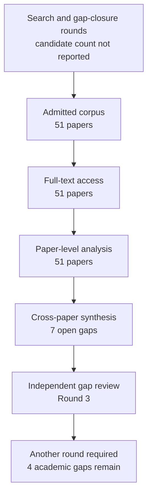

# Research Report: Evidence Attribution, Factuality, Completeness and Reliability Evaluation for Workplace Communication Systems

## Contents

- [Round History](#round-history)
- [Executive Summary](#executive-summary)
- [Research Question](#research-question)
- [Methodology](#methodology)
- [Papers Reviewed](#papers-reviewed)
- [Research Landscape](#research-landscape)
- [Methodology Comparison](#methodology-comparison)
- [Confidence-Graded Findings](#confidence-graded-findings)
- [Trade-Off Analysis](#trade-off-analysis)
- [Points of Agreement](#points-of-agreement)
- [Points of Contradiction](#points-of-contradiction)
- [Research Gaps](#research-gaps)
- [Reproducibility Notes](#reproducibility-notes)
- [Practical Recommendations](#practical-recommendations)
- [Future Directions](#future-directions)
- [Readiness Assessment (System-Building Mode)](#readiness-assessment-system-building-mode)
- [Evidence Map](#evidence-map)
- [References](#references)
- [Appendix: Run Metadata](#appendix-run-metadata)

## Round History

Iterative gap-closure loop (hard cap: 4 rounds). See `references/iterative-synthesis.md` for the full loop definition.

| Round | Run ID | Topic / Gap Focus | New Papers | Gaps Addressed | Remaining Gaps |
|-------|--------|-------------------|------------|----------------|----------------|
| 1 | e601ba8b9b6f | evidence attribution, factuality, completeness and reliability evaluation for workplace communication systems: what exact evidence supports each decision-relevant statement, whether it is current and correctly attributed, what was omitted, and when the system should abstain | 17 | initial shortlist | 5 academic, 3 engineering |
| 2 | 6ee1939a8f1e | evaluation of calibrated abstention, evidence completeness, and omission for free-form multi-source generation under temporal and distributional change | 20 | 1 resolved | 4 academic, 3 engineering |
| 3 | 59261fd4011a | Integrated evaluation of evidence completeness and omission for temporally evolving multi-source free-form generation, with calibrated selective prediction under non-stationary distribution shift | 14 | academic gaps of the previous round | 4 academic, 3 engineering |

**Stop reason**: another round runs while open academic gaps remain and new papers appear

## Executive Summary

This review examines how to evaluate evidence attribution, factual correctness, evidence and report completeness, temporal/current-state validity, calibrated uncertainty, and abstention for evidence-grounded workplace communication systems. The corpus contains 51 papers spanning 2008–2026 and six full-text access-source families, with evidence drawn primarily from summarization, question answering, RAG, report generation, temporal verification, human evaluation, and uncertainty/selective-prediction research rather than direct private workplace deployments. [HIGH] The strongest finding is that claim correctness, attribution correctness, completeness, temporal validity, omission, calibration, and selective risk are empirically separable and therefore should not be collapsed into one reliability score [2212.08037] [2305.14627] [2405.00982] [2408.08067] [2604.03141]. [HIGH] The most consequential unresolved gap is that no admitted study validates one end-to-end scheme combining all required dimensions while retaining separate denominators, and no direct benchmark covers continuously evolving private workplace email or Teams-style communication.

**Scope**: 51 papers analyzed from arXiv, ACL Anthology, ResearchGate, NIST/TREC, TechScience, and NeurIPS Proceedings over 2008–2026  
**Overall Confidence**: Medium — High for general evaluation principles and failure modes, lower for direct transfer to continuously evolving private workplace communication  
**Verdict**: HAS_GAPS

## Research Question

The investigation asks:

> How should a workplace communication system evaluate what exact evidence supports each decision-relevant statement, whether that evidence is correctly attributed and temporally current, whether important evidence or work was omitted, how confidence should be calibrated, and when the system should abstain?

The scope includes claim-level factual verification, citation/source attribution, evidence completeness, report-level omission, temporal validity, evolving and contradictory evidence, confidence calibration, selective prediction, abstention, risk-coverage analysis, and human or LLM-assisted evaluation methodology.

The scope explicitly distinguishes factual correctness from citation correctness; citation correctness from citation completeness; evidence support from current-state correctness; current-state correctness from report completeness; confidence values from calibrated probabilities; and calibration from an operational selective-decision policy. Domain-specific semantics such as what constitutes a correct action, Topic identity, response scope, or supersession remain owned by their originating project Topics rather than being redefined here.

## Methodology

### Search Strategy

- **Sources**: full-text material was accessed through the host's web tool from arXiv, ACL Anthology, ResearchGate, NIST/TREC, TechScience, and NeurIPS Proceedings. Discovery-source metadata beyond the supplied pipeline records was not separately reported.
- **Query variants**:
  - `integrated evidence completeness omission temporally evolving multi-source free-form generation, calibrated selective prediction under non-stationary distribution shift`
  - `integrated evidence`
  - `integrated completeness omission temporally evolving multi-source free-form generation, calibrated selective prediction under non-stationary distribution shift`
  - `evidence completeness omission temporally evolving multi-source free-form generation, calibrated selective prediction under non-stationary distribution shift`
  - `integrated evidence completeness omission`
  - `integrated evidence temporally evolving`
  - `integrated evidence multi-source free-form`
  - `integrated evidence generation, calibrated`
- **Time window**: 2008–2026.
- **Screening**: iterative shortlist and academic-gap closure. The supplied run metadata does not state whether BM25-only or BM25 plus sub-agent screening was used, so that detail is unknown.
- **Evidence policy**: project handoffs and project-context documents were used only to define scope and ownership boundaries, not as evidence for findings or gap closure.
- **Paper reading**: all 51 admitted papers were read at `full_text` access level through the host's web tool. No abstract-only record was used in the supplied corpus.

### Full-Text Access Audit

Every admitted paper had `full_text` access:

- `1707.05555` — full_text, arXiv HTML
- `1910.12840` — full_text, arXiv HTML
- `2004.14974` — full_text, arXiv HTML
- `2012.14983` — full_text, arXiv HTML
- `2105.00071` — full_text, arXiv HTML
- `2106.00170` — full_text, arXiv HTML
- `2111.09525` — full_text, arXiv HTML
- `2212.08037` — full_text, arXiv HTML
- `2302.07869` — full_text, arXiv HTML
- `2305.14627` — full_text, arXiv HTML
- `2307.09254` — full_text, arXiv HTML
- `2312.09300` — full_text, arXiv HTML
- `2402.05629` — full_text, arXiv HTML
- `2404.00474` — full_text, arXiv HTML
- `2404.15588` — full_text, arXiv HTML
- `2405.00982` — full_text, arXiv HTML
- `2406.07967` — full_text, arXiv HTML
- `2408.08067` — full_text, arXiv HTML
- `2410.14964` — full_text, arXiv HTML
- `2505.23912` — full_text, arXiv HTML
- `2508.20867` — full_text, arXiv HTML
- `2509.26184` — full_text, arXiv HTML
- `2510.07238` — full_text, arXiv HTML
- `2510.12839` — full_text, arXiv HTML
- `2511.16198` — full_text, arXiv HTML
- `2512.17776` — full_text, arXiv HTML
- `2602.11908` — full_text, arXiv HTML
- `2602.16537` — full_text, arXiv HTML
- `2604.03141` — full_text, arXiv HTML
- `2604.12046` — full_text, arXiv HTML
- `2605.01749` — full_text, arXiv HTML
- `2605.03534` — full_text, arXiv HTML
- `2605.06635` — full_text, arXiv HTML
- `2605.16354` — full_text, arXiv HTML
- `2606.00093` — full_text, arXiv HTML
- `2606.29054` — full_text, arXiv HTML
- `2607.03870` — full_text, arXiv HTML
- `2607.08700` — full_text, arXiv HTML
- `2607.19322` — full_text, arXiv HTML
- `2608.11238` — full_text, arXiv HTML
- `2608.22483` — full_text, arXiv HTML
- `doi-10-1017-s1351324909005051` — full_text, ResearchGate
- `doi-10-1109-access-2026-3679691` — full_text, ResearchGate
- `doi-10-1162-tacl-a-00407` — full_text, arXiv HTML
- `doi-10-18653-v1-2025-acl-long-837` — full_text, ACL Anthology PDF
- `doi-10-18653-v1-w19-8642` — full_text, ACL Anthology PDF
- `doi-10-32604-cmc-2026-086343` — full_text, TechScience HTML
- `doi-10-6028-nist-sp-500-321-realtime-overview` — full_text, NIST/TREC PDF
- `manual-32d5793dca` — full_text, NeurIPS Proceedings PDF
- `manual-39435af3dd` — full_text, NIST TAC PDF
- `manual-f5ce52cae2` — full_text, ACL Anthology PDF

### Pipeline Summary

| Metric | Count |
|--------|-------|
| Total candidates | not reported |
| After screening / admitted | 51 |
| Downloaded locally | not reported; host web reading was used |
| Successfully converted locally | not applicable to the supplied evidence record |
| Deeply analyzed | 51 |
| Iterations completed | 3 |

The three rounds admitted 17, 20, and 14 new papers respectively, totaling 51 records.

For uncertainty evaluation, no single scalar is sufficient. A generic calibration error can be represented as

$\mathrm{ECE}=\sum_{b=1}^{B}\frac{|S_b|}{n}\left|\mathrm{acc}(S_b)-\mathrm{conf}(S_b)\right|$,

while probabilistic accuracy may additionally be measured with a Brier score,

$\mathrm{Brier}=\frac{1}{n}\sum_{i=1}^{n}(p_i-y_i)^2$.

For selective prediction, reliability must also be represented as a function of retained coverage rather than only as a global calibration number. If $A_c$ is the subset retained at coverage $c$, a generic selective risk is

$R(c)=\frac{1}{|A_c|}\sum_{i\in A_c}\ell_i$,

and a risk-coverage curve examines $R(c)$ over multiple values of $c$. The reviewed calibration and selective-generation literature demonstrates why improved calibration error cannot automatically be interpreted as improved ranking, useful coverage, or lower selective risk [2012.14983] [doi-10-1162-tacl-a-00407] [2307.09254] [2602.11908] [2606.29054].

## Papers Reviewed

| # | Title | Authors | Year | Venue | Quality Score | Relevance | Access |
|---|-------|---------|------|-------|--------------|-----------|--------|
| 1 | FaStFACT: Faster, Stronger Long-Form Factuality Evaluations in LLMs [2510.12839] | Yingjia Wan, Haochen Tan, Xiao Zhu et al. | 2025 | not supplied | not scored | HIGH | full_text |
| 2 | SemanticCite: Citation Verification with AI-Powered Full-Text Analysis and Evidence-Based Reasoning [2511.16198] | Sebastian Haan | 2025 | not supplied | not scored | HIGH | full_text |
| 3 | RAGChecker: A Fine-grained Framework for Diagnosing Retrieval-Augmented Generation [2408.08067] | Dongyu Ru, Lin Qiu, Xiangkun Hu et al. | 2024 | not supplied | not scored | HIGH | full_text |
| 4 | Optimal training-conditional regret for online conformal prediction [2602.16537] | Jiadong Liang, Zhimei Ren, Yuxin Chen | 2026 | not supplied | not scored | MEDIUM, transfer | full_text |
| 5 | When Should LLMs Be Less Specific? Selective Abstraction for Reliable Long-Form Text Generation [2602.11908] | Shani Goren, Ido Galil, Ran El-Yaniv | 2026 | not supplied | not scored | HIGH | full_text |
| 6 | Improved Online Conformal Prediction via Strongly Adaptive Online Learning [2302.07869] | Aadyot Bhatnagar, Huan Wang, Caiming Xiong et al. | 2023 | not supplied | not scored | MEDIUM, transfer | full_text |
| 7 | Overview of the TAC 2008 Update Summarization Task [manual-39435af3dd] | Hoa Trang Dang, Karolina K. Owczarzak | 2008 | not supplied | not scored | HIGH | full_text |
| 8 | Evaluating LLM Uncertainty in Long-Form Generation Using Deterministic Ground Truth [2607.03870] | Ido Amit, Ido Galil, Ran El-Yaniv | 2026 | not supplied | not scored | HIGH | full_text |
| 9 | Overview of the TREC 2016 Real-Time Summarization Track [doi-10-6028-nist-sp-500-321-realtime-overview] | Jimmy Lin, Adam Roegiest, Luchen Tan et al. | 2016 | not supplied | not scored | HIGH | full_text |
| 10 | On the Evaluation of Machine-Generated Reports [2405.00982] | James Mayfield, Eugene Yang, Dawn Lawrie et al. | 2024 | not supplied | not scored | HIGH | full_text |
| 11 | Beyond Precision: Importance-Aware Recall for Factuality Evaluation in Long-Form LLM Generation [2604.03141] | Nazanin Jafari, James Allan, Mohit Iyyer | 2026 | not supplied | not scored | HIGH | full_text |
| 12 | Evaluating Attribution in Dialogue Systems: The BEGIN Benchmark [2105.00071] | Nouha Dziri, Hannah Rashkin, Tal Linzen et al. | 2022 | not supplied | not scored | HIGH | full_text |
| 13 | Merging Facts, Crafting Fallacies: Evaluating the Contradictory Nature of Aggregated Factual Claims in Long-Form Generations [2402.05629] | Cheng-Han Chiang, Hung-yi Lee | 2024 | not supplied | not scored | HIGH | full_text |
| 14 | Towards Query-Agnostic RAG Evaluation via Query Coverage and Claim Verifiability [2608.11238] | Jeonghwan Choi, Taewon Yun, Minjeong Ban et al. | 2026 | not supplied | not scored | HIGH | full_text |
| 15 | Do LLMs Know When Evidence is Insufficient? An Evidence Sufficiency Benchmark for Answer-Abstention Calibration in Retrieval-Augmented Generation [doi-10-32604-cmc-2026-086343] | Hantian Zhang, Wentai Wu | 2026 | not supplied | not scored | HIGH | full_text |
| 16 | Fact or Fiction: Verifying Scientific Claims [2004.14974] | David Wadden, Shanchuan Lin, Kyle Lo et al. | 2020 | not supplied | not scored | MEDIUM, transfer | full_text |
| 17 | When Benchmarks Age: Temporal Misalignment through Large Language Model Factuality Evaluation [2510.07238] | Xunyi Jiang, Dingyi Chang, Julian McAuley et al. | 2026 | not supplied | not scored | HIGH | full_text |
| 18 | ReproHum #0892-01: The painful route to consistent results: A reproduction study of human evaluation in NLG [manual-f5ce52cae2] | Irene Mondella, Huiyuan Lai, Malvina Nissim | 2024 | not supplied | not scored | MEDIUM | full_text |
| 19 | ChronoFact: Timeline-based Temporal Fact Verification [2410.14964] | Anab Maulana Barik, Wynne Hsu, Mong Li Lee | 2025 | not supplied | not scored | HIGH | full_text |
| 20 | Runtime Verification of Temporal Properties over Out-of-order Data Streams [1707.05555] | David Basin, Felix Klaedtke, Eugen Zălinescu | 2017 | not supplied | not scored | MEDIUM, transfer | full_text |
| 21 | Evaluating the Factual Consistency of Abstractive Text Summarization [1910.12840] | Wojciech Kryściński, Bryan McCann, Caiming Xiong et al. | 2020 | not supplied | not scored | HIGH | full_text |
| 22 | Attributed Question Answering: Evaluation and Modeling for Attributed Large Language Models [2212.08037] | Bernd Bohnet, Vinh Q. Tran, Pat Verga et al. | 2022 | not supplied | not scored | HIGH | full_text |
| 23 | Cited but Not Verified: Parsing and Evaluating Source Attribution in LLM Deep Research Agents [2605.06635] | Hailey Onweller, Elias Lumer, Austin Huber et al. | 2026 | not supplied | not scored | HIGH | full_text |
| 24 | Do You Need a Frontier Model as a Citation Verifier? Benchmarking Rubric LLMs for Deep-Research Source Attribution [2607.08700] | Ethan Leung, Elias Lumer, Corey Feld et al. | 2026 | not supplied | not scored | HIGH | full_text |
| 25 | Formal and functional assessment of the pyramid method for summary content evaluation [doi-10-1017-s1351324909005051] | Rebecca J. Passonneau | 2010 | not supplied | not scored | HIGH | full_text |
| 26 | Agreement Metrics for LLM-as-Judge Evaluation: What to Report and Why [2606.00093] | Delip Rao, Chris Callison-Burch | 2026 | not supplied | not scored | HIGH | full_text |
| 27 | Augmenting Human Evaluation with LLM Judges: How Many Human Reviews Do You Need? [2605.16354] | Jane Paik Kim | 2026 | not supplied | not scored | HIGH | full_text |
| 28 | SummaC: Re-Visiting NLI-based Models for Inconsistency Detection in Summarization [2111.09525] | Philippe Laban, Tobias Schnabel, Paul N. Bennett et al. | 2022 | not supplied | not scored | HIGH | full_text |
| 29 | Enabling Large Language Models to Generate Text with Citations [2305.14627] | Tianyu Gao, Howard Yen, Jiatong Yu et al. | 2023 | not supplied | not scored | HIGH | full_text |
| 30 | Better than Random: Reliable NLG Human Evaluation with Constrained Active Sampling [2406.07967] | Jie Ruan, Xiao Pu, Mingqi Gao et al. | 2024 | not supplied | not scored | HIGH | full_text |
| 31 | How Can We Know When Language Models Know? On the Calibration of Language Models for Question Answering [doi-10-1162-tacl-a-00407] | Zhengbao Jiang, Jun Araki, Haibo Ding et al. | 2021 | not supplied | not scored | HIGH | full_text |
| 32 | Linguistic Calibration of Long-Form Generations [2404.00474] | Neil Band, Xuechen Li, Tengyu Ma et al. | 2024 | not supplied | not scored | HIGH | full_text |
| 33 | Claim-Level Confidence Calibration for Reliable Decision Making with Large Language Models [2608.22483] | Toghrul Abbasli, Kentaroh Toyoda, Yuan Wang et al. | 2026 | not supplied | not scored | HIGH | full_text |
| 34 | Only Say What You Know: Calibration-Aware Generation for Long-Form Factuality [2605.01749] | Wen Luo, Guangyue Peng, Liang Wang et al. | 2026 | not supplied | not scored | HIGH | full_text |
| 35 | Program-Verifiable Evaluation for Temporal QA: Metrics for Evidence Validity [doi-10-1109-access-2026-3679691] | Beomseok Kim, Hoansuk Choi, Namhyun Yoo et al. | 2026 | not supplied | not scored | HIGH | full_text |
| 36 | Minimal Evidence Group Identification for Claim Verification [2404.15588] | Xiangci Li, Sihao Chen, Rajvi Kapadia et al. | 2025 | not supplied | not scored | HIGH | full_text |
| 37 | SURE-RAG: Sufficiency and Uncertainty-Aware Evidence Verification for Selective Retrieval-Augmented Generation [2605.03534] | Jingxi Qiu, Zeyu Han, Cheng Huang | 2026 | not supplied | not scored | HIGH | full_text |
| 38 | MSRS: Evaluating Multi-Source Retrieval-Augmented Generation [2508.20867] | Rohan Phanse, Yijie Zhou, Kejian Shi et al. | 2025 | not supplied | not scored | HIGH | full_text |
| 39 | Adaptive Conformal Inference Under Distribution Shift [2106.00170] | Isaac Gibbs, Emmanuel Candès | 2021 | not supplied | not scored | MEDIUM, transfer | full_text |
| 40 | When Can Conformal Risk Control Certify LLM Outputs? Bounds, Impossibility, and Adaptation for Structured Generation [2606.29054] | Varun Kotte | 2026 | not supplied | not scored | HIGH | full_text |
| 41 | DEER: A Benchmark for Evaluating Deep Research Agents on Expert Report Generation [2512.17776] | Janghoon Han, Heegyu Kim, Changho Lee et al. | 2025 | not supplied | not scored | HIGH | full_text |
| 42 | Auto-ARGUE: LLM-Based Report Generation Evaluation [2509.26184] | William Walden, Marc Mason, Orion Weller et al. | 2025 | not supplied | not scored | HIGH | full_text |
| 43 | Self-Evaluation Improves Selective Generation in Large Language Models [2312.09300] | Jie Ren, Yao Zhao, Tu Vu et al. | 2023 | not supplied | not scored | HIGH | full_text |
| 44 | LoVeC: Reinforcement Learning for Better Verbalized Confidence in Long-Form Generation [2505.23912] | Caiqi Zhang, Xiaochen Zhu, Chengzu Li et al. | 2025 | not supplied | not scored | HIGH | full_text |
| 45 | Two-Level Meta-Rubrics for Evaluating Open-Ended Generation: GAMUT, a Benchmark for Factual Completeness [2607.19322] | Xilun Chen, Zhaleh Feizollahi, Ross Goodwin et al. | 2026 | not supplied | not scored | HIGH | full_text |
| 46 | Selective Generation for Controllable Language Models [2307.09254] | Minjae Lee, Kyungmin Kim, Taesoo Kim et al. | 2023 | not supplied | not scored | HIGH | full_text |
| 47 | Validating LLM-as-a-Judge Systems under Rating Indeterminacy [manual-32d5793dca] | Luke Guerdan, Solon Barocas, Kenneth Holstein et al. | 2025 | not supplied | not scored | HIGH | full_text |
| 48 | Reducing Conversational Agents’ Overconfidence Through Linguistic Calibration [2012.14983] | Sabrina J. Mielke, Arthur Szlam, Emily Dinan et al. | 2022 | not supplied | not scored | HIGH | full_text |
| 49 | Think Through Uncertainty: Improving Long-Form Generation Factuality via Reasoning Calibration [2604.12046] | Xin Liu, Lu Wang | 2026 | not supplied | not scored | HIGH | full_text |
| 50 | Agreement is overrated: A plea for correlation to assess human evaluation reliability [doi-10-18653-v1-w19-8642] | Jacopo Amidei, Paul Piwek, Alistair Willis | 2019 | not supplied | not scored | MEDIUM | full_text |
| 51 | Can LLMs Evaluate Complex Attribution in QA? Automatic Benchmarking using Knowledge Graphs [doi-10-18653-v1-2025-acl-long-837] | Nan Hu, Jiaoyan Chen, Yike Wu et al. | 2025 | not supplied | not scored | HIGH | full_text |

## Research Landscape

### Theme 1: Decomposed Reliability Evaluation

**Coverage**: 8 representative papers | **Confidence**: High  
**Supporting papers**: [2212.08037], [2305.14627], [2405.00982], [2408.08067], [2510.12839], [2604.03141], [2605.06635], [2607.19322]

The literature consistently separates dimensions that a single generic "faithfulness" or "hallucination" score would obscure. Attribution can fail when an answer is otherwise factually correct; citations can be present while supporting only part of a claim; a report can contain mostly correct statements while omitting decision-relevant content; and fine-grained RAG diagnosis separates retrieval and generation failures [2212.08037] [2305.14627] [2405.00982] [2408.08067] [2604.03141]. Citation-verification work further shows that link existence or topical relatedness is not equivalent to evidence-level support [2605.06635].

Key findings:

1. [HIGH] Claim correctness, attribution correctness, and evidence/content completeness are separable dimensions and require separate denominators [2212.08037] [2305.14627] [2405.00982] [2408.08067] [2604.03141].
2. [HIGH] Citation presence or relevance can overstate genuine evidential support, so attribution evaluation must inspect whether cited evidence actually supports the associated claim [2605.06635] [2607.08700] [doi-10-18653-v1-2025-acl-long-837].
3. [HIGH] Importance-aware recall and report-level completeness benchmarks identify omissions that precision-oriented factuality evaluation can miss [2604.03141] [2607.19322].

### Theme 2: Claim-Level Verification Versus Report-Level Structure

**Coverage**: 7 representative papers | **Confidence**: High  
**Supporting papers**: [1910.12840], [2111.09525], [2402.05629], [2405.00982], [2510.12839], [2512.17776], [2607.19322]

Claim decomposition and NLI-style inconsistency detection provide useful local diagnosis, but report reliability is not reducible to independent claim decisions. Aggregating individually plausible facts can create contradictions or entity-mixing failures, and report-generation benchmarks expose structural and coverage deficiencies beyond individual atomic statements [2402.05629] [2405.00982] [2512.17776] [2607.19322].

Key findings:

1. [HIGH] Fine-grained decomposition improves factuality and attribution diagnosis [1910.12840] [2111.09525] [2510.12839].
2. [HIGH] Atomic support alone does not guarantee coherent report-level truth because cross-claim aggregation and entity relationships can still be wrong [2402.05629].
3. [HIGH] Reliable report evaluation therefore needs both local claim checks and higher-level coverage/relationship checks [2405.00982] [2512.17776] [2607.19322].

### Theme 3: Evidence Sufficiency, Completeness, Retrieval and Omission

**Coverage**: 10 representative papers | **Confidence**: High  
**Supporting papers**: [2004.14974], [2305.14627], [2404.15588], [2408.08067], [2508.20867], [2512.17776], [2604.03141], [2605.03534], [2607.19322], [doi-10-32604-cmc-2026-086343]

The corpus distinguishes having enough evidence to justify a claim from having complete evidence about everything important. Minimal evidence groups address sufficiency for verification, while multi-source RAG and completeness benchmarks show that generated reports can still omit relevant material even with strong retrieval [2404.15588] [2508.20867] [2604.03141]. Models also struggle to recognize evidence insufficiency, especially under contradictory or partially adequate contexts [2605.03534] [doi-10-32604-cmc-2026-086343].

Key findings:

1. [HIGH] Omission remains substantial even under strong or oracle-style evidence access; retrieval quality alone does not solve generation completeness [2508.20867] [2512.17776] [2604.03141] [2607.19322].
2. [HIGH] Evidence sufficiency and evidence completeness are different objectives: a minimally sufficient evidence set for one claim does not prove complete coverage of all decision-relevant facts [2404.15588] [2604.03141].
3. [HIGH] Models frequently over-answer when evidence is contradictory or incomplete, making abstention and explicit sufficiency assessment necessary evaluation targets [2605.03534] [doi-10-32604-cmc-2026-086343].
4. [HIGH] More evidence is not monotonically better: targeted retrieval can outperform undirected context expansion, while deeper search can introduce noise or synthesis errors [2004.14974] [2305.14627] [2408.08067] [2508.20867] [2605.06635].

### Theme 4: Temporal Validity, Revision and Out-of-Order Evidence

**Coverage**: 7 representative papers | **Confidence**: High for temporal distinctness; Medium for direct workplace transfer  
**Supporting papers**: [1707.05555], [2410.14964], [2510.07238], [doi-10-1109-access-2026-3679691], [manual-39435af3dd], [doi-10-6028-nist-sp-500-321-realtime-overview], [2508.20867]

Temporal correctness introduces failure modes not captured by ordinary factuality. Benchmark labels can age, evidence can be chronologically valid but invalid at a queried observation time, updates can supersede prior information, and data can arrive out of order [1707.05555] [2410.14964] [2510.07238] [doi-10-1109-access-2026-3679691]. Update and real-time summarization additionally make novelty and non-repetition explicit evaluation concerns [manual-39435af3dd] [doi-10-6028-nist-sp-500-321-realtime-overview].

Key findings:

1. [HIGH] Temporal validity is distinct from ordinary answer correctness [2410.14964] [2510.07238] [doi-10-1109-access-2026-3679691].
2. [HIGH] Out-of-order evidence requires evaluation against observation time rather than simple ingestion order [1707.05555].
3. [HIGH] Update-sensitive evaluation must distinguish genuinely new information from already-known information rather than rewarding repetition [manual-39435af3dd] [doi-10-6028-nist-sp-500-321-realtime-overview].
4. [MEDIUM] These temporal results provide strong transfer mechanisms for workplace streams, but the corpus does not directly validate revision-heavy private email/Teams data.

### Theme 5: Calibration, Selective Generation and Distribution Shift

**Coverage**: 15 representative papers | **Confidence**: High for general principles; Medium for non-stationary workplace transfer  
**Supporting papers**: [2012.14983], [doi-10-1162-tacl-a-00407], [2106.00170], [2302.07869], [2307.09254], [2312.09300], [2404.00474], [2505.23912], [2602.11908], [2602.16537], [2604.12046], [2605.01749], [2606.29054], [2607.03870], [2608.22483]

Calibration is not one scalar property. A system can improve verbalized confidence or expected calibration error without necessarily improving ranking quality or selective risk. Selective generation and abstraction can reduce factual error by withholding or generalizing uncertain content, but gains come at a coverage cost [2307.09254] [2602.11908] [2605.01749]. Adaptive conformal work addresses changing distributions, while structured-generation risk-control results show that demanding guarantees can become impractical or highly abstentive when baseline error is too high [2106.00170] [2302.07869] [2602.16537] [2606.29054].

Key findings:

1. [HIGH] Calibration behavior depends on metric, task, and domain; a better calibration score does not imply better selective ranking or lower emitted risk [2012.14983] [doi-10-1162-tacl-a-00407] [2604.12046] [2607.03870].
2. [HIGH] Selective generation and abstraction can lower factual risk, but only by trading against coverage or specificity [2307.09254] [2602.11908] [2605.01749].
3. [HIGH] Formal risk control can become vacuous or require severe abstention when target risk is below what the underlying model can support [2606.29054].
4. [MEDIUM] Adaptive online conformal methods provide useful mechanisms for distribution shift, but the literature does not establish equivalent guarantees for continuously evolving free-form workplace reports [2106.00170] [2302.07869] [2602.16537] [2606.29054].

### Theme 6: Human Evaluation and LLM-Judge Reliability

**Coverage**: 9 representative papers | **Confidence**: High  
**Supporting papers**: [2212.08037], [2406.07967], [2605.16354], [2606.00093], [2607.08700], [manual-32d5793dca], [manual-f5ce52cae2], [doi-10-1017-s1351324909005051], [doi-10-18653-v1-w19-8642]

Evaluation reliability itself must be measured. System-level correlation can mask poor instance-level decisions; similar aggregate judge scores can hide directional false-positive/false-negative asymmetries; abstention handling changes estimates; and rating indeterminacy complicates single-label gold interpretations [2606.00093] [2607.08700] [manual-32d5793dca] [doi-10-18653-v1-w19-8642]. Sampling and LLM assistance can reduce human-evaluation burden, but the savings depend on sampling design and how predictive automated judgments are of the desired human estimand [2406.07967] [2605.16354].

Key findings:

1. [HIGH] Judge quality must be assessed at the same granularity and decision threshold at which it will be operationally used [2606.00093] [manual-32d5793dca].
2. [HIGH] Aggregate accuracy or correlation can conceal operationally different directional error profiles [2607.08700] [doi-10-18653-v1-w19-8642].
3. [MEDIUM] Model-assisted or constrained sampling can lower human-review cost while preserving useful system-level conclusions in studied settings, but the achievable reduction is task dependent [2406.07967] [2605.16354] [doi-10-1017-s1351324909005051] [manual-f5ce52cae2].

## Methodology Comparison

| Approach | Papers | Strengths | Weaknesses | Best For | Performance |
|----------|--------|-----------|------------|----------|-------------|
| Claim decomposition and NLI/factual consistency | [1910.12840], [2111.09525], [2510.12839] | Fine-grained localization of unsupported or inconsistent claims | Can miss cross-claim, entity, aggregation, temporal, and omission failures | Claim-level factuality diagnostics | No cross-paper comparable numeric metric supplied |
| Citation/attribution verification | [2212.08037], [2305.14627], [2511.16198], [2605.06635], [2607.08700] | Tests whether a claimed source actually supports generated content | Citation relevance or automatic-judge optimization can still mislead | Evidence-backed answers and source traceability | Benchmark-dependent; no unified comparable score supplied |
| Completeness and omission evaluation | [2405.00982], [2604.03141], [2607.19322], [2512.17776] | Detects missing important content invisible to precision-only metrics | Defining the denominator of all important content is difficult | Reports and long-form generation | No unified comparable score supplied |
| Minimal evidence and evidence-sufficiency assessment | [2404.15588], [2605.03534], [doi-10-32604-cmc-2026-086343] | Makes "enough evidence to answer" explicit | Sufficiency for one claim does not imply overall completeness | Retrieval stopping and abstention | Clear risk-coverage trade-off; no universal threshold supplied |
| Temporal verification | [1707.05555], [2410.14964], [2510.07238], [doi-10-1109-access-2026-3679691] | Evaluates time validity, aging, and out-of-order evidence | Mostly adjacent domains rather than workplace streams | Current-state and observation-time correctness | Task-specific metrics; no unified workplace baseline |
| Selective generation and confidence calibration | [2307.09254], [2312.09300], [2404.00474], [2505.23912], [2602.11908], [2605.01749], [2607.03870], [2608.22483] | Exposes confidence-quality and coverage-risk trade-offs | Better calibration does not guarantee better ranking or acceptable coverage | Abstention and uncertainty-aware generation | Improvements are setting-specific; universal threshold unsupported |
| Adaptive conformal/risk-control methods | [2106.00170], [2302.07869], [2602.16537], [2606.29054] | Formal tools for changing distributions and bounded risks | Guarantees depend on assumptions and may become vacuous for structured generation | Adaptive thresholds and distribution shift | Formal guarantees exist in studied settings, not validated for target workplace generation |
| Human/LLM-judge methodology | [2406.07967], [2605.16354], [2606.00093], [manual-32d5793dca] | Can quantify judge reliability and reduce review cost | Bias, indeterminacy, abstentions, and sampling can distort estimates | Acceptance testing and annotation workflows | Review reduction is task- and auxiliary-model-dependent |

## Confidence-Graded Findings

### 🟢 High Confidence (supported by 3+ papers with consistent results)

1. [HIGH] **Claim correctness, attribution correctness, and evidence/content completeness are separable evaluation dimensions.** Systems can answer correctly while citing incompletely, cite relevant sources without complete support, or attain strong precision while omitting important information [2212.08037] [2305.14627] [2405.00982] [2408.08067] [2604.03141].

2. [HIGH] **Omission is a material long-form generation failure even when evidence retrieval is strong.** Multi-source, report-generation, importance-aware recall, and completeness benchmarks expose missed major or minor information that structural plausibility or precision-only measures do not capture [2508.20867] [2512.17776] [2604.03141] [2607.19322] [manual-39435af3dd].

3. [HIGH] **Atomic or claim-level verification is necessary but insufficient for report reliability.** Cross-claim aggregation, entity mixing, and structured dependencies can remain wrong even when individual claims appear supportable [1910.12840] [2111.09525] [2402.05629] [2510.12839] [2607.19322].

4. [HIGH] **Citation presence, valid links, or topical relevance do not prove evidential support.** Evaluators must test the relationship between the exact claim and the evidence, and automatic attribution metrics can be distorted by evaluator optimization or hidden directional bias [2212.08037] [2305.14627] [2605.06635] [2607.08700] [doi-10-18653-v1-2025-acl-long-837].

5. [HIGH] **Temporal validity is a distinct reliability dimension.** Stale labels, chronologically invalid evidence, and facts valid outside the relevant observation period can all create misleading correctness judgments [1707.05555] [2410.14964] [2510.07238] [doi-10-1109-access-2026-3679691].

6. [HIGH] **Calibration is metric- and task-dependent rather than a single system property.** Improved calibration error does not guarantee better confidence ranking, selective risk, or cross-domain transfer [2012.14983] [doi-10-1162-tacl-a-00407] [2604.12046] [2605.03534] [2607.03870].

7. [HIGH] **Selective generation and selective abstraction can lower factual risk, but reliability gains trade against information coverage.** Formal certification may become impractical or extremely abstentive when base risk exceeds the requested bound [2307.09254] [2602.11908] [2605.01749] [2606.29054].

8. [HIGH] **Adaptive conformal methods improve coverage behavior under some changing-distribution settings, but existing guarantees do not establish equivalent selective-risk control for continuously changing structured free-form communication.** [2106.00170] [2302.07869] [2602.16537] [2606.29054].

9. [HIGH] **Models remain unreliable at recognizing insufficient or conflicting evidence.** Evidence-sufficiency aggregation can improve selective behavior, but it does not eliminate the risk-coverage trade-off [2404.15588] [2605.03534] [doi-10-32604-cmc-2026-086343].

10. [HIGH] **Human and LLM-judge reliability depends on the estimand, aggregation level, abstention treatment, rating indeterminacy, and directional error profile.** Strong system-level metrics can coexist with weaker instance-level reliability [2212.08037] [2606.00093] [2607.08700] [manual-32d5793dca] [doi-10-18653-v1-w19-8642].

11. [HIGH] **Retrieval quality strongly affects downstream factuality and completeness, but increasing evidence volume or search depth is not monotonically beneficial.** Targeted retrieval can help, while excessive context or deeper search may introduce noise or synthesis failures [2004.14974] [2305.14627] [2408.08067] [2508.20867] [2605.06635].

### 🟡 Medium Confidence (supported by 1-2 papers or with caveats)

1. [MEDIUM] **Constrained or model-assisted sampling can reduce human-review cost while retaining useful system-level conclusions.** The amount of safe reduction remains dependent on the sampling strategy, evaluation target, and predictive value of auxiliary LLM judgments [2406.07967] [2605.16354] [doi-10-1017-s1351324909005051] [manual-f5ce52cae2].

2. [MEDIUM] **Mechanisms from adaptive conformal prediction are promising for non-stationary workplace streams.** The evidence is indirect because the conformal studies do not validate continuously evolving private free-form workplace reporting [2106.00170] [2302.07869] [2602.16537].

3. [MEDIUM] **Update and real-time summarization provide useful precedents for novelty and non-repetition evaluation.** They do not directly establish completeness criteria for evolving work-item state, deadlines, revisions, and superseded workplace facts [manual-39435af3dd] [doi-10-6028-nist-sp-500-321-realtime-overview].

### 🔴 Low Confidence (preliminary, single-source, or contradicted)

1. [LOW] **No specific integrated workplace reliability architecture can yet be claimed as validated by this literature.** No admitted study evaluates the complete combination of claim correctness, attribution, completeness, temporal state, omission, uncertainty, and abstention on realistic private workplace communication; asserting such validation would exceed the evidence.

## Trade-Off Analysis

| Decision | Option A | Option B | Recommendation |
|----------|----------|----------|----------------|
| Reliability scoring | One aggregate reliability score: compact but can hide unsafe dimensions | Separate denominators for correctness, attribution, completeness, temporal validity, omission, calibration and selective risk | [HIGH] Use separate denominators; optionally derive summaries only after retaining the underlying components [2212.08037] [2408.08067] [2604.03141] |
| Verification granularity | Atomic claims: precise and diagnosable | Report-level evaluation: captures aggregation, coverage and structural failures | [HIGH] Use both levels because neither subsumes the other [2402.05629] [2405.00982] [2607.19322] |
| Evidence target | Minimal sufficient evidence: efficient for supporting one claim | Broad completeness: detects missing complementary evidence | [HIGH] Measure sufficiency and completeness separately [2404.15588] [2508.20867] [2604.03141] |
| Retrieval policy | Larger/deeper evidence context may increase recall but also noise | Targeted retrieval can reduce distraction but may miss evidence | [HIGH] Evaluate risk and completeness as a function of retrieval depth rather than assuming monotonic gains [2004.14974] [2408.08067] [2508.20867] [2605.06635] |
| Uncertain outputs | Always answer: high coverage but greater unsupported-content risk | Abstain/generalize: lower emitted risk but reduced coverage/specificity | [HIGH] Treat abstention as a scored decision and report risk jointly with coverage [2307.09254] [2602.11908] [2605.01749] [2606.29054] |
| Calibration under shift | Fixed threshold/calibration learned on historical distribution | Adaptive/online calibration | [MEDIUM] Evaluate adaptive methods under replayed temporal drift; existing transfer evidence is promising but not target-domain validation [2106.00170] [2302.07869] [2602.16537] |
| Automatic evaluation | Reuse development judge for acceptance: inexpensive but vulnerable to evaluator overfit | Independent human-reviewed holdout and evaluator separation | [HIGH] Keep acceptance evidence independent from development-time automatic judges [2606.00093] [2607.08700] [manual-32d5793dca] |
| Human sampling | Uniform broad review | Constrained/risk-stratified/model-assisted review | [MEDIUM] Use efficiency methods only after verifying that estimates remain valid for the intended acceptance criteria [2406.07967] [2605.16354] |

## Points of Agreement **[EVIDENCE REQUIRED]**

1. [HIGH] **Reliability is multidimensional rather than equivalent to a single hallucination or faithfulness score.** This is supported across attribution, RAG diagnostics, report evaluation, and completeness work [2212.08037] [2405.00982] [2408.08067] [2604.03141].

2. [HIGH] **Evidence relevance and evidence support must not be conflated.** Citation-bearing systems require claim-to-evidence verification rather than checking only citation presence or source topicality [2305.14627] [2605.06635] [2607.08700] [doi-10-18653-v1-2025-acl-long-837].

3. [HIGH] **Precision-oriented factuality metrics do not adequately measure omission.** Completeness and importance-aware recall require explicit evaluation [2405.00982] [2512.17776] [2604.03141] [2607.19322].

4. [HIGH] **Temporal validity needs explicit treatment.** Static correctness labels can become stale or evaluate evidence at the wrong time [2410.14964] [2510.07238] [doi-10-1109-access-2026-3679691].

5. [HIGH] **Selective reliability must be analyzed jointly with coverage.** Abstaining or reducing specificity can lower risk, but an apparently safe system that withholds too much information is not automatically useful [2307.09254] [2602.11908] [2605.01749] [2606.29054].

6. [HIGH] **Evaluation mechanisms themselves require validation.** Aggregate judge metrics, human agreement values, or automatic scores are insufficient without understanding instance-level behavior, directional errors, indeterminacy, and sampling [2606.00093] [2607.08700] [manual-32d5793dca] [doi-10-18653-v1-w19-8642].

## Points of Contradiction **[EVIDENCE REQUIRED]**

1. [HIGH] **No genuine cross-paper contradiction was accepted in the supplied synthesis.** Apparent tensions generally reflect different scopes, datasets, or evaluation questions rather than incompatible empirical claims.

   - FactCC-style document-conditioned factual consistency and SummaC-style sentence-granular NLI represent different verification granularities rather than opposing conclusions [1910.12840] [2111.09525].
   - Evidence that targeted retrieval benefits factual generation does not contradict findings that excessive context or deeper search can reduce factual support; together they indicate a non-monotonic retrieval-quality/context-volume relationship [2305.14627] [2408.08067] [2508.20867] [2605.06635].
   - Adaptive conformal coverage results do not contradict structured-generation impossibility or feasibility limits because the guarantees, assumptions, loss structures, and output spaces differ [2106.00170] [2302.07869] [2602.16537] [2606.29054].
   - **Implication**: methodological differences should not be converted into artificial "winner" conclusions. The project should test the relevant mechanisms under its own task denominators and temporal stream conditions.

## Research Gaps

All gaps below remain open. None is presented as accepted or closed; the literature has not answered them yet.

| # | Gap | Type | Severity | Rounds Searched | Impact on Goals |
|---|-----|------|----------|-----------------|-----------------|
| gap-1 | No end-to-end evaluation jointly measures correctness, attribution, evidence completeness, temporal/current-state correctness, omission, calibrated uncertainty and abstention while preserving separate denominators | ACADEMIC | HIGH | 1, 2, 3 | Without it, individually strong metrics may still permit a system to fail on an unmeasured dimension |
| gap-2 | No direct evaluation on realistic private workplace email/Teams streams with revisions, quoted history, conflicts, out-of-order arrival, versioned attachments and permission-constrained evidence | ENGINEERING | HIGH | 1, 2 | Transfer validity to msgloom's operational domain remains unproven |
| gap-4 | No general evidence-completeness method jointly handles compound claims, partial support, complementary multi-source evidence and temporally versioned evidence | ACADEMIC | HIGH | 1, 2, 3 | Incomplete or partly supported decision-relevant claims may be accepted as fully evidenced |
| gap-5 | No validated omission method covers evolving workplace work items, due information, superseded facts and decision-relevant state across time | ACADEMIC | HIGH | 1, 2, 3 | Important due work or state changes may disappear from reports without being detected |
| gap-6 | No target-domain human-review protocol fixes representative/risk-stratified sampling, minimum review volume, adjudication, confusion matrices, abstention handling, coverage reporting and LLM-judge validation | ENGINEERING | HIGH | 1, 2 | Acceptance testing could be statistically or operationally misleading |
| gap-7 | No project-specific procedure prevents development-time optimization from overfitting to the same automatic evaluator used for acceptance | ENGINEERING | MEDIUM | 1, 2 | Evaluation gaming can create apparent improvement without real reliability improvement |
| gap-8 | No validated selective-prediction method covers continuing temporal/distributional change in non-stationary free-form workplace communication | ACADEMIC | MEDIUM | 1, 2, 3 | Confidence and abstention thresholds may become unsafe as communication patterns drift |

### Academic Gaps (require more papers)

1. **[ACADEMIC] [HIGH] gap-1 — Integrated end-to-end evaluation**: The literature has not answered whether one evaluation architecture can jointly measure claim correctness, evidence attribution correctness, evidence/citation completeness, temporal/current-state correctness, omission, calibrated uncertainty and abstention without collapsing their denominators. Rounds searched: 1, 2, 3. Newer component studies strengthen individual dimensions but do not validate their full joint operation [2405.00982] [2604.03141] [2606.29054] [2607.19322] [doi-10-1109-access-2026-3679691]. Suggested query: `"evaluation framework" factuality attribution "evidence completeness" temporal correctness omission uncertainty abstention "free-form generation"`.

2. **[ACADEMIC] [HIGH] gap-4 — General evidence completeness under compound, partial, multi-source and temporal support**: The literature has not answered how to jointly evaluate compound claims, partial support, multiple complementary sources, and versioned temporal evidence. Rounds searched: 1, 2, 3. Minimal evidence groups, multi-source RAG, attribution, and temporal evaluation each solve only subsets [2404.15588] [2508.20867] [doi-10-18653-v1-2025-acl-long-837] [doi-10-1109-access-2026-3679691]. Suggested query: `"evidence completeness" "compound claims" "partial support" multi-source temporal versioned evidence attribution evaluation`.

3. **[ACADEMIC] [HIGH] gap-5 — Longitudinal omission of evolving work state**: The literature has not answered how to detect omission of evolving workplace work items, due information, superseded facts, and decision-relevant state across time. Rounds searched: 1, 2, 3. Report and update benchmarks cover adjacent forms of omission or novelty but not this integrated workplace problem [2405.00982] [2512.17776] [2604.03141] [2607.19322] [2410.14964] [manual-39435af3dd] [doi-10-6028-nist-sp-500-321-realtime-overview]. Suggested query: `"omission detection" temporal summarization evolving state superseded information "decision-relevant" longitudinal workplace`.

4. **[ACADEMIC] [MEDIUM] gap-8 — Calibration under continuing non-stationarity**: The literature has not answered how to maintain selective-prediction calibration in continuously changing free-form workplace communication streams. Rounds searched: 1, 2, 3. Adaptive conformal inference, benchmark aging, linguistic calibration, and structured-generation risk control materially strengthen the evidence base but do not validate the target scenario [2106.00170] [2302.07869] [2404.00474] [2505.23912] [2510.07238] [2602.16537] [2606.29054]. Suggested query: `"selective prediction" non-stationary stream "free-form generation" temporal distribution shift calibration abstention`.

### Engineering Gaps (fillable without papers)

1. **[ENGINEERING] [HIGH] gap-2 — Target-domain adversarial benchmark**: The literature has not directly validated the specified private workplace domain. Rounds searched: 1, 2. Suggested resolution: construct independent synthetic/adversarial and authorized-domain fixtures covering quoted history, revisions, conflicting updates, delayed/out-of-order evidence, versioned attachments, permissions, stale evidence, omissions, and explicit observation cutoffs. Adjacent temporal and multi-source literature can inform fixture design but cannot establish workplace validity [1707.05555] [2508.20867] [doi-10-32604-cmc-2026-086343] [manual-39435af3dd].

2. **[ENGINEERING] [HIGH] gap-6 — Human-review acceptance protocol**: The literature has not determined msgloom-specific sample sizes, risk strata, adjudication rules, acceptance thresholds, abstention handling, or judge-validation requirements. Rounds searched: 1, 2. Suggested resolution: create an independently sampled human-reviewed holdout, define per-dimension confusion matrices and coverage denominators, require adjudication for disagreement, and validate every automated judge against the human target before using it for acceptance [2406.07967] [2605.16354] [2606.00093] [manual-32d5793dca] [manual-f5ce52cae2].

3. **[ENGINEERING] [MEDIUM] gap-7 — Evaluator isolation and anti-overfitting protocol**: The literature has not provided the required project-specific procedure. Rounds searched: 1, 2. Suggested resolution: separate development and acceptance evaluators, freeze independent holdouts, prevent gold/future evidence leakage into prediction inputs, track evaluator-version lineage, use mutation/regression tests, and inspect directional false-positive/false-negative matrices [2212.08037] [2512.17776] [2606.00093] [2607.08700] [manual-32d5793dca].

## Reproducibility Notes

The supplied synthesis did not include authoritative repository, dataset-availability, or license metadata for individual papers. Those fields therefore remain unknown rather than being inferred from publication titles or access hosts.

| Paper | Code Available | Data Available | Sufficient Detail | License |
|-------|---------------|----------------|-------------------|---------|
| [2408.08067] | unknown from supplied metadata | unknown | full paper available; reproducibility status not independently audited | unknown |
| [2604.03141] | unknown from supplied metadata | unknown | full paper available; reproducibility status not independently audited | unknown |
| [2410.14964] | unknown from supplied metadata | unknown | full paper available; reproducibility status not independently audited | unknown |
| [2605.03534] | unknown from supplied metadata | unknown | full paper available; reproducibility status not independently audited | unknown |
| [2106.00170] | unknown from supplied metadata | unknown | full paper available; reproducibility status not independently audited | unknown |
| [2606.29054] | unknown from supplied metadata | unknown | full paper available; reproducibility status not independently audited | unknown |
| [2606.00093] | unknown from supplied metadata | unknown | full paper available; reproducibility status not independently audited | unknown |
| [2406.07967] | unknown from supplied metadata | unknown | full paper available; reproducibility status not independently audited | unknown |
| [2512.17776] | unknown from supplied metadata | unknown | full paper available; reproducibility status not independently audited | unknown |
| [2607.19322] | unknown from supplied metadata | unknown | full paper available; reproducibility status not independently audited | unknown |

## Practical Recommendations **[EVIDENCE REQUIRED]**

1. [HIGH] **Keep separate evaluation denominators for claim correctness, attribution correctness, evidence completeness, temporal/current-state correctness, omission/repetition, calibration, and selective risk.** Do not compress them into one universal reliability score [2212.08037] [2405.00982] [2408.08067] [2604.03141].  
   *Confidence*: High

2. [HIGH] **Evaluate at both atomic-claim and report levels.** Claim-level verification should identify local support failures, while report-level checks should detect cross-claim entity mixing, temporal interactions, aggregation errors and missing information [1910.12840] [2402.05629] [2607.19322].  
   *Confidence*: High

3. [HIGH] **Treat evidence sufficiency and evidence completeness as distinct evaluation targets.** Record whether a claim has enough evidence to justify it, whether complementary evidence is missing, and whether generated content is unsupported [2404.15588] [2508.20867] [2605.03534].  
   *Confidence*: High

4. [HIGH] **Evaluate temporal correctness at explicit observation cutoffs and source versions.** Test stale, superseded, contradictory, late-arriving and out-of-order evidence rather than evaluating only a final static snapshot [1707.05555] [2410.14964] [2510.07238] [doi-10-1109-access-2026-3679691].  
   *Confidence*: High

5. [HIGH] **Pair calibration metrics with ranking and selective-decision metrics.** ECE or Brier score should be reported alongside coverage, risk-coverage curves, emitted risk, and where appropriate ranking discrimination; improvement in one must not be assumed to imply improvement in all [2012.14983] [doi-10-1162-tacl-a-00407] [2607.03870] [2606.29054].  
   *Confidence*: High

6. [HIGH] **Make abstention an explicit scored outcome.** Report coverage, false acceptance, false rejection, unresolved/conflicting-evidence rates, and risk among retained outputs rather than evaluating only answered cases [2307.09254] [2602.11908] [2605.01749] [doi-10-32604-cmc-2026-086343].  
   *Confidence*: High

7. [HIGH] **Keep acceptance evaluation independent from development-time automatic judges.** Use human-reviewed holdouts and validate any LLM judge at the decision granularity at which it will be trusted [2606.00093] [2607.08700] [manual-32d5793dca] [2406.07967].  
   *Confidence*: High

8. [MEDIUM] **Build target-domain adversarial fixtures before interpreting benchmark improvements as production reliability.** Include revisions, quoted history, conflicting evidence, delayed/out-of-order arrivals, versioned attachments, permission constraints, stale evidence and omitted due information. The recommendation is strongly motivated by adjacent evidence but direct workplace validation remains absent [1707.05555] [2410.14964] [2508.20867] [manual-39435af3dd].  
   *Confidence*: Medium

## Future Directions

1. [HIGH] Search specifically for integrated reliability-evaluation frameworks that combine attribution, completeness, temporal validity, omission and selective prediction without aggregating away dimension-specific denominators.

2. [HIGH] Extend evidence-completeness research from single claims or static multi-source RAG to compound claims requiring complementary and temporally versioned evidence.

3. [HIGH] Investigate longitudinal omission metrics that distinguish a genuinely new development, a still-open state, a superseded fact, a resolved obligation and an omitted due item.

4. [MEDIUM] Test adaptive selective-prediction methods on replayable non-stationary free-form streams with controlled changes in topic distribution, language, source mix, retrieval quality and error prevalence.

5. [HIGH] Develop an independent workplace-style reliability benchmark where future evidence and evaluation gold are structurally hidden from prediction inputs and where each reliability dimension has its own denominator.

6. [HIGH] Establish an evaluator-governance protocol covering holdout isolation, judge-versioning, anti-overfitting regression tests, human adjudication and explicit treatment of abstentions.

## Readiness Assessment (System-Building Mode)

### Verdict: HAS_GAPS

### Assessment Summary

The synthesis is sufficient to define a defensible multi-dimensional evaluation architecture and to reject several unsafe shortcuts, including single-score reliability, citation-presence proxies, unvalidated LLM judges, and calibration metrics reported without coverage. It is not sufficient to claim a validated end-to-end workplace reliability system because all four academic gaps and three engineering gaps remain open, especially integrated evaluation, longitudinal omission, non-stationary calibration, and target-domain validation.

### Coverage Matrix

| Dimension | Status | Evidence |
|-----------|--------|----------|
| Architecture patterns | ⚠️ Partial | Separate evaluation dimensions and multi-level verification are well supported [2408.08067] [2604.03141] [2607.19322], but no complete integrated architecture is validated |
| Technology stack | ❌ Missing | The corpus is evaluation-method focused and does not establish a target implementation stack |
| Performance baselines | ⚠️ Partial | Numerous task-specific baselines exist, but no unified workplace baseline spans all required dimensions [2512.17776] [2508.20867] [2606.29054] |
| Security model | ❌ Missing | No admitted paper directly validates permission-constrained private workplace evidence evaluation |
| Trade-off map | ✅ Sufficient for design hypotheses | Coverage-risk, evidence-volume, human-review, calibration, and granularity trade-offs are well established [2307.09254] [2406.07967] [2508.20867] [2606.29054] |

### Gap Resolution Plan

| # | Gap | Type | Severity | Resolution |
|---|-----|------|----------|------------|
| gap-1 | Integrated end-to-end multi-dimensional evaluation | ACADEMIC | HIGH | Continue targeted literature search; do not infer integration validity from individually validated components |
| gap-2 | Direct workplace benchmark | ENGINEERING | HIGH | Build independent adversarial and authorized-domain fixtures with source/version/permission lineage |
| gap-4 | Compound/partial/multi-source/temporal evidence completeness | ACADEMIC | HIGH | Target literature combining evidence aggregation, partial entailment, completeness and temporal provenance |
| gap-5 | Longitudinal omission of evolving workplace state | ACADEMIC | HIGH | Search longitudinal/update/temporal omission literature and retain as open until direct evidence exists |
| gap-6 | Human-review acceptance protocol | ENGINEERING | HIGH | Define risk strata, adjudication, confusion matrices, coverage and independent judge validation |
| gap-7 | Evaluator isolation | ENGINEERING | MEDIUM | Separate development and acceptance judges; freeze holdouts; add mutation/regression tests |
| gap-8 | Non-stationary free-form calibration | ACADEMIC | MEDIUM | Continue targeted search and later evaluate adaptive methods on replayable shifted streams |

## Evidence Map

| Research Question Aspect | Representative Evidence | What the Evidence Supports |
|--------------------------|-------------------------|----------------------------|
| Claim factual correctness | [1910.12840], [2111.09525], [2510.12839] | Fine-grained inconsistency/factuality diagnosis |
| Attribution correctness | [2212.08037], [2305.14627], [2511.16198], [2605.06635] | Claim-to-source support must be tested rather than inferred from citation presence |
| Attribution evaluator reliability | [2607.08700], [doi-10-18653-v1-2025-acl-long-837] | Automatic citation judges can have directional bias or fail on complex attribution |
| Evidence completeness | [2404.15588], [2508.20867], [2604.03141] | Minimal sufficiency and broader evidence/content completeness are distinct |
| Report-level omission | [2405.00982], [2512.17776], [2604.03141], [2607.19322] | Correct-looking reports can omit important content |
| Cross-claim consistency | [2402.05629], [2607.19322] | Independently plausible facts can combine into faulty aggregate statements |
| Temporal/current-state correctness | [2410.14964], [2510.07238], [doi-10-1109-access-2026-3679691] | Evidence must be valid for the relevant time, not merely factually plausible |
| Out-of-order temporal evidence | [1707.05555] | Event/observation order must be distinguished from arrival order |
| Novelty/non-repetition | [manual-39435af3dd], [doi-10-6028-nist-sp-500-321-realtime-overview] | Update-sensitive evaluation must distinguish new content from repeated prior state |
| Evidence insufficiency and abstention | [2605.03534], [doi-10-32604-cmc-2026-086343] | Models over-answer under insufficient/conflicting evidence; sufficiency-aware selection helps but reduces coverage |
| Selective generation | [2307.09254], [2602.11908], [2605.01749] | Withholding or abstracting uncertain content can lower risk at a coverage/specificity cost |
| Calibration quality | [2012.14983], [doi-10-1162-tacl-a-00407], [2404.00474], [2607.03870], [2608.22483] | Calibration is task-, metric- and representation-dependent |
| Distribution shift | [2106.00170], [2302.07869], [2602.16537] | Adaptive conformal approaches address changing distributions under specified assumptions |
| Structured-generation risk control | [2606.29054] | Formal guarantees may be infeasible or highly abstentive when base risk is excessive |
| Retrieval/context trade-off | [2004.14974], [2408.08067], [2508.20867], [2605.06635] | Better evidence helps, but larger/deeper context does not monotonically improve factual support |
| Human-evaluation efficiency | [2406.07967], [2605.16354] | Sampling and auxiliary judges can reduce review burden in studied settings |
| Judge agreement and indeterminacy | [2606.00093], [manual-32d5793dca], [doi-10-18653-v1-w19-8642] | Choice of estimand, aggregation and abstention handling changes evaluator reliability conclusions |

## References

1. [2510.12839] — *FaStFACT: Faster, Stronger Long-Form Factuality Evaluations in LLMs*. Yingjia Wan, Haochen Tan, Xiao Zhu et al. 2025.
2. [2511.16198] — *SemanticCite: Citation Verification with AI-Powered Full-Text Analysis and Evidence-Based Reasoning*. Sebastian Haan. 2025.
3. [2408.08067] — *RAGChecker: A Fine-grained Framework for Diagnosing Retrieval-Augmented Generation*. Dongyu Ru, Lin Qiu, Xiangkun Hu et al. 2024.
4. [2602.16537] — *Optimal training-conditional regret for online conformal prediction*. Jiadong Liang, Zhimei Ren, Yuxin Chen. 2026.
5. [2602.11908] — *When Should LLMs Be Less Specific? Selective Abstraction for Reliable Long-Form Text Generation*. Shani Goren, Ido Galil, Ran El-Yaniv. 2026.
6. [2302.07869] — *Improved Online Conformal Prediction via Strongly Adaptive Online Learning*. Aadyot Bhatnagar, Huan Wang, Caiming Xiong et al. 2023.
7. [manual-39435af3dd] — *Overview of the TAC 2008 Update Summarization Task*. Hoa Trang Dang, Karolina K. Owczarzak. 2008.
8. [2607.03870] — *Evaluating LLM Uncertainty in Long-Form Generation Using Deterministic Ground Truth*. Ido Amit, Ido Galil, Ran El-Yaniv. 2026.
9. [doi-10-6028-nist-sp-500-321-realtime-overview] — *Overview of the TREC 2016 Real-Time Summarization Track*. Jimmy Lin, Adam Roegiest, Luchen Tan et al. 2016.
10. [2405.00982] — *On the Evaluation of Machine-Generated Reports*. James Mayfield, Eugene Yang, Dawn Lawrie et al. 2024.
11. [2604.03141] — *Beyond Precision: Importance-Aware Recall for Factuality Evaluation in Long-Form LLM Generation*. Nazanin Jafari, James Allan, Mohit Iyyer. 2026.
12. [2105.00071] — *Evaluating Attribution in Dialogue Systems: The BEGIN Benchmark*. Nouha Dziri, Hannah Rashkin, Tal Linzen et al. 2022.
13. [2402.05629] — *Merging Facts, Crafting Fallacies: Evaluating the Contradictory Nature of Aggregated Factual Claims in Long-Form Generations*. Cheng-Han Chiang, Hung-yi Lee. 2024.
14. [2608.11238] — *Towards Query-Agnostic RAG Evaluation via Query Coverage and Claim Verifiability*. Jeonghwan Choi, Taewon Yun, Minjeong Ban et al. 2026.
15. [doi-10-32604-cmc-2026-086343] — *Do LLMs Know When Evidence is Insufficient? An Evidence Sufficiency Benchmark for Answer-Abstention Calibration in Retrieval-Augmented Generation*. Hantian Zhang, Wentai Wu. 2026.
16. [2004.14974] — *Fact or Fiction: Verifying Scientific Claims*. David Wadden, Shanchuan Lin, Kyle Lo et al. 2020.
17. [2510.07238] — *When Benchmarks Age: Temporal Misalignment through Large Language Model Factuality Evaluation*. Xunyi Jiang, Dingyi Chang, Julian McAuley et al. 2026.
18. [manual-f5ce52cae2] — *ReproHum #0892-01: The painful route to consistent results: A reproduction study of human evaluation in NLG*. Irene Mondella, Huiyuan Lai, Malvina Nissim. 2024.
19. [2410.14964] — *ChronoFact: Timeline-based Temporal Fact Verification*. Anab Maulana Barik, Wynne Hsu, Mong Li Lee. 2025.
20. [1707.05555] — *Runtime Verification of Temporal Properties over Out-of-order Data Streams*. David Basin, Felix Klaedtke, Eugen Zălinescu. 2017.
21. [1910.12840] — *Evaluating the Factual Consistency of Abstractive Text Summarization*. Wojciech Kryściński, Bryan McCann, Caiming Xiong et al. 2020.
22. [2212.08037] — *Attributed Question Answering: Evaluation and Modeling for Attributed Large Language Models*. Bernd Bohnet, Vinh Q. Tran, Pat Verga et al. 2022.
23. [2605.06635] — *Cited but Not Verified: Parsing and Evaluating Source Attribution in LLM Deep Research Agents*. Hailey Onweller, Elias Lumer, Austin Huber et al. 2026.
24. [2607.08700] — *Do You Need a Frontier Model as a Citation Verifier? Benchmarking Rubric LLMs for Deep-Research Source Attribution*. Ethan Leung, Elias Lumer, Corey Feld et al. 2026.
25. [doi-10-1017-s1351324909005051] — *Formal and functional assessment of the pyramid method for summary content evaluation*. Rebecca J. Passonneau. 2010.
26. [2606.00093] — *Agreement Metrics for LLM-as-Judge Evaluation: What to Report and Why*. Delip Rao, Chris Callison-Burch. 2026.
27. [2605.16354] — *Augmenting Human Evaluation with LLM Judges: How Many Human Reviews Do You Need?*. Jane Paik Kim. 2026.
28. [2111.09525] — *SummaC: Re-Visiting NLI-based Models for Inconsistency Detection in Summarization*. Philippe Laban, Tobias Schnabel, Paul N. Bennett et al. 2022.
29. [2305.14627] — *Enabling Large Language Models to Generate Text with Citations*. Tianyu Gao, Howard Yen, Jiatong Yu et al. 2023.
30. [2406.07967] — *Better than Random: Reliable NLG Human Evaluation with Constrained Active Sampling*. Jie Ruan, Xiao Pu, Mingqi Gao et al. 2024.
31. [doi-10-1162-tacl-a-00407] — *How Can We Know When Language Models Know? On the Calibration of Language Models for Question Answering*. Zhengbao Jiang, Jun Araki, Haibo Ding et al. 2021.
32. [2404.00474] — *Linguistic Calibration of Long-Form Generations*. Neil Band, Xuechen Li, Tengyu Ma et al. 2024.
33. [2608.22483] — *Claim-Level Confidence Calibration for Reliable Decision Making with Large Language Models*. Toghrul Abbasli, Kentaroh Toyoda, Yuan Wang et al. 2026.
34. [2605.01749] — *Only Say What You Know: Calibration-Aware Generation for Long-Form Factuality*. Wen Luo, Guangyue Peng, Liang Wang et al. 2026.
35. [doi-10-1109-access-2026-3679691] — *Program-Verifiable Evaluation for Temporal QA: Metrics for Evidence Validity*. Beomseok Kim, Hoansuk Choi, Namhyun Yoo et al. 2026.
36. [2404.15588] — *Minimal Evidence Group Identification for Claim Verification*. Xiangci Li, Sihao Chen, Rajvi Kapadia et al. 2025.
37. [2605.03534] — *SURE-RAG: Sufficiency and Uncertainty-Aware Evidence Verification for Selective Retrieval-Augmented Generation*. Jingxi Qiu, Zeyu Han, Cheng Huang. 2026.
38. [2508.20867] — *MSRS: Evaluating Multi-Source Retrieval-Augmented Generation*. Rohan Phanse, Yijie Zhou, Kejian Shi et al. 2025.
39. [2106.00170] — *Adaptive Conformal Inference Under Distribution Shift*. Isaac Gibbs, Emmanuel Candès. 2021.
40. [2606.29054] — *When Can Conformal Risk Control Certify LLM Outputs? Bounds, Impossibility, and Adaptation for Structured Generation*. Varun Kotte. 2026.
41. [2512.17776] — *DEER: A Benchmark for Evaluating Deep Research Agents on Expert Report Generation*. Janghoon Han, Heegyu Kim, Changho Lee et al. 2025.
42. [2509.26184] — *Auto-ARGUE: LLM-Based Report Generation Evaluation*. William Walden, Marc Mason, Orion Weller et al. 2025.
43. [2312.09300] — *Self-Evaluation Improves Selective Generation in Large Language Models*. Jie Ren, Yao Zhao, Tu Vu et al. 2023.
44. [2505.23912] — *LoVeC: Reinforcement Learning for Better Verbalized Confidence in Long-Form Generation*. Caiqi Zhang, Xiaochen Zhu, Chengzu Li et al. 2025.
45. [2607.19322] — *Two-Level Meta-Rubrics for Evaluating Open-Ended Generation: GAMUT, a Benchmark for Factual Completeness*. Xilun Chen, Zhaleh Feizollahi, Ross Goodwin et al. 2026.
46. [2307.09254] — *Selective Generation for Controllable Language Models*. Minjae Lee, Kyungmin Kim, Taesoo Kim et al. 2023.
47. [manual-32d5793dca] — *Validating LLM-as-a-Judge Systems under Rating Indeterminacy*. Luke Guerdan, Solon Barocas, Kenneth Holstein et al. 2025.
48. [2012.14983] — *Reducing Conversational Agents’ Overconfidence Through Linguistic Calibration*. Sabrina J. Mielke, Arthur Szlam, Emily Dinan et al. 2022.
49. [2604.12046] — *Think Through Uncertainty: Improving Long-Form Generation Factuality via Reasoning Calibration*. Xin Liu, Lu Wang. 2026.
50. [doi-10-18653-v1-w19-8642] — *Agreement is overrated: A plea for correlation to assess human evaluation reliability*. Jacopo Amidei, Paul Piwek, Alistair Willis. 2019.
51. [doi-10-18653-v1-2025-acl-long-837] — *Can LLMs Evaluate Complex Attribution in QA? Automatic Benchmarking using Knowledge Graphs*. Nan Hu, Jiaoyan Chen, Yike Wu et al. 2025.

## Appendix: Run Metadata

- **Run ID**: `59261fd4011a`
- **Round**: 3 of at most 4
- **Research focus**: Integrated evaluation of evidence completeness and omission for temporally evolving multi-source free-form generation, with calibrated selective prediction under non-stationary distribution shift
- **Sources**: arXiv, ACL Anthology, ResearchGate, NIST/TREC, TechScience, NeurIPS Proceedings
- **Access**: all 51 admitted papers read at `full_text` level through the host's web tool
- **Pipeline version**: not supplied
- **Date**: 2026-09-17
- **Artifacts**: `runs/59261fd4011a/`
- **Corpus size**: 51 papers across rounds 1–3
- **Open gaps after round 3**: 4 academic, 3 engineering
- **Academic gaps still open**: gap-1, gap-4, gap-5, gap-8
- **Engineering gaps still open**: gap-2, gap-6, gap-7
- **Stop state**: another round runs while open academic gaps remain and new papers appear
- **Evidence boundary**: inherited project handoffs were used only for scoping and ownership boundaries and were not treated as evidence.
- **Key limitation**: direct production-workplace validity remains unestablished; most admitted evidence comes from adjacent summarization, QA, RAG, report-generation, temporal-verification, conformal-prediction, or human-evaluation settings.
